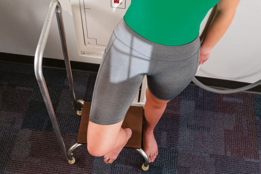
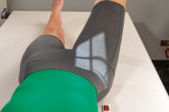
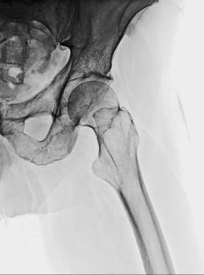
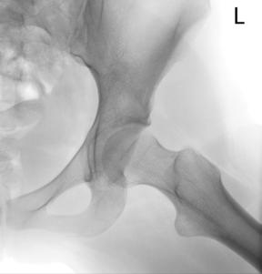

# Rx Șold AND PROXIMAL Femur MEDIOLATERAL PROJECTION (MODIFIED CLEAVES METHOD)

  📷 Radiografie Convențională (Rx)
  <strong>Actualizat:</strong> 2026-09-15
  <strong>Autor:</strong> Departamentul de Radiologie / Referință Bontrager

---

-   __1. Rezumat Clinic & Indicații__

    ---

    === "Indicații Clinice"

        - Lateral view to assess Șold joint and proximal Femur for nontraumatism acuttic Șold situations

    === "Ghid Național IRIS"

        !!! info "Referință Primară: Ghidul Național IRIS (Ordinul MS 1342/2012)"
            - **Capitol Ghid IRIS:** *Ghidul Național IRIS*
            - **Grad de Recomandare:** **De verificat pe indicație; fără grad atribuit automat**
            - **Nivel de Iradiere Estimată:** `De verificat pentru examinarea și populația selectate`

            [:octicons-search-16: Deschide Ghidul IRIS](../../iris.md){ .md-button .md-button--primary } [:material-open-in-new: Aplicația Oficială PWA](https://radiologie-pediatrica.ro/iris/){ .md-button target="_blank" rel="noopener" }
-   __2. Poziționare & Centrare Fascicul__

    ---

    - **Poziție Pacient:** Pacient: With patient Ortostatism or Decubit Dorsal, position affected Șold area to be aligned to CR and midline of table and/or IR.; Regiune anatomică: (Fig. 7.76) Flex Genunchi and Șold on affected side, as shown, with sole of Picior against inside of opposite leg, near Genunchi if possible. Abduct Femur 45 degrees from vertical for general proximal Femur region (see NOTE 1). Center affected femoral neck to CR and midline of IR and tabletop. Apply Șold localization methods to determine location of femoral neck.
    - **Punct de Centrare Fascicul:** is perpendicular to IR (see NOTE 2), directed to midfemoral neck (center of IR).
    - **Distanță Focar-Film (DFF / SID):** 100 cm
    - **Comandă Respiratorie:** Suspend respiration during exposure.

-   __3. Parametri Tehnici Expunere__

    ---

    | Parametru Tehnic | Valoare Configurare Generator / Tub |
    |:-----------------|:-------------------------------------|
    | **Tensiune Tub (kV)** | 80-85 kV |
    | **Sarcină / Produs Curent-Timp (mAs)** | DE CONFIGURAT PE APARAT |
    | **Distanță Focar-Film (DFF / SID)** | 100 cm |
    | **Grilă Antidifuzoare (Bucky)** | Cu grilă antidifuzoare Bucky |
    | **Dimensiune Focar** | Focar Mic (0.6 mm) |
    | **Camere de Ionizare AEC** | Camerele laterale (sau camera centrală funcție de regiune) |
    | **Colimare Fascicul** | Collimate on four sides to anatomy of interest. |
    | **Filtrare Tub** | Totală ≥ 2.5 mm Al echivalent |

-   __4. Criterii de Calitate & Reușită Imagine__

    ---

    - Lateral views of acetabulum and femoral head and neck, trochanteric area, and proximal onethird of Femur are visible. Position:
    - Proper abduction (45 degrees) of Femur is demonstrated by femoral neck seen in profile, superimposed by marele trohanter (Fig. 7.77). Less abduction (20 to 30 degrees) will prevent superimposition of marele trohanter on the femoral neck (Fig. 7.78). Proper centering is evidenced by femoral neck at center of collimated field.
    - Collimation field size to area of interest. Exposure:
    - Optimal image receptor exposure and contrast of the margins of the femoral head and the acetabulum through overlying pelvic structures without overexposing other parts of the proximal Femur.
    - Trabecular markings and bony margins of proximal Femur and Bazin (Pelvis) should appear sharp, indicating no motion. R Fig. 7.77 For femoral neck—45degree abduction. 1-2 inches 3-4 inches ASIS R Fig. 7.78 Unilateral modified Cleaves, 20to 30degree abduction. (From McQuillen Martensen K: Radiographic image analysis, ed 4, St. Louis, 2015, Saunders Elsevier.) Fig. 7.76 45degree abduction. Head and acetabulum are well demonstrated. Inset, 90degree abduction. Unilateral modified Cleaves position (femoral neck parallel to IR). Femoral neck is foreshortened.

-   __5. Protecție Radiologică (ALARA)__

    ---

    - Ecranare gonadică și a organelor radiosensibile conform procedurilor locale de radioprotecție ALARA.
    - Colimare strictă la aria de interes pentru limitarea radiației difuze.
    - Verificarea posibilității unei sarcini la pacientele de vârstă fertilă înainte de expunere.

!!! note "Observații Clinice & Tehnice"
    A modification of this position is the LauensteinHickey method, with the patient starting in a similar position, then rotating onto the affected side until the Femur is in contact with the tabletop and parallel to the IR. This position foreshortens the neck region but may demonstrate the head and acetabulum well if affected leg can be abducted sufficiently, as shown in Fig. 7.76, inset). Șold and Proximal Femur SPECIAL—NONtraumatism acut Modified Cleaves

### 🖼️ Imagini

<figure class="protocol-image-card" markdown>

<figcaption><strong>Fig. 7.77 For femoral neck—45-</strong> — Poziționare pacient conform Ghidului Bontrager (Fig. 7.77 For femoral neck—45-)</figcaption>

</figure>

<figure class="protocol-image-card" markdown>

<figcaption><strong>Fig. 7.78 Unilateral modified Cleaves, 20-</strong> — Aspect radiografic de referință conform Ghidului Bontrager (Fig. 7.78 Unilateral modified Cleaves, 20-)</figcaption>

</figure>

<figure class="protocol-image-card" markdown>

<figcaption><strong>Fig. 7.76 45-</strong> — Aspect radiografic de referință conform Ghidului Bontrager (Fig. 7.76 45-)</figcaption>

</figure>

<figure class="protocol-image-card" markdown>

<figcaption><strong>Figura 4</strong> — Aspect radiografic de referință conform Ghidului Bontrager (Figura 4)</figcaption>

</figure>

=== "Ghid Rapid de Execuție"

    1. **Identificarea și verificarea pacientului:** verificare identitate, zonă de examinat, consimțământ conform procedurii și evaluarea posibilității unei sarcini, când este relevantă.
    2. **Pregătire:** îndepărtarea oricăror obiecte radiopace (bijuterii, agrafe, fermoare, proteze, pansamente dense).
    3. **Poziționare precisă:** alinierea receptorului de imagine și a tubului la distanța prescrisă (100 cm).
    4. **Colimare strictă:** adaptarea fasciculului strict la regiunea de diagnostic pentru scăderea iradierii și reducerea radiației difuze.
    5. **Radioprotecție:** verificarea [politicii RX](../radioprotectie.md), cu măsuri distincte pentru pacient, personal și însoțitor.

## Surse de documentare

- [Bontrager's Textbook of Radiographic Positioning (Ed. 9/10), Pagina 308](https://www.elsevier.com/books/textbook-of-radiographic-positioning-and-related-anatomy/lampignano/978-0-323-65367-1)
