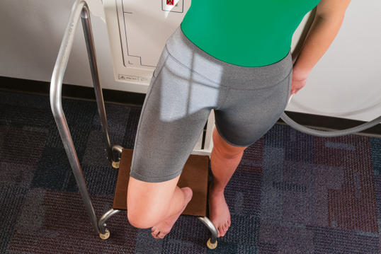
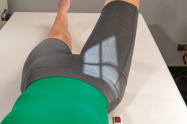
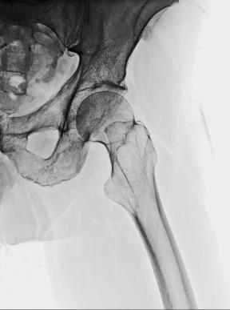
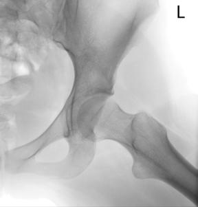

# Rx șold și femur proximal — incidență mediolaterală (METODA MODIFICATĂ CLEAVES)

  📷 Radiografie Convențională (Rx)
  <strong>Actualizat:</strong> 2026-09-15
  <strong>Autor:</strong> Departamentul de Radiologie / Referință Bontrager

---

-   __1. Rezumat Clinic & Indicații__

    ---

    === "Indicații Clinice"

        - incidență laterală pentru evaluarea articulației șoldului și a femurului proximal în situații de șold nontraumatice acute

    === "Ghid Național IRIS"

        !!! info "Referință Primară: Ghidul Național IRIS (Ordinul MS 1342/2012)"
            - **Capitol Ghid IRIS:** *Aparat locomotor & Bazin*
            - **Grad de Recomandare:** **Grad A**
            - **Nivel de Iradiere Estimată:** `Clasa 2 (Foarte mică ~ 0.8 - 1.0 mSv)`

            [:octicons-search-16: Deschide Ghidul IRIS](../../iris.md){ .md-button .md-button--primary } [:material-open-in-new: Aplicația Oficială PWA](https://radiologie-pediatrica.ro/iris/){ .md-button target="_blank" rel="noopener" }

-   __2. Poziționare & Centrare Fascicul__

    ---

    - **Poziție Pacient:** Pacient: pacientul în ortostatism sau decubit dorsal, cu regiunea șoldului afectat aliniată la raza centrală și la linia mediană a mesei și/sau a receptorului de imagine.; Regiune anatomică: (Fig. 7.76) se flectează genunchiul și șoldul de pe partea afectată, după cum este ilustrat, cu talpa piciorului sprijinită de partea internă a membrului inferior opus, în apropierea genunchiului, dacă este posibil. Se abduce femurul cu 45 grade față de verticală pentru regiunea generală a femurului proximal (vezi NOTA 1). Se centrează colul femural afectat la raza centrală și la linia mediană a receptorului de imagine și a mesei. Se aplică metodele de localizare a șoldului pentru determinarea poziției colului femural.
    - **Punct de Centrare Fascicul:** este perpendicular pe receptorul de imagine (vezi NOTA 2), orientat spre mijlocul colului femural (centrul receptorului de imagine).
    - **Distanță Focar-Film (DFF / SID):** 100 cm
    - **Comandă Respiratorie:** Apnee pe durata expunerii.

-   __3. Parametri Tehnici Expunere__

    ---

    | Parametru Tehnic | Valoare Configurare Generator / Tub |
    |:-----------------|:-------------------------------------|
    | **Tensiune Tub (kV)** | 80-85 kV |
    | **Sarcină / Produs Curent-Timp (mAs)** | DE CONFIGURAT PE APARAT |
    | **Distanță Focar-Film (DFF / SID)** | 100 cm |
    | **Grilă Antidifuzoare (Bucky)** | Cu grilă antidifuzoare Bucky |
    | **Dimensiune Focar** | Focar Mic (0.6 mm) |
    | **Camere de Ionizare AEC** | Camerele laterale (sau camera centrală, în funcție de regiune) |
    | **Colimare Fascicul** | Colimați pe cele patru laturi la anatomia de interes. |
    | **Filtrare Tub** | Totală ≥ 2.5 mm Al echivalent |

-   __4. Criterii de Calitate & Reușită Imagine__

    ---

    - incidențele laterale ale cotilului (acetabulului), capului și colului femural, regiunii trohanteriene și treimii proximale a femurului sunt vizibile. Poziție:
    - abducția corectă (45 grade) a femurului este evidențiată prin colul femural văzut în profil, suprapus de trohanterul mare (Fig. 7.77). O abducție mai mică (20 la 30 grade) va împiedica suprapunerea trohanterului mare peste colul femural (Fig. 7.78). Centrarea corectă este evidențiată prin poziționarea colului femural în centrul câmpului colimat.
    - Dimensiunea câmpului de colimare până la aria de interes diagnostic. Expunere:
    - optimizați receptorul de imagine, expunerea și contrastul marginilor capului femural și cotilului (acetabulului) prin structurile pelvine suprapuse, fără supraexpunerea altor părți ale femurului proximal.
    - Trabeculația și marginile osoase ale femurului proximal și bazinului (pelvisului) trebuie să apară net, indicând absența mișcării. R Fig. 7.77 pentru colul femural—abducție de 45°. 1-2 țoli 3-4 țoli spină iliacă antero-superioară (SIAS) R Fig. 7.78 incidență unilaterală modificată Cleaves, abducție de 20 până la 30°. (după McQuillen Martensen K: Analiza imaginii radiografice, ed. 4, St. Louis, 2015, Saunders Elsevier.) Fig. 7.76 abducție de 45°. Capul și cotilul (acetabulul) sunt bine evidențiate. Imagine inserată, abducție de 90°. Poziția unilaterală modificată Cleaves (colul femural paralel cu receptorul de imagine). Colul femural este scurtat aparent.

-   __5. Protecție Radiologică (ALARA)__

    ---

    - Ecranare gonadică și a organelor radiosensibile conform procedurilor locale de radioprotecție ALARA.
    - Colimare strictă la aria de interes pentru limitarea radiației difuze.
    - Verificarea posibilității unei sarcini la pacientele de vârstă fertilă înainte de expunere.

!!! note "Observații Clinice & Tehnice"
    modificarea acestei poziții este metoda Lauenstein-Hickey, cu pacientul pornind dintr-o poziție similară, apoi rotindu-se pe partea afectată până când femurul este în contact cu suprafața mesei și paralel cu receptorul de imagine (RI). Această poziție scurtează proiectiv regiunea colului, dar poate evidenția bine capul și cotilul (acetabulul) dacă membrul inferior afectat poate fi suficient de abdu­s, după cum se vede în Fig. 7.76, imagine inserată). Șoldul și femurul proximal — SPECIAL — nontraumatism acut — metoda Cleaves modificată

### 🖼️ Imagini

<figure class="protocol-image-card" markdown>

<figcaption><strong>Fig. 7.77 pentru colul femural—45-</strong> — Poziționarea pacientului conform Ghidului Bontrager (Fig. 7.77 pentru colul femural—45-)</figcaption>

</figure>

<figure class="protocol-image-card" markdown>

<figcaption><strong>Fig. 7.78 incidență unilaterală modificată Cleaves, 20-</strong> — Aspect radiografic de referință conform Ghidului Bontrager (Fig. 7.78 incidență unilaterală modificată Cleaves, 20-)</figcaption>

</figure>

<figure class="protocol-image-card" markdown>

<figcaption><strong>Fig. 7.76 45-</strong> — Aspect radiografic de referință conform Ghidului Bontrager (Fig. 7.76 45-)</figcaption>

</figure>

<figure class="protocol-image-card" markdown>

<figcaption><strong>Figura 4</strong> — Aspect radiografic de referință conform Ghidului Bontrager (Figura 4)</figcaption>

</figure>

=== "Ghid Rapid de Execuție"

    1. **Identificarea și verificarea pacientului:** verificare identitate, zonă de examinat, consimțământ conform procedurii și evaluarea posibilității unei sarcini, când este relevantă.
    2. **Pregătire:** îndepărtarea oricăror obiecte radiopace (bijuterii, agrafe, fermoare, proteze, pansamente dense).
    3. **Poziționare precisă:** alinierea receptorului de imagine și a tubului la distanța prescrisă (100 cm).
    4. **Colimare strictă:** adaptarea fasciculului strict la regiunea de diagnostic pentru scăderea iradierii și reducerea radiației difuze.
    5. **Radioprotecție:** verificarea [politicii RX](../radioprotectie.md), cu măsuri distincte pentru pacient, personal și însoțitor.

## Surse de documentare

- [Bontrager's Textbook of Radiographic Positioning (Ed. 9/10), Pagina 308](https://www.elsevier.com/books/textbook-of-radiographic-positioning-and-related-anatomy/lampignano/978-0-323-65367-1)
