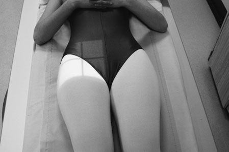
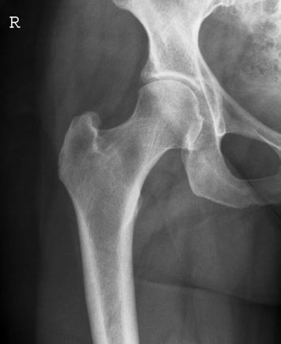
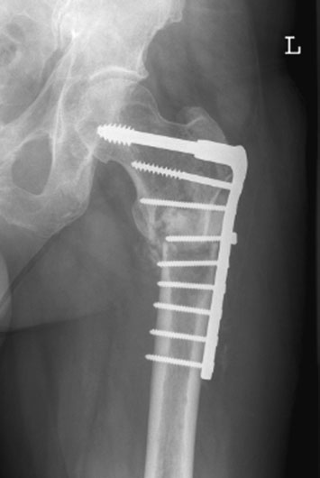
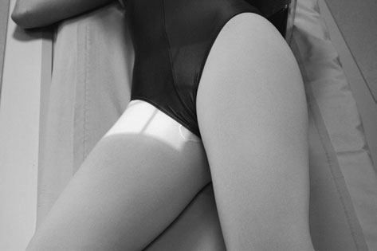
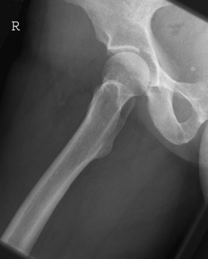
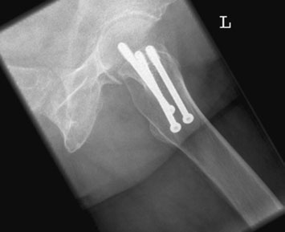

# Rx Șold (Articulație Coxofemurală) and upper third of Femur Antero-Posterior (AP) - single Șold (basic)

  📷 Radiografie Convențională (Rx)
  <strong>Actualizat:</strong> 2026-09-16
  <strong>Autor:</strong> Departamentul de Radiologie / Referință Clark (Ed. 12)

---

-   __1. Rezumat Clinic & Indicații__

    ---

    === "Indicații Clinice"

        - This incidență trebuie să nu fie used pentru primary investigation de suspected suspiciune de fractură. full Antero-posterior (AP) incidență de Bazin (bazin (pelvis)) este required pentru that purpose la assess other bony pelvic injuries.
        - pacientul requires grade de mobility la fie poziționat satisfactorily și trebuie să nu experience orice great discomfort în maintaining poziție.
        - Used cu Antero-posterior (AP) incidență, it shows satisfactory poziție de intern fixation pins și plates.
        - whole de acetabular rim poate fie assessed when this imagine este used în conjunction cu Oblică Anterioară incidență (Judet’s incidență). Normal Oblică Posterioară incidență de Șold Oblică Posterioară incidență evidențiind poziție de Garden screws This incidență evidențiază upper third de Femur în Profil (lateral) poziție și relationship între cap de Femur și cotil (acetabul). posterior rim de cotil (acetabul) este vizualizat.

    === "Ghid Național IRIS"

        !!! info "Referință Primară: Ghidul Național IRIS (Ordinul MS 1342/2012)"
            - **Capitol Ghid IRIS:** *Ghidul Național IRIS*
            - **Grad de Recomandare:** **De verificat pe indicație; fără grad atribuit automat**
            - **Nivel de Iradiere Estimată:** `De verificat pentru examinarea și populația selectate`

            [:octicons-search-16: Deschide Ghidul IRIS](../../iris.md){ .md-button .md-button--primary } [:material-open-in-new: Aplicația Oficială PWA](https://radiologie-pediatrica.ro/iris/){ .md-button target="_blank" rel="noopener" }
-   __2. Poziționare & Centrare Fascicul__

    ---

    - **Poziție Pacient:** pacientul este poziționat ca described pentru basic Bazin (bazin (pelvis)) și basic bilateral Șold incidențe.
• pacientul este culcat Decubit dorsal și simetric pe masa radiologică, cu planul mediosagital perpendicular pe tabletop.
• la avoid pelvic rotație, anterior superior iliac spines trebuie să fie echidistant față de tabletop.
• affected limb este internally rotit la bring gâtul de Femur paralel cu tabletop, și este then sprijinit prin săculeți cu nisip.

• Pacientul este așezat în decubit dorsal pe masa radiologică, cu picioarele extins. planul mediosagital coincides cu axa longitudinală de masa de examinare Bucky.
• pacientul rotates through 45 grade pe la partea afectată, cu Șold în abducție 45 grade și flectat 45 grade, și este sprijinit în this poziție prin non-opaque pads.
• Genunchi este flectat la bring Profil (lateral) aspect de thigh into contact cu tabletop. Genunchi falls into Profil (lateral) poziție.
• opposite limb este raised și sprijinit behind limb being examined.
• A 24  30-cm casetă este used și plasat longitudinally și possibly obliquely în tăvița Bucky.
• caseta este centred la nivelul femoral pulse în groin și trebuie să include upper third de Femur. upper margine de caseta trebuie să fie level cu spină iliacă antero-superioară (SIAS).
    - **Punct de Centrare Fascicul:** • raza centrală verticală centrală este orientat 2.5 cm distally along perpendicular bisector de line joining spină iliacă antero-superioară (SIAS) și simfiză pubiană over femoral pulse.
• primary fascicul trebuie să fie collimated la area under examination și gonad protection applied where appropriate.
150 spină iliacă antero-superioară (SIAS) Level de depression over mare trohanter simfiză pubiană 90° Antero-posterior (AP) radiografie de single Șold Antero-posterior (AP) radiografie de single Șold evidențiind pin și plate în situ

• Centre la femoral pulse în groin de partea afectată, cu raza centrală centrală perpendicular pe casetă.
• axa longitudinală de primary fascicul este ajustat prin turning light fascicul cupole diafragmatice (LBD) la coincide cu axa longitudinală de Femur.
• primary fascicul needs la fie collimated la area under examination.
    - **Distanță Focar-Film (DFF / SID):** 100 cm
    - **Comandă Respiratorie:** Apnee pe durata expunerii (apnee în inspir pentru torace; expir pentru Abdomen/bazin).

-   __3. Parametri Tehnici Expunere__

    ---

    | Parametru Tehnic | Valoare Configurare Generator / Tub |
    |:-----------------|:-------------------------------------|
    | **Tensiune Tub (kV)** | DE CONFIGURAT PE APARAT |
    | **Sarcină / Produs Curent-Timp (mAs)** | Conform AEC / grosime anatomică |
    | **Distanță Focar-Film (DFF / SID)** | 100 cm |
    | **Grilă Antidifuzoare (Bucky)** | Cu grilă antidifuzoare Bucky |
    | **Dimensiune Focar** | Focar Mic (0.6 mm) |
    | **Camere de Ionizare AEC** | Camerele laterale (sau camera centrală funcție de regiune) |
    | **Colimare Fascicul** | Colimare strictă adaptată pe receptor 24 x 30 cm |
    | **Filtrare Tub** | Totală ≥ 2.5 mm Al echivalent (conform Clark: 3.0 mm Al eq.) |

-   __4. Criterii de Calitate & Reușită Imagine__

    ---

    - Vizualizarea clară întregii arii anatomice (Șold (Articulație Coxofemurală) și upper third de Femur).
    - Absența artefactelor de mișcare; trabeculație osoasă și contururi nete.
    - Densitate optică și contrast adecvate pentru diferențierea țesuturilor moi de structurile osoase.

-   __5. Protecție Radiologică (ALARA)__

    ---

    - Ecranare gonadică cu șorț plumbat dacă gonadele sunt în apropierea fasciculului util (regula ALARA).
    - Colimare precisă la dimensiunea anatomică strict necesară pentru reducerea dozei și a radiației difuze.
    - Verificarea posibilității unei sarcini la pacientele de vârstă fertilă înainte de expunere.

!!! note "Observații Clinice & Tehnice"
    • imagine trebuie să include upper third de Femur. When taken la show positioning și integrity de arthroplasty, whole length de prosthesis, including cement, trebuie să fie visualized.
• Together cu Oblică Profil (lateral) incidență, this este used pentru checking intern fixations following suspiciune de fractură.
• If too high mAs este used, optical densitate optică around mare trohanter poate fie too great pentru adecvat visualization, particularly în very slender pacienți.
• Over-rotating limb internally will bring mare trohanter into profile. This poate fie useful incidență suplimentară pentru suspected avulsion suspiciune de fractură la this bone.

• If partea sănătoasă (neafectată) este raised greater than 45 grade, then superior pubic ramus poate fie superimposed pe cotil (acetabul).
• shaft de Femur will fie poziționat la 45 grade la axa longitudinală de corp.

### 🖼️ Imagini

<figure class="protocol-image-card" markdown>

<figcaption><strong>Antero-posterior (AP) radiografie de single Șold</strong> — Poziționare pacient și centrare fascicul conform Clark (Ed. 12)</figcaption>

</figure>

<figure class="protocol-image-card" markdown>

<figcaption><strong>Antero-posterior (AP) radiografie de single Șold evidențiind pin și plate în situ</strong> — Aspect radiografic / ghid de poziționare conform tratatului Clark (Ed. 12)</figcaption>

</figure>

<figure class="protocol-image-card" markdown>

<figcaption><strong>checking intern fixations following suspiciune de fractură.</strong> — Aspect radiografic / ghid de poziționare conform tratatului Clark (Ed. 12)</figcaption>

</figure>

<figure class="protocol-image-card" markdown>

<figcaption><strong>tion de suspected suspiciune de fractură. full Antero-posterior (AP) incidență</strong> — Aspect radiografic / ghid de poziționare conform tratatului Clark (Ed. 12)</figcaption>

</figure>

<figure class="protocol-image-card" markdown>

<figcaption><strong>Normal Oblică Posterioară incidență de Șold</strong> — Aspect radiografic / ghid de poziționare conform tratatului Clark (Ed. 12)</figcaption>

</figure>

<figure class="protocol-image-card" markdown>

<figcaption><strong>Oblică Posterioară incidență evidențiind poziție de Garden screws</strong> — Aspect radiografic / ghid de poziționare conform tratatului Clark (Ed. 12)</figcaption>

</figure>

=== "Ghid Rapid de Execuție"

    1. **Identificarea și verificarea pacientului:** verificare identitate, zonă de examinat, consimțământ conform procedurii și evaluarea posibilității unei sarcini, când este relevantă.
    2. **Pregătire:** îndepărtarea oricăror obiecte radiopace (bijuterii, agrafe, fermoare, proteze, pansamente dense).
    3. **Poziționare precisă:** alinierea receptorului de imagine și a tubului la distanța prescrisă (100 cm).
    4. **Colimare strictă:** adaptarea fasciculului strict la regiunea de diagnostic pentru scăderea iradierii și reducerea radiației difuze.
    5. **Radioprotecție:** verificarea [politicii RX](../radioprotectie.md), cu măsuri distincte pentru pacient, personal și însoțitor.

## Surse de documentare

- [Clark's Positioning in Radiography (Ed. 12), Pagina 165](../../assets/protocols/sources/Clark___Positioning_in_Radiography__12th_edition.pdf#page=165)
