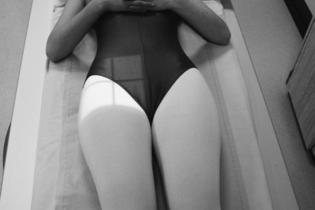
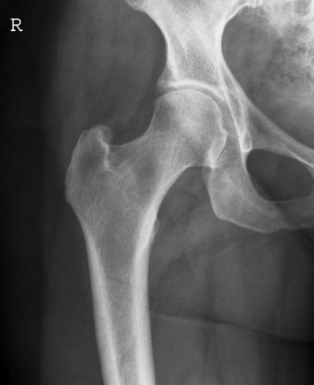
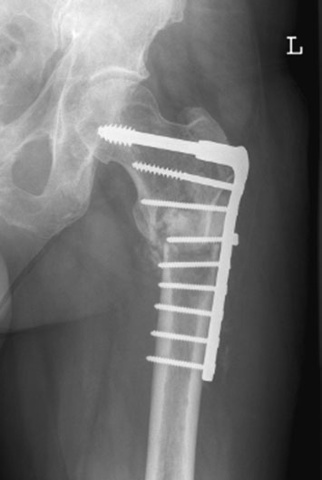
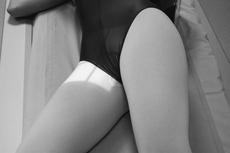
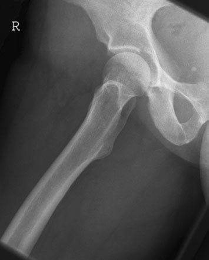
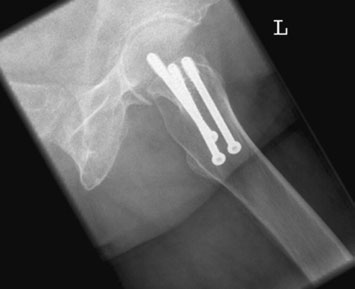

# Rx șold (articulația coxofemurală) și treimea superioară a femurului — incidență Antero-posterioară (AP), șold unilateral (de bază)

  📷 Radiografie Convențională (Rx)
  <strong>Actualizat:</strong> 2026-09-16
  <strong>Autor:</strong> Departamentul de Radiologie / Referință Clark (Ed. 12)

---

-   __1. Rezumat Clinic & Indicații__

    ---

    === "Indicații Clinice"

        - Această incidență nu trebuie utilizată pentru investigarea primară a unei suspiciuni de fractură. Pentru acest scop este necesară o incidență Antero-posterioară (AP) completă a bazinului (pelvisului), pentru evaluarea altor leziuni osoase pelvine.
        - Pacientul trebuie să aibă un grad de mobilitate care să permită poziționarea satisfăcătoare și nu trebuie să resimtă un disconfort important în menținerea poziției.
        - Utilizată împreună cu incidența Antero-posterioară (AP), evidențiază satisfăcător poziția pinilor și plăcilor de fixare internă.
        - Întregul rebord acetabular poate fi evaluat când această imagine este utilizată împreună cu incidența oblică anterioară (incidența Judet). Incidență oblică posterioară normală a șoldului. Incidență oblică posterioară evidențiind poziția șuruburilor Garden. Această incidență evidențiază treimea superioară a femurului în poziție de profil (lateral) și relația dintre capul femurului și cotil (acetabul). Rebordul posterior al cotilului (acetabulului) este vizualizat.

    === "Ghid Național IRIS"

        !!! info "Referință Primară: Ghidul Național IRIS (Ordinul MS 1342/2012)"
            - **Capitol Ghid IRIS:** *Aparat locomotor & Bazin*
            - **Grad de Recomandare:** **Grad A**
            - **Nivel de Iradiere Estimată:** `Clasa 2 (Foarte mică ~ 0.8 - 1.0 mSv)`

            [:octicons-search-16: Deschide Ghidul IRIS](../../iris.md){ .md-button .md-button--primary } [:material-open-in-new: Aplicația Oficială PWA](https://radiologie-pediatrica.ro/iris/){ .md-button target="_blank" rel="noopener" }

-   __2. Poziționare & Centrare Fascicul__

    ---

    - **Poziție Pacient:**
        Pacientul este poziționat conform descrierii pentru incidențele de bazin (pelvis) de bază și de șold bilateral de bază.

        - Pacientul este culcat în decubit dorsal și simetric pe masa radiologică, cu planul mediosagital perpendicular pe suprafața mesei.
        - Pentru a evita rotația pelvină, spinele iliace antero-superioare trebuie să fie echidistante față de suprafața mesei.
        - Membrul afectat este rotit intern pentru a aduce colul femural paralel cu suprafața mesei și este apoi susținut cu săculeți cu nisip.
        - Pacientul este așezat în decubit dorsal pe masa radiologică, cu picioarele extinse. Planul mediosagital coincide cu axa longitudinală a mesei de examinare Bucky.
        - Pacientul este rotit cu 45 grade spre partea afectată, cu șoldul în abducție de 45 grade și flectat la 45 grade, și este susținut în această poziție cu tampoane radiotransparente.
        - Genunchiul este flectat pentru a aduce aspectul de profil (lateral) al coapsei în contact cu suprafața mesei. Genunchiul ajunge în poziție de profil (lateral).
        - Membrul contralateral este ridicat și susținut în spatele membrului examinat.
        - Se utilizează o casetă de 24 × 30-cm, plasată longitudinal și posibil oblic în tăvița Bucky.
        - Caseta este centrată la nivelul pulsului femural din regiunea inghinală și trebuie să includă treimea superioară a femurului. Marginea superioară a casetei trebuie să fie la nivelul spinei iliace antero-superioare (SIAS).
    - **Punct de Centrare Fascicul:**
        - Raza centrală verticală este orientată la 2.5 cm distal, de-a lungul bisectoarei perpendiculare a liniei care unește spina iliacă antero-superioară (SIAS) și simfiza pubiană, deasupra pulsului femural.
        - Fasciculul primar trebuie colimat la aria examinată, iar protecția gonadelor trebuie aplicată atunci când este adecvat. 150 spină iliacă antero-superioară (SIAS) Nivel de depresiune deasupra trohanterului mare simfiză pubiană 90° Antero-posterior (AP) radiografie de șold unilaterală Antero-posterior (AP) radiografie de șold unilaterală evidențiind pinul și placa in situ
        - Centrați pe pulsul femural din regiunea inghinală de partea afectată, cu raza centrală perpendiculară pe casetă.
        - Axa longitudinală a fasciculului primar este ajustată prin rotirea cupolelor diafragmatice ale fasciculului luminos (LBD), pentru a coincide cu axa longitudinală a femurului.
        - Fasciculul primar trebuie colimat la aria examinată.
    - **Distanță Focar-Film (DFF / SID):** 100 cm
    - **Comandă Respiratorie:** Apnee pe durata expunerii (apnee în inspir pentru torace; expir pentru Abdomen/bazin).

-   __3. Parametri Tehnici Expunere__

    ---

    | Parametru Tehnic | Valoare Configurare Generator / Tub |
    |:-----------------|:-------------------------------------|
    | **Tensiune Tub (kV)** | DE CONFIGURAT PE APARAT |
    | **Sarcină / Produs Curent-Timp (mAs)** | Conform AEC / grosimii anatomice |
    | **Distanță Focar-Film (DFF / SID)** | 100 cm |
    | **Grilă Antidifuzoare (Bucky)** | Cu grilă antidifuzoare Bucky |
    | **Dimensiune Focar** | Focar Mic (0.6 mm) |
    | **Camere de Ionizare AEC** | Camerele laterale (sau camera centrală, în funcție de regiune) |
    | **Colimare Fascicul** | Colimare strictă adaptată pe receptor 24 x 30 cm |
    | **Filtrare Tub** | Totală ≥ 2.5 mm Al echivalent (conform Clark: 3.0 mm Al echivalent) |

-   __4. Criterii de Calitate & Reușită Imagine__

    ---

    - Vizualizarea clară a întregii arii anatomice (șoldul [articulația coxofemurală] și treimea superioară a femurului).
    - Absența artefactelor de mișcare; trabeculație osoasă și contururi nete.
    - Densitate optică și contrast adecvate pentru diferențierea țesuturilor moi de structurile osoase.

-   __5. Protecție Radiologică (ALARA)__

    ---

    - Ecranare gonadică cu șorț plumbat dacă gonadele sunt în apropierea fasciculului util (regula ALARA).
    - Colimare precisă la dimensiunea anatomică strict necesară pentru reducerea dozei și a radiației difuze.
    - Verificarea posibilității unei sarcini la pacientele de vârstă fertilă înainte de expunere.

!!! note "Observații Clinice & Tehnice"
    - Imaginea trebuie să includă treimea superioară a femurului. Când este efectuată pentru evidențierea poziției și integrității artroplastiei, trebuie vizualizată întreaga lungime a protezei, inclusiv cimentul.
    - Împreună cu incidența oblică de profil (lateral), aceasta este utilizată pentru verificarea fixărilor interne după o suspiciune de fractură.
    - Dacă se utilizează un mAs prea mare, densitatea optică din jurul trohanterului mare poate fi prea mare pentru o vizualizare adecvată, în special la pacienții foarte slabi.
    - Rotirea internă excesivă a membrului va aduce trohanterul mare în profil. Aceasta poate fi o incidență suplimentară utilă pentru suspiciunea de fractură prin avulsie la nivelul acestui os.
    - Dacă partea sănătoasă (neafectată) este ridicată la mai mult de 45 grade, ramul pubian superior poate fi suprapus peste cotil (acetabul).
    - Diafiza femurului va fi poziționată la 45 grade față de axa longitudinală a corpului.

### 🖼️ Imagini

<figure class="protocol-image-card" markdown>

<figcaption><strong>Radiografie Antero-posterioară (AP) a șoldului unilateral</strong> — Poziționarea pacientului și centrarea fasciculului conform Clark (Ed. 12)</figcaption>

</figure>

<figure class="protocol-image-card" markdown>

<figcaption><strong>Radiografie Antero-posterioară (AP) a șoldului unilateral, evidențiind pinul și placa in situ</strong> — Aspect radiografic / ghid de poziționare conform tratatului Clark (Ed. 12)</figcaption>

</figure>

<figure class="protocol-image-card" markdown>

<figcaption><strong>verificarea fixărilor interne după o suspiciune de fractură.</strong> — Aspect radiografic / ghid de poziționare conform tratatului Clark (Ed. 12)</figcaption>

</figure>

<figure class="protocol-image-card" markdown>

<figcaption><strong>rea unei suspiciuni de fractură. Incidență Antero-posterioară (AP) completă</strong> — Aspect radiografic / ghid de poziționare conform tratatului Clark (Ed. 12)</figcaption>

</figure>

<figure class="protocol-image-card" markdown>

<figcaption><strong>Incidență oblică posterioară normală a șoldului</strong> — Aspect radiografic / ghid de poziționare conform tratatului Clark (Ed. 12)</figcaption>

</figure>

<figure class="protocol-image-card" markdown>

<figcaption><strong>Incidență oblică posterioară evidențiind poziția șuruburilor Garden</strong> — Aspect radiografic / ghid de poziționare conform tratatului Clark (Ed. 12)</figcaption>

</figure>

=== "Ghid Rapid de Execuție"

    1. **Identificarea și verificarea pacientului:** verificare identitate, zonă de examinat, consimțământ conform procedurii și evaluarea posibilității unei sarcini, când este relevantă.
    2. **Pregătire:** îndepărtarea oricăror obiecte radiopace (bijuterii, agrafe, fermoare, proteze, pansamente dense).
    3. **Poziționare precisă:** alinierea receptorului de imagine și a tubului la distanța prescrisă (100 cm).
    4. **Colimare strictă:** adaptarea fasciculului strict la regiunea de diagnostic pentru scăderea iradierii și reducerea radiației difuze.
    5. **Radioprotecție:** verificarea [politicii RX](../radioprotectie.md), cu măsuri distincte pentru pacient, personal și însoțitor.

## Surse de documentare

- [Clark's Positioning in Radiography (Ed. 12), Pagina 165](https://books.google.com/books/about/Clark_s_Positioning_in_Radiography.html?id=Xxu6MwEACAAJ)
