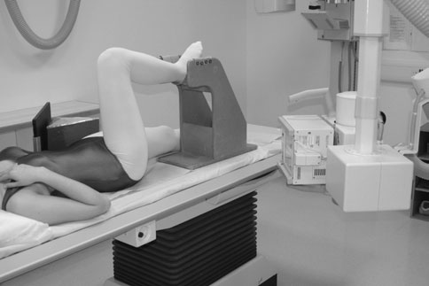
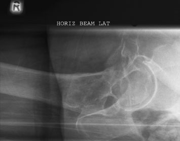
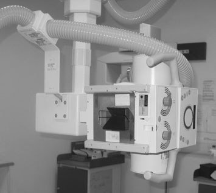

# Rx Șold (Articulație Coxofemurală) and upper third of Femur True Profil (Lateral) - Col Femural (basic)

  📷 Radiografie Convențională (Rx)
  <strong>Actualizat:</strong> 2026-09-16
  <strong>Autor:</strong> Departamentul de Radiologie / Referință Clark (Ed. 12)

---

-   __1. Rezumat Clinic & Indicații__

    ---

    === "Indicații Clinice"

        - This incidență este routinely used pentru suspected Col Femural suspiciune de fractură. It este similarly invaluable pentru assessment de suspected slipped upper femoral epiphysis, și suspiciune de fractură de cotil (acetabul). Profil (lateral) incidență de Șold evidențiind subcapital suspiciune de fractură de neck și Femur Example de filter în place pe light fascicul cupole diafragmatice

    === "Ghid Național IRIS"

        !!! info "Referință Primară: Ghidul Național IRIS (Ordinul MS 1342/2012)"
            - **Capitol Ghid IRIS:** *Ghidul Național IRIS*
            - **Grad de Recomandare:** **De verificat pe indicație; fără grad atribuit automat**
            - **Nivel de Iradiere Estimată:** `De verificat pentru examinarea și populația selectate`

            [:octicons-search-16: Deschide Ghidul IRIS](../../iris.md){ .md-button .md-button--primary } [:material-open-in-new: Aplicația Oficială PWA](https://radiologie-pediatrica.ro/iris/){ .md-button target="_blank" rel="noopener" }
-   __2. Poziționare & Centrare Fascicul__

    ---

    - **Poziție Pacient:** • pacientul este culcat Decubit dorsal pe stretcher sau masa radiologică.
• picioarele sunt extins și Bazin (bazin (pelvis)) ajustat la make planul mediosagital perpendicular pe tabletop. This poate nu always fie possible if pacientul este în great pain.
• If pacientul este very slender, it poate fie necessary la place non-opaque pad under buttocks astfel încât whole de affected Șold poate fie included în imagine.
• casetă cu grilă antidifuzoare este poziționat vertically, cu shorter edge pressed firmly pe / sprijinit de waist, just above crestele iliace.
• longitudinal axis de caseta trebuie să fie paralel cu Col Femural. This poate fie approximated prin placing a 45-grade foam pad între front de caseta și Profil (lateral) aspect de Bazin (bazin (pelvis)).
• caseta este sprijinit în this poziție prin săculeți cu nisip sau special casetă holder attached la masa de examinare.
• unaffected limb este then raised until thigh este vertical, cu Genunchi flectat. This poziție este maintained prin supporting lower membru inferior pe stool sau specialized equipment.
    - **Punct de Centrare Fascicul:** • Centre through affected groin, midway între femoral pulse și palpable prominence de mare trohanter, cu raza centrală centrală Orientat orizontal și la drept-angles la caseta. central fascicul trebuie să fie ajustat vertically la pass în line cu col femural și trebuie să fie collimated closely la area la improve imagine contrast.
    - **Distanță Focar-Film (DFF / SID):** 100 cm
    - **Comandă Respiratorie:** Apnee pe durata expunerii (apnee în inspir pentru torace; expir pentru Abdomen/bazin).

-   __3. Parametri Tehnici Expunere__

    ---

    | Parametru Tehnic | Valoare Configurare Generator / Tub |
    |:-----------------|:-------------------------------------|
    | **Tensiune Tub (kV)** | 100 kV |
    | **Sarcină / Produs Curent-Timp (mAs)** | Conform AEC / grosime anatomică |
    | **Distanță Focar-Film (DFF / SID)** | 100 cm |
    | **Grilă Antidifuzoare (Bucky)** | Cu grilă antidifuzoare Bucky |
    | **Dimensiune Focar** | Focar Mic (0.6 mm) |
    | **Camere de Ionizare AEC** | Camerele laterale (sau camera centrală funcție de regiune) |
    | **Colimare Fascicul** | Colimare strictă adaptată pe receptor 24 x 30 cm |
    | **Filtrare Tub** | Totală ≥ 2.5 mm Al echivalent (conform Clark: 3.0 mm Al eq.) |

-   __4. Criterii de Calitate & Reușită Imagine__

    ---

    - Vizualizarea clară întregii arii anatomice (Șold (Articulație Coxofemurală) și upper third de Femur).
    - Absența artefactelor de mișcare; trabeculație osoasă și contururi nete.
    - Densitate optică și contrast adecvate pentru diferențierea țesuturilor moi de structurile osoase.

-   __5. Protecție Radiologică (ALARA)__

    ---

    - Ecranare gonadică cu șorț plumbat dacă gonadele sunt în apropierea fasciculului util (regula ALARA).
    - Colimare precisă la dimensiunea anatomică strict necesară pentru reducerea dozei și a radiației difuze.
    - Verificarea posibilității unei sarcini la pacientele de vârstă fertilă înainte de expunere.

!!! note "Observații Clinice & Tehnice"
    • If Ortostatism Bucky este used, then stretcher este turned so that its axa longitudinală makes angle de 45 grade cu Bucky.
gâtul de Femur este now paralel cu casetă plasat în Bucky. middle AEC chamber este poziționat în line cu col femural, which will mean air gap exists între pacient și Ortostatism Bucky. resultant magnification poate fie compensated pentru prin increasing 152 focus-la-film radiologic distance (FFD). air gap improves imagine contrast.
• în trauma cases, when suspiciune de fractură este suspected, limb este often externally rotit. pe fără account trebuie să limb fie rotit de la this poziție. Antero-posterior (AP) și Profil (lateral) incidențe sunt taken cu limb în that poziție.
• relatively high kVp (e.g. 100 kVp) este necessary la penetrate thigh fără blackening trochanteric region. Using filter improves overall optical densitate optică.
• Loss de bony resolution poate occur when using casetă cu grilă antidifuzoare sau stationary grilă și casetă due la X-ray fascicul nu being aliniat correctly la grila lines.

### 🖼️ Imagini

<figure class="protocol-image-card" markdown>

<figcaption><strong>pacienți cu clinical suspicion de suspiciune de fractură (affected Picior în</strong> — Poziționare pacient și centrare fascicul conform Clark (Ed. 12)</figcaption>

</figure>

<figure class="protocol-image-card" markdown>

<figcaption><strong>moving). pacienți who sustain suspiciune de fractură de Șold sunt often</strong> — Aspect radiografic / ghid de poziționare conform tratatului Clark (Ed. 12)</figcaption>

</figure>

<figure class="protocol-image-card" markdown>

<figcaption><strong>• în trauma cases, when suspiciune de fractură este suspected, limb este</strong> — Aspect radiografic / ghid de poziționare conform tratatului Clark (Ed. 12)</figcaption>

</figure>

=== "Ghid Rapid de Execuție"

    1. **Identificarea și verificarea pacientului:** verificare identitate, zonă de examinat, consimțământ conform procedurii și evaluarea posibilității unei sarcini, când este relevantă.
    2. **Pregătire:** îndepărtarea oricăror obiecte radiopace (bijuterii, agrafe, fermoare, proteze, pansamente dense).
    3. **Poziționare precisă:** alinierea receptorului de imagine și a tubului la distanța prescrisă (100 cm).
    4. **Colimare strictă:** adaptarea fasciculului strict la regiunea de diagnostic pentru scăderea iradierii și reducerea radiației difuze.
    5. **Radioprotecție:** verificarea [politicii RX](../radioprotectie.md), cu măsuri distincte pentru pacient, personal și însoțitor.

## Surse de documentare

- [Clark's Positioning in Radiography (Ed. 12), Pagina 167](../../assets/protocols/sources/Clark___Positioning_in_Radiography__12th_edition.pdf#page=167)
