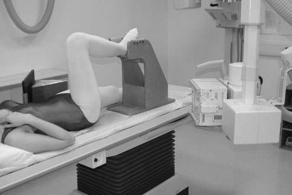
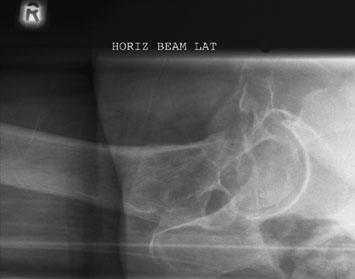
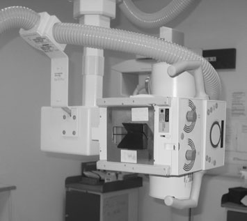

# Rx șold (articulația coxofemurală) și treimea superioară a femurului — incidență adevărată de profil (lateral) — col femural (de bază)

  📷 Radiografie Convențională (Rx)
  <strong>Actualizat:</strong> 2026-09-16
  <strong>Autor:</strong> Departamentul de Radiologie / Referință Clark (Ed. 12)

---

-   __1. Rezumat Clinic & Indicații__

    ---

    === "Indicații Clinice"

        - Această incidență este utilizată de rutină pentru suspiciunea de fractură a colului femural. Este la fel de valoroasă pentru evaluarea unei suspiciuni de epifizioliză femurală superioară și a unei suspiciuni de fractură a cotilului (acetabulului). Incidență de profil (lateral) a șoldului evidențiind o suspiciune de fractură subcapitală a colului femural. Exemplu de filtru poziționat pe cupolele diafragmatice ale fasciculului luminos

    === "Ghid Național IRIS"

        !!! info "Referință Primară: Ghidul Național IRIS (Ordinul MS 1342/2012)"
            - **Capitol Ghid IRIS:** *Aparat locomotor & Bazin*
            - **Grad de Recomandare:** **Grad A**
            - **Nivel de Iradiere Estimată:** `Clasa 2 (Foarte mică ~ 0.8 - 1.0 mSv)`

            [:octicons-search-16: Deschide Ghidul IRIS](../../iris.md){ .md-button .md-button--primary } [:material-open-in-new: Aplicația Oficială PWA](https://radiologie-pediatrica.ro/iris/){ .md-button target="_blank" rel="noopener" }

-   __2. Poziționare & Centrare Fascicul__

    ---

    - **Poziție Pacient:**
        - Pacientul este culcat în decubit dorsal pe targă sau pe masa radiologică.
        - Picioarele sunt extinse, iar bazinul (pelvisul) este ajustat pentru ca planul mediosagital să fie perpendicular pe suprafața mesei. Acest lucru poate să nu fie întotdeauna posibil dacă pacientul are dureri mari.
        - Dacă pacientul este foarte slab, poate fi necesară plasarea unui tampon radiotransparent sub fese, astfel încât întregul șold afectat să fie inclus în imagine.
        - Caseta cu grilă antidifuzoare este poziționată vertical, cu marginea mai scurtă apăsată ferm pe / sprijinită de talie, imediat deasupra crestelor iliace.
        - Axa longitudinală a casetei trebuie să fie paralelă cu colul femural. Aceasta poate fi aproximată prin plasarea unui suport din spumă de 45 grade între partea anterioară a casetei și aspectul de profil (lateral) al bazinului (pelvisului).
        - Caseta este susținută în această poziție cu săculeți cu nisip sau cu un suport special pentru casetă, atașat mesei de examinare.
        - Membrul neafectat este apoi ridicat până când coapsa este verticală, cu genunchiul flectat. Această poziție este menținută prin sprijinirea membrului inferior pe un taburet sau pe un echipament specializat.
    - **Punct de Centrare Fascicul:** • Centrați prin regiunea inghinală afectată, la mijlocul distanței dintre pulsul femural și proeminența palpabilă a trohanterului mare, cu raza centrală orientată orizontal și perpendiculară pe casetă. Fasciculul central trebuie ajustat vertical pentru a trece în axul colului femural și trebuie colimat strâns la aria examinată pentru a îmbunătăți contrastul imaginii.
    - **Distanță Focar-Film (DFF / SID):** 100 cm
    - **Comandă Respiratorie:** Apnee pe durata expunerii (apnee în inspir pentru torace; expir pentru Abdomen/bazin).

-   __3. Parametri Tehnici Expunere__

    ---

    | Parametru Tehnic | Valoare Configurare Generator / Tub |
    |:-----------------|:-------------------------------------|
    | **Tensiune Tub (kV)** | 100 kV |
    | **Sarcină / Produs Curent-Timp (mAs)** | Conform AEC / grosimii anatomice |
    | **Distanță Focar-Film (DFF / SID)** | 100 cm |
    | **Grilă Antidifuzoare (Bucky)** | Cu grilă antidifuzoare Bucky |
    | **Dimensiune Focar** | Focar Mic (0.6 mm) |
    | **Camere de Ionizare AEC** | Camerele laterale (sau camera centrală, în funcție de regiune) |
    | **Colimare Fascicul** | Colimare strictă adaptată pe receptor 24 x 30 cm |
    | **Filtrare Tub** | Totală ≥ 2.5 mm Al echivalent (conform Clark: 3.0 mm Al echivalent) |

-   __4. Criterii de Calitate & Reușită Imagine__

    ---

    - Vizualizarea clară a întregii arii anatomice (șoldul [articulația coxofemurală] și treimea superioară a femurului).
    - Absența artefactelor de mișcare; trabeculație osoasă și contururi nete.
    - Densitate optică și contrast adecvate pentru diferențierea țesuturilor moi de structurile osoase.

-   __5. Protecție Radiologică (ALARA)__

    ---

    - Ecranare gonadică cu șorț plumbat dacă gonadele sunt în apropierea fasciculului util (regula ALARA).
    - Colimare precisă la dimensiunea anatomică strict necesară pentru reducerea dozei și a radiației difuze.
    - Verificarea posibilității unei sarcini la pacientele de vârstă fertilă înainte de expunere.

!!! note "Observații Clinice & Tehnice"
    - Dacă se utilizează un Bucky vertical pentru ortostatism, targa este rotită astfel încât axa sa longitudinală să formeze un unghi de 45 grade cu Bucky-ul. Colul femural este acum paralel cu caseta plasată în Bucky. Camera AEC mijlocie este poziționată în axul colului femural, ceea ce înseamnă că există un spațiu de aer între pacient și Bucky-ul vertical pentru ortostatism. Mărirea rezultată poate fi compensată prin creșterea distanței focar-film 152 (FFD). Spațiul de aer îmbunătățește contrastul imaginii.
    - În cazurile de traumatism, când există suspiciune de fractură, membrul este adesea rotit extern. Membrul nu trebuie în niciun caz rotit din această poziție. Incidențele Antero-posterioară (AP) și de profil (lateral) sunt efectuate cu membrul în această poziție.
    - Este necesar un kVp relativ ridicat (de exemplu, 100 kVp) pentru a penetra coapsa fără înnegrirea regiunii trohanteriene. Utilizarea unui filtru îmbunătățește densitatea optică generală.
    - Pierderea rezoluției osoase poate apărea la utilizarea unei casete cu grilă antidifuzoare sau a unei grile staționare și a unei casete, din cauza nealinierii corecte a fasciculului de raze X cu liniile grilei.

### 🖼️ Imagini

<figure class="protocol-image-card" markdown>

<figcaption><strong>Pacienți cu suspiciune clinică de fractură (piciorul afectat în</strong> — Poziționarea pacientului și centrarea fasciculului conform Clark (Ed. 12)</figcaption>

</figure>

<figure class="protocol-image-card" markdown>

<figcaption><strong>mișcare). Pacienții care suferă o suspiciune de fractură de șold sunt adesea</strong> — Aspect radiografic / ghid de poziționare conform tratatului Clark (Ed. 12)</figcaption>

</figure>

<figure class="protocol-image-card" markdown>

<figcaption><strong>• În cazurile de traumatism, când există suspiciune de fractură, membrul este</strong> — Aspect radiografic / ghid de poziționare conform tratatului Clark (Ed. 12)</figcaption>

</figure>

=== "Ghid Rapid de Execuție"

    1. **Identificarea și verificarea pacientului:** verificare identitate, zonă de examinat, consimțământ conform procedurii și evaluarea posibilității unei sarcini, când este relevantă.
    2. **Pregătire:** îndepărtarea oricăror obiecte radiopace (bijuterii, agrafe, fermoare, proteze, pansamente dense).
    3. **Poziționare precisă:** alinierea receptorului de imagine și a tubului la distanța prescrisă (100 cm).
    4. **Colimare strictă:** adaptarea fasciculului strict la regiunea de diagnostic pentru scăderea iradierii și reducerea radiației difuze.
    5. **Radioprotecție:** verificarea [politicii RX](../radioprotectie.md), cu măsuri distincte pentru pacient, personal și însoțitor.

## Surse de documentare

- [Clark's Positioning in Radiography (Ed. 12), Pagina 167](https://books.google.com/books/about/Clark_s_Positioning_in_Radiography.html?id=Xxu6MwEACAAJ)
