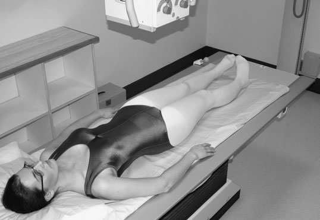
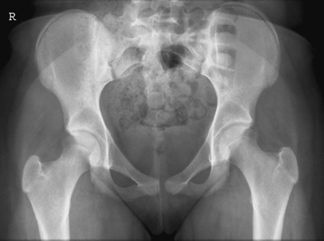
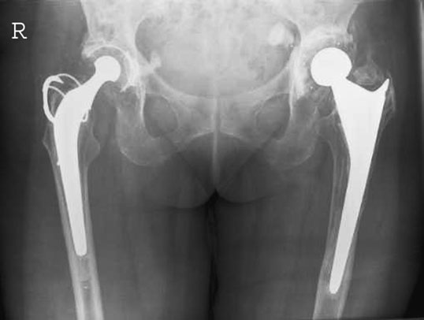
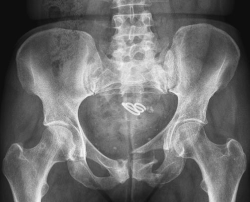
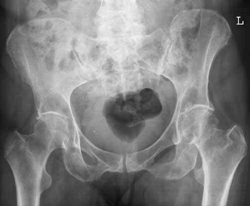
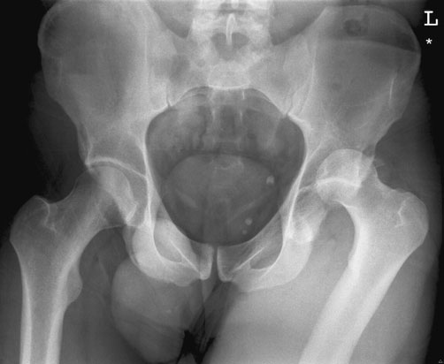

# Rx Șold (Articulație Coxofemurală), upper third of Femur and Bazin (Pelvis) Antero-Posterior (AP) - Bazin (Pelvis)

  📷 Radiografie Convențională (Rx)
  <strong>Actualizat:</strong> 2026-09-16
  <strong>Autor:</strong> Departamentul de Radiologie / Referință Clark (Ed. 12)

---

-   __1. Rezumat Clinic & Indicații__

    ---

    === "Indicații Clinice"

        - Antero-posterior (AP) imagine allows comparison de ambele hips la fie made; în trauma cases, it ensures that suspiciune de fractură la distal Bazin (bazin (pelvis)) este nu missed, e.g. suspiciune de fracturăd pubic ramus. în cases de suspected suspiciune de fractură de Șold, injured limb este commonly externally rotit și trebuie să nu fie moved. If possible, opposite limb trebuie să fie externally rotit la same grade de rotație so that more precis comparison poate fie made.

    === "Ghid Național IRIS"

        !!! info "Referință Primară: Ghidul Național IRIS (Ordinul MS 1342/2012)"
            - **Capitol Ghid IRIS:** *Ghidul Național IRIS*
            - **Grad de Recomandare:** **De verificat pe indicație; fără grad atribuit automat**
            - **Nivel de Iradiere Estimată:** `De verificat pentru examinarea și populația selectate`

            [:octicons-search-16: Deschide Ghidul IRIS](../../iris.md){ .md-button .md-button--primary } [:material-open-in-new: Aplicația Oficială PWA](https://radiologie-pediatrica.ro/iris/){ .md-button target="_blank" rel="noopener" }
-   __2. Poziționare & Centrare Fascicul__

    ---

    - **Poziție Pacient:** • pacientul este culcat Decubit dorsal și simetric pe masa radiologică, cu planul mediosagital perpendicular pe tabletop.
• linia mediană pacient trebuie să coincide cu centred primary fascicul și table Bucky mechanism.
• If pacientul remains pe trolley, ideally they trebuie să fie poziționat down linia mediană și ajustat la achieve optimum incidență dependent pe their grade de mobility.
• la avoid pelvic rotație, anterior superior iliac spines trebuie să fie echidistant față de tabletop. non-opaque pad plasat under buttock poate fie used la make Bazin (bazin (pelvis)) level. plan coronal trebuie să now fie paralel cu tabletop.
• limbs sunt slightly în abducție și internally rotit la bring femoral necks paralel cu casetă.
• săculeți cu nisip și pads sunt plasat pe / sprijinit de Gleznă (Articulație Talocrurală) region la help maintain this poziție.
    - **Punct de Centrare Fascicul:** • Centre în linia mediană, cu vertical central fascicul.
• centre de caseta este plasat midway între upper margine de simfiză pubiană și spină iliacă antero-superioară (SIAS) pentru whole de Bazin (bazin (pelvis)) și proximal femora. upper edge de caseta trebuie să fie 5 cm above upper margine de crestele iliace la compensate pentru divergent fascicul și la ensure that whole de bony Bazin (bazin (pelvis)) este included.
• centre de caseta este plasat level cu upper margine de simfiză pubiană pentru șoldurile și upper femora.
148 Antero-posterior (AP) incidență de whole Bazin (bazin (pelvis)), cu intern rotație de femora Antero-posterior (AP) radiografie de ambele hips și upper femora evidențiind bilateral prostheses
    - **Distanță Focar-Film (DFF / SID):** 100 cm
    - **Comandă Respiratorie:** Apnee pe durata expunerii (apnee în inspir pentru torace; expir pentru Abdomen/bazin).

-   __3. Parametri Tehnici Expunere__

    ---

    | Parametru Tehnic | Valoare Configurare Generator / Tub |
    |:-----------------|:-------------------------------------|
    | **Tensiune Tub (kV)** | DE CONFIGURAT PE APARAT |
    | **Sarcină / Produs Curent-Timp (mAs)** | Conform AEC / grosime anatomică |
    | **Distanță Focar-Film (DFF / SID)** | 100 cm |
    | **Grilă Antidifuzoare (Bucky)** | Cu grilă antidifuzoare Bucky |
    | **Dimensiune Focar** | Focar Mic (0.6 mm) |
    | **Camere de Ionizare AEC** | Camerele laterale (sau camera centrală funcție de regiune) |
    | **Colimare Fascicul** | Colimare strictă la aria anatomică de interes diagnostic |
    | **Filtrare Tub** | Totală ≥ 2.5 mm Al echivalent (conform Clark: 3.0 mm Al eq.) |

-   __4. Criterii de Calitate & Reușită Imagine__

    ---

    - pentru basic incidență de ambele hips, ambele trochanters și upper third de femora trebuie să fie vizibil pe imagine.
    - pentru basic Bazin (bazin (pelvis)) incidență, ambele creste iliace și proximal femora, including lesser trochanters, trebuie să fie vizibil pe imagine.
    - Absența rotației anatomice (simetrie bilaterală perfectă). iliac bones trebuie să fie de equal size și găuri obturatoare same size și shape.
    - It trebuie să fie possible la identify Shenton’s line, which forms continuous curve între mic trohanter, col femural și lower margine de simfiză pubiană.
    - optical densitate optică, ideally, trebuie să fie similar throughout bones de Bazin (bazin (pelvis)) și proximal femora. If kVp este too low și mAs este too high, then supero-Profil (lateral) part de ilia și greater trochanters poate nu fie visualized, particularly în slender pacienți.
    - imagine contrast trebuie să also allow visualization de trabecular patterns în femoral necks. Using compression pe appropriate pacienți, who have excess părți moi overlying their pelvic bones, poate improve imagine contrast.
    - fără artefacts de la clothing trebuie să fie vizibil.

-   __5. Protecție Radiologică (ALARA)__

    ---

    - At the first clinic visit and in trauma cases, it is normal practice to not apply gonad protection, which may obscure the pelvic bones and result in missed information. In follow-up visits, gonad protection must be used and must be positioned carefully to avoid obscuring the region of interest resulting in an unnecessary repeat radiograph.
    - The primary beam should be optimally collimated to the size of the cassette. Ideally, evidence of collimation should be visible on the image.
    - The correct use of automatic exposure control (AEC) reduces the number of repeats due to poor choice of exposure factors.
    - Exposure factors or dose–area product (DAP) readings should be recorded. Antero-Posterior (AP) Bazin (Pelvis) showing suspiciune de fractură of ischium and pubis with disruption of Shenton’s line. Associated suspiciune de fractură of the left side of the Sacru Antero-Posterior (AP) radiograph showing a subcapital suspiciune de fractură of the neck of the left Femur Antero-Posterior (AP) radiograph of Bazin (Pelvis) showing posterior luxație articulară of the left Șold
    - Ecranare gonadică cu șorț plumbat dacă gonadele sunt în apropierea fasciculului util (regula ALARA).
    - Colimare precisă la dimensiunea anatomică strict necesară pentru reducerea dozei și a radiației difuze.
    - Verificarea posibilității unei sarcini la pacientele de vârstă fertilă înainte de expunere.

!!! note "Observații Clinice & Tehnice"
    • intern rotație de limb compensates pentru X-ray fascicul divergence when centring în linia mediană. resultant imagine will show ambele greater și lesser trochanters.
• pacient respirație la blur out overlying structures poate fie used la diminish obvious bowel shadows over Sacru și iliac bones.

### 🖼️ Imagini

<figure class="protocol-image-card" markdown>

<figcaption><strong>la fie made; în trauma cases, it ensures that suspiciune de fractură la dis-</strong> — Poziționare pacient și centrare fascicul conform Clark (Ed. 12)</figcaption>

</figure>

<figure class="protocol-image-card" markdown>

<figcaption><strong>tal Bazin (bazin (pelvis)) este nu missed, e.g. suspiciune de fracturăd pubic ramus.</strong> — Aspect radiografic / ghid de poziționare conform tratatului Clark (Ed. 12)</figcaption>

</figure>

<figure class="protocol-image-card" markdown>

<figcaption><strong>în cases de suspected suspiciune de fractură de Șold, injured limb este</strong> — Aspect radiografic / ghid de poziționare conform tratatului Clark (Ed. 12)</figcaption>

</figure>

<figure class="protocol-image-card" markdown>

<figcaption><strong>• la first clinic visit și în trauma cases, it este normal prac-</strong> — Aspect radiografic / ghid de poziționare conform tratatului Clark (Ed. 12)</figcaption>

</figure>

<figure class="protocol-image-card" markdown>

<figcaption><strong>unnecessary repeat radiografie.</strong> — Aspect radiografic / ghid de poziționare conform tratatului Clark (Ed. 12)</figcaption>

</figure>

<figure class="protocol-image-card" markdown>

<figcaption><strong>Antero-posterior (AP) Bazin (bazin (pelvis)) evidențiind suspiciune de fractură de ischium și pubis cu disruption</strong> — Aspect radiografic / ghid de poziționare conform tratatului Clark (Ed. 12)</figcaption>

</figure>

=== "Ghid Rapid de Execuție"

    1. **Identificarea și verificarea pacientului:** verificare identitate, zonă de examinat, consimțământ conform procedurii și evaluarea posibilității unei sarcini, când este relevantă.
    2. **Pregătire:** îndepărtarea oricăror obiecte radiopace (bijuterii, agrafe, fermoare, proteze, pansamente dense).
    3. **Poziționare precisă:** alinierea receptorului de imagine și a tubului la distanța prescrisă (100 cm).
    4. **Colimare strictă:** adaptarea fasciculului strict la regiunea de diagnostic pentru scăderea iradierii și reducerea radiației difuze.
    5. **Radioprotecție:** verificarea [politicii RX](../radioprotectie.md), cu măsuri distincte pentru pacient, personal și însoțitor.

## Surse de documentare

- [Clark's Positioning in Radiography (Ed. 12), Pagina 163](../../assets/protocols/sources/Clark___Positioning_in_Radiography__12th_edition.pdf#page=163)
