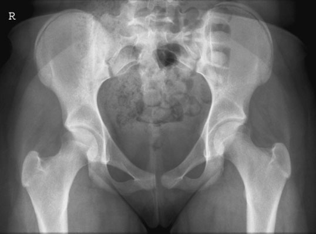
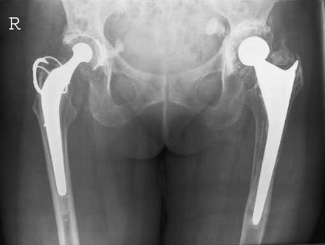
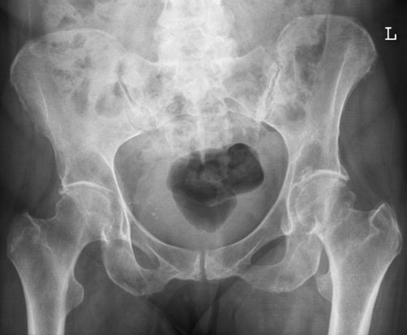
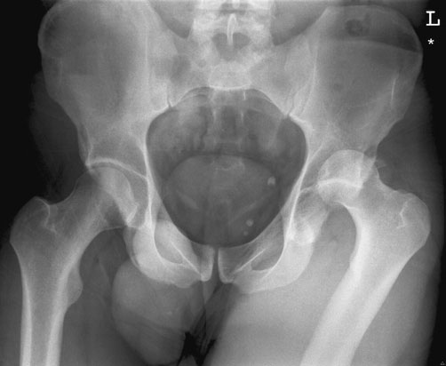

# Rx șold — treimea superioară a femurului și bazin — incidență anteroposterioară (AP)

  📷 Radiografie Convențională (Rx)
  <strong>Actualizat:</strong> 2026-09-16
  <strong>Autor:</strong> Departamentul de Radiologie / Referință Clark (Ed. 12)

---

-   __1. Rezumat Clinic & Indicații__

    ---

    === "Indicații Clinice"

        - Imaginea anteroposterioară (AP) permite compararea ambelor șolduri; în cazurile de traumatism, asigură că o suspiciune de fractură a bazinului distal nu este omisă, de exemplu, o suspiciune de fractură a ramului pubian. În cazurile de suspiciune de fractură de șold, membrul lezat este de obicei rotat extern și nu trebuie mobilizat. Dacă este posibil, membrul opus trebuie rotat extern în același grad de rotație, astfel încât să se poată face o comparație mai precisă.

    === "Ghid Național IRIS"

        !!! info "Referință Primară: Ghidul Național IRIS (Ordinul MS 1342/2012)"
            - **Capitol Ghid IRIS:** *Aparat locomotor & Bazin*
            - **Grad de Recomandare:** **Grad A**
            - **Nivel de Iradiere Estimată:** `Clasa 2 (Foarte mică ~ 0.8 - 1.0 mSv)`

            [:octicons-search-16: Deschide Ghidul IRIS](../../iris.md){ .md-button .md-button--primary } [:material-open-in-new: Aplicația Oficială PWA](https://radiologie-pediatrica.ro/iris/){ .md-button target="_blank" rel="noopener" }

-   __2. Poziționare & Centrare Fascicul__

    ---

    - **Poziție Pacient:**
        - Pacientul este culcat în decubit dorsal și simetric pe masa radiologică, cu planul mediosagital perpendicular pe masa radiologică.
        - Linia mediană a pacientului trebuie să coincidă cu fasciculul primar centrat și cu mecanismul Bucky al mesei.
        - Dacă pacientul rămâne pe targa mobilă, ideal trebuie poziționat de-a lungul liniei mediane și ajustat pentru a obține incidența optimă, în funcție de gradul său de mobilitate.
        - Pentru a evita rotația bazinului, spinele iliace anterosuperioare trebuie să fie echidistante față de masa radiologică. Se poate utiliza un suport neopac plasat sub fesă pentru a nivela bazinul. Planul coronal trebuie să fie acum paralel cu masa radiologică.
        - Membrele sunt ușor în abducție și rotite intern pentru a aduce colurile femurale paralel cu caseta.
        - Săculeții cu nisip și suporturile sunt plasați pe sau sprijiniți de regiunea gleznei pentru a ajuta la menținerea acestei poziții.
    - **Punct de Centrare Fascicul:**
        - Se centrează pe linia mediană, cu raza centrală verticală.
        - Centrul casetei se plasează la jumătatea distanței dintre marginea superioară a simfizei pubiene și SIAS pentru întregul bazin și femurele proximale. Marginea superioară a casetei trebuie să fie cu 5 cm deasupra marginii superioare a crestelor iliace pentru a compensa divergența fasciculului și pentru a asigura includerea întregului bazin osos.
        - Centrul casetei se plasează la nivelul marginii superioare a simfizei pubiene pentru șolduri și femurele superioare. 148 Incidență anteroposterioară (AP) a întregului bazin, cu rotație internă a femurelor. Radiografie anteroposterioară (AP) a ambelor șolduri și a femurelor superioare, evidențiind proteze bilaterale
    - **Distanță Focar-Film (DFF / SID):** 100 cm
    - **Comandă Respiratorie:** Apnee pe durata expunerii (apnee în inspir pentru torace; expir pentru Abdomen/bazin).

-   __3. Parametri Tehnici Expunere__

    ---

    | Parametru Tehnic | Valoare Configurare Generator / Tub |
    |:-----------------|:-------------------------------------|
    | **Tensiune Tub (kV)** | DE CONFIGURAT PE APARAT |
    | **Sarcină / Produs Curent-Timp (mAs)** | Conform AEC / grosimii anatomice |
    | **Distanță Focar-Film (DFF / SID)** | 100 cm |
    | **Grilă Antidifuzoare (Bucky)** | Cu grilă antidifuzoare Bucky |
    | **Dimensiune Focar** | Focar Mic (0.6 mm) |
    | **Camere de Ionizare AEC** | Camerele laterale (sau camera centrală, în funcție de regiune) |
    | **Colimare Fascicul** | Colimare strictă la aria anatomică de interes diagnostic |
    | **Filtrare Tub** | Totală ≥ 2.5 mm Al echivalent (conform Clark: 3.0 mm Al echivalent) |

-   __4. Criterii de Calitate & Reușită Imagine__

    ---

    - Pentru incidența de bază a ambelor șolduri, ambii trohanteri și treimea superioară a femurelor trebuie să fie vizibili pe imagine.
    - Pentru incidența de bază a bazinului, ambele creste iliace și femurele proximale, inclusiv trohanterii mici, trebuie să fie vizibile pe imagine.
    - Absența rotației anatomice (simetrie bilaterală perfectă). Oasele iliace trebuie să aibă aceeași dimensiune, iar găurile obturatoare trebuie să aibă aceeași dimensiune și formă.
    - Trebuie să fie posibilă identificarea liniei lui Shenton, care formează o curbă continuă între trohanterul mic, colul femural și marginea inferioară a simfizei pubiene.
    - Densitatea optică trebuie, în mod ideal, să fie similară în întregul bazin și în femurele proximale. Dacă kVp este prea mic și mAs este prea mare, partea supero-laterală a ilionului și trohanterii mari pot să nu fie vizualizați, în special la pacienții slabi.
    - Contrastul imaginii trebuie, de asemenea, să permită vizualizarea desenului trabecular al colurilor femurale. Utilizarea compresiei la pacienții adecvați, care au exces de părți moi suprapuse oaselor bazinului, poate îmbunătăți contrastul imaginii.
    - Nu trebuie să fie vizibile artefacte provenite de la îmbrăcăminte.

-   __5. Protecție Radiologică (ALARA)__

    ---

    - La prima vizită la clinică și în cazurile de traumatism, este o practică obișnuită să nu se aplice protecție gonadică, deoarece aceasta poate ascunde oasele bazinului și poate duce la omiterea unor informații. La vizitele de urmărire, protecția gonadică trebuie utilizată și poziționată cu atenție pentru a evita mascarea regiunii de interes, ceea ce ar duce la repetarea inutilă a radiografiei.
    - Fasciculul primar trebuie colimat optim la dimensiunea casetei. În mod ideal, pe imagine trebuie să fie vizibilă dovada colimării.
    - Utilizarea corectă a controlului automat al expunerii (AEC) reduce numărul repetărilor cauzate de alegerea necorespunzătoare a factorilor de expunere.
    - Factorii de expunere sau valorile produsului doză–suprafață (DAP) trebuie înregistrate. Bazin anteroposterior (AP) evidențiind o suspiciune de fractură a ischionului și pubisului, cu întreruperea liniei lui Shenton. Suspiciune de fractură asociată a părții stângi a sacrului. Radiografie anteroposterioară (AP) evidențiind o suspiciune de fractură subcapitală a colului femural stâng. Radiografie anteroposterioară (AP) a bazinului evidențiind luxația posterioară a articulației șoldului stâng.
    - Ecranare gonadică cu șorț plumbat dacă gonadele sunt în apropierea fasciculului util (regula ALARA).
    - Colimare precisă la dimensiunea anatomică strict necesară pentru reducerea dozei și a radiației difuze.
    - Verificarea posibilității unei sarcini la pacientele de vârstă fertilă înainte de expunere.

!!! note "Observații Clinice & Tehnice"
    - Rotația internă a membrelor compensează divergența fasciculului de raze X atunci când se centrează pe linia mediană. Imaginea rezultată va evidenția ambii trohanteri, mare și mic.
    - Apneea pacientului pentru estomparea structurilor suprapuse poate fi utilizată pentru diminuarea umbrelor intestinale evidente deasupra sacrului și oaselor iliace.

### 🖼️ Imagini

<figure class="protocol-image-card" markdown>

![să se poată face; în cazurile de traumatism, asigură că o suspiciune de fractură a bazinului dis- [fragment deteriorat în sursă]](../../assets/images/protocols/clark/rx-sold-articulatie-coxofemurala-upper-third-of-femur-and-bazin-pelvis-antero-posterior-bazin-pelvis-p163-clark/fig_1.jpeg)

<figcaption><strong>să se poată face; în cazurile de traumatism, asigură că o suspiciune de fractură a bazinului dis- [fragment deteriorat în sursă]</strong> — Poziționarea pacientului și centrarea fasciculului conform Clark (Ed. 12)</figcaption>

</figure>

<figure class="protocol-image-card" markdown>

<figcaption><strong>tal nu este omisă, de exemplu, o suspiciune de fractură a ramului pubian.</strong> — Aspect radiografic / ghid de poziționare conform tratatului Clark (Ed. 12)</figcaption>

</figure>

<figure class="protocol-image-card" markdown>

<figcaption><strong>În cazurile de suspiciune de fractură de șold, membrul lezat este</strong> — Aspect radiografic / ghid de poziționare conform tratatului Clark (Ed. 12)</figcaption>

</figure>

<figure class="protocol-image-card" markdown>

![• La prima vizită la clinică și în cazurile de traumatism, este o practică nor- [fragment deteriorat în sursă]](../../assets/images/protocols/clark/rx-sold-articulatie-coxofemurala-upper-third-of-femur-and-bazin-pelvis-antero-posterior-bazin-pelvis-p163-clark/fig_4.jpeg)

<figcaption><strong>• La prima vizită la clinică și în cazurile de traumatism, este o practică nor- [fragment deteriorat în sursă]</strong> — Aspect radiografic / ghid de poziționare conform tratatului Clark (Ed. 12)</figcaption>

</figure>

<figure class="protocol-image-card" markdown>

<figcaption><strong>repetare inutilă a radiografiei.</strong> — Aspect radiografic / ghid de poziționare conform tratatului Clark (Ed. 12)</figcaption>

</figure>

<figure class="protocol-image-card" markdown>

<figcaption><strong>Bazin anteroposterior (AP) evidențiind o suspiciune de fractură a ischionului și pubisului, cu întreruperea</strong> — Aspect radiografic / ghid de poziționare conform tratatului Clark (Ed. 12)</figcaption>

</figure>

=== "Ghid Rapid de Execuție"

    1. **Identificarea și verificarea pacientului:** verificare identitate, zonă de examinat, consimțământ conform procedurii și evaluarea posibilității unei sarcini, când este relevantă.
    2. **Pregătire:** îndepărtarea oricăror obiecte radiopace (bijuterii, agrafe, fermoare, proteze, pansamente dense).
    3. **Poziționare precisă:** alinierea receptorului de imagine și a tubului la distanța prescrisă (100 cm).
    4. **Colimare strictă:** adaptarea fasciculului strict la regiunea de diagnostic pentru scăderea iradierii și reducerea radiației difuze.
    5. **Radioprotecție:** verificarea [politicii RX](../radioprotectie.md), cu măsuri distincte pentru pacient, personal și însoțitor.

## Surse de documentare

- [Clark's Positioning in Radiography (Ed. 12), Pagina 163](https://books.google.com/books/about/Clark_s_Positioning_in_Radiography.html?id=Xxu6MwEACAAJ)
