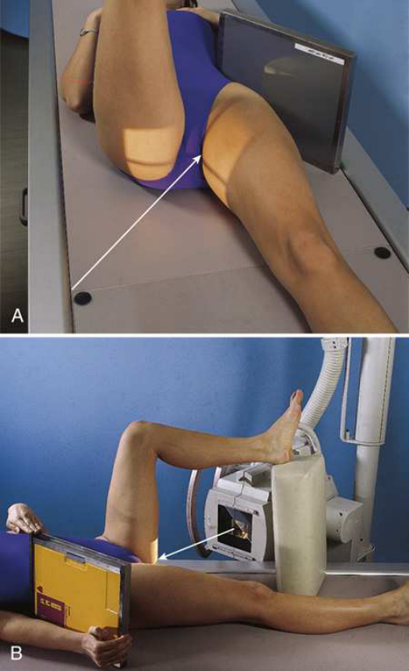
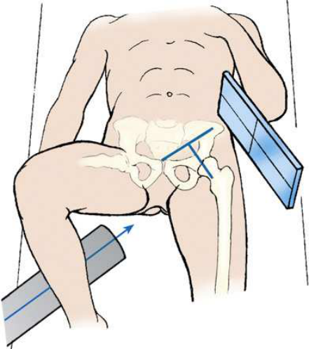
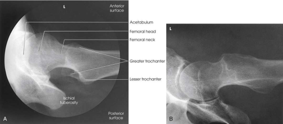

# Rx Șold — Axiolateral Incidență — Danelius-Miller Method (Merrill)

  📷 Radiografie Convențională (Rx)
  <strong>Actualizat:</strong> 2026-09-16
  <strong>Autor:</strong> Referință Merrill

---

-   __1. Rezumat Clinic & Indicații__

    ---

    === "Indicații Clinice"

        - Conform reperelor anatomice standard din tratat

    === "Ghid Național IRIS"

        !!! info "Referință Primară: Ghidul Național IRIS (Ordinul MS 1342/2012)"
            - **Capitol Ghid IRIS:** *Ghidul Național IRIS*
            - **Grad de Recomandare:** **De verificat pe indicație; fără grad atribuit automat**
            - **Nivel de Iradiere Estimată:** `De verificat pentru examinarea și populația selectate`

            [:octicons-search-16: Deschide Ghidul IRIS](../../iris.md){ .md-button .md-button--primary } [:material-open-in-new: Aplicația Oficială PWA](https://radiologie-pediatrica.ro/iris/){ .md-button target="_blank" rel="noopener" }
-   __2. Poziționare & Centrare Fascicul__

    ---

    - **Poziție Pacient:** se așază pacientul în Decubit dorsal poziție.; When examining pacient who este thin sau culcat pe soft bed, elevate Bazin (bazin (pelvis)) pe firm pillow sau folded sheets suficiently la se centrează most prominent point de mare trohanter la linia mediană receptorul de imagine. support trebuie să nu extend beyond lateral surface de corp; otherwise, it would interfere cu placement de receptorul de imagine. When Bazin (bazin (pelvis)) este ridicat, support afected limb la Șold level pe săculeți cu nisip sau firm pillows. se flectează Genunchi și Șold de unafected side la elevate thigh în vertical poziție. Rest unafected membru inferior pe suitable support that does nu interfere cu raza centrală centrală. Special support devices sunt available. Do nu rest Picior pe x-ray tube sau collimator. se ajustează Bazin (bazin (pelvis)) so that it este nu rotit (Figs. 8.33 și 8.34). Unless contraindicated, grasp heel și medially se rotește Picior și membru inferior de afected side approximately 15 la 20 grade. săculeți cu nisip poate fie used la hold membru inferior și Picior în this poziție, și small support poate fie plasat under Genunchi. Manipulation de pacienți cu unhealed suspiciune de fractură trebuie să fie performed prin physician. Place receptorul de imagine în vertical poziție cu its upper margine în părți moi crease above crestele iliace. Angle receptorul de imagine away de la corp until it este exactly paralel cu axa longitudinală de col femural. Support receptorul de imagine în this poziție cu săculeți cu nisip sau vertical receptorul de imagine holder. These sunt preferred methods. Alternatively, pacientul poate support receptorul de imagine cu Mână. fie careful la poziție grila vertically but cu lead strips oriented horizontally.
    - **Punct de Centrare Fascicul:** perpendicular pe axa longitudinală de col femural. raza centrală enters groin area la point midway între anterior și posterior surfaces de upper thigh și passes through col femural, which este approximately 2.5 inches (6.4 cm) below point de intersection de localization lines described previously (see Fig. 8.12).
    - **Distanță Focar-Film (DFF / SID):** Nespecificat în fragmentul extras; de verificat în sursă
    - **Comandă Respiratorie:** apnee (oprirea respirației).

-   __3. Parametri Tehnici Expunere__

    ---

    | Parametru Tehnic | Valoare Configurare Generator / Tub |
    |:-----------------|:-------------------------------------|
    | **Tensiune Tub (kV)** | DE CONFIGURAT PE APARAT |
    | **Sarcină / Produs Curent-Timp (mAs)** | DE CONFIGURAT PE APARAT |
    | **Distanță Focar-Film (DFF / SID)** | Nespecificat în fragmentul extras; de verificat în sursă |
    | **Grilă Antidifuzoare (Bucky)** | DE CONFIGURAT PE APARAT |
    | **Dimensiune Focar** | DE CONFIGURAT PE APARAT |
    | **Camere de Ionizare AEC** | DE CONFIGURAT PE APARAT |
    | **Colimare Fascicul** | Se ajustează câmpul de iradiere la formatul 24 × 30 cm pe colimator. Se plasează markerul de lateralitate în câmpul colimat. Compensating Filter This incidență este improved dramatically și poate fie performed cu one expunere cu use de specially designed compensating filter. |
    | **Filtrare Tub** | DE CONFIGURAT PE APARAT |

-   __4. Criterii de Calitate & Reușită Imagine__

    ---

    - Criterii radiologice de calitate imaginii:
    - Colimare adecvată vizibilă și prezența markerului de lateralitate (D/S) plasat clear de anatomy de interest
    - Șold articulație cu cotil (acetabul)
    - col femural fără overlap de la mare trohanter
    - Small amount de mic trohanter pe posterior surface de Femur
    - Small amount de mare trohanter pe anterior și posterior surfaces de proximal Femur when Femur este properly inverted
    - tuberozități ischiatice below cap femural și neck
    - părți moi shadow de unafected thigh nu overlapping Șold articulație sau proximal Femur
    - orice orthopedic appliance în its entirety
    - Bony detalii trabeculare osoase și surrounding soft tissues

-   __5. Protecție Radiologică (ALARA)__

    ---

    - Nespecificat în fragmentul extras; de verificat în sursă

!!! note "Observații Clinice & Tehnice"
    Conform reperelor anatomice standard din tratat

### 🖼️ Imagini

<figure class="protocol-image-card" markdown>

<figcaption><strong>Merrill — pagina PDF 629, imaginea 1</strong> — Imagine din fragmentul sursă; asocierea necesită revizie.</figcaption>

</figure>

<figure class="protocol-image-card" markdown>

<figcaption><strong>Merrill — pagina PDF 630, imaginea 2</strong> — Imagine din fragmentul sursă; asocierea necesită revizie.</figcaption>

</figure>

<figure class="protocol-image-card" markdown>

<figcaption><strong>Merrill — pagina PDF 631, imaginea 3</strong> — Imagine din fragmentul sursă; asocierea necesită revizie.</figcaption>

</figure>

=== "Ghid Rapid de Execuție"

    1. **Identificarea și verificarea pacientului:** verificare identitate, zonă de examinat, consimțământ conform procedurii și evaluarea posibilității unei sarcini, când este relevantă.
    2. **Pregătire:** îndepărtarea oricăror obiecte radiopace (bijuterii, agrafe, fermoare, proteze, pansamente dense).
    3. **Poziționare precisă:** alinierea receptorului de imagine și a tubului la distanța prescrisă (Nespecificat în fragmentul extras; de verificat în sursă).
    4. **Colimare strictă:** adaptarea fasciculului strict la regiunea de diagnostic pentru scăderea iradierii și reducerea radiației difuze.
    5. **Radioprotecție:** verificarea [politicii RX](../radioprotectie.md), cu măsuri distincte pentru pacient, personal și însoțitor.

## Surse de documentare

- [Merrill’s Atlas, 8. Pelvis and Hip, pagini PDF 627–631](../../assets/protocols/sources/a56d45c16829_Merrills_Atlas_of_Radiographic_Positioning__Procedures_3Vol_Set.pdf#page=627)

## Fragmente sursă traduse (referință tehnică)

### anatomy

cotil (acetabul), cap, neck, și trochanters de femur (Fig. 8.35).

### collimation

• Se ajustează câmpul de iradiere la formatul 24 × 30 cm pe colimator. Se plasează markerul de lateralitate în câmpul colimat.
Compensating Filter
This incidență este improved dramatically și poate fie performed cu one expunere cu use de specially designed compensating filter.

### cr

• perpendicular pe axa longitudinală de col femural. raza centrală enters groin area la point midway între anterior și
posterior surfaces de upper thigh și passes through col femural, which este approximately 2.5 inches (6.4 cm) below point
de intersection de localization lines described previously (see Fig. 8.12).

### criteria

Criterii radiologice de calitate imaginii:
• Colimare adecvată vizibilă și prezența markerului de lateralitate (D/S) plasat clear de anatomy de interest
• Hip articulație cu cotil (acetabul)
• col femural fără overlap de la mare trohanter
• Small amount de mic trohanter pe posterior surface de femur
• Small amount de mare trohanter pe anterior și posterior surfaces de proximal femur when femur este properly
inverted
• tuberozități ischiatice below cap femural și neck
• părți moi shadow de unafected thigh nu overlapping hip articulație sau proximal femur
• orice orthopedic appliance în its entirety
• Bony detalii trabeculare osoase și surrounding soft tissues

### part_pos

• When examining pacient who este thin sau culcat pe soft bed, elevate bazinul pe firm pillow sau folded sheets suficiently la center
most prominent point de mare trohanter la linia mediană receptorul de imagine. support trebuie să nu extend beyond lateral surface
de corp; otherwise, it would interfere cu placement de receptorul de imagine.
• When bazinul este ridicat, support afected limb la hip level pe săculeți cu nisip sau firm pillows.
• se flectează genunchi și hip de unafected side la elevate thigh în vertical poziție.
• Rest unafected membru inferior pe suitable support that does nu interfere cu raza centrală centrală. Special support devices sunt available. Do nu
rest picior pe x-ray tube sau collimator.
• se ajustează bazin (pelvis) so that it este nu rotit (Figs. 8.33 și 8.34).
• Unless contraindicated, grasp heel și medially se rotește picior și membru inferior de afected side approximately 15 la 20 grade.
săculeți cu nisip poate fie used la hold membru inferior și picior în this poziție, și small support poate fie plasat under genunchi. Manipulation de
pacienți cu unhealed suspiciune de fractură trebuie să fie performed prin physician.
• Place receptorul de imagine în vertical poziție cu its upper margine în părți moi crease above crestele iliace.
• Angle receptorul de imagine away de la corp until it este exactly paralel cu axa longitudinală de col femural.
• Support receptorul de imagine în this poziție cu săculeți cu nisip sau vertical receptorul de imagine holder. These sunt preferred methods. Alternatively, pacientul poate
support receptorul de imagine cu mână.
• fie careful la poziție grila vertically but cu lead strips oriented horizontally.

### patient_pos

• se așază pacientul în decubit dorsal.

### respiration

apnee (oprirea respirației).

### tech

poziționat prin manufacturer sau department protocol pentru corect anatomy display orientation; raza centrală plate: 10 × 12 inches (24
× 30 cm) longitudinal.

