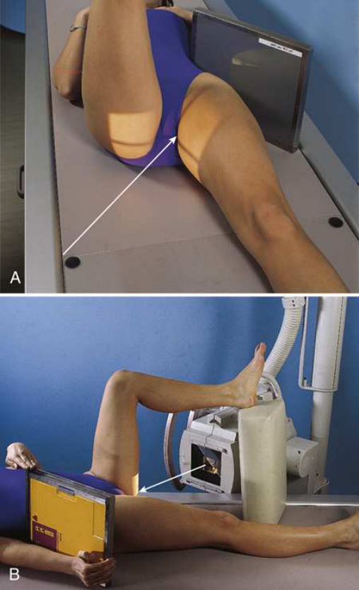
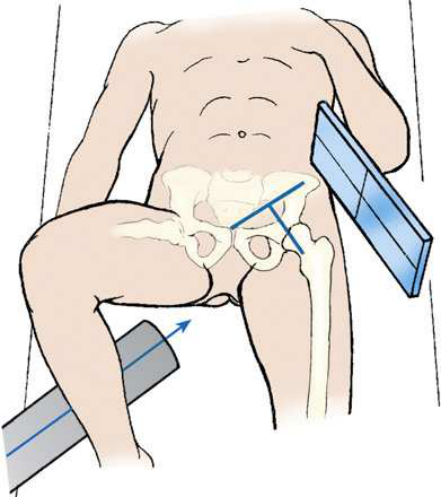
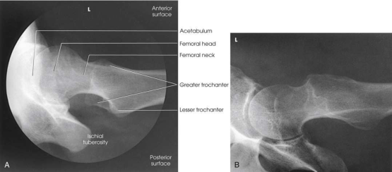

# Rx șold — incidență axiolaterală — metoda Danelius-Miller (Merrill)

  📷 Radiografie Convențională (Rx)
  <strong>Actualizat:</strong> 2026-09-16
  <strong>Autor:</strong> Referință Merrill

---

-   __1. Rezumat Clinic & Indicații__

    ---

    === "Indicații Clinice"

        - Conform reperelor anatomice standard din tratat

    === "Ghid Național IRIS"

        !!! info "Referință Primară: Ghidul Național IRIS (Ordinul MS 1342/2012)"
            - **Capitol Ghid IRIS:** *Aparat locomotor & Bazin*
            - **Grad de Recomandare:** **Grad A**
            - **Nivel de Iradiere Estimată:** `Clasa 2 (Foarte mică ~ 0.8 - 1.0 mSv)`

            [:octicons-search-16: Deschide Ghidul IRIS](../../iris.md){ .md-button .md-button--primary } [:material-open-in-new: Aplicația Oficială PWA](https://radiologie-pediatrica.ro/iris/){ .md-button target="_blank" rel="noopener" }

-   __2. Poziționare & Centrare Fascicul__

    ---

    - **Poziție Pacient:** Se așază pacientul în decubit dorsal. Când se examinează un pacient slab sau culcat pe un pat moale, se ridică bazinul pe o pernă fermă sau pe cearșafuri împăturite, suficient pentru a centra punctul cel mai proeminent al trohanterului mare pe linia mediană a receptorului de imagine. Suportul nu trebuie să se extindă dincolo de suprafața laterală a corpului; în caz contrar, ar interfera cu plasarea receptorului de imagine. Când bazinul este ridicat, se susține membrul afectat la nivelul șoldului pe săculeți cu nisip sau perne ferme. Se flectează genunchiul și șoldul de partea neafectată pentru a ridica coapsa în poziție verticală. Se sprijină membrul inferior neafectat pe un suport adecvat care nu interferează cu raza centrală. Sunt disponibile dispozitive speciale de susținere. Nu se sprijină piciorul pe tubul de raze X sau pe colimator. Se ajustează bazinul astfel încât să nu fie rotat (Figs. 8.33 și 8.34). Dacă nu există contraindicații, se prinde călcâiul și se rotește medial piciorul și membrul inferior de partea afectată cu aproximativ 15 la 20 de grade. Se pot utiliza săculeți cu nisip pentru menținerea membrului inferior și a piciorului în această poziție, iar un suport mic poate fi plasat sub genunchi. Manipularea pacienților cu o suspiciune de fractură nevindecată trebuie efectuată de medic. Se plasează receptorul de imagine în poziție verticală, cu marginea sa superioară în pliul părților moi deasupra crestelor iliace. Se înclină receptorul de imagine în sens opus corpului până când este exact paralel cu axa longitudinală a colului femural. Se susține receptorul de imagine în această poziție cu săculeți cu nisip sau cu suportul vertical al receptorului de imagine. Acestea sunt metodele preferate. Alternativ, pacientul poate susține receptorul de imagine cu mâna. Se acordă atenție poziționării verticale a grilei, dar cu lamelele de plumb orientate orizontal.
    - **Punct de Centrare Fascicul:** perpendicular pe axa longitudinală a colului femural. Raza centrală intră în regiunea inghinală într-un punct situat la jumătatea distanței dintre suprafețele anterioară și posterioară ale coapsei superioare și trece prin colul femural, care se află la aproximativ 2.5 țoli (6.4 cm) sub punctul de intersecție al liniilor de localizare descrise anterior (vezi Fig. 8.12).
    - **Distanță Focar-Film (DFF / SID):** Nespecificat în fragmentul extras; de verificat în sursă
    - **Comandă Respiratorie:** apnee (oprirea respirației).

-   __3. Parametri Tehnici Expunere__

    ---

    | Parametru Tehnic | Valoare Configurare Generator / Tub |
    |:-----------------|:-------------------------------------|
    | **Tensiune Tub (kV)** | DE CONFIGURAT PE APARAT |
    | **Sarcină / Produs Curent-Timp (mAs)** | DE CONFIGURAT PE APARAT |
    | **Distanță Focar-Film (DFF / SID)** | Nespecificat în fragmentul extras; de verificat în sursă |
    | **Grilă Antidifuzoare (Bucky)** | DE CONFIGURAT PE APARAT |
    | **Dimensiune Focar** | DE CONFIGURAT PE APARAT |
    | **Camere de Ionizare AEC** | DE CONFIGURAT PE APARAT |
    | **Colimare Fascicul** | Se ajustează câmpul de iradiere la formatul 24 × 30 cm pe colimator. Se plasează markerul de lateralitate în câmpul colimat. Filtru compensator. Această incidență este îmbunătățită considerabil și poate fi efectuată cu o singură expunere, utilizând un filtru compensator special conceput. |
    | **Filtrare Tub** | DE CONFIGURAT PE APARAT |

-   __4. Criterii de Calitate & Reușită Imagine__

    ---

    - Criterii radiologice de calitate a imaginii:
    - Colimare adecvată vizibilă și prezența markerului de lateralitate (D/S) plasat în afara structurilor anatomice de interes
    - Articulația șoldului cu cotilul (acetabulul)
    - Col femural fără suprapunerea trohanterului mare
    - O mică porțiune a trohanterului mic pe suprafața posterioară a femurului
    - O mică porțiune a trohanterului mare pe suprafețele anterioară și posterioară ale femurului proximal, când femurul este inversat corespunzător
    - Tuberozitățile ischiatice sub capul și colul femural
    - Umbra părților moi ale coapsei neafectate nu se suprapune peste articulația șoldului sau femurul proximal
    - orice dispozitiv ortopedic în întregime
    - Detalii trabeculare osoase și țesuturile moi înconjurătoare

-   __5. Protecție Radiologică (ALARA)__

    ---

    - Nespecificat în fragmentul extras; de verificat în sursă

!!! note "Observații Clinice & Tehnice"
    Conform reperelor anatomice standard din tratat

### 🖼️ Imagini

<figure class="protocol-image-card" markdown>

<figcaption><strong>Merrill — pagina 629, imaginea 1</strong> — Imagine din fragmentul sursă; asocierea necesită revizie.</figcaption>

</figure>

<figure class="protocol-image-card" markdown>

<figcaption><strong>Merrill — pagina 630, imaginea 2</strong> — Imagine din fragmentul sursă; asocierea necesită revizie.</figcaption>

</figure>

<figure class="protocol-image-card" markdown>

<figcaption><strong>Merrill — pagina 631, imaginea 3</strong> — Imagine din fragmentul sursă; asocierea necesită revizie.</figcaption>

</figure>

=== "Ghid Rapid de Execuție"

    1. **Identificarea și verificarea pacientului:** verificare identitate, zonă de examinat, consimțământ conform procedurii și evaluarea posibilității unei sarcini, când este relevantă.
    2. **Pregătire:** îndepărtarea oricăror obiecte radiopace (bijuterii, agrafe, fermoare, proteze, pansamente dense).
    3. **Poziționare precisă:** alinierea receptorului de imagine și a tubului la distanța prescrisă (Nespecificat în fragmentul extras; de verificat în sursă).
    4. **Colimare strictă:** adaptarea fasciculului strict la regiunea de diagnostic pentru scăderea iradierii și reducerea radiației difuze.
    5. **Radioprotecție:** verificarea [politicii RX](../radioprotectie.md), cu măsuri distincte pentru pacient, personal și însoțitor.

## Surse de documentare

- [Merrill’s Atlas, 8. Pelvis and Hip, pagini 627–631](https://books.google.com/books/about/Merrill_s_Atlas_of_Radiographic_Position.html?id=BM0lEQAAQBAJ)
