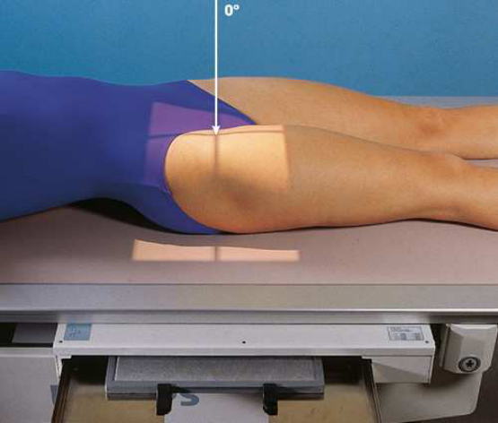
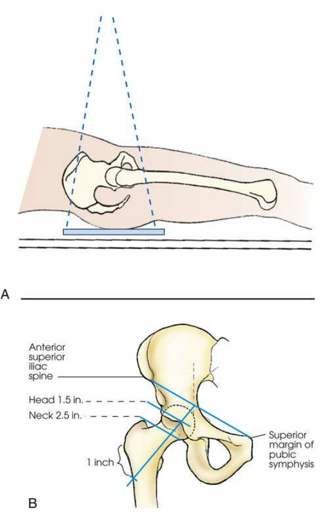
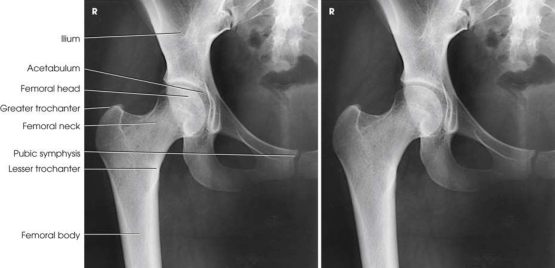

# Rx Șold — Incidență Antero-Posterioară (AP) (Merrill)

  📷 Radiografie Convențională (Rx)
  <strong>Actualizat:</strong> 2026-09-16
  <strong>Autor:</strong> Referință Merrill

---

-   __1. Rezumat Clinic & Indicații__

    ---

    === "Indicații Clinice"

        - Conform reperelor anatomice standard din tratat

    === "Ghid Național IRIS"

        !!! info "Referință Primară: Ghidul Național IRIS (Ordinul MS 1342/2012)"
            - **Capitol Ghid IRIS:** *Ghidul Național IRIS*
            - **Grad de Recomandare:** **De verificat pe indicație; fără grad atribuit automat**
            - **Nivel de Iradiere Estimată:** `De verificat pentru examinarea și populația selectate`

            [:octicons-search-16: Deschide Ghidul IRIS](../../iris.md){ .md-button .md-button--primary } [:material-open-in-new: Aplicația Oficială PWA](https://radiologie-pediatrica.ro/iris/){ .md-button target="_blank" rel="noopener" }
-   __2. Poziționare & Centrare Fascicul__

    ---

    - **Poziție Pacient:** se așază pacientul în Decubit dorsal poziție.; se ajustează pacient’s Bazin (bazin (pelvis)) so that it este nu rotit. This este accomplished prin placing spină iliacă antero-superioară (SIAS) echidistant față de masa de examinare (Figs. 8.27 și 8.28). se poziționează pacientul’s brațe în comfortable poziție. Medially se rotește membru inferior și Picior approximately 15 la 20 grade la place col femural paralel cu plane de receptorul de imagine unless this maneuver este contraindicated sau other instructions sunt given. Place support under Genunchi și săculeți cu nisip across Gleznă (Articulație Talocrurală). This makes it easier pentru pacientul la maintain this poziție.
    - **Punct de Centrare Fascicul:** perpendicular pe col femural; using localizing technique previously described (see Fig. 8.12), place raza centrală approximately 2.5 inches (6.4 cm) distal pe line drawn perpendicular pe midpoint de line între spină iliacă antero-superioară (SIAS) și simfiză pubiană (see Fig. 8.28B). Se centrează receptorul de imagine pe raza centrală. Make orice necessary adjustments în receptorul de imagine size și raza centrală point when entire orthopedic device este la fie vizualizat pe one imagine.
    - **Distanță Focar-Film (DFF / SID):** Nespecificat în fragmentul extras; de verificat în sursă
    - **Comandă Respiratorie:** apnee (oprirea respirației).

-   __3. Parametri Tehnici Expunere__

    ---

    | Parametru Tehnic | Valoare Configurare Generator / Tub |
    |:-----------------|:-------------------------------------|
    | **Tensiune Tub (kV)** | DE CONFIGURAT PE APARAT |
    | **Sarcină / Produs Curent-Timp (mAs)** | DE CONFIGURAT PE APARAT |
    | **Distanță Focar-Film (DFF / SID)** | Nespecificat în fragmentul extras; de verificat în sursă |
    | **Grilă Antidifuzoare (Bucky)** | DE CONFIGURAT PE APARAT |
    | **Dimensiune Focar** | DE CONFIGURAT PE APARAT |
    | **Camere de Ionizare AEC** | DE CONFIGURAT PE APARAT |
    | **Colimare Fascicul** | Se ajustează câmpul de iradiere la formatul 24 × 30 cm pe colimator. Se plasează markerul de lateralitate în câmpul colimat. |
    | **Filtrare Tub** | DE CONFIGURAT PE APARAT |

-   __4. Criterii de Calitate & Reușită Imagine__

    ---

    - Criterii radiologice de calitate imaginii:
    - Colimare adecvată vizibilă și prezența markerului de lateralitate (D/S) plasat clear de anatomy de interest
    - Regions de ilium și pubic bones adjoining simfiză pubiană
    - Șold articulație
    - proximal one-third de Femur
    - cap femural, penetrated și seen through cotil (acetabul)
    - Entire axa longitudinală de col femural nu foreshortened
    - mare trohanter în profile
    - mic trohanter usually nu projected beyond medial margine de Femur sau only very small amount de trochanter vizibil
    - orice orthopedic appliance în its entirety
    - Bony detalii trabeculare osoase și surrounding soft tissues

-   __5. Protecție Radiologică (ALARA)__

    ---

    - Nespecificat în fragmentul extras; de verificat în sursă

!!! note "Observații Clinice & Tehnice"
    Traumatism / Regim Urgență pacienți who have sustained severe injury usually sunt nu transferred la masa radiologică but sunt radiographed pe stretcher sau bed. After localization point has been established și marked, one assistant trebuie să fie pe fiecare side de stretcher la grasp sheet și lift Bazin (bazin (pelvis)) just enough pentru placement de receptorul de imagine, while third person supports injured limb. orice necessary manipulation de limb trebuie să fie made prin physician.

### 🖼️ Imagini

<figure class="protocol-image-card" markdown>

<figcaption><strong>Merrill — pagina PDF 623, imaginea 1</strong> — Imagine din fragmentul sursă; asocierea necesită revizie.</figcaption>

</figure>

<figure class="protocol-image-card" markdown>

<figcaption><strong>Merrill — pagina PDF 624, imaginea 2</strong> — Imagine din fragmentul sursă; asocierea necesită revizie.</figcaption>

</figure>

<figure class="protocol-image-card" markdown>

<figcaption><strong>Merrill — pagina PDF 625, imaginea 3</strong> — Imagine din fragmentul sursă; asocierea necesită revizie.</figcaption>

</figure>

=== "Ghid Rapid de Execuție"

    1. **Identificarea și verificarea pacientului:** verificare identitate, zonă de examinat, consimțământ conform procedurii și evaluarea posibilității unei sarcini, când este relevantă.
    2. **Pregătire:** îndepărtarea oricăror obiecte radiopace (bijuterii, agrafe, fermoare, proteze, pansamente dense).
    3. **Poziționare precisă:** alinierea receptorului de imagine și a tubului la distanța prescrisă (Nespecificat în fragmentul extras; de verificat în sursă).
    4. **Colimare strictă:** adaptarea fasciculului strict la regiunea de diagnostic pentru scăderea iradierii și reducerea radiației difuze.
    5. **Radioprotecție:** verificarea [politicii RX](../radioprotectie.md), cu măsuri distincte pentru pacient, personal și însoțitor.

## Surse de documentare

- [Merrill’s Atlas, 8. Pelvis and Hip, pagini PDF 622–625](../../assets/protocols/sources/a56d45c16829_Merrills_Atlas_of_Radiographic_Positioning__Procedures_3Vol_Set.pdf#page=622)

## Fragmente sursă traduse (referință tehnică)

### anatomy

capul, neck, trochanters, și proximal one-third de corp de femur (Fig. 8.29). în initial examination de hip lesion, whether
traumatic sau pathologic în origin, AP incidență este often obtained using receptorul de imagine large enough pentru include entire pelvic girdle și upper
femora. Progress studies poate fie restricted la afected side.

### collimation

• Se ajustează câmpul de iradiere la formatul 24 × 30 cm pe colimator. Se plasează markerul de lateralitate în câmpul colimat.

### cr

• perpendicular pe col femural; using localizing technique previously described (see Fig. 8.12), place raza centrală
approximately 2.5 inches (6.4 cm) distal pe line drawn perpendicular pe midpoint de line între spină iliacă antero-superioară (SIAS) și pubic
simfiză (see Fig. 8.28B).
• Se centrează receptorul de imagine pe raza centrală.
• Make orice necessary adjustments în receptorul de imagine size și raza centrală point when entire orthopedic device este la fie vizualizat pe one imagine.

### criteria

Criterii radiologice de calitate imaginii:
• Colimare adecvată vizibilă și prezența markerului de lateralitate (D/S) plasat clear de anatomy de interest
• Regions de ilium și pubic bones adjoining simfiză pubiană
• Hip articulație
• proximal one-third de femur
• cap femural, penetrated și seen through cotil (acetabul)
• Entire axa longitudinală de col femural nu foreshortened
• mare trohanter în profile
• mic trohanter usually nu projected beyond medial margine de femur sau only very small amount de trochanter vizibil
• orice orthopedic appliance în its entirety
• Bony detalii trabeculare osoase și surrounding soft tissues

### notes

Trauma pacienți who have sustained severe injury usually sunt nu transferred la masa radiologică but sunt radiographed pe stretcher sau bed. After localization point has been established și marked, one assistant trebuie să fie pe fiecare side de stretcher la grasp
sheet și lift bazinul just enough pentru placement de receptorul de imagine, while third person supports injured limb. orice necessary manipulation de
limb trebuie să fie made prin physician.

### part_pos

• se ajustează pacient’s bazin (pelvis) so that it este nu rotit. This este accomplished prin placing spină iliacă antero-superioară (SIAS) echidistant față de masa de examinare (Figs. 8.27 și
8.28).
• se poziționează pacientul’s brațe în comfortable poziție.
• Medially se rotește membru inferior și picior approximately 15 la 20 grade la place col femural paralel cu plane de receptorul de imagine
unless this maneuver este contraindicated sau other instructions sunt given.
• Place support under genunchi și săculeți cu nisip across ankle. This makes it easier pentru pacientul la maintain this poziție.

### patient_pos

• se așază pacientul în decubit dorsal.

### respiration

apnee (oprirea respirației).

### tech

poziționat prin manufacturer sau department protocol pentru corect anatomy display orientation; raza centrală plate: 10 × 12 inches (24 ×
30 cm) longitudinal.

