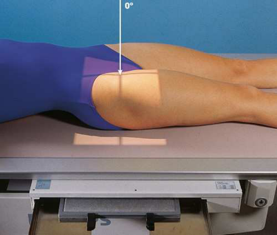
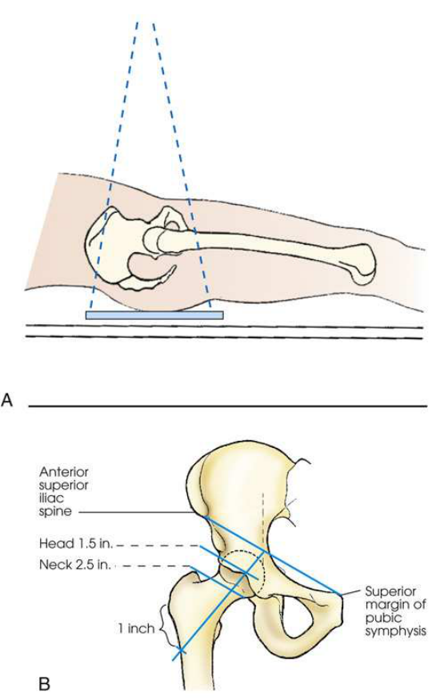
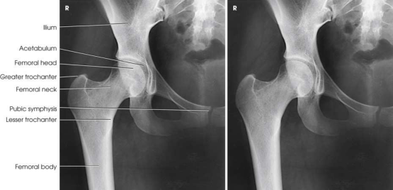

# Rx șold — incidență antero-posterioară (AP) (Merrill)

  📷 Radiografie Convențională (Rx)
  <strong>Actualizat:</strong> 2026-09-16
  <strong>Autor:</strong> Referință Merrill

---

-   __1. Rezumat Clinic & Indicații__

    ---

    === "Indicații Clinice"

        - Conform reperelor anatomice standard din tratat

    === "Ghid Național IRIS"

        !!! info "Referință Primară: Ghidul Național IRIS (Ordinul MS 1342/2012)"
            - **Capitol Ghid IRIS:** *Aparat locomotor & Bazin*
            - **Grad de Recomandare:** **Grad A**
            - **Nivel de Iradiere Estimată:** `Clasa 2 (Foarte mică ~ 0.8 - 1.0 mSv)`

            [:octicons-search-16: Deschide Ghidul IRIS](../../iris.md){ .md-button .md-button--primary } [:material-open-in-new: Aplicația Oficială PWA](https://radiologie-pediatrica.ro/iris/){ .md-button target="_blank" rel="noopener" }

-   __2. Poziționare & Centrare Fascicul__

    ---

    - **Poziție Pacient:** Se așază pacientul în poziție de decubit dorsal; se ajustează bazinul pacientului astfel încât să nu fie rotit. Acest lucru se realizează prin poziționarea spinelor iliace antero-superioare (SIAS) la distanțe egale față de masa de examinare (Fig. 8.27 și 8.28). Se poziționează brațele pacientului într-o poziție confortabilă. Se rotește medial membrul inferior și piciorul cu aproximativ 15 la 20 de grade pentru a plasa colul femural paralel cu planul receptorului de imagine, cu excepția cazului în care această manevră este contraindicată sau sunt date alte instrucțiuni. Se plasează un suport sub genunchi și săculeți cu nisip peste gleznă (articulația talocrurală). Astfel, pacientului îi este mai ușor să mențină această poziție.
    - **Punct de Centrare Fascicul:** perpendicular pe colul femural; utilizând tehnica de localizare descrisă anterior (vezi Fig. 8.12), se plasează raza centrală la aproximativ 2.5 țoli (6.4 cm) distal pe linia trasată perpendicular pe mijlocul liniei dintre SIAS și simfiza pubiană (vezi Fig. 8.28B). Se centrează receptorul de imagine pe raza centrală. Se fac toate ajustările necesare ale dimensiunii receptorului de imagine și ale punctului razei centrale atunci când întregul dispozitiv ortopedic trebuie vizualizat într-o singură imagine.
    - **Distanță Focar-Film (DFF / SID):** Nespecificat în fragmentul extras; de verificat în sursă
    - **Comandă Respiratorie:** apnee (oprirea respirației).

-   __3. Parametri Tehnici Expunere__

    ---

    | Parametru Tehnic | Valoare Configurare Generator / Tub |
    |:-----------------|:-------------------------------------|
    | **Tensiune Tub (kV)** | DE CONFIGURAT PE APARAT |
    | **Sarcină / Produs Curent-Timp (mAs)** | DE CONFIGURAT PE APARAT |
    | **Distanță Focar-Film (DFF / SID)** | Nespecificat în fragmentul extras; de verificat în sursă |
    | **Grilă Antidifuzoare (Bucky)** | DE CONFIGURAT PE APARAT |
    | **Dimensiune Focar** | DE CONFIGURAT PE APARAT |
    | **Camere de Ionizare AEC** | DE CONFIGURAT PE APARAT |
    | **Colimare Fascicul** | Se ajustează câmpul de iradiere la formatul 24 × 30 cm pe colimator. Se plasează markerul de lateralitate în câmpul colimat. |
    | **Filtrare Tub** | DE CONFIGURAT PE APARAT |

-   __4. Criterii de Calitate & Reușită Imagine__

    ---

    - Criterii radiologice de calitate a imaginii:
    - Colimare adecvată vizibilă și prezența markerului de lateralitate (D/S) plasat în afara structurilor anatomice de interes
    - Regiunile ilionului și oaselor pubiene adiacente simfizei pubiene
    - Articulația șoldului
    - Treimea proximală a femurului
    - Capul femural, penetrat și vizibil prin cotil (acetabul)
    - Întreaga axă longitudinală a colului femural, fără scurtare de perspectivă
    - Trohanterul mare în profil
    - Trohanterul mic nu este de obicei proiectat dincolo de marginea medială a femurului sau este vizibilă doar o porțiune foarte mică a trohanterului
    - orice dispozitiv ortopedic în întregime
    - Detalii trabeculare osoase și țesuturile moi înconjurătoare

-   __5. Protecție Radiologică (ALARA)__

    ---

    - Nespecificat în fragmentul extras; de verificat în sursă

!!! note "Observații Clinice & Tehnice"
    Traumatism / regim de urgență. Pacienții care au suferit leziuni severe nu sunt de obicei transferați pe masa radiologică, ci sunt radiografiați pe targă sau pe pat. După stabilirea și marcarea punctului de localizare, câte un asistent trebuie să se afle de fiecare parte a tărgii pentru a prinde cearșaful și a ridica bazinul doar atât cât este necesar pentru plasarea receptorului de imagine, în timp ce o a treia persoană susține membrul lezat. Orice manipulare necesară a membrului trebuie efectuată de medic.

### 🖼️ Imagini

<figure class="protocol-image-card" markdown>

<figcaption><strong>Merrill — pagina 623, imaginea 1</strong> — Imagine din fragmentul sursă; asocierea necesită revizie.</figcaption>

</figure>

<figure class="protocol-image-card" markdown>

<figcaption><strong>Merrill — pagina 624, imaginea 2</strong> — Imagine din fragmentul sursă; asocierea necesită revizie.</figcaption>

</figure>

<figure class="protocol-image-card" markdown>

<figcaption><strong>Merrill — pagina 625, imaginea 3</strong> — Imagine din fragmentul sursă; asocierea necesită revizie.</figcaption>

</figure>

=== "Ghid Rapid de Execuție"

    1. **Identificarea și verificarea pacientului:** verificare identitate, zonă de examinat, consimțământ conform procedurii și evaluarea posibilității unei sarcini, când este relevantă.
    2. **Pregătire:** îndepărtarea oricăror obiecte radiopace (bijuterii, agrafe, fermoare, proteze, pansamente dense).
    3. **Poziționare precisă:** alinierea receptorului de imagine și a tubului la distanța prescrisă (Nespecificat în fragmentul extras; de verificat în sursă).
    4. **Colimare strictă:** adaptarea fasciculului strict la regiunea de diagnostic pentru scăderea iradierii și reducerea radiației difuze.
    5. **Radioprotecție:** verificarea [politicii RX](../radioprotectie.md), cu măsuri distincte pentru pacient, personal și însoțitor.

## Surse de documentare

- [Merrill’s Atlas, 8. Pelvis and Hip, pagini 622–625](https://books.google.com/books/about/Merrill_s_Atlas_of_Radiographic_Position.html?id=BM0lEQAAQBAJ)
