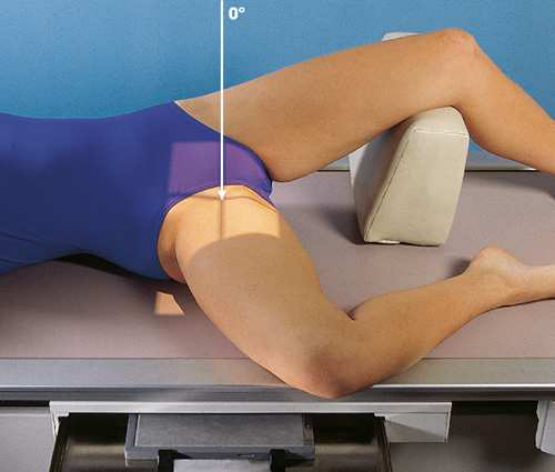
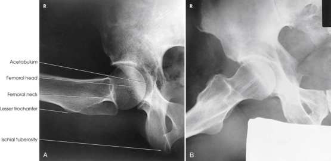
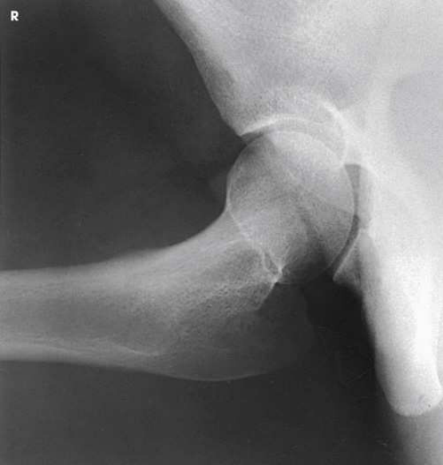

# Rx Șold — Incidență de Profil (Lateral) — Lauenstein and Hickey Methods Medio-Lateral (Merrill)

  📷 Radiografie Convențională (Rx)
  <strong>Actualizat:</strong> 2026-09-16
  <strong>Autor:</strong> Referință Merrill

---

-   __1. Rezumat Clinic & Indicații__

    ---

    === "Indicații Clinice"

        - Conform reperelor anatomice standard din tratat

    === "Ghid Național IRIS"

        !!! info "Referință Primară: Ghidul Național IRIS (Ordinul MS 1342/2012)"
            - **Capitol Ghid IRIS:** *Ghidul Național IRIS*
            - **Grad de Recomandare:** **De verificat pe indicație; fără grad atribuit automat**
            - **Nivel de Iradiere Estimată:** `De verificat pentru examinarea și populația selectate`

            [:octicons-search-16: Deschide Ghidul IRIS](../../iris.md){ .md-button .md-button--primary } [:material-open-in-new: Aplicația Oficială PWA](https://radiologie-pediatrica.ro/iris/){ .md-button target="_blank" rel="noopener" }
-   __2. Poziționare & Centrare Fascicul__

    ---

    - **Poziție Pacient:** de la Decubit dorsal poziție, se rotește pacient slightly spre afected side la Incidență Oblică. grade de obliquity depends pe how much pacientul poate abduct membru inferior.; se ajustează pacient’s corp și se centrează afected Șold la linia mediană grilă. Se instruiește pacientul să se flectează afected Genunchi și draw thigh up la poziție la nearly drept angle la Șold bone. Keep corp de afected Femur paralel cu table. se extinde opposite limb și support it la Șold level și under Genunchi. se rotește Bazin (bazin (pelvis)) fără more than necessary la accommodate flexion de thigh și avoid superimposition de afected side (Fig. 8.30).
    - **Punct de Centrare Fascicul:** perpendicular through Șold articulație, which este located midway între spină iliacă antero-superioară (SIAS) și simfiză pubiană pentru Lauenstein method (Fig. 8.31) și la cephalic angle de 20 la 25 grade și additional 1 inch (2.5 cm) more inferior pentru Hickey method (Fig. 8.32). Se centrează receptorul de imagine pe raza centrală.
    - **Distanță Focar-Film (DFF / SID):** Nespecificat în fragmentul extras; de verificat în sursă
    - **Comandă Respiratorie:** apnee (oprirea respirației).

-   __3. Parametri Tehnici Expunere__

    ---

    | Parametru Tehnic | Valoare Configurare Generator / Tub |
    |:-----------------|:-------------------------------------|
    | **Tensiune Tub (kV)** | DE CONFIGURAT PE APARAT |
    | **Sarcină / Produs Curent-Timp (mAs)** | DE CONFIGURAT PE APARAT |
    | **Distanță Focar-Film (DFF / SID)** | Nespecificat în fragmentul extras; de verificat în sursă |
    | **Grilă Antidifuzoare (Bucky)** | DE CONFIGURAT PE APARAT |
    | **Dimensiune Focar** | DE CONFIGURAT PE APARAT |
    | **Camere de Ionizare AEC** | DE CONFIGURAT PE APARAT |
    | **Colimare Fascicul** | Se ajustează câmpul de iradiere la formatul 24 × 30 cm pe colimator. Se plasează markerul de lateralitate în câmpul colimat. |
    | **Filtrare Tub** | DE CONFIGURAT PE APARAT |

-   __4. Criterii de Calitate & Reușită Imagine__

    ---

    - Criterii radiologice de calitate imaginii:
    - Colimare adecvată vizibilă și prezența markerului de lateralitate (D/S) plasat clear de anatomy de interest
    - Șold articulație centrat pe radiografie
    - Șold articulație, cotil (acetabul), și cap femural
    - col femural overlapped prin mare trohanter în Lauenstein method
    - cu cephalic angulation în Hickey method, col femural liber de superimposition
    - Bony detalii trabeculare osoase și surrounding soft tissues

-   __5. Protecție Radiologică (ALARA)__

    ---

    - Nespecificat în fragmentul extras; de verificat în sursă

!!! note "Observații Clinice & Tehnice"
    This examination este contraindicated pentru pacienți cu suspected suspiciune de fractură sau pathologic condition. Lauenstein și Hickey methods sunt used la show Șold articulație și relationship de cap femural la cotil (acetabul). This poziție este similar la previously described modified Cleaves method.

### 🖼️ Imagini

<figure class="protocol-image-card" markdown>

<figcaption><strong>Merrill — pagina PDF 626, imaginea 1</strong> — Imagine din fragmentul sursă; asocierea necesită revizie.</figcaption>

</figure>

<figure class="protocol-image-card" markdown>

<figcaption><strong>Merrill — pagina PDF 627, imaginea 2</strong> — Imagine din fragmentul sursă; asocierea necesită revizie.</figcaption>

</figure>

<figure class="protocol-image-card" markdown>

<figcaption><strong>Merrill — pagina PDF 627, imaginea 3</strong> — Imagine din fragmentul sursă; asocierea necesită revizie.</figcaption>

</figure>

=== "Ghid Rapid de Execuție"

    1. **Identificarea și verificarea pacientului:** verificare identitate, zonă de examinat, consimțământ conform procedurii și evaluarea posibilității unei sarcini, când este relevantă.
    2. **Pregătire:** îndepărtarea oricăror obiecte radiopace (bijuterii, agrafe, fermoare, proteze, pansamente dense).
    3. **Poziționare precisă:** alinierea receptorului de imagine și a tubului la distanța prescrisă (Nespecificat în fragmentul extras; de verificat în sursă).
    4. **Colimare strictă:** adaptarea fasciculului strict la regiunea de diagnostic pentru scăderea iradierii și reducerea radiației difuze.
    5. **Radioprotecție:** verificarea [politicii RX](../radioprotectie.md), cu măsuri distincte pentru pacient, personal și însoțitor.

## Surse de documentare

- [Merrill’s Atlas, 8. Pelvis and Hip, pagini PDF 625–627](../../assets/protocols/sources/a56d45c16829_Merrills_Atlas_of_Radiographic_Positioning__Procedures_3Vol_Set.pdf#page=625)

## Fragmente sursă traduse (referință tehnică)

### anatomy

lateral incidență de hip, including cotil (acetabul), extremitatea proximală femur, și relationship de cap femural la cotil (acetabul) (see Figs. 8.31 și 8.32).

### collimation

• Se ajustează câmpul de iradiere la formatul 24 × 30 cm pe colimator. Se plasează markerul de lateralitate în câmpul colimat.

### cr

• perpendicular through hip articulație, which este located midway între spină iliacă antero-superioară (SIAS) și simfiză pubiană pentru Lauenstein method
(Fig. 8.31) și la cephalic angle de 20 la 25 grade și additional 1 inch (2.5 cm) more inferior pentru Hickey method (Fig. 8.32).
• Se centrează receptorul de imagine pe raza centrală.

### criteria

Criterii radiologice de calitate imaginii:
• Colimare adecvată vizibilă și prezența markerului de lateralitate (D/S) plasat clear de anatomy de interest
• Hip articulație centrat pe radiografie
• Hip articulație, cotil (acetabul), și cap femural
• col femural overlapped prin mare trohanter în Lauenstein method
• cu cephalic angulation în Hickey method, col femural liber de superimposition
• Bony detalii trabeculare osoase și surrounding soft tissues

### notes

This examination este contraindicated pentru pacienți cu suspected suspiciune de fractură sau pathologic condition.
Lauenstein și Hickey methods sunt used la show hip articulație și relationship de cap femural la cotil (acetabul). This poziție este
similar la previously described modified Cleaves method.

### part_pos

• se ajustează pacient’s corp și se centrează afected hip la linia mediană grilă.
• Se instruiește pacientul să se flectează afected genunchi și draw thigh up la poziție la nearly drept angle la hip bone.
• Keep corp de afected femur paralel cu table.
• se extinde opposite limb și support it la hip level și under genunchi.
• se rotește bazin (pelvis) fără more than necessary la accommodate flexion de thigh și avoid superimposition de afected side (Fig. 8.30).

### patient_pos

• de la decubit dorsal, se rotește pacient slightly spre afected side la oblic poziție. grade de obliquity depends pe
how much pacientul poate abduct membru inferior.

### respiration

apnee (oprirea respirației).

### tech

poziționat prin manufacturer sau department protocol pentru corect anatomy display orientation; raza centrală plate: 10 × 12 inches (24
× 30 cm) transversal.

