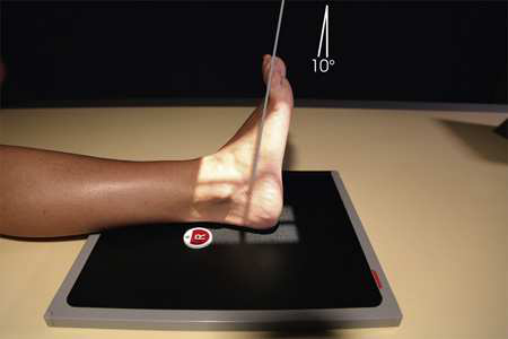
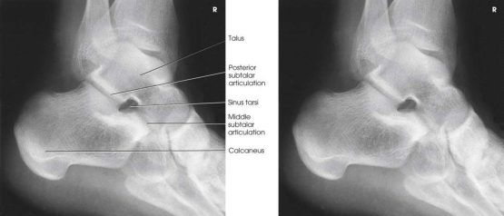

# Rx Subtalar Joint — Oblică Axială AP — Isherwood Method Rotație Internă (Medială) Gleznă (Articulație Talocrurală) (Merrill)

  📷 Radiografie Convențională (Rx)
  <strong>Actualizat:</strong> 2026-09-16
  <strong>Autor:</strong> Referință Merrill

---

-   __1. Rezumat Clinic & Indicații__

    ---

    === "Indicații Clinice"

        - Conform reperelor anatomice standard din tratat

    === "Ghid Național IRIS"

        !!! info "Referință Primară: Ghidul Național IRIS (Ordinul MS 1342/2012)"
            - **Capitol Ghid IRIS:** *Ghidul Național IRIS*
            - **Grad de Recomandare:** **De verificat pe indicație; fără grad atribuit automat**
            - **Nivel de Iradiere Estimată:** `De verificat pentru examinarea și populația selectate`

            [:octicons-search-16: Deschide Ghidul IRIS](../../iris.md){ .md-button .md-button--primary } [:material-open-in-new: Aplicația Oficială PWA](https://radiologie-pediatrica.ro/iris/){ .md-button target="_blank" rel="noopener" }
-   __2. Poziționare & Centrare Fascicul__

    ---

    - **Poziție Pacient:** Se instruiește pacientul să assume Poziție Șezândă poziție pe masa radiologică și turn cu corp weight resting pe flectat Șold și thigh de unafected side. If semilateral Decubit poziție este more comfortable, se ajustează pacient accordingly.; Se instruiește pacientul să se rotește membru inferior și Picior medially enough la rest side de Picior și afected Gleznă (Articulație Talocrurală) pe optional 30-grade foam wedge (Fig. 7.87). Place support under Genunchi. If pacientul este Decubit, place another support under mare trohanter. Dorsiflex Picior, then invert it, if possible, și Se instruiește pacientul să maintain poziție prin pulling pe strip de 2- sau 3-inch (5- la 7.6- cm) bandage looped around ball de Picior. se efectuează ecranarea gonadelor cu șorț plumbat.
    - **Punct de Centrare Fascicul:** orientat la point 1 inch (2.5 cm) distal și 1 inch (2.5 cm) anterior la maleolă laterală (fibulară) la un unghi de 10 grade cranial.
    - **Distanță Focar-Film (DFF / SID):** Nespecificat în fragmentul extras; de verificat în sursă
    - **Comandă Respiratorie:** Conform reperelor anatomice standard din tratat

-   __3. Parametri Tehnici Expunere__

    ---

    | Parametru Tehnic | Valoare Configurare Generator / Tub |
    |:-----------------|:-------------------------------------|
    | **Tensiune Tub (kV)** | DE CONFIGURAT PE APARAT |
    | **Sarcină / Produs Curent-Timp (mAs)** | DE CONFIGURAT PE APARAT |
    | **Distanță Focar-Film (DFF / SID)** | Nespecificat în fragmentul extras; de verificat în sursă |
    | **Grilă Antidifuzoare (Bucky)** | DE CONFIGURAT PE APARAT |
    | **Dimensiune Focar** | DE CONFIGURAT PE APARAT |
    | **Camere de Ionizare AEC** | DE CONFIGURAT PE APARAT |
    | **Colimare Fascicul** | se ajustează câmp de iradiere la 1 inch (2.5 cm) beyond posterior și inferior shadow de heel. Include maleolă laterală (fibulară) și metatarsal bases. Place marker de lateralitate (D/S) în collimated expunere field. |
    | **Filtrare Tub** | DE CONFIGURAT PE APARAT |

-   __4. Criterii de Calitate & Reușită Imagine__

    ---

    - Criterii radiologice de calitate imaginii:
    - Evidence de corect collimation și presence de marker de lateralitate (D/S) plasat clear de anatomy de interest
    - Middle (subtalar) articulation
    - Open sinus tarsi
    - Bony detalii trabeculare osoase și surrounding soft tissues

-   __5. Protecție Radiologică (ALARA)__

    ---

    - Nespecificat în fragmentul extras; de verificat în sursă

!!! note "Observații Clinice & Tehnice"
    Conform reperelor anatomice standard din tratat

### 🖼️ Imagini

<figure class="protocol-image-card" markdown>

<figcaption><strong>Merrill — pagina PDF 515, imaginea 1</strong> — Imagine din fragmentul sursă; asocierea necesită revizie.</figcaption>

</figure>

<figure class="protocol-image-card" markdown>

<figcaption><strong>Merrill — pagina PDF 516, imaginea 2</strong> — Imagine din fragmentul sursă; asocierea necesită revizie.</figcaption>

</figure>

=== "Ghid Rapid de Execuție"

    1. **Identificarea și verificarea pacientului:** verificare identitate, zonă de examinat, consimțământ conform procedurii și evaluarea posibilității unei sarcini, când este relevantă.
    2. **Pregătire:** îndepărtarea oricăror obiecte radiopace (bijuterii, agrafe, fermoare, proteze, pansamente dense).
    3. **Poziționare precisă:** alinierea receptorului de imagine și a tubului la distanța prescrisă (Nespecificat în fragmentul extras; de verificat în sursă).
    4. **Colimare strictă:** adaptarea fasciculului strict la regiunea de diagnostic pentru scăderea iradierii și reducerea radiației difuze.
    5. **Radioprotecție:** verificarea [politicii RX](../radioprotectie.md), cu măsuri distincte pentru pacient, personal și însoțitor.

## Surse de documentare

- [Merrill’s Atlas, 7. Lower Extremity, pagini PDF 514–516](../../assets/protocols/sources/a56d45c16829_Merrills_Atlas_of_Radiographic_Positioning__Procedures_3Vol_Set.pdf#page=514)

## Fragmente sursă traduse (referință tehnică)

### anatomy

middle articulation de subtalar articulație și an “end-pe” incidență de sinus tarsi (Fig. 7.88).

### collimation

• se ajustează câmp de iradiere la 1 inch (2.5 cm) beyond posterior și inferior shadow de heel. Include maleolă laterală (fibulară) și metatarsal bases. Place marker de lateralitate (D/S) în collimated expunere field.

### cr

• orientat la point 1 inch (2.5 cm) distal și 1 inch (2.5 cm) anterior la maleolă laterală (fibulară) la un unghi de 10 grade cranial.

### criteria

Criterii radiologice de calitate imaginii:
• Evidence de corect collimation și presence de marker de lateralitate (D/S) plasat clear de anatomy de interest
• Middle (subtalar) articulation
• Open sinus tarsi
• Bony detalii trabeculare osoase și surrounding soft tissues

### part_pos

• Se instruiește pacientul să se rotește membru inferior și picior medially enough la rest side de picior și afected ankle pe optional 30-grade foam
wedge (Fig. 7.87).
• Place support under genunchi. If pacientul este recumbent, place another support under mare trohanter.
• Dorsiflex picior, then invert it, if possible, și Se instruiește pacientul să maintain poziție prin pulling pe strip de 2- sau 3-inch (5- la 7.6-
cm) bandage looped around ball de picior.
• se efectuează ecranarea gonadelor cu șorț plumbat.

### patient_pos

• Se instruiește pacientul să assume așezat pe scaun poziție pe masa radiologică și turn cu corp weight resting pe flectat hip și thigh de
unafected side.
• If semilateral recumbent poziție este more comfortable, se ajustează pacient accordingly.

### tech

poziționat prin manufacturer sau department protocol pentru corect anatomy display orientation; raza centrală plate: 10 × 12 inches (24 × 30 cm) longitudinal.

