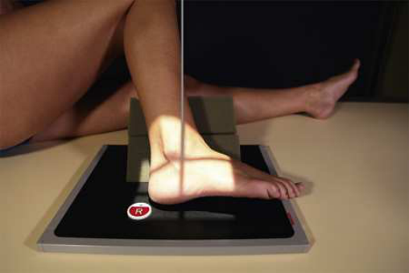
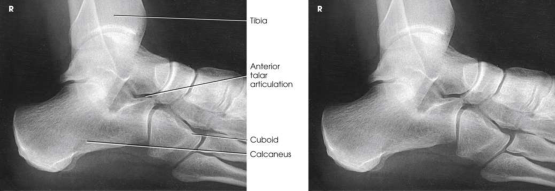

# Rx Subtalar Joint — Latero-Medial Incidență Oblică — Isherwood Method Rotație Internă (Medială) Picior (Merrill)

  📷 Radiografie Convențională (Rx)
  <strong>Actualizat:</strong> 2026-09-16
  <strong>Autor:</strong> Referință Merrill

---

-   __1. Rezumat Clinic & Indicații__

    ---

    === "Indicații Clinice"

        - Conform reperelor anatomice standard din tratat

    === "Ghid Național IRIS"

        !!! info "Referință Primară: Ghidul Național IRIS (Ordinul MS 1342/2012)"
            - **Capitol Ghid IRIS:** *Ghidul Național IRIS*
            - **Grad de Recomandare:** **De verificat pe indicație; fără grad atribuit automat**
            - **Nivel de Iradiere Estimată:** `De verificat pentru examinarea și populația selectate`

            [:octicons-search-16: Deschide Ghidul IRIS](../../iris.md){ .md-button .md-button--primary } [:material-open-in-new: Aplicația Oficială PWA](https://radiologie-pediatrica.ro/iris/){ .md-button target="_blank" rel="noopener" }
-   __2. Poziționare & Centrare Fascicul__

    ---

    - **Poziție Pacient:** se așază pacientul în semisupine sau Poziție Șezândă poziție, turned away de la side being examined. Se instruiește pacientul să se flectează Genunchi enough la place Gleznă (Articulație Talocrurală) articulație în nearly drept-angle flexion și then la lean membru inferior și Picior medially.; cu medial margine de Picior resting pe receptorul de imagine, place a 45-grade foam wedge under ridicat membru inferior. se ajustează membru inferior so that its axa longitudinală este în same plane ca raza centrală. se ajustează Picior la fie la drept angle. Place support under Genunchi (Fig. 7.85). se efectuează ecranarea gonadelor cu șorț plumbat.
    - **Punct de Centrare Fascicul:** perpendicular la point 1 inch (2.5 cm) distal și 1 inch (2.5 cm) anterior la maleolă laterală (fibulară).
    - **Distanță Focar-Film (DFF / SID):** Nespecificat în fragmentul extras; de verificat în sursă
    - **Comandă Respiratorie:** Conform reperelor anatomice standard din tratat

-   __3. Parametri Tehnici Expunere__

    ---

    | Parametru Tehnic | Valoare Configurare Generator / Tub |
    |:-----------------|:-------------------------------------|
    | **Tensiune Tub (kV)** | DE CONFIGURAT PE APARAT |
    | **Sarcină / Produs Curent-Timp (mAs)** | DE CONFIGURAT PE APARAT |
    | **Distanță Focar-Film (DFF / SID)** | Nespecificat în fragmentul extras; de verificat în sursă |
    | **Grilă Antidifuzoare (Bucky)** | DE CONFIGURAT PE APARAT |
    | **Dimensiune Focar** | DE CONFIGURAT PE APARAT |
    | **Camere de Ionizare AEC** | DE CONFIGURAT PE APARAT |
    | **Colimare Fascicul** | se ajustează câmp de iradiere la 1 inch (2.5 cm) beyond posterior și inferior shadow de heel. Include maleolă laterală (fibulară) și metatarsal bases. Place marker de lateralitate (D/S) în collimated expunere field. |
    | **Filtrare Tub** | DE CONFIGURAT PE APARAT |

-   __4. Criterii de Calitate & Reușită Imagine__

    ---

    - Criterii radiologice de calitate imaginii:
    - Evidence de corect collimation și presence de marker de lateralitate (D/S) plasat clear de anatomy de interest
    - anterior talar articular surface
    - Bony detalii trabeculare osoase și surrounding soft tissues

-   __5. Protecție Radiologică (ALARA)__

    ---

    - Nespecificat în fragmentul extras; de verificat în sursă

!!! note "Observații Clinice & Tehnice"
    Conform reperelor anatomice standard din tratat

### 🖼️ Imagini

<figure class="protocol-image-card" markdown>

<figcaption><strong>Merrill — pagina PDF 514, imaginea 1</strong> — Imagine din fragmentul sursă; asocierea necesită revizie.</figcaption>

</figure>

<figure class="protocol-image-card" markdown>

<figcaption><strong>Merrill — pagina PDF 514, imaginea 2</strong> — Imagine din fragmentul sursă; asocierea necesită revizie.</figcaption>

</figure>

=== "Ghid Rapid de Execuție"

    1. **Identificarea și verificarea pacientului:** verificare identitate, zonă de examinat, consimțământ conform procedurii și evaluarea posibilității unei sarcini, când este relevantă.
    2. **Pregătire:** îndepărtarea oricăror obiecte radiopace (bijuterii, agrafe, fermoare, proteze, pansamente dense).
    3. **Poziționare precisă:** alinierea receptorului de imagine și a tubului la distanța prescrisă (Nespecificat în fragmentul extras; de verificat în sursă).
    4. **Colimare strictă:** adaptarea fasciculului strict la regiunea de diagnostic pentru scăderea iradierii și reducerea radiației difuze.
    5. **Radioprotecție:** verificarea [politicii RX](../radioprotectie.md), cu măsuri distincte pentru pacient, personal și însoțitor.

## Surse de documentare

- [Merrill’s Atlas, 7. Lower Extremity, pagini PDF 513–514](../../assets/protocols/sources/a56d45c16829_Merrills_Atlas_of_Radiographic_Positioning__Procedures_3Vol_Set.pdf#page=513)

## Fragmente sursă traduse (referință tehnică)

### anatomy

anterior subtalar articulation și oblic incidență de oase tarsiene (Fig. 7.86). Feist-Mankin method produces similar imagine
representation.

### collimation

• se ajustează câmp de iradiere la 1 inch (2.5 cm) beyond posterior și inferior shadow de heel. Include maleolă laterală (fibulară) și metatarsal bases. Place marker de lateralitate (D/S) în collimated expunere field.

### cr

• perpendicular la point 1 inch (2.5 cm) distal și 1 inch (2.5 cm) anterior la maleolă laterală (fibulară).

### criteria

Criterii radiologice de calitate imaginii:
• Evidence de corect collimation și presence de marker de lateralitate (D/S) plasat clear de anatomy de interest
• anterior talar articular surface
• Bony detalii trabeculare osoase și surrounding soft tissues

### part_pos

• cu medial margine de picior resting pe receptorul de imagine, place a 45-grade foam wedge under ridicat membru inferior.
• se ajustează membru inferior so that its axa longitudinală este în same plane ca raza centrală.
• se ajustează picior la fie la drept angle.
• Place support under genunchi (Fig. 7.85).
• se efectuează ecranarea gonadelor cu șorț plumbat.

### patient_pos

• se așază pacientul în semisupine sau așezat pe scaun poziție, turned away de la side being examined.
• Se instruiește pacientul să se flectează genunchi enough la place ankle articulație în nearly drept-angle flexion și then la lean membru inferior și picior medially.

### tech

poziționat prin manufacturer sau department protocol pentru corect anatomy display orientation; raza centrală plate: 10 × 12 inches (24 × 30 cm) longitudinal.

