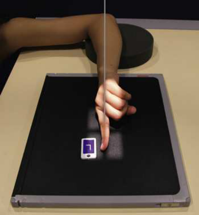
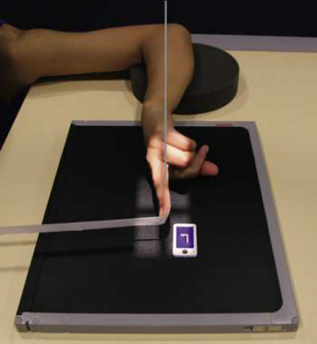
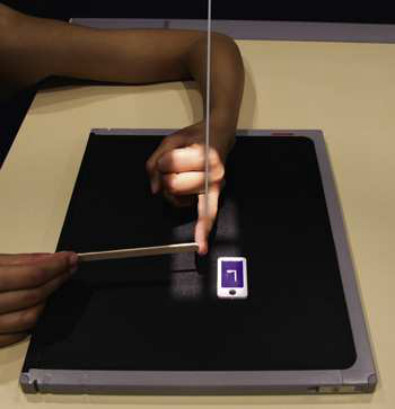
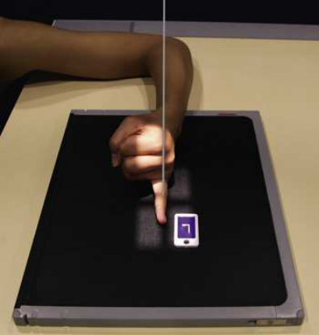
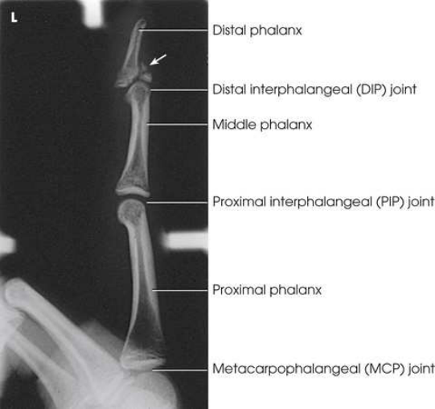
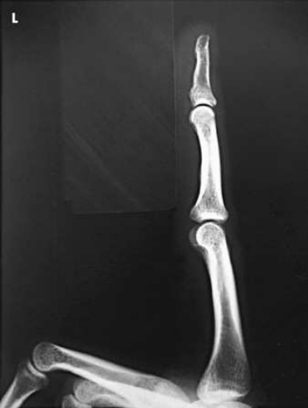
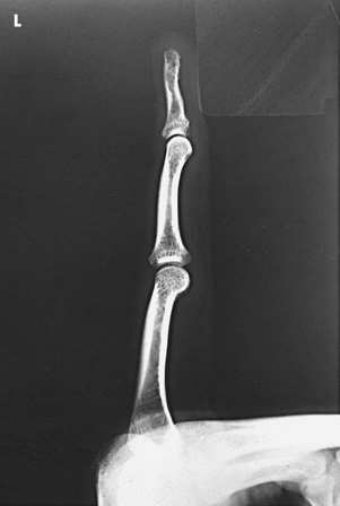
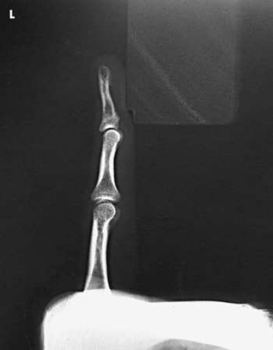

# Rx Membru Superior — Incidență de Profil (Lateral) — Latero-Medial sau Medio-Lateral (Merrill)

  📷 Radiografie Convențională (Rx)
  <strong>Actualizat:</strong> 2026-09-16
  <strong>Autor:</strong> Referință Merrill

---

-   __1. Rezumat Clinic & Indicații__

    ---

    === "Indicații Clinice"

        - Conform reperelor anatomice standard din tratat

    === "Ghid Național IRIS"

        !!! info "Referință Primară: Ghidul Național IRIS (Ordinul MS 1342/2012)"
            - **Capitol Ghid IRIS:** *Ghidul Național IRIS*
            - **Grad de Recomandare:** **De verificat pe indicație; fără grad atribuit automat**
            - **Nivel de Iradiere Estimată:** `De verificat pentru examinarea și populația selectate`

            [:octicons-search-16: Deschide Ghidul IRIS](../../iris.md){ .md-button .md-button--primary } [:material-open-in-new: Aplicația Oficială PWA](https://radiologie-pediatrica.ro/iris/){ .md-button target="_blank" rel="noopener" }
-   __2. Poziționare & Centrare Fascicul__

    ---

    - **Poziție Pacient:** se așază pacientul pe scaun la end de masa radiologică.; Because lateral falange poziții sunt dificult la hold, tell pacientul how falange este ajustat pe receptorul de imagine și evidențiază cu your own finger. Allow pacientul la assume most comfortable braț poziție. Se instruiește pacientul să se extinde falange la fie examined. Close rest de falange into fist, și hold them în complete flexion cu Police. Support Cot pe săculeți cu nisip sau provide other suitable support when Cot trebuie să fie ridicat la bring falange into poziție. cu falange under examination extins și other falange folded into fist, Se instruiește pacientul să’s Mână rest pe lateral, sau radial, surface pentru second sau third falange (Figs. 5.20 și 5.21) sau pe medial, sau ulnar, surface pentru fourth sau fifth falange (Figs. 5.22 și 5.23). Before making final adjustment de falange poziție, place receptorul de imagine astfel încât midline este paralel cu axa longitudinală de falange. se centrează receptorul de imagine la PIP articulație. Rest second și fifth falange directly pe receptorul de imagine, but pentru precis imagine de bones și articulații, elevate third și fourth falange și place their long axes paralel cu plane de receptorul de imagine. radiolucent sponge poate fie used la support falange. se imobilizează extins falange prin placing strip de adhesive tape, tongue depressor, sau other support against its palmar surface. pacientul poate hold support cu opposite Mână. se ajustează anterior sau posterior rotație de Mână la obtain true Incidență de Profil (lateral) de falange. se efectuează ecranarea gonadelor cu șorț plumbat.
    - **Punct de Centrare Fascicul:** perpendicular pe PIP articulație de afected falange
    - **Distanță Focar-Film (DFF / SID):** Nespecificat în fragmentul extras; de verificat în sursă
    - **Comandă Respiratorie:** Conform reperelor anatomice standard din tratat

-   __3. Parametri Tehnici Expunere__

    ---

    | Parametru Tehnic | Valoare Configurare Generator / Tub |
    |:-----------------|:-------------------------------------|
    | **Tensiune Tub (kV)** | DE CONFIGURAT PE APARAT |
    | **Sarcină / Produs Curent-Timp (mAs)** | DE CONFIGURAT PE APARAT |
    | **Distanță Focar-Film (DFF / SID)** | Nespecificat în fragmentul extras; de verificat în sursă |
    | **Grilă Antidifuzoare (Bucky)** | DE CONFIGURAT PE APARAT |
    | **Dimensiune Focar** | DE CONFIGURAT PE APARAT |
    | **Camere de Ionizare AEC** | DE CONFIGURAT PE APARAT |
    | **Colimare Fascicul** | Adjust câmp de iradiere la 1 inch (2.5 cm) pe toate sides de falange, including 1 inch (2.5 cm) proximal la articulații metacarpofalangiene (MCF). Se plasează markerul de lateralitate în câmpul colimat. |
    | **Filtrare Tub** | DE CONFIGURAT PE APARAT |

-   __4. Criterii de Calitate & Reușită Imagine__

    ---

    - Criterii radiologice de calitate imaginii:
    - Colimare adecvată vizibilă și prezența markerului de lateralitate (D/S) plasat clear de anatomy de interest
    - Entire falange de la fingertip la distal portion de adjoining metacarpal
    - Absența rotației anatomice (simetrie bilaterală perfectă):
    - Fingernail în profile, if visualized și normal
    - Concave, anterior surfaces de falange
    - fără superimposition de proximal phalanx sau articulații metacarpofalangiene (MCF) prin adjacent falange
    - Open articulații interfalangiene (IF) spaces
    - Bony detalii trabeculare osoase și surrounding soft tissues OPTION: Some radiographers se rotește second falange medially de la în pronație poziție (Fig. 5.36). advantage de medially rotating falange este that part este closer la receptorul de imagine pentru improved resolution și increased visibility de certain suspiciune de fractură. 3

-   __5. Protecție Radiologică (ALARA)__

    ---

    - Nespecificat în fragmentul extras; de verificat în sursă

!!! note "Observații Clinice & Tehnice"
    Conform reperelor anatomice standard din tratat

### 🖼️ Imagini

<figure class="protocol-image-card" markdown>

<figcaption><strong>Merrill — pagina PDF 249, imaginea 1</strong> — Imagine din fragmentul sursă; asocierea necesită revizie.</figcaption>

</figure>

<figure class="protocol-image-card" markdown>

<figcaption><strong>Merrill — pagina PDF 250, imaginea 2</strong> — Imagine din fragmentul sursă; asocierea necesită revizie.</figcaption>

</figure>

<figure class="protocol-image-card" markdown>

<figcaption><strong>Merrill — pagina PDF 250, imaginea 3</strong> — Imagine din fragmentul sursă; asocierea necesită revizie.</figcaption>

</figure>

<figure class="protocol-image-card" markdown>

<figcaption><strong>Merrill — pagina PDF 251, imaginea 4</strong> — Imagine din fragmentul sursă; asocierea necesită revizie.</figcaption>

</figure>

<figure class="protocol-image-card" markdown>

<figcaption><strong>Merrill — pagina PDF 252, imaginea 5</strong> — Imagine din fragmentul sursă; asocierea necesită revizie.</figcaption>

</figure>

<figure class="protocol-image-card" markdown>

<figcaption><strong>Merrill — pagina PDF 252, imaginea 6</strong> — Imagine din fragmentul sursă; asocierea necesită revizie.</figcaption>

</figure>

<figure class="protocol-image-card" markdown>

<figcaption><strong>Merrill — pagina PDF 253, imaginea 7</strong> — Imagine din fragmentul sursă; asocierea necesită revizie.</figcaption>

</figure>

<figure class="protocol-image-card" markdown>

<figcaption><strong>Merrill — pagina PDF 253, imaginea 8</strong> — Imagine din fragmentul sursă; asocierea necesită revizie.</figcaption>

</figure>

=== "Ghid Rapid de Execuție"

    1. **Identificarea și verificarea pacientului:** verificare identitate, zonă de examinat, consimțământ conform procedurii și evaluarea posibilității unei sarcini, când este relevantă.
    2. **Pregătire:** îndepărtarea oricăror obiecte radiopace (bijuterii, agrafe, fermoare, proteze, pansamente dense).
    3. **Poziționare precisă:** alinierea receptorului de imagine și a tubului la distanța prescrisă (Nespecificat în fragmentul extras; de verificat în sursă).
    4. **Colimare strictă:** adaptarea fasciculului strict la regiunea de diagnostic pentru scăderea iradierii și reducerea radiației difuze.
    5. **Radioprotecție:** verificarea [politicii RX](../radioprotectie.md), cu măsuri distincte pentru pacient, personal și însoțitor.

## Surse de documentare

- [Merrill’s Atlas, 5. Upper Extremity, pagini PDF 249–253](../../assets/protocols/sources/a56d45c16829_Merrills_Atlas_of_Radiographic_Positioning__Procedures_3Vol_Set.pdf#page=249)

## Fragmente sursă traduse (referință tehnică)

### anatomy

lateral incidență de afected falange și adjoining distal metacarpal (Figs. 5.24 through 5.27).

### collimation

• Adjust câmp de iradiere la 1 inch (2.5 cm) pe toate sides de falange, including 1 inch (2.5 cm) proximal la articulații metacarpofalangiene (MCF). Place marker de lateralitate (D/S)
în collimated expunere field.

### cr

• perpendicular pe PIP articulație de afected falange

### criteria

Criterii radiologice de calitate imaginii:
• Colimare adecvată vizibilă și prezența markerului de lateralitate (D/S) plasat clear de anatomy de interest
• Entire falange de la fingertip la distal portion de adjoining metacarpal
• Absența rotației anatomice (simetrie bilaterală perfectă):
• Fingernail în profile, if visualized și normal
• Concave, anterior surfaces de falange
• fără superimposition de proximal phalanx sau articulații metacarpofalangiene (MCF) prin adjacent falange
• Open articulații interfalangiene (IF) spaces
• Bony detalii trabeculare osoase și surrounding soft tissues
OPTION: Some radiographers se rotește second falange medially de la în pronație poziție (Fig. 5.36). advantage de medially rotating falange este that part este closer la receptorul de imagine pentru improved resolution și increased visibility de certain suspiciune de fractură. 3

### part_pos

• Because lateral falange poziții sunt dificult la hold, tell pacientul how falange este ajustat pe receptorul de imagine și evidențiază cu your own
finger. Allow pacientul la assume most comfortable braț poziție.
• Se instruiește pacientul să se extinde falange la fie examined. Close rest de falange into fist, și hold them în complete flexion cu thumb.
• Support cot pe săculeți cu nisip sau provide other suitable support when cot trebuie să fie ridicat la bring falange into poziție.
• cu falange under examination extins și other falange folded into fist, Se instruiește pacientul să’s mână rest pe lateral, sau radial,
surface pentru second sau third falange (Figs. 5.20 și 5.21) sau pe medial, sau ulnar, surface pentru fourth sau fifth falange (Figs. 5.22 și
5.23).
• Before making final adjustment de falange poziție, place receptorul de imagine astfel încât midline este paralel cu axa longitudinală de falange.
se centrează receptorul de imagine la PIP articulație.
• Rest second și fifth falange directly pe receptorul de imagine, but pentru precis imagine de bones și articulații, elevate third și fourth falange
și place their long axes paralel cu plane de receptorul de imagine. radiolucent sponge poate fie used la support falange.
• se imobilizează extins falange prin placing strip de adhesive tape, tongue depressor, sau other support against its palmar surface. pacient poate hold support cu opposite mână.
• se ajustează anterior sau posterior rotație de mână la obtain true poziție de profil (lateral) de falange.
• se efectuează ecranarea gonadelor cu șorț plumbat.

### patient_pos

• se așază pacientul pe scaun la end de masa radiologică.

### tech

poziționat prin manufacturer sau department protocol pentru corect anatomy display orientation; raza centrală plate: 10 × 12 inches (24 × 30 cm) longitudinal.

