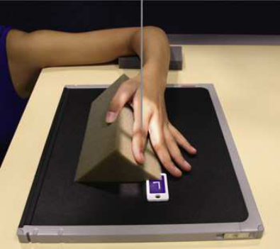
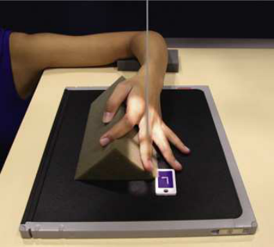
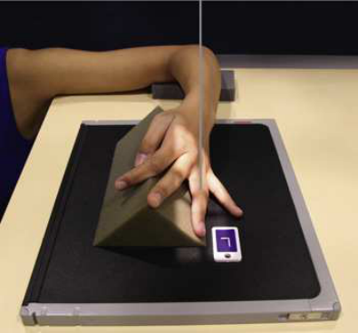
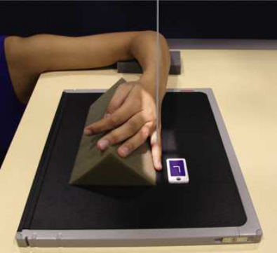
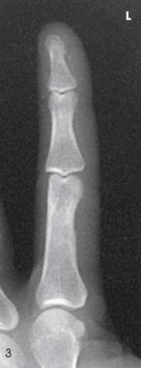
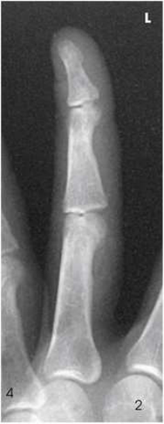
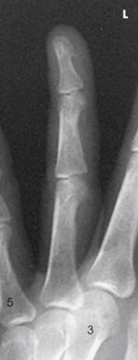

# Rx Membru Superior — Oblică Postero-Anterioară (PA) — Rotație Externă (Laterală) (Merrill)

  📷 Radiografie Convențională (Rx)
  <strong>Actualizat:</strong> 2026-09-16
  <strong>Autor:</strong> Referință Merrill

---

-   __1. Rezumat Clinic & Indicații__

    ---

    === "Indicații Clinice"

        - Conform reperelor anatomice standard din tratat

    === "Ghid Național IRIS"

        !!! info "Referință Primară: Ghidul Național IRIS (Ordinul MS 1342/2012)"
            - **Capitol Ghid IRIS:** *Ghidul Național IRIS*
            - **Grad de Recomandare:** **De verificat pe indicație; fără grad atribuit automat**
            - **Nivel de Iradiere Estimată:** `De verificat pentru examinarea și populația selectate`

            [:octicons-search-16: Deschide Ghidul IRIS](../../iris.md){ .md-button .md-button--primary } [:material-open-in-new: Aplicația Oficială PWA](https://radiologie-pediatrica.ro/iris/){ .md-button target="_blank" rel="noopener" }
-   __2. Poziționare & Centrare Fascicul__

    ---

    - **Poziție Pacient:** se așază pacientul pe scaun la end de masa radiologică.; se poziționează pacientul’s Antebraț pe masa de examinare, cu Mână în pronație și palm resting pe receptorul de imagine. se centrează receptorul de imagine la nivelul PIP articulație. se rotește Mână laterally until falange sunt separated și sprijinit pe a 45-grade foam wedge. wedge supports falange în poziție paralel cu receptorul de imagine plane (Figs. 5.28 through 5.31) astfel încât articulații interfalangiene (IF) spaces sunt open. se efectuează ecranarea gonadelor cu șorț plumbat.
    - **Punct de Centrare Fascicul:** perpendicular pe PIP articulație de afected falange
    - **Distanță Focar-Film (DFF / SID):** Nespecificat în fragmentul extras; de verificat în sursă
    - **Comandă Respiratorie:** Conform reperelor anatomice standard din tratat

-   __3. Parametri Tehnici Expunere__

    ---

    | Parametru Tehnic | Valoare Configurare Generator / Tub |
    |:-----------------|:-------------------------------------|
    | **Tensiune Tub (kV)** | DE CONFIGURAT PE APARAT |
    | **Sarcină / Produs Curent-Timp (mAs)** | DE CONFIGURAT PE APARAT |
    | **Distanță Focar-Film (DFF / SID)** | Nespecificat în fragmentul extras; de verificat în sursă |
    | **Grilă Antidifuzoare (Bucky)** | DE CONFIGURAT PE APARAT |
    | **Dimensiune Focar** | DE CONFIGURAT PE APARAT |
    | **Camere de Ionizare AEC** | DE CONFIGURAT PE APARAT |
    | **Colimare Fascicul** | Adjust câmp de iradiere la 1 inch (2.5 cm) pe toate sides de falange, including 1 inch (2.5 cm) proximal la articulații metacarpofalangiene (MCF). Se plasează markerul de lateralitate în câmpul colimat. |
    | **Filtrare Tub** | DE CONFIGURAT PE APARAT |

-   __4. Criterii de Calitate & Reușită Imagine__

    ---

    - Criterii radiologice de calitate imaginii:
    - Colimare adecvată vizibilă și prezența markerului de lateralitate (D/S) plasat clear de anatomy de interest
    - Entire falange, including distal portion de adjoining metacarpal
    - falange rotit la 45 grade, evidențiat prin concavity de ridicat side de phalangeal corpuri
    - fără superimposition de proximal phalanx sau articulații metacarpofalangiene (MCF) prin adjacent falange
    - Open IP și articulații metacarpofalangiene (MCF) spaces
    - Bony detalii trabeculare osoase și surrounding soft tissues

-   __5. Protecție Radiologică (ALARA)__

    ---

    - Nespecificat în fragmentul extras; de verificat în sursă

!!! note "Observații Clinice & Tehnice"
    Conform reperelor anatomice standard din tratat

### 🖼️ Imagini

<figure class="protocol-image-card" markdown>

<figcaption><strong>Merrill — pagina PDF 254, imaginea 1</strong> — Imagine din fragmentul sursă; asocierea necesită revizie.</figcaption>

</figure>

<figure class="protocol-image-card" markdown>

<figcaption><strong>Merrill — pagina PDF 255, imaginea 2</strong> — Imagine din fragmentul sursă; asocierea necesită revizie.</figcaption>

</figure>

<figure class="protocol-image-card" markdown>

<figcaption><strong>Merrill — pagina PDF 255, imaginea 3</strong> — Imagine din fragmentul sursă; asocierea necesită revizie.</figcaption>

</figure>

<figure class="protocol-image-card" markdown>

<figcaption><strong>Merrill — pagina PDF 256, imaginea 4</strong> — Imagine din fragmentul sursă; asocierea necesită revizie.</figcaption>

</figure>

<figure class="protocol-image-card" markdown>

<figcaption><strong>Merrill — pagina PDF 256, imaginea 5</strong> — Imagine din fragmentul sursă; asocierea necesită revizie.</figcaption>

</figure>

<figure class="protocol-image-card" markdown>

<figcaption><strong>Merrill — pagina PDF 257, imaginea 6</strong> — Imagine din fragmentul sursă; asocierea necesită revizie.</figcaption>

</figure>

<figure class="protocol-image-card" markdown>

<figcaption><strong>Merrill — pagina PDF 258, imaginea 7</strong> — Imagine din fragmentul sursă; asocierea necesită revizie.</figcaption>

</figure>

=== "Ghid Rapid de Execuție"

    1. **Identificarea și verificarea pacientului:** verificare identitate, zonă de examinat, consimțământ conform procedurii și evaluarea posibilității unei sarcini, când este relevantă.
    2. **Pregătire:** îndepărtarea oricăror obiecte radiopace (bijuterii, agrafe, fermoare, proteze, pansamente dense).
    3. **Poziționare precisă:** alinierea receptorului de imagine și a tubului la distanța prescrisă (Nespecificat în fragmentul extras; de verificat în sursă).
    4. **Colimare strictă:** adaptarea fasciculului strict la regiunea de diagnostic pentru scăderea iradierii și reducerea radiației difuze.
    5. **Radioprotecție:** verificarea [politicii RX](../radioprotectie.md), cu măsuri distincte pentru pacient, personal și însoțitor.

## Surse de documentare

- [Merrill’s Atlas, 5. Upper Extremity, pagini PDF 253–258](../../assets/protocols/sources/a56d45c16829_Merrills_Atlas_of_Radiographic_Positioning__Procedures_3Vol_Set.pdf#page=253)

## Fragmente sursă traduse (referință tehnică)

### anatomy

PA oblic incidență de afected falange și adjoining distal metacarpal (Figs. 5.32 through 5.35).

### collimation

• Adjust câmp de iradiere la 1 inch (2.5 cm) pe toate sides de falange, including 1 inch (2.5 cm) proximal la articulații metacarpofalangiene (MCF). Place marker de lateralitate (D/S)
în collimated expunere field.

### cr

• perpendicular pe PIP articulație de afected falange

### criteria

Criterii radiologice de calitate imaginii:
• Colimare adecvată vizibilă și prezența markerului de lateralitate (D/S) plasat clear de anatomy de interest
• Entire falange, including distal portion de adjoining metacarpal
• falange rotit la 45 grade, evidențiat prin concavity de ridicat side de phalangeal corpuri
• fără superimposition de proximal phalanx sau articulații metacarpofalangiene (MCF) prin adjacent falange
• Open IP și articulații metacarpofalangiene (MCF) spaces
• Bony detalii trabeculare osoase și surrounding soft tissues

### part_pos

• se poziționează pacientul’s forearm pe masa de examinare, cu mână în pronație și palm resting pe receptorul de imagine.
• se centrează receptorul de imagine la nivelul PIP articulație.
• se rotește mână laterally until falange sunt separated și sprijinit pe a 45-grade foam wedge. wedge supports falange în poziție paralel cu receptorul de imagine plane (Figs. 5.28 through 5.31) astfel încât articulații interfalangiene (IF) spaces sunt open.
• se efectuează ecranarea gonadelor cu șorț plumbat.

### patient_pos

• se așază pacientul pe scaun la end de masa radiologică.

### tech

poziționat prin manufacturer sau department protocol pentru corect anatomy display orientation; raza centrală plate: 10 × 12 inches (24 × 30 cm) longitudinal.

