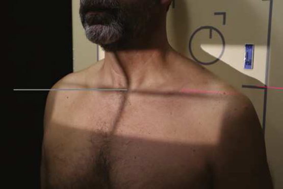
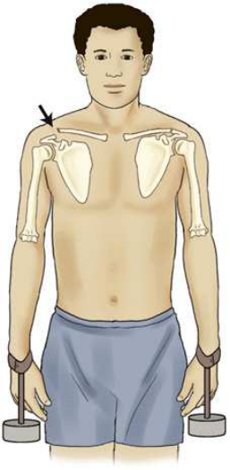
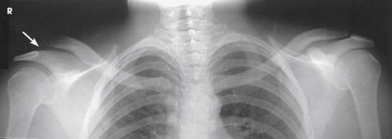
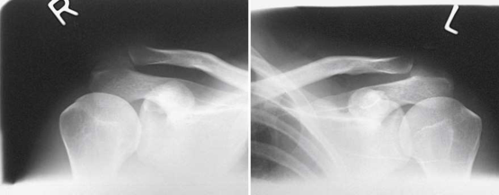

# Rx Articulații Acromioclaviculare — Incidență Antero-Posterioară (AP) — Metoda Pearson Bilateral (Merrill)

  📷 Radiografie Convențională (Rx)
  <strong>Actualizat:</strong> 2026-09-16
  <strong>Autor:</strong> Referință Merrill

---

-   __1. Rezumat Clinic & Indicații__

    ---

    === "Indicații Clinice"

        - Conform reperelor anatomice standard din tratat

    === "Ghid Național IRIS"

        !!! info "Referință Primară: Ghidul Național IRIS (Ordinul MS 1342/2012)"
            - **Capitol Ghid IRIS:** *Ghidul Național IRIS*
            - **Grad de Recomandare:** **De verificat pe indicație; fără grad atribuit automat**
            - **Nivel de Iradiere Estimată:** `De verificat pentru examinarea și populația selectate`

            [:octicons-search-16: Deschide Ghidul IRIS](../../iris.md){ .md-button .md-button--primary } [:material-open-in-new: Aplicația Oficială PWA](https://radiologie-pediatrica.ro/iris/){ .md-button target="_blank" rel="noopener" }
-   __2. Poziționare & Centrare Fascicul__

    ---

    - **Poziție Pacient:** se așază pacientul în ortostatism corp poziție, either Poziție Șezândă sau în ortostatism, because luxație articulară de articulații acromioclaviculare tends la reduce itself în Decubit poziție. positioning este easily modified la obtain Incidență Postero-Anterioară (PA).; se așază pacientul în ortostatism before stativ vertical Bucky, then se ajustează height de receptorul de imagine astfel încât midpoint de receptorul de imagine lies la same level ca Articulații Acromioclaviculare (Fig. 6.54). se centrează linia mediană corp la linia mediană grilă. Ensure that weight de corp este equally distributed pe picioarele la avoid rotație. cu pacientul’s brațe hanging prin sides, se ajustează umeri la lie în same plan orizontal. It este important that brațele hang unsupported. Make two expuneri: one în which pacientul este în ortostatism în ortostatism fără weights attached, și second în which pacientul has equal weights (5 la 10 lb) afixed la fiecare Pumn (Articulație Radiocarpiană). 14, 15 After first expunere, slowly afix weights la pacientul’s Pumn (Articulație Radiocarpiană), using band sau strap. Instruct pacientul nu la favor (tense up) injured Umăr. Avoid having pacientul hold weights în fiecare Mână; this tends la make Umăr muscles contract, reducing possibility de evidențiind small AC separation (Fig. 6.55). se efectuează ecranarea gonadelor cu șorț plumbat. Also use thyroid collar because thyroid gland este exposed la primary fascicul.
    - **Punct de Centrare Fascicul:** perpendicular pe linia mediană corp la nivelul Articulații Acromioclaviculare pentru single incidență; orientat la fiecare respective articulații acromioclaviculare when two separate expuneri sunt necessary pentru fiecare Umăr în broad-shouldered pacienți
    - **Distanță Focar-Film (DFF / SID):** 72 inches (183 cm). A longer SID reduces magnification, which enables both joints to be included on one image. The longer SID also reduces the distortion of the joint space resulting from beam divergence.
    - **Comandă Respiratorie:** apnee (oprirea respirației).

-   __3. Parametri Tehnici Expunere__

    ---

    | Parametru Tehnic | Valoare Configurare Generator / Tub |
    |:-----------------|:-------------------------------------|
    | **Tensiune Tub (kV)** | DE CONFIGURAT PE APARAT |
    | **Sarcină / Produs Curent-Timp (mAs)** | DE CONFIGURAT PE APARAT |
    | **Distanță Focar-Film (DFF / SID)** | 72 inches (183 cm). A longer SID reduces magnification, which enables both joints to be included on one image. The longer SID also reduces the distortion of the joint space resulting from beam divergence. |
    | **Grilă Antidifuzoare (Bucky)** | DE CONFIGURAT PE APARAT |
    | **Dimensiune Focar** | DE CONFIGURAT PE APARAT |
    | **Camere de Ionizare AEC** | DE CONFIGURAT PE APARAT |
    | **Colimare Fascicul** | Se ajustează câmpul de iradiere la formatul 15 × 43 cm pe colimator pentru ambele articulații cu single expunere sau la 6 × 8 inches (15 × 20 cm) pentru separate expuneri de fiecare articulație Se plasează markerul de lateralitate în câmpul colimat. |
    | **Filtrare Tub** | DE CONFIGURAT PE APARAT |

-   __4. Criterii de Calitate & Reușită Imagine__

    ---

    - Criterii radiologice de calitate imaginii:
    - Colimare adecvată vizibilă și prezența markerului de lateralitate (D/S)s plasat clear de anatomy de interest
    - ambele Articulații Acromioclaviculare, cu și fără weights, included pe one sau two radiografii
    - Absența rotației anatomice (simetrie bilaterală perfectă) sau leaning prin pacientul
    - articulații acromioclaviculare separation, if present, clar vizibil(e) pe imagini cu weights
    - Bony detalii trabeculare osoase și surrounding soft tissues

-   __5. Protecție Radiologică (ALARA)__

    ---

    - Nespecificat în fragmentul extras; de verificat în sursă

!!! note "Observații Clinice & Tehnice"
    Conform reperelor anatomice standard din tratat

### 🖼️ Imagini

<figure class="protocol-image-card" markdown>

<figcaption><strong>Merrill — pagina PDF 415, imaginea 1</strong> — Imagine din fragmentul sursă; asocierea necesită revizie.</figcaption>

</figure>

<figure class="protocol-image-card" markdown>

<figcaption><strong>Merrill — pagina PDF 416, imaginea 2</strong> — Imagine din fragmentul sursă; asocierea necesită revizie.</figcaption>

</figure>

<figure class="protocol-image-card" markdown>

<figcaption><strong>Merrill — pagina PDF 416, imaginea 3</strong> — Imagine din fragmentul sursă; asocierea necesită revizie.</figcaption>

</figure>

<figure class="protocol-image-card" markdown>

<figcaption><strong>Merrill — pagina PDF 417, imaginea 4</strong> — Imagine din fragmentul sursă; asocierea necesită revizie.</figcaption>

</figure>

=== "Ghid Rapid de Execuție"

    1. **Identificarea și verificarea pacientului:** verificare identitate, zonă de examinat, consimțământ conform procedurii și evaluarea posibilității unei sarcini, când este relevantă.
    2. **Pregătire:** îndepărtarea oricăror obiecte radiopace (bijuterii, agrafe, fermoare, proteze, pansamente dense).
    3. **Poziționare precisă:** alinierea receptorului de imagine și a tubului la distanța prescrisă (72 inches (183 cm). A longer SID reduces magnification, which enables both joints to be included on one image. The longer SID also reduces the distortion of the joint space resulting from beam divergence.).
    4. **Colimare strictă:** adaptarea fasciculului strict la regiunea de diagnostic pentru scăderea iradierii și reducerea radiației difuze.
    5. **Radioprotecție:** verificarea [politicii RX](../radioprotectie.md), cu măsuri distincte pentru pacient, personal și însoțitor.

## Surse de documentare

- [Merrill’s Atlas, 6. Shoulder Girdle, pagini PDF 414–417](../../assets/protocols/sources/a56d45c16829_Merrills_Atlas_of_Radiographic_Positioning__Procedures_3Vol_Set.pdf#page=414)

## Fragmente sursă traduse (referință tehnică)

### anatomy

bilateral imagini de articulații acromioclaviculare (Figs. 6.56 și 6.57). This incidență este used la show luxație articulară, separation, și function de articulații.

### collimation

• Se ajustează câmpul de iradiere la formatul 15 × 43 cm pe colimator pentru ambele articulații cu single expunere
• sau la 6 × 8 inches (15 × 20 cm) pentru separate expuneri de fiecare articulație
• Se plasează markerul de lateralitate în câmpul colimat.

### cr

• perpendicular pe linia mediană corp la nivelul articulații acromioclaviculare pentru single incidență; orientat la fiecare respective articulații acromioclaviculare when
two separate expuneri sunt necessary pentru fiecare umăr în broad-shouldered pacienți

### criteria

Criterii radiologice de calitate imaginii:
• Colimare adecvată vizibilă și prezența markerului de lateralitate (D/S)s plasat clear de anatomy de interest
• ambele articulații acromioclaviculare, cu și fără weights, included pe one sau two radiografii
• Absența rotației anatomice (simetrie bilaterală perfectă) sau leaning prin pacientul
• articulații acromioclaviculare separation, if present, clar vizibil(e) pe imagini cu weights
• Bony detalii trabeculare osoase și surrounding soft tissues

### part_pos

• se așază pacientul în ortostatism before stativ vertical Bucky, then se ajustează height de receptorul de imagine astfel încât midpoint de receptorul de imagine
lies la same level ca articulații acromioclaviculare (Fig. 6.54).
• se centrează linia mediană corp la linia mediană grilă.
• Ensure that weight de corp este equally distributed pe picioarele la avoid rotație.
• cu pacientul’s brațe hanging prin sides, se ajustează umeri la lie în same plan orizontal. It este important that brațele hang
unsupported.
• Make two expuneri: one în which pacientul este în ortostatism în ortostatism fără weights attached, și second în which pacientul has equal
weights (5 la 10 lb) afixed la fiecare wrist. 14, 15
• After first expunere, slowly afix weights la pacientul’s wrist, using band sau strap.
• Instruct pacientul nu la favor (tense up) injured umăr.
• Avoid having pacientul hold weights în fiecare mână; this tends la make umăr muscles contract, reducing possibility de evidențiind small AC separation (Fig. 6.55).
• se efectuează ecranarea gonadelor cu șorț plumbat. Also use thyroid collar because thyroid gland este exposed la primary fascicul.

### patient_pos

• se așază pacientul în ortostatism corp poziție, either așezat pe scaun sau în ortostatism, because luxație articulară de articulații acromioclaviculare tends la reduce itself în recumbent poziție. positioning este easily modified la obtain PA incidență.

### respiration

apnee (oprirea respirației).

### sid

72 inches (183 cm). longer SID reduces magnification, which enables ambele articulații la fie included pe one imagine. longer SID also reduces distortion de spații articulare resulting de la fascicul divergence.

### tech

poziționat prin manufacturer sau department protocol pentru corect anatomy display orientation; raza centrală plate: 14 × 17 inches (35 ×
43 cm) sau two 10 × 12 inches (24 × 30 cm), ca needed la fit pacientul.

