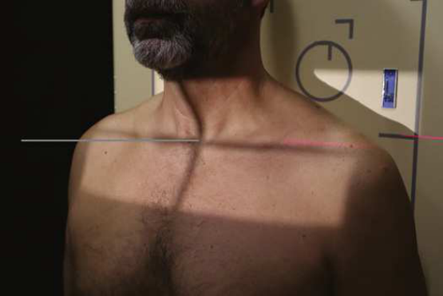
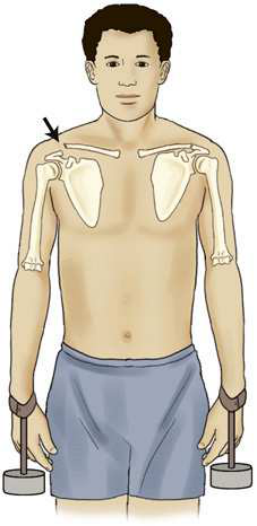
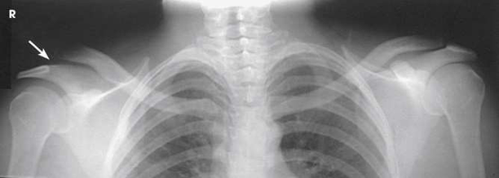
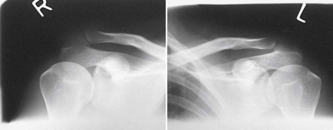

# Rx articulații acromioclaviculare — incidență anteroposterioară (AP) — metoda Pearson bilateral (Merrill)

  📷 Radiografie Convențională (Rx)
  <strong>Actualizat:</strong> 2026-09-16
  <strong>Autor:</strong> Referință Merrill

---

-   __1. Rezumat Clinic & Indicații__

    ---

    === "Indicații Clinice"

        - Conform reperelor anatomice standard din tratat

    === "Ghid Național IRIS"

        !!! info "Referință Primară: Ghidul Național IRIS (Ordinul MS 1342/2012)"
            - **Capitol Ghid IRIS:** *Aparat locomotor & Membru superior*
            - **Grad de Recomandare:** **Grad A**
            - **Nivel de Iradiere Estimată:** `Clasa 1 (Minimă < 0.05 mSv)`

            [:octicons-search-16: Deschide Ghidul IRIS](../../iris.md){ .md-button .md-button--primary } [:material-open-in-new: Aplicația Oficială PWA](https://radiologie-pediatrica.ro/iris/){ .md-button target="_blank" rel="noopener" }

-   __2. Poziționare & Centrare Fascicul__

    ---

    - **Poziție Pacient:** se așază pacientul în ortostatism, fie în poziție șezândă, fie în ortostatism, deoarece luxația articulațiilor acromioclaviculare tinde să se reducă spontan în decubit. Poziționarea se modifică ușor pentru obținerea unei incidențe PA.; se așază pacientul în ortostatism în fața stativului vertical Bucky, apoi se ajustează înălțimea receptorului de imagine astfel încât mijlocul receptorului de imagine să fie la același nivel cu articulațiile acromioclaviculare (Fig. 6.54). Se centrează linia mediană a corpului pe linia mediană a grilei. Se asigură distribuirea egală a greutății corpului pe picioare pentru a evita rotația. Cu brațele pacientului atârnând pe lângă corp, se ajustează umerii astfel încât să se afle în același plan orizontal. Este important ca brațele să atârne nesusținute. Se efectuează două expuneri: una în care pacientul este în ortostatism fără greutăți atașate și a doua în care pacientul are greutăți egale (5 la 10 lb) atașate de fiecare pumn (articulație radiocarpiană). 14, 15 După prima expunere, se atașează lent greutățile de pumnul pacientului, folosind o bandă sau o curea. Se instruiește pacientul să nu favorizeze (să nu încordeze) umărul lezat. Se evită ca pacientul să țină greutățile în fiecare mână; aceasta tinde să determine contracția mușchilor umărului, reducând posibilitatea evidențierii unei separări AC mici (Fig. 6.55). Se efectuează ecranarea gonadelor cu șorț plumbat. Se folosește și un guler tiroidian, deoarece glanda tiroidă este expusă fasciculului primar.
    - **Punct de Centrare Fascicul:** perpendicular pe linia mediană a corpului, la nivelul articulațiilor acromioclaviculare pentru o singură incidență; orientat către fiecare articulație acromioclaviculară respectivă atunci când sunt necesare două expuneri separate pentru fiecare umăr la pacienții cu umeri lați
    - **Distanță Focar-Film (DFF / SID):** 72 inci (183 cm). O SID mai mare reduce magnificarea, ceea ce permite includerea ambelor articulații pe aceeași imagine. O SID mai mare reduce și distorsiunea spațiului articular cauzată de divergența fasciculului.
    - **Comandă Respiratorie:** apnee (oprirea respirației).

-   __3. Parametri Tehnici Expunere__

    ---

    | Parametru Tehnic | Valoare Configurare Generator / Tub |
    |:-----------------|:-------------------------------------|
    | **Tensiune Tub (kV)** | DE CONFIGURAT PE APARAT |
    | **Sarcină / Produs Curent-Timp (mAs)** | DE CONFIGURAT PE APARAT |
    | **Distanță Focar-Film (DFF / SID)** | 72 inci (183 cm). O SID mai mare reduce magnificarea, ceea ce permite includerea ambelor articulații pe aceeași imagine. O SID mai mare reduce și distorsiunea spațiului articular cauzată de divergența fasciculului. |
    | **Grilă Antidifuzoare (Bucky)** | DE CONFIGURAT PE APARAT |
    | **Dimensiune Focar** | DE CONFIGURAT PE APARAT |
    | **Camere de Ionizare AEC** | DE CONFIGURAT PE APARAT |
    | **Colimare Fascicul** | Se ajustează câmpul de iradiere la formatul 15 × 43 cm pe colimator pentru ambele articulații, cu o singură expunere, sau la 6 × 8 țoli (15 × 20 cm) pentru expuneri separate ale fiecărei articulații. Se plasează markerul de lateralitate în câmpul colimat. |
    | **Filtrare Tub** | DE CONFIGURAT PE APARAT |

-   __4. Criterii de Calitate & Reușită Imagine__

    ---

    - Criterii radiologice de calitate a imaginii:
    - Colimare adecvată vizibilă și prezența markerului de lateralitate (D/S) plasat clar față de anatomia de interes
    - Ambele articulații acromioclaviculare, cu și fără greutăți, incluse pe una sau două radiografii
    - Absența rotației anatomice (simetrie bilaterală perfectă) sau a înclinării pacientului
    - Separarea articulațiilor acromioclaviculare, dacă este prezentă, clar vizibilă pe imaginile cu greutăți
    - Detalii trabeculare osoase și țesuturile moi înconjurătoare

-   __5. Protecție Radiologică (ALARA)__

    ---

    - Nespecificat în fragmentul extras; de verificat în sursă

!!! note "Observații Clinice & Tehnice"
    Conform reperelor anatomice standard din tratat

### 🖼️ Imagini

<figure class="protocol-image-card" markdown>

<figcaption><strong>Merrill — pagina 415, imaginea 1</strong> — Imagine din fragmentul sursă; asocierea necesită revizie.</figcaption>

</figure>

<figure class="protocol-image-card" markdown>

<figcaption><strong>Merrill — pagina 416, imaginea 2</strong> — Imagine din fragmentul sursă; asocierea necesită revizie.</figcaption>

</figure>

<figure class="protocol-image-card" markdown>

<figcaption><strong>Merrill — pagina 416, imaginea 3</strong> — Imagine din fragmentul sursă; asocierea necesită revizie.</figcaption>

</figure>

<figure class="protocol-image-card" markdown>

<figcaption><strong>Merrill — pagina 417, imaginea 4</strong> — Imagine din fragmentul sursă; asocierea necesită revizie.</figcaption>

</figure>

=== "Ghid Rapid de Execuție"

    1. **Identificarea și verificarea pacientului:** verificare identitate, zonă de examinat, consimțământ conform procedurii și evaluarea posibilității unei sarcini, când este relevantă.
    2. **Pregătire:** îndepărtarea oricăror obiecte radiopace (bijuterii, agrafe, fermoare, proteze, pansamente dense).
    3. **Poziționare precisă:** alinierea receptorului de imagine și a tubului la distanța prescrisă (72 inci (183 cm). O SID mai mare reduce magnificarea, ceea ce permite includerea ambelor articulații pe aceeași imagine. O SID mai mare reduce și distorsiunea spațiului articular cauzată de divergența fasciculului.).
    4. **Colimare strictă:** adaptarea fasciculului strict la regiunea de diagnostic pentru scăderea iradierii și reducerea radiației difuze.
    5. **Radioprotecție:** verificarea [politicii RX](../radioprotectie.md), cu măsuri distincte pentru pacient, personal și însoțitor.

## Surse de documentare

- [Merrill’s Atlas, 6. Shoulder Girdle, pagini 414–417](https://books.google.com/books/about/Merrill_s_Atlas_of_Radiographic_Position.html?id=BM0lEQAAQBAJ)
