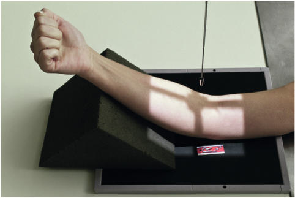
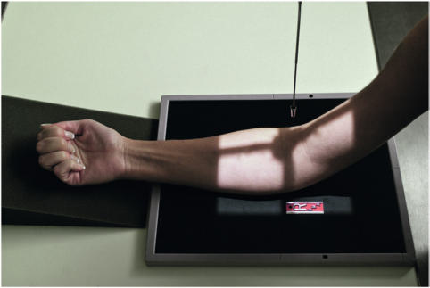
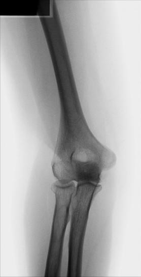
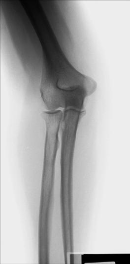

# Rx ALTERNATE PARTIAL FLEXION AP (Antero-Posterior) (Cot - WHEN Cot CANNOT BE FULLY EXTENDED)

  📷 Radiografie Convențională (Rx)
  <strong>Actualizat:</strong> 2026-09-15
  <strong>Autor:</strong> Departamentul de Radiologie / Referință Bontrager

---

-   __1. Rezumat Clinic & Indicații__

    ---

    === "Indicații Clinice"

        - suspiciune de fractură and luxație / subluxație articulară of the Cot
        - Pathologic processes, such as osteomielită / leziuni inflamatorii osoase and arthritis

    === "Ghid Național IRIS"

        !!! info "Referință Primară: Ghidul Național IRIS (Ordinul MS 1342/2012)"
            - **Capitol Ghid IRIS:** *Ghidul Național IRIS*
            - **Grad de Recomandare:** **De verificat pe indicație; fără grad atribuit automat**
            - **Nivel de Iradiere Estimată:** `De verificat pentru examinarea și populația selectate`

            [:octicons-search-16: Deschide Ghidul IRIS](../../iris.md){ .md-button .md-button--primary } [:material-open-in-new: Aplicația Oficială PWA](https://radiologie-pediatrica.ro/iris/){ .md-button target="_blank" rel="noopener" }
-   __2. Poziționare & Centrare Fascicul__

    ---

    - **Poziție Pacient:** Pacient: Seat patient at end of table, with Cot partially flexed.; Regiune anatomică: Obtain two AP projections—one with Antebraț parallel to IR and one with Humerus parallel to IR (Figs. 4.125 and 4.126). Place support under Pumn (Articulație Radiocarpiană) and Antebraț for projection with Humerus parallel to IR, if needed, to prevent motion.
    - **Punct de Centrare Fascicul:** perpendicular to IR, directed to midelbow joint, which is approximately ¾ inch (2 cm) distal to midpoint of a line between epicondyles
    - **Distanță Focar-Film (DFF / SID):** 100 cm
    - **Comandă Respiratorie:** Apnee pe durata expunerii (sau conform cooperării pacientului)

-   __3. Parametri Tehnici Expunere__

    ---

    | Parametru Tehnic | Valoare Configurare Generator / Tub |
    |:-----------------|:-------------------------------------|
    | **Tensiune Tub (kV)** | 65 kV |
    | **Sarcină / Produs Curent-Timp (mAs)** | DE CONFIGURAT PE APARAT |
    | **Distanță Focar-Film (DFF / SID)** | 100 cm |
    | **Grilă Antidifuzoare (Bucky)** | Fără grilă (expunere directă) |
    | **Dimensiune Focar** | Focar Mic (0.6 mm) |
    | **Camere de Ionizare AEC** | DE CONFIGURAT PE APARAT |
    | **Colimare Fascicul** | Field Size Collimate on four sides to anatomy of interest. |
    | **Filtrare Tub** | Totală ≥ 2.5 mm Al echivalent |

-   __4. Criterii de Calitate & Reușită Imagine__

    ---

    - Distal Humerus is best visualized on “Humerus parallel” projection, and proximal radius and ulna are best visualized on “Antebraț parallel” projection (Figs. 4.127 and 4.128).

-   __5. Protecție Radiologică (ALARA)__

    ---

    - Ecranare gonadică și a organelor radiosensibile conform procedurilor locale de radioprotecție ALARA.
    - Colimare strictă la aria de interes pentru limitarea radiației difuze.
    - Verificarea posibilității unei sarcini la pacientele de vârstă fertilă înainte de expunere.

!!! note "Observații Clinice & Tehnice"
    Structures in Cot joint region are partially obscured and slightly distorted, depending on amount of Cot flexion possible. Position: Long axis of arm should be aligned with side border of IR. Absența rotației anatomice: clavicule echidistante față de linia apofizelor spinoase is evidenced by the epicondyles seen in profile and radial head and neck separated or only slightly superimposed over ulna on Antebraț parallel projection. CR and center of collimation field size should be to the midelbow joint. Exposure: Optimal image receptor exposure and contrast with no motion should visualize soft tissue detail; sharp, bony cortical margins; and clear, bony trabecular markings. Distal Humerus, including epicondyles, should be demonstrated with sufficient density on “Humerus parallel” projection. On “Antebraț parallel” projection, proximal radius and ulna should be well visualized with density to allow visualization of both soft tissue and bony detail. Fig. 4.127 Humerus parallel. Fig. 4.128 Antebraț parallel.

### 🖼️ Imagini

<figure class="protocol-image-card" markdown>

<figcaption><strong>Fig. 4.125 AP Cot (partially flexed); Humerus parallel to IR.</strong> — Poziționare pacient conform Ghidului Bontrager (Fig. 4.125 AP elbow (partially flexed); humerus parallel to IR.)</figcaption>

</figure>

<figure class="protocol-image-card" markdown>

<figcaption><strong>Fig. 4.126 AP Cot (partially flexed); Antebraț parallel to IR.</strong> — Aspect radiografic de referință conform Ghidului Bontrager (Fig. 4.126 AP elbow (partially flexed); forearm parallel to IR.)</figcaption>

</figure>

<figure class="protocol-image-card" markdown>

<figcaption><strong>Fig. 4.127 Humerus parallel.</strong> — Aspect radiografic de referință conform Ghidului Bontrager (Fig. 4.127 Humerus parallel.)</figcaption>

</figure>

<figure class="protocol-image-card" markdown>

<figcaption><strong>Fig. 4.128 Antebraț parallel.</strong> — Aspect radiografic de referință conform Ghidului Bontrager (Fig. 4.128 Forearm parallel.)</figcaption>

</figure>

=== "Ghid Rapid de Execuție"

    1. **Identificarea și verificarea pacientului:** verificare identitate, zonă de examinat, consimțământ conform procedurii și evaluarea posibilității unei sarcini, când este relevantă.
    2. **Pregătire:** îndepărtarea oricăror obiecte radiopace (bijuterii, agrafe, fermoare, proteze, pansamente dense).
    3. **Poziționare precisă:** alinierea receptorului de imagine și a tubului la distanța prescrisă (100 cm).
    4. **Colimare strictă:** adaptarea fasciculului strict la regiunea de diagnostic pentru scăderea iradierii și reducerea radiației difuze.
    5. **Radioprotecție:** verificarea [politicii RX](../radioprotectie.md), cu măsuri distincte pentru pacient, personal și însoțitor.

## Surse de documentare

- [Bontrager's Textbook of Radiographic Positioning (Ed. 9/10), Pagina 178](https://www.elsevier.com/books/textbook-of-radiographic-positioning-and-related-anatomy/lampignano/978-0-323-65367-1)
