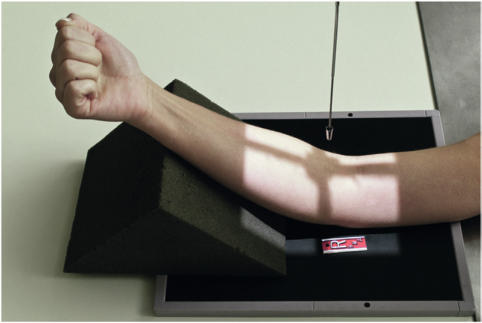
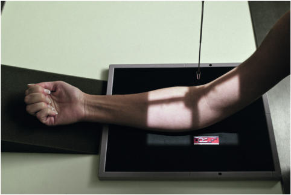
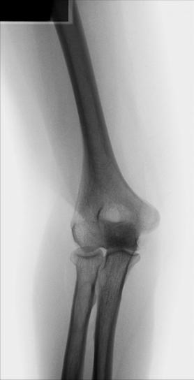
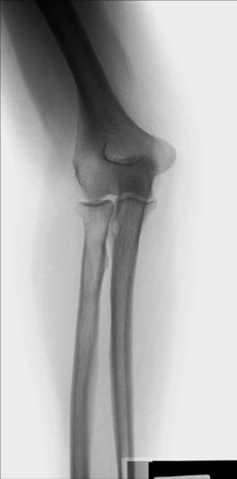

# Rx flexie parțială alternativă AP (anteroposterioară) (cot — când cotul nu poate fi extins complet)

  📷 Radiografie Convențională (Rx)
  <strong>Actualizat:</strong> 2026-09-15
  <strong>Autor:</strong> Departamentul de Radiologie / Referință Bontrager

---

-   __1. Rezumat Clinic & Indicații__

    ---

    === "Indicații Clinice"

        - suspiciune de fractură și luxație / subluxație articulară a cotului
        - Procese patologice, cum ar fi osteomielita / leziuni inflamatorii osoase și artrita

    === "Ghid Național IRIS"

        !!! info "Referință Primară: Ghidul Național IRIS (Ordinul MS 1342/2012)"
            - **Capitol Ghid IRIS:** *Aparat locomotor & Membru superior*
            - **Grad de Recomandare:** **Grad A**
            - **Nivel de Iradiere Estimată:** `Clasa 1 (Minimă < 0.02 mSv)`

            [:octicons-search-16: Deschide Ghidul IRIS](../../iris.md){ .md-button .md-button--primary } [:material-open-in-new: Aplicația Oficială PWA](https://radiologie-pediatrica.ro/iris/){ .md-button target="_blank" rel="noopener" }

-   __2. Poziționare & Centrare Fascicul__

    ---

    - **Poziție Pacient:** Pacient: Se așază pacientul la capătul mesei, cu cotul parțial flectat.; Regiune anatomică: Se obțin două incidențe AP — una cu antebrațul paralel cu receptorul de imagine și una cu humerusul paralel cu receptorul de imagine (Fig. 4.125 și 4.126). Se plasează un suport sub pumn și antebraț pentru incidența cu humerusul paralel cu receptorul de imagine, dacă este necesar, pentru a preveni mișcarea.
    - **Punct de Centrare Fascicul:** perpendicular pe receptorul de imagine, orientat către articulația cotului, la aproximativ ¾ țol (2 cm) distal față de mijlocul liniei dintre epicondili
    - **Distanță Focar-Film (DFF / SID):** 100 cm
    - **Comandă Respiratorie:** Apnee pe durata expunerii (sau conform cooperării pacientului)

-   __3. Parametri Tehnici Expunere__

    ---

    | Parametru Tehnic | Valoare Configurare Generator / Tub |
    |:-----------------|:-------------------------------------|
    | **Tensiune Tub (kV)** | 65 kV |
    | **Sarcină / Produs Curent-Timp (mAs)** | DE CONFIGURAT PE APARAT |
    | **Distanță Focar-Film (DFF / SID)** | 100 cm |
    | **Grilă Antidifuzoare (Bucky)** | Fără grilă (expunere directă) |
    | **Dimensiune Focar** | Focar Mic (0.6 mm) |
    | **Camere de Ionizare AEC** | DE CONFIGURAT PE APARAT |
    | **Colimare Fascicul** | Dimensiunea câmpului Colimați pe cele patru laturi la regiunea anatomică de interes. |
    | **Filtrare Tub** | Totală ≥ 2.5 mm Al echivalent |

-   __4. Criterii de Calitate & Reușită Imagine__

    ---

    - Humerusul distal este cel mai bine vizualizat pe incidența „Humerus paralel”, iar radiusul și ulna proximale sunt cel mai bine vizualizate pe incidența „Antebraț paralel” (Fig. 4.127 și 4.128).

-   __5. Protecție Radiologică (ALARA)__

    ---

    - Ecranare gonadică și a organelor radiosensibile conform procedurilor locale de radioprotecție ALARA.
    - Colimare strictă la aria de interes pentru limitarea radiației difuze.
    - Verificarea posibilității unei sarcini la pacientele de vârstă fertilă înainte de expunere.

!!! note "Observații Clinice & Tehnice"
    Structurile din regiunea articulației cotului sunt parțial ascunse și ușor deformate, în funcție de gradul de flexie posibil al cotului. Poziție: axa longitudinală a brațului trebuie aliniată cu marginea laterală a receptorului de imagine. Absența rotației anatomice: claviculele echidistante față de linia apofizelor spinoase este evidențiată prin epicondilii văzuți de profil și capul radial și colul separate sau doar ușor suprapuse peste ulna pe incidența cu antebrațul paralel. Raza centrală și centrul câmpului de colimare trebuie să fie la nivelul articulației cotului. Expunere: expunerea și contrastul optime ale receptorului de imagine, fără mișcare, trebuie să evidențieze detaliile părților moi; marginile corticale osoase nete; și reperele trabeculare osoase clare. Humerusul distal, inclusiv epicondilii, trebuie evidențiat cu densitate optică suficientă pe incidența „Humerus paralel”. Pe incidența „Antebraț paralel”, radiusul și ulna proximale trebuie vizualizate clar, cu densitate optică ce permite vizualizarea atât a părților moi, cât și a detaliilor osoase. Fig. 4.127 Humerus paralel. Fig. 4.128 Antebraț paralel.

### 🖼️ Imagini

<figure class="protocol-image-card" markdown>

<figcaption><strong>Fig. 4.125 AP cot (parțial flectat); humerus paralel cu receptorul de imagine.</strong> — Poziționarea pacientului conform Ghidului Bontrager (Fig. 4.125 AP cot (parțial flectat); humerus paralel cu receptorul de imagine.)</figcaption>

</figure>

<figure class="protocol-image-card" markdown>

<figcaption><strong>Fig. 4.126 AP cot (parțial flectat); antebraț paralel cu receptorul de imagine.</strong> — Aspect radiografic de referință conform Ghidului Bontrager (Fig. 4.126 AP cot (parțial flectat); antebraț paralel cu receptorul de imagine.)</figcaption>

</figure>

<figure class="protocol-image-card" markdown>

<figcaption><strong>Fig. 4.127 Humerus paralel.</strong> — Aspect radiografic de referință conform Ghidului Bontrager (Fig. 4.127 Humerus paralel.)</figcaption>

</figure>

<figure class="protocol-image-card" markdown>

<figcaption><strong>Fig. 4.128 Antebraț paralel.</strong> — Aspect radiografic de referință conform Ghidului Bontrager (Fig. 4.128 Antebraț paralel.)</figcaption>

</figure>

=== "Ghid Rapid de Execuție"

    1. **Identificarea și verificarea pacientului:** verificare identitate, zonă de examinat, consimțământ conform procedurii și evaluarea posibilității unei sarcini, când este relevantă.
    2. **Pregătire:** îndepărtarea oricăror obiecte radiopace (bijuterii, agrafe, fermoare, proteze, pansamente dense).
    3. **Poziționare precisă:** alinierea receptorului de imagine și a tubului la distanța prescrisă (100 cm).
    4. **Colimare strictă:** adaptarea fasciculului strict la regiunea de diagnostic pentru scăderea iradierii și reducerea radiației difuze.
    5. **Radioprotecție:** verificarea [politicii RX](../radioprotectie.md), cu măsuri distincte pentru pacient, personal și însoțitor.

## Surse de documentare

- [Bontrager's Textbook of Radiographic Positioning (Ed. 9/10), Pagina 178](https://www.elsevier.com/books/textbook-of-radiographic-positioning-and-related-anatomy/lampignano/978-0-323-65367-1)
