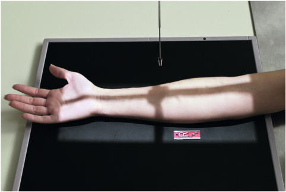
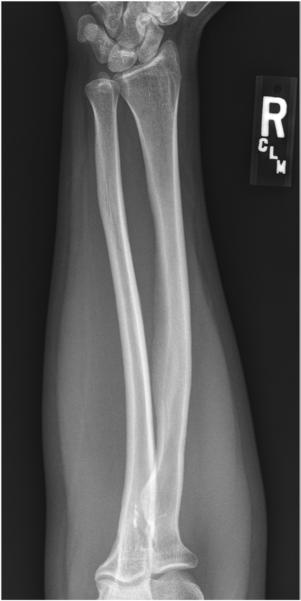

# Rx Antebraț AP (Antero-Posterior)

  📷 Radiografie Convențională (Rx)
  <strong>Actualizat:</strong> 2026-09-15
  <strong>Autor:</strong> Departamentul de Radiologie / Referință Bontrager

---

-   __1. Rezumat Clinic & Indicații__

    ---

    === "Indicații Clinice"

        - suspiciune de fractură și luxație / subluxație articulară de radius sau ulna
        - Pathologic processes such ca osteomielită / leziuni inflamatorii osoase sau arthritis

    === "Ghid Național IRIS"

        !!! info "Referință Primară: Ghidul Național IRIS (Ordinul MS 1342/2012)"
            - **Capitol Ghid IRIS:** *Ghidul Național IRIS*
            - **Grad de Recomandare:** **De verificat pe indicație; fără grad atribuit automat**
            - **Nivel de Iradiere Estimată:** `De verificat pentru examinarea și populația selectate`

            [:octicons-search-16: Deschide Ghidul IRIS](../../iris.md){ .md-button .md-button--primary } [:material-open-in-new: Aplicația Oficială PWA](https://radiologie-pediatrica.ro/iris/){ .md-button target="_blank" rel="noopener" }
-   __2. Poziționare & Centrare Fascicul__

    ---

    - **Poziție Pacient:** Pacient: Seat pacient la end de table, cu Mână și braț fully extins și palm up (în supinație).; Regiune anatomică: Drop Umăr la place entire membru superior pe same plan orizontal. Align și center Antebraț la axa longitudinală de receptorul de imagine, ensuring that ambele Pumn (Articulație Radiocarpiană) și Cot articulații sunt included (use ca large receptorul de imagine ca needed). Instruct pacient la lean laterally ca needed la place entire Pumn (Articulație Radiocarpiană), Antebraț, și Cot în ca near true frontal poziție ca possible (Fig. 4.118). Palpate medial și lateral epicondyles la ensure they sunt same distance de la receptorul de imagine.
    - **Punct de Centrare Fascicul:** perpendicular pe receptorul de imagine, orientat la midforearm
    - **Distanță Focar-Film (DFF / SID):** 100 cm
    - **Comandă Respiratorie:** Apnee pe durata expunerii (sau conform cooperării pacientului)

-   __3. Parametri Tehnici Expunere__

    ---

    | Parametru Tehnic | Valoare Configurare Generator / Tub |
    |:-----------------|:-------------------------------------|
    | **Tensiune Tub (kV)** | 65 kV |
    | **Sarcină / Produs Curent-Timp (mAs)** | DE CONFIGURAT PE APARAT |
    | **Distanță Focar-Film (DFF / SID)** | 100 cm |
    | **Grilă Antidifuzoare (Bucky)** | Fără grilă (expunere directă) |
    | **Dimensiune Focar** | Focar Mic (0.6 mm) |
    | **Camere de Ionizare AEC** | DE CONFIGURAT PE APARAT |
    | **Colimare Fascicul** | Field Size Collimate lateral margini la actual Antebraț area cu minimal collimation field size la ambele ends la avoid excluding anatomy la either articulație. Considering divergence de xray fascicul, ensure that minimum de 1 la 1½ inches (3 la 4 cm) distal la Pumn (Articulație Radiocarpiană) și Cot articulații este included pe receptorul de imagine. (3 5) fără 11 x 14" receptorul de imagine called pentru this poziție (43) Antebraț ROUTINE AP lateral Fig. 4.118 AP Antebraț (including ambele articulații). Fig. 4.119 AP Antebraț (ambele articulații). |
    | **Filtrare Tub** | Totală ≥ 2.5 mm Al echivalent |

-   __4. Criterii de Calitate & Reușită Imagine__

    ---

    - Incidență Antero-Posterioară (AP) de entire radius și ulna este vizualizat, cu minimum de proximal row oase carpiene și distal Humerus și pertinent soft tissues, such ca fat pads și stripes de Pumn (Articulație Radiocarpiană) și Cot articulații (Fig. 4.119). poziție:
    - axa longitudinală de Antebraț trebuie să fie aliniat cu axa longitudinală de receptorul de imagine.
    - Absența rotației anatomice: clavicule echidistante față de linia apofizelor spinoase este evidenced prin humeral epicondyles visualized în profile, cu cap radial, neck, și tuberosity slightly superimposed prin ulna.
    - Pumn (Articulație Radiocarpiană) și Cot spații articulare sunt only partially open because de fascicul divergence.
    - raza centrală și center de collimation field size trebuie să fie la approximate midpoint de radius și ulna. expunere:
    - optim receptorul de imagine expunere și contrast cu fără mișcare trebuie să visualize părți moi și net, cortical margins și clear, bony trabecular markings.

-   __5. Protecție Radiologică (ALARA)__

    ---

    - Ecranare gonadică și a organelor radiosensibile conform procedurilor locale de radioprotecție ALARA.
    - Colimare strictă la aria de interes pentru limitarea radiației difuze.
    - Verificarea posibilității unei sarcini la pacientele de vârstă fertilă înainte de expunere.

### 🖼️ Imagini

<figure class="protocol-image-card" markdown>

<figcaption><strong>Fig. 4.118 AP Antebraț (including ambele articulații).</strong> — Poziționare pacient conform Ghidului Bontrager (Fig. 4.118 AP forearm (including ambele articulații).)</figcaption>

</figure>

<figure class="protocol-image-card" markdown>

<figcaption><strong>Fig. 4.119 AP Antebraț (ambele articulații).</strong> — Aspect radiografic de referință conform Ghidului Bontrager (Fig. 4.119 AP forearm (ambele articulații).)</figcaption>

</figure>

=== "Ghid Rapid de Execuție"

    1. **Identificarea și verificarea pacientului:** verificare identitate, zonă de examinat, consimțământ conform procedurii și evaluarea posibilității unei sarcini, când este relevantă.
    2. **Pregătire:** îndepărtarea oricăror obiecte radiopace (bijuterii, agrafe, fermoare, proteze, pansamente dense).
    3. **Poziționare precisă:** alinierea receptorului de imagine și a tubului la distanța prescrisă (100 cm).
    4. **Colimare strictă:** adaptarea fasciculului strict la regiunea de diagnostic pentru scăderea iradierii și reducerea radiației difuze.
    5. **Radioprotecție:** verificarea [politicii RX](../radioprotectie.md), cu măsuri distincte pentru pacient, personal și însoțitor.

## Surse de documentare

- [Bontrager's Textbook of Radiographic Positioning (Ed. 9/10), Pagina 175](https://www.elsevier.com/books/textbook-of-radiographic-positioning-and-related-anatomy/lampignano/978-0-323-65367-1)
