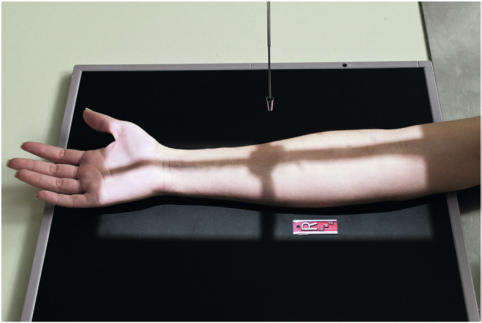
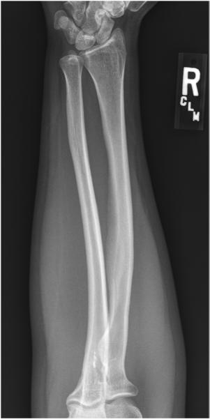

# Rx antebraț AP (anteroposterior)

  📷 Radiografie Convențională (Rx)
  <strong>Actualizat:</strong> 2026-09-15
  <strong>Autor:</strong> Departamentul de Radiologie / Referință Bontrager

---

-   __1. Rezumat Clinic & Indicații__

    ---

    === "Indicații Clinice"

        - suspiciune de fractură și luxație / subluxație articulară a radiusului sau ulnei
        - Procese patologice, cum ar fi osteomielita / leziuni inflamatorii osoase sau artrita

    === "Ghid Național IRIS"

        !!! info "Referință Primară: Ghidul Național IRIS (Ordinul MS 1342/2012)"
            - **Capitol Ghid IRIS:** *Aparat locomotor & Membru superior*
            - **Grad de Recomandare:** **Grad A**
            - **Nivel de Iradiere Estimată:** `Clasa 1 (Minimă < 0.02 mSv)`

            [:octicons-search-16: Deschide Ghidul IRIS](../../iris.md){ .md-button .md-button--primary } [:material-open-in-new: Aplicația Oficială PWA](https://radiologie-pediatrica.ro/iris/){ .md-button target="_blank" rel="noopener" }

-   __2. Poziționare & Centrare Fascicul__

    ---

    - **Poziție Pacient:** Pacient: Se așază pacientul la capătul mesei, cu mâna și brațul complet extinse și palma în sus (în supinație).; Regiune anatomică: Se coboară umărul pentru a plasa întregul membru superior în același plan orizontal. Se aliniază și se centrează antebrațul pe axa longitudinală a receptorului de imagine, asigurând includerea ambelor articulații — pumnul și cotul (se utilizează un receptor de imagine mai mare, după cum este necesar). Se instruiește pacientul să se încline lateral, după cum este necesar, pentru a plasa întregul pumn, antebraț și cot într-o poziție cât mai apropiată de adevărata poziție frontală (Fig. 4.118). Se palpează epicondilii medial și lateral pentru a se asigura că se află la aceeași distanță față de receptorul de imagine.
    - **Punct de Centrare Fascicul:** perpendicular pe receptorul de imagine, orientat către mijlocul antebrațului
    - **Distanță Focar-Film (DFF / SID):** 100 cm
    - **Comandă Respiratorie:** Apnee pe durata expunerii (sau conform cooperării pacientului)

-   __3. Parametri Tehnici Expunere__

    ---

    | Parametru Tehnic | Valoare Configurare Generator / Tub |
    |:-----------------|:-------------------------------------|
    | **Tensiune Tub (kV)** | 65 kV |
    | **Sarcină / Produs Curent-Timp (mAs)** | DE CONFIGURAT PE APARAT |
    | **Distanță Focar-Film (DFF / SID)** | 100 cm |
    | **Grilă Antidifuzoare (Bucky)** | Fără grilă (expunere directă) |
    | **Dimensiune Focar** | Focar Mic (0.6 mm) |
    | **Camere de Ionizare AEC** | DE CONFIGURAT PE APARAT |
    | **Colimare Fascicul** | Dimensiunea câmpului: colimați marginile laterale la nivelul regiunii antebrațului propriu-zis, cu dimensiunea minimă a câmpului, la ambele extremități, pentru a evita excluderea anatomiei de la oricare articulație. Având în vedere divergența fasciculului de raze X, asigurați-vă că minimum 1 până la 1½ țoli (3 până la 4 cm) distal de articulația pumnului (radiocarpiană) și de articulația cotului este inclus pe receptorul de imagine. (3 5) fără receptorul de imagine de 11 x 14" solicitat pentru această poziție (43) Antebraț de rutină AP profil Fig. 4.118 AP antebraț (incluzând ambele articulații). Fig. 4.119 AP antebraț (ambele articulații). |
    | **Filtrare Tub** | Totală ≥ 2.5 mm Al echivalent |

-   __4. Criterii de Calitate & Reușită Imagine__

    ---

    - Pe incidența anteroposterioară (AP) a întregului radius și a ulnei sunt vizualizate minimum primul rând de oase carpiene proximal și humerusul distal, precum și țesuturile moi pertinente, cum ar fi pernițele adipoase și straturile articulațiilor pumnului și cotului (Fig. 4.119). Poziție:
    - axa longitudinală a antebrațului trebuie aliniată cu axa longitudinală a receptorului de imagine.
    - Absența rotației anatomice: claviculele echidistante față de linia apofizelor spinoase este evidențiată prin epicondilii humerali vizualizați de profil, cu capul radial, colul și tuberozitatea ușor suprapuse peste ulna.
    - Spațiile articulare ale pumnului și cotului sunt deschise doar parțial din cauza divergenței fasciculului.
    - Raza centrală și centrul câmpului de colimare trebuie să fie la aproximativ mijlocul radiusului și ulnei. Expunere:
    - Expunerea și contrastul optime ale receptorului de imagine, fără mișcare, trebuie să evidențieze părțile moi și marginile corticale nete, precum și reperele trabeculare osoase clare.

-   __5. Protecție Radiologică (ALARA)__

    ---

    - Ecranare gonadică și a organelor radiosensibile conform procedurilor locale de radioprotecție ALARA.
    - Colimare strictă la aria de interes pentru limitarea radiației difuze.
    - Verificarea posibilității unei sarcini la pacientele de vârstă fertilă înainte de expunere.

### 🖼️ Imagini

<figure class="protocol-image-card" markdown>

<figcaption><strong>Fig. 4.118 AP antebraț (incluzând ambele articulații).</strong> — Poziționarea pacientului conform Ghidului Bontrager (Fig. 4.118 AP antebraț (incluzând ambele articulații).)</figcaption>

</figure>

<figure class="protocol-image-card" markdown>

<figcaption><strong>Fig. 4.119 AP antebraț (ambele articulații).</strong> — Aspect radiografic de referință conform Ghidului Bontrager (Fig. 4.119 AP antebraț (ambele articulații).)</figcaption>

</figure>

=== "Ghid Rapid de Execuție"

    1. **Identificarea și verificarea pacientului:** verificare identitate, zonă de examinat, consimțământ conform procedurii și evaluarea posibilității unei sarcini, când este relevantă.
    2. **Pregătire:** îndepărtarea oricăror obiecte radiopace (bijuterii, agrafe, fermoare, proteze, pansamente dense).
    3. **Poziționare precisă:** alinierea receptorului de imagine și a tubului la distanța prescrisă (100 cm).
    4. **Colimare strictă:** adaptarea fasciculului strict la regiunea de diagnostic pentru scăderea iradierii și reducerea radiației difuze.
    5. **Radioprotecție:** verificarea [politicii RX](../radioprotectie.md), cu măsuri distincte pentru pacient, personal și însoțitor.

## Surse de documentare

- [Bontrager's Textbook of Radiographic Positioning (Ed. 9/10), Pagina 175](https://www.elsevier.com/books/textbook-of-radiographic-positioning-and-related-anatomy/lampignano/978-0-323-65367-1)
