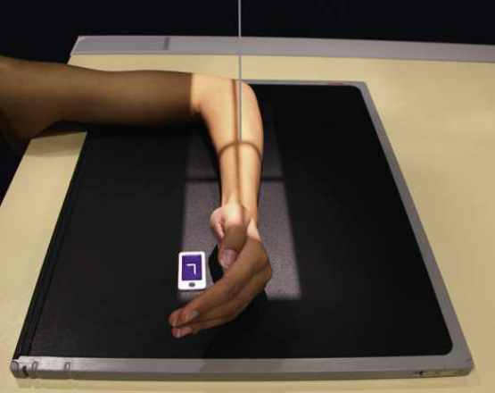
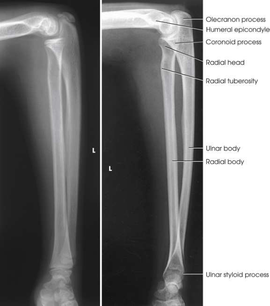

# Rx Antebraț — Incidență de Profil (Lateral) — Latero-Medial (Merrill)

  📷 Radiografie Convențională (Rx)
  <strong>Actualizat:</strong> 2026-09-16
  <strong>Autor:</strong> Referință Merrill

---

-   __1. Rezumat Clinic & Indicații__

    ---

    === "Indicații Clinice"

        - Conform reperelor anatomice standard din tratat

    === "Ghid Național IRIS"

        !!! info "Referință Primară: Ghidul Național IRIS (Ordinul MS 1342/2012)"
            - **Capitol Ghid IRIS:** *Ghidul Național IRIS*
            - **Grad de Recomandare:** **De verificat pe indicație; fără grad atribuit automat**
            - **Nivel de Iradiere Estimată:** `De verificat pentru examinarea și populația selectate`

            [:octicons-search-16: Deschide Ghidul IRIS](../../iris.md){ .md-button .md-button--primary } [:material-open-in-new: Aplicația Oficială PWA](https://radiologie-pediatrica.ro/iris/){ .md-button target="_blank" rel="noopener" }
-   __2. Poziționare & Centrare Fascicul__

    ---

    - **Poziție Pacient:** se așază pacientul pe scaun close la masa radiologică și low enough that Humerus, Umăr articulație, și Cot lie în same plane.; se flectează Cot 90 grade și place medial aspect de Antebraț pe / sprijinit de receptorul de imagine. se ajustează receptorul de imagine astfel încât axa longitudinală este paralel cu Antebraț. se ajustează extremity în true Incidență de Profil (lateral), ensuring humeral epicondyles și styloid processes sunt superimposed și perpendicular pe receptorul de imagine (RI). Police side de Mână trebuie să fie up (Fig. 5.108). se efectuează ecranarea gonadelor cu șorț plumbat.
    - **Punct de Centrare Fascicul:** perpendicular pe midpoint de Antebraț
    - **Distanță Focar-Film (DFF / SID):** Nespecificat în fragmentul extras; de verificat în sursă
    - **Comandă Respiratorie:** Conform reperelor anatomice standard din tratat

-   __3. Parametri Tehnici Expunere__

    ---

    | Parametru Tehnic | Valoare Configurare Generator / Tub |
    |:-----------------|:-------------------------------------|
    | **Tensiune Tub (kV)** | DE CONFIGURAT PE APARAT |
    | **Sarcină / Produs Curent-Timp (mAs)** | DE CONFIGURAT PE APARAT |
    | **Distanță Focar-Film (DFF / SID)** | Nespecificat în fragmentul extras; de verificat în sursă |
    | **Grilă Antidifuzoare (Bucky)** | DE CONFIGURAT PE APARAT |
    | **Dimensiune Focar** | DE CONFIGURAT PE APARAT |
    | **Camere de Ionizare AEC** | DE CONFIGURAT PE APARAT |
    | **Colimare Fascicul** | Adjust câmp de iradiere la 2 inches (5 cm) distal la Pumn (Articulație Radiocarpiană) articulație și proximal la Cot articulație, și 1 inch (2.5 cm) pe sides. Se plasează markerul de lateralitate în câmpul colimat. |
    | **Filtrare Tub** | DE CONFIGURAT PE APARAT |

-   __4. Criterii de Calitate & Reușită Imagine__

    ---

    - Criterii radiologice de calitate imaginii:
    - Colimare adecvată vizibilă și prezența markerului de lateralitate (D/S) plasat clear de anatomy de interest
    - Entire Antebraț, including Pumn (Articulație Radiocarpiană) și distal Humerus în true Incidență de Profil (lateral):
    - Superimposition de radius și ulna la their distal end
    - Superimposition de cap radial over proces coronoid
    - tuberozitate radială bicipitală facing anteriorly
    - Superimposed humeral epicondyles
    - Cot flectat 90 grade
    - Bony detalii trabeculare osoase și surrounding soft tissues

-   __5. Protecție Radiologică (ALARA)__

    ---

    - Nespecificat în fragmentul extras; de verificat în sursă

!!! note "Observații Clinice & Tehnice"
    Conform reperelor anatomice standard din tratat

### 🖼️ Imagini

<figure class="protocol-image-card" markdown>

<figcaption><strong>Merrill — pagina PDF 319, imaginea 1</strong> — Imagine din fragmentul sursă; asocierea necesită revizie.</figcaption>

</figure>

<figure class="protocol-image-card" markdown>

<figcaption><strong>Merrill — pagina PDF 320, imaginea 2</strong> — Imagine din fragmentul sursă; asocierea necesită revizie.</figcaption>

</figure>

=== "Ghid Rapid de Execuție"

    1. **Identificarea și verificarea pacientului:** verificare identitate, zonă de examinat, consimțământ conform procedurii și evaluarea posibilității unei sarcini, când este relevantă.
    2. **Pregătire:** îndepărtarea oricăror obiecte radiopace (bijuterii, agrafe, fermoare, proteze, pansamente dense).
    3. **Poziționare precisă:** alinierea receptorului de imagine și a tubului la distanța prescrisă (Nespecificat în fragmentul extras; de verificat în sursă).
    4. **Colimare strictă:** adaptarea fasciculului strict la regiunea de diagnostic pentru scăderea iradierii și reducerea radiației difuze.
    5. **Radioprotecție:** verificarea [politicii RX](../radioprotectie.md), cu măsuri distincte pentru pacient, personal și însoțitor.

## Surse de documentare

- [Merrill’s Atlas, 5. Upper Extremity, pagini PDF 318–320](../../assets/protocols/sources/a56d45c16829_Merrills_Atlas_of_Radiographic_Positioning__Procedures_3Vol_Set.pdf#page=318)

## Fragmente sursă traduse (referință tehnică)

### anatomy

cot articulație, radius și ulna, și proximal row de superimposed oase carpiene (Fig. 5.109).

### collimation

• Adjust câmp de iradiere la 2 inches (5 cm) distal la wrist articulație și proximal la cot articulație, și 1 inch (2.5 cm) pe sides. Place
marker de lateralitate (D/S) în collimated expunere field.

### cr

• perpendicular pe midpoint de forearm

### criteria

Criterii radiologice de calitate imaginii:
• Colimare adecvată vizibilă și prezența markerului de lateralitate (D/S) plasat clear de anatomy de interest
• Entire forearm, including wrist și distal humerus în true poziție de profil (lateral):
• Superimposition de radius și ulna la their distal end
• Superimposition de cap radial over proces coronoid
• tuberozitate radială bicipitală facing anteriorly
• Superimposed humeral epicondyles
• cot flectat 90 grade
• Bony detalii trabeculare osoase și surrounding soft tissues

### part_pos

• se flectează cot 90 grade și place medial aspect de forearm pe / sprijinit de receptorul de imagine.
• se ajustează receptorul de imagine astfel încât axa longitudinală este paralel cu forearm.
• se ajustează extremity în true poziție de profil (lateral), ensuring humeral epicondyles și styloid processes sunt superimposed și
perpendicular pe receptorul de imagine (RI). policele side de mână trebuie să fie up (Fig. 5.108).
• se efectuează ecranarea gonadelor cu șorț plumbat.

### patient_pos

• se așază pacientul pe scaun close la masa radiologică și low enough that humerus, umăr articulație, și cot lie în same plane.

### tech

poziționat prin manufacturer sau department protocol pentru corect anatomy display orientation; raza centrală plate: 14 × 17 inches (35 × 43 cm) longitudinal.

