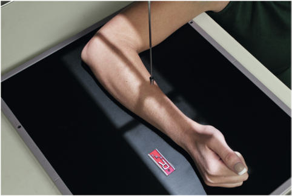
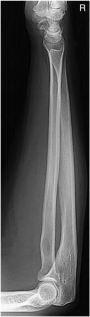

# Rx antebraț — incidență lateromedială

  📷 Radiografie Convențională (Rx)
  <strong>Actualizat:</strong> 2026-09-15
  <strong>Autor:</strong> Departamentul de Radiologie / Referință Bontrager

---

-   __1. Rezumat Clinic & Indicații__

    ---

    === "Indicații Clinice"

        - suspiciune de fractură și luxație / subluxație articulară a radiusului sau ulnei
        - Procese patologice, cum ar fi osteomielita/leziunile inflamatorii osoase sau artrita

    === "Ghid Național IRIS"

        !!! info "Referință Primară: Ghidul Național IRIS (Ordinul MS 1342/2012)"
            - **Capitol Ghid IRIS:** *Aparat locomotor & Membru superior*
            - **Grad de Recomandare:** **Grad A**
            - **Nivel de Iradiere Estimată:** `Clasa 1 (Minimă < 0.02 mSv)`

            [:octicons-search-16: Deschide Ghidul IRIS](../../iris.md){ .md-button .md-button--primary } [:material-open-in-new: Aplicația Oficială PWA](https://radiologie-pediatrica.ro/iris/){ .md-button target="_blank" rel="noopener" }

-   __2. Poziționare & Centrare Fascicul__

    ---

    - **Poziție Pacient:** Pacient: Așezați pacientul la capătul mesei, cu cotul flectat la 90°.; Regiune anatomică: Coborâți umărul pentru a plasa întregul membru superior în același plan orizontal. Aliniați și centrați antebrațul pe axa longitudinală a receptorului de imagine; asigurați-vă că ambele articulații ale pumnului (radiocarpiană) și cotului sunt incluse pe receptorul de imagine (Fig. 4.120). Rotiți mâna și pumnul (articulația radiocarpiană) în incidență de profil adevărată și sprijiniți mâna pentru a preveni mișcarea, dacă este necesar (asigurați-vă că radiusul și ulna distale sunt suprapuse direct). Pentru antebrațele cu musculatură voluminoasă, plasați un suport sub mână și pumn (articulația radiocarpiană), după cum este necesar, pentru a plasa radiusul și ulna paralel cu receptorul de imagine.
    - **Punct de Centrare Fascicul:** perpendicular pe receptorul de imagine, orientat către mijlocul antebrațului
    - **Distanță Focar-Film (DFF / SID):** 100 cm
    - **Comandă Respiratorie:** Apnee pe durata expunerii (sau conform cooperării pacientului)

-   __3. Parametri Tehnici Expunere__

    ---

    | Parametru Tehnic | Valoare Configurare Generator / Tub |
    |:-----------------|:-------------------------------------|
    | **Tensiune Tub (kV)** | 65 kV |
    | **Sarcină / Produs Curent-Timp (mAs)** | DE CONFIGURAT PE APARAT |
    | **Distanță Focar-Film (DFF / SID)** | 100 cm |
    | **Grilă Antidifuzoare (Bucky)** | Fără grilă (expunere directă) |
    | **Dimensiune Focar** | Focar Mic (0.6 mm) |
    | **Camere de Ionizare AEC** | DE CONFIGURAT PE APARAT |
    | **Colimare Fascicul** | Dimensiunea câmpului: colimați ambele margini laterale la nivelul regiunii antebrațului propriu-zis. De asemenea, colimați la ambele extremități pentru a evita excluderea anatomiei de la oricare articulație. Având în vedere divergența fasciculului de raze X, asigurați-vă că minimum 1 până la 1½ țoli (3 până la 4 cm) distal de articulația pumnului (radiocarpiană) și de articulația cotului este inclus pe receptorul de imagine. (3 5) fără receptorul de imagine de 11 x 14" solicitat pentru această poziție (43) Antebraț de rutină AP profil Fig. 4.120 profil antebraț (incluzând ambele articulații). |
    | **Filtrare Tub** | Totală ≥ 2.5 mm Al echivalent |

-   __4. Criterii de Calitate & Reușită Imagine__

    ---

    - Incidența de profil a întregului radius și a ulnei, a rândului proximal de oase carpiene, a cotului și a extremității distale a humerusului este vizibilă, în plus față de părțile moi relevante, cum ar fi pernițele adipoase și benzile articulațiilor pumnului (radiocarpiană) și cotului (Fig. 4.121). Poziție:
    - axa longitudinală a antebrațului trebuie aliniată cu axa longitudinală a receptorului de imagine.
    - Cotul trebuie să fie flectat la 90°.
    - Absența rotației anatomice: claviculele sunt echidistante față de linia apofizelor spinoase, după cum se evidențiază prin suprapunerea capului ulnei peste radius, iar epicondilii humerali trebuie să fie suprapuși.
    - Capul radial trebuie să se suprapună peste procesul coronoid, tuberozitatea radială bicipitală fiind evidențiată.
    - Raza centrală și centrul câmpului de colimare trebuie să fie la mijlocul radiusului și ulnei. Expunere:
    - Expunerea și contrastul optime ale receptorului de imagine, fără mișcare, trebuie să vizualizeze marginile corticale clare și contururi osoase și travee trabeculare nete, fără artefacte de mișcare, precum și pernițele adipoase și benzile articulațiilor pumnului (radiocarpiană) și cotului. Fig. 4.121 Incidență de profil a antebrațului (ambele articulații).

-   __5. Protecție Radiologică (ALARA)__

    ---

    - Ecranare gonadică și a organelor radiosensibile conform procedurilor locale de radioprotecție ALARA.
    - Colimare strictă la aria de interes pentru limitarea radiației difuze.
    - Verificarea posibilității unei sarcini la pacientele de vârstă fertilă înainte de expunere.

### 🖼️ Imagini

<figure class="protocol-image-card" markdown>

<figcaption><strong>Fig. 4.120 profil antebraț (incluzând ambele articulații).</strong> — Poziționarea pacientului conform Ghidului Bontrager (Fig. 4.120 profil antebraț (incluzând ambele articulații).)</figcaption>

</figure>

<figure class="protocol-image-card" markdown>

<figcaption><strong>Fig. 4.121 Incidență de profil a antebrațului (ambele articulații).</strong> — Aspect radiografic de referință conform Ghidului Bontrager (Fig. 4.121 incidență de profil a antebrațului (ambele articulații).)</figcaption>

</figure>

=== "Ghid Rapid de Execuție"

    1. **Identificarea și verificarea pacientului:** verificare identitate, zonă de examinat, consimțământ conform procedurii și evaluarea posibilității unei sarcini, când este relevantă.
    2. **Pregătire:** îndepărtarea oricăror obiecte radiopace (bijuterii, agrafe, fermoare, proteze, pansamente dense).
    3. **Poziționare precisă:** alinierea receptorului de imagine și a tubului la distanța prescrisă (100 cm).
    4. **Colimare strictă:** adaptarea fasciculului strict la regiunea de diagnostic pentru scăderea iradierii și reducerea radiației difuze.
    5. **Radioprotecție:** verificarea [politicii RX](../radioprotectie.md), cu măsuri distincte pentru pacient, personal și însoțitor.

## Surse de documentare

- [Bontrager's Textbook of Radiographic Positioning (Ed. 9/10), Pagina 176](https://www.elsevier.com/books/textbook-of-radiographic-positioning-and-related-anatomy/lampignano/978-0-323-65367-1)
