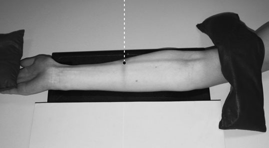
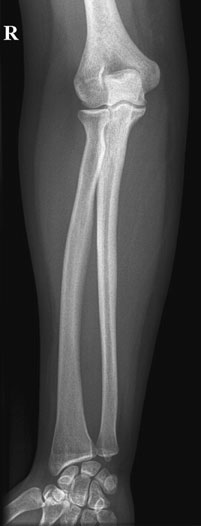
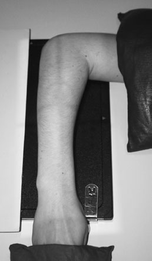
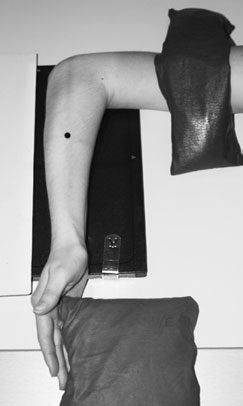
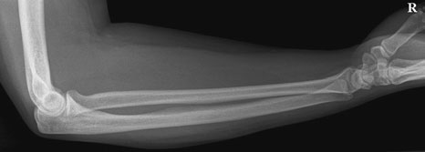
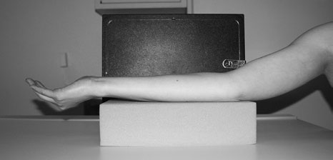
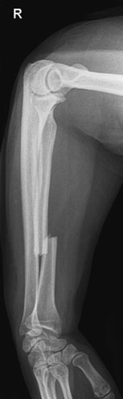
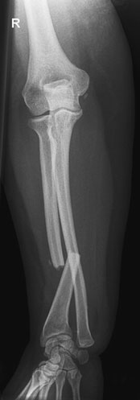

# Rx Antebraț (Radius și Ulna) Antero-Posterior (AP) - basic

  📷 Radiografie Convențională (Rx)
  <strong>Actualizat:</strong> 2026-09-16
  <strong>Autor:</strong> Departamentul de Radiologie / Referință Clark (Ed. 12)

---

-   __1. Rezumat Clinic & Indicații__

    ---

    === "Indicații Clinice"

        - When two sau more bones such ca radius și ulna form ring, suspiciune de fractură de one de bones este often associated cu suspiciune de fractură sau luxație articulară elsewhere în ring, especially if suspiciune de fractură este displaced sau bone ends overlap. în Galeazzi suspiciune de fractură there este suspiciune de fractură de radius cu luxație articulară de distal ulna, while în Monteggia suspiciune de fractură there este suspiciune de fractură de ulna cu luxație articulară de capul de radius. în Antebraț (Radius și Ulna) suspiciune de fractură, therefore, ambele ends de ambele bones, ca well ca proximal și distal radio-ulnar articulații, trebuie să fie evidențiat.
        - General Antebraț (Radius și Ulna) incidențe do nu give adecvat incidențe de Cot și trebuie să nu fie relied upon pentru diagnosis de cap radial injury.
        - If Cot articulație effusion este vizualizat, formal incidențe de Cot articulație will fie required. 60 Normal basic Profil (lateral) radiografie de Antebraț (Radius și Ulna) Profil (lateral) incidență Antero-posterior (AP) incidență radiografii de Antebraț (Radius și Ulna) evidențiind Galeazzi suspiciune de fractură

    === "Ghid Național IRIS"

        !!! info "Referință Primară: Ghidul Național IRIS (Ordinul MS 1342/2012)"
            - **Capitol Ghid IRIS:** *Ghidul Național IRIS*
            - **Grad de Recomandare:** **De verificat pe indicație; fără grad atribuit automat**
            - **Nivel de Iradiere Estimată:** `De verificat pentru examinarea și populația selectate`

            [:octicons-search-16: Deschide Ghidul IRIS](../../iris.md){ .md-button .md-button--primary } [:material-open-in-new: Aplicația Oficială PWA](https://radiologie-pediatrica.ro/iris/){ .md-button target="_blank" rel="noopener" }
-   __2. Poziționare & Centrare Fascicul__

    ---

    - **Poziție Pacient:** • Pacientul stă așezat pe scaun lângă masa de examinare, cu partea afectată sprijinită pe masă.
• braț este în abducție și Cot articulație este fully extins, cu în supinație Antebraț (Radius și Ulna) resting pe masa de examinare.
• Umăr este lowered la same level ca Cot articulație.
• caseta este plasat under Antebraț (Radius și Ulna) pentru include Pumn (Articulație Radiocarpiană) articulație și Cot articulație.
• braț este ajustat astfel încât radial și ulnar styloid processes și medial și Profil (lateral) epicondyles sunt echidistant față de caseta.
• lower end de Humerus și Mână sunt imobilizat using săculeți cu nisip.

• de la Antero-posterior (AP) poziție, Cot este flectat la 90 grade.
• Humerus este internally rotit la 90 grade la bring medial aspect de upper braț, Cot, Antebraț (Radius și Ulna), Pumn (Articulație Radiocarpiană) și Mână into contact cu masa de examinare.
• caseta este plasat under Antebraț (Radius și Ulna) pentru include Pumn (Articulație Radiocarpiană) articulație și Cot articulație.
• braț este ajustat astfel încât radial și ulnar styloid processes și medial și Profil (lateral) epicondyles sunt superimposed.
• lower end de Humerus și Mână sunt imobilizat using săculeți cu nisip.
    - **Punct de Centrare Fascicul:** • raza centrală verticală centrală este centred în linia mediană Antebraț (Radius și Ulna) la point midway între Pumn (Articulație Radiocarpiană) și Cot articulații.

• raza centrală verticală centrală este centred în linia mediană Antebraț (Radius și Ulna) la point midway între Pumn (Articulație Radiocarpiană) și Cot articulații.
    - **Distanță Focar-Film (DFF / SID):** 100 cm
    - **Comandă Respiratorie:** Apnee pe durata expunerii (apnee în inspir pentru torace; expir pentru Abdomen/bazin).

-   __3. Parametri Tehnici Expunere__

    ---

    | Parametru Tehnic | Valoare Configurare Generator / Tub |
    |:-----------------|:-------------------------------------|
    | **Tensiune Tub (kV)** | DE CONFIGURAT PE APARAT |
    | **Sarcină / Produs Curent-Timp (mAs)** | Conform AEC / grosime anatomică |
    | **Distanță Focar-Film (DFF / SID)** | 100 cm |
    | **Grilă Antidifuzoare (Bucky)** | Conform grosimii anatomice (> 10-12 cm cu grilă) |
    | **Dimensiune Focar** | Focar Mic (0.6 mm) |
    | **Camere de Ionizare AEC** | DE CONFIGURAT PE APARAT |
    | **Colimare Fascicul** | Colimare strictă adaptată pe receptor 24 x 30 cm |
    | **Filtrare Tub** | Totală ≥ 2.5 mm Al echivalent (conform Clark: 3.0 mm Al eq.) |

-   __4. Criterii de Calitate & Reușită Imagine__

    ---

    - ambele Cot și Pumn (Articulație Radiocarpiană) articulație trebuie să fie evidențiat pe casetă.
    - ambele articulații trebuie să fie seen în true Antero-posterior (AP) poziție, cu radial și ulnar styloid processes și epicondyles de Humerus echidistant față de caseta.
    - ambele Cot și Pumn (Articulație Radiocarpiană) articulație trebuie să fie evidențiat pe imagine.
    - ambele articulații trebuie să fie seen în true Profil (lateral) poziție, cu radial și ulnar styloid processes și epicondyles de Humerus superimposed.

-   __5. Protecție Radiologică (ALARA)__

    ---

    - Ecranare gonadică cu șorț plumbat dacă gonadele sunt în apropierea fasciculului util (regula ALARA).
    - Colimare precisă la dimensiunea anatomică strict necesară pentru reducerea dozei și a radiației difuze.
    - Verificarea posibilității unei sarcini la pacientele de vârstă fertilă înainte de expunere.

!!! note "Observații Clinice & Tehnice"
    Postero-anterior (PA) incidență de Antebraț (Radius și Ulna) cu Pumn (Articulație Radiocarpiană) în pronație este nu satisfactory because, în this incidență, radius este superimposed over ulna pentru part de its length.
Normal Antero-posterior (AP) radiografie de Antebraț (Radius și Ulna) Example de incorrect technique – radius este superimposed în Postero-anterior (PA) incidență

• în trauma cases, it poate fie impossible la move braț into poziții described, și modified technique poate need la fie employed la ensure that two incidențe la drept-angles la fiecare other sunt obtained.
• If limb cannot fie moved through 90 grade, then Fascicul Orizontal trebuie să fie used.
• ambele articulații trebuie să fie included pe fiecare imagine.
• fără attempt trebuie să fie made la se rotește pacient’s Mână.

### 🖼️ Imagini

<figure class="protocol-image-card" markdown>

<figcaption><strong>incidențe sunt normally acquired pe one film radiologic, cu half de</strong> — Poziționare pacient și centrare fascicul conform Clark (Ed. 12)</figcaption>

</figure>

<figure class="protocol-image-card" markdown>

<figcaption><strong>Normal Antero-posterior (AP) radiografie de Antebraț (Radius și Ulna)</strong> — Aspect radiografic / ghid de poziționare conform tratatului Clark (Ed. 12)</figcaption>

</figure>

<figure class="protocol-image-card" markdown>

<figcaption><strong>Figura 3: Aspect radiografic / Poziționare (Clark Ed. 12)</strong> — Aspect radiografic / ghid de poziționare conform tratatului Clark (Ed. 12)</figcaption>

</figure>

<figure class="protocol-image-card" markdown>

<figcaption><strong>ring, suspiciune de fractură de one de bones este often associated cu frac-</strong> — Aspect radiografic / ghid de poziționare conform tratatului Clark (Ed. 12)</figcaption>

</figure>

<figure class="protocol-image-card" markdown>

<figcaption><strong>ture este displaced sau bone ends overlap. în Galeazzi suspiciune de fractură</strong> — Aspect radiografic / ghid de poziționare conform tratatului Clark (Ed. 12)</figcaption>

</figure>

<figure class="protocol-image-card" markdown>

<figcaption><strong>there este suspiciune de fractură de radius cu luxație articulară de distal</strong> — Aspect radiografic / ghid de poziționare conform tratatului Clark (Ed. 12)</figcaption>

</figure>

<figure class="protocol-image-card" markdown>

<figcaption><strong>ulna, while în Monteggia suspiciune de fractură there este suspiciune de fractură de ulna</strong> — Aspect radiografic / ghid de poziționare conform tratatului Clark (Ed. 12)</figcaption>

</figure>

<figure class="protocol-image-card" markdown>

<figcaption><strong>Normal basic Profil (lateral) radiografie de Antebraț (Radius și Ulna)</strong> — Aspect radiografic / ghid de poziționare conform tratatului Clark (Ed. 12)</figcaption>

</figure>

=== "Ghid Rapid de Execuție"

    1. **Identificarea și verificarea pacientului:** verificare identitate, zonă de examinat, consimțământ conform procedurii și evaluarea posibilității unei sarcini, când este relevantă.
    2. **Pregătire:** îndepărtarea oricăror obiecte radiopace (bijuterii, agrafe, fermoare, proteze, pansamente dense).
    3. **Poziționare precisă:** alinierea receptorului de imagine și a tubului la distanța prescrisă (100 cm).
    4. **Colimare strictă:** adaptarea fasciculului strict la regiunea de diagnostic pentru scăderea iradierii și reducerea radiației difuze.
    5. **Radioprotecție:** verificarea [politicii RX](../radioprotectie.md), cu măsuri distincte pentru pacient, personal și însoțitor.

## Surse de documentare

- [Clark's Positioning in Radiography (Ed. 12), Pagina 74](../../assets/protocols/sources/Clark___Positioning_in_Radiography__12th_edition.pdf#page=74)
