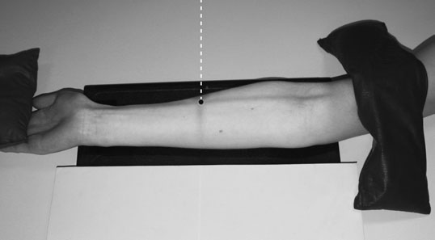
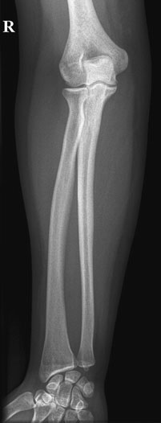
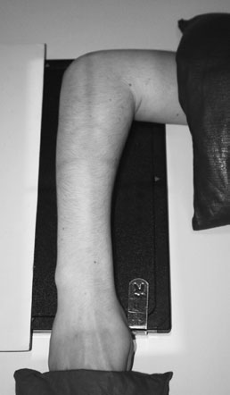
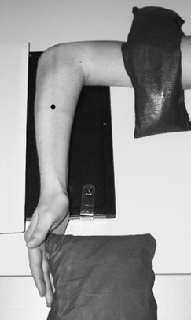
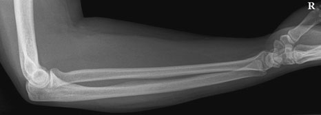
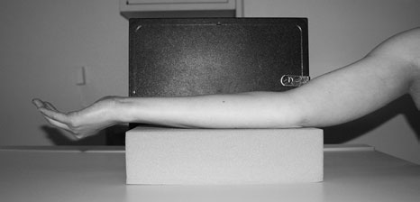
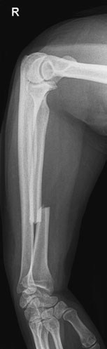
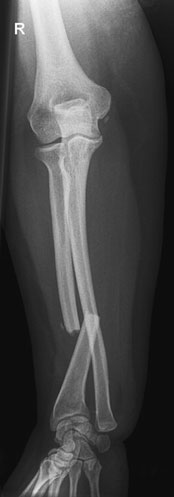

# Rx antebraț (radius și ulna) anteroposterior (AP) – de bază

  📷 Radiografie Convențională (Rx)
  <strong>Actualizat:</strong> 2026-09-16
  <strong>Autor:</strong> Departamentul de Radiologie / Referință Clark (Ed. 12)

---

-   __1. Rezumat Clinic & Indicații__

    ---

    === "Indicații Clinice"

        - Când două sau mai multe oase, precum radiusul și ulna, formează un inel, suspiciunea de fractură a unuia dintre oase este adesea asociată cu suspiciunea de fractură sau luxație articulară în altă parte a inelului, în special dacă fractura este deplasată sau capetele osoase se suprapun. În fractura Galeazzi există o fractură a radiusului cu luxația ulnei distale, în timp ce în fractura Monteggia există o fractură a ulnei cu luxația capului radiusului. Prin urmare, în cazul unei fracturi de antebraț (radius și ulna), ambele extremități ale ambelor oase, precum și articulațiile radioulnare proximală și distală, trebuie evidențiate.
        - Incidențele generale ale antebrațului (radius și ulna) nu oferă incidențe adecvate ale cotului și nu trebuie utilizate pentru diagnosticarea unei leziuni a capului radial.
        - Dacă este vizibil un revărsat în articulația cotului, vor fi necesare incidențe formale ale articulației cotului. 60 Radiografie normală de bază a antebrațului (radius și ulna), de profil; incidență de profil; incidență anteroposterioară (AP); radiografii ale antebrațului (radius și ulna) care evidențiază o fractură Galeazzi

    === "Ghid Național IRIS"

        !!! info "Referință Primară: Ghidul Național IRIS (Ordinul MS 1342/2012)"
            - **Capitol Ghid IRIS:** *Aparat locomotor & Membru superior*
            - **Grad de Recomandare:** **Grad A**
            - **Nivel de Iradiere Estimată:** `Clasa 1 (Minimă < 0.02 mSv)`

            [:octicons-search-16: Deschide Ghidul IRIS](../../iris.md){ .md-button .md-button--primary } [:material-open-in-new: Aplicația Oficială PWA](https://radiologie-pediatrica.ro/iris/){ .md-button target="_blank" rel="noopener" }

-   __2. Poziționare & Centrare Fascicul__

    ---

    - **Poziție Pacient:**
        - Pacientul stă așezat pe scaun lângă masa de examinare, cu partea afectată sprijinită pe masă.
        - Brațul este în abducție, iar articulația cotului este complet extinsă, cu antebrațul (radius și ulna) în supinație și sprijinit pe masa de examinare.
        - Umărul este coborât la același nivel cu articulația cotului.
        - Caseta este plasată sub antebrațul (radius și ulna) pentru a include articulația radiocarpiană și articulația cotului.
        - Brațul este ajustat astfel încât procesele stiloide radial și ulnar și epicondilii medial și lateral să fie echidistanți față de casetă.
        - Extremitatea inferioară a humerusului și mâna sunt imobilizate cu săculeți cu nisip.
        - Din poziția anteroposterioară (AP), cotul este flectat la 90 de grade.
        - Humerusul este rotit intern la 90 de grade pentru a aduce aspectul medial al brațului, cotul, antebrațul (radius și ulna), articulația radiocarpiană și mâna în contact cu masa de examinare.
        - Caseta este plasată sub antebrațul (radius și ulna) pentru a include articulația radiocarpiană și articulația cotului.
        - Brațul este ajustat astfel încât procesele stiloide radial și ulnar și epicondilii medial și lateral să fie suprapuși.
        - Extremitatea inferioară a humerusului și mâna sunt imobilizate cu săculeți cu nisip.
    - **Punct de Centrare Fascicul:**
        - raza centrală verticală este centrată pe linia mediană a antebrațului (radius și ulna), la jumătatea distanței dintre articulația radiocarpiană și articulația cotului.
        - raza centrală verticală este centrată pe linia mediană a antebrațului (radius și ulna), la jumătatea distanței dintre articulația radiocarpiană și articulația cotului.
    - **Distanță Focar-Film (DFF / SID):** 100 cm
    - **Comandă Respiratorie:** Apnee pe durata expunerii (apnee în inspir pentru torace; expir pentru Abdomen/bazin).

-   __3. Parametri Tehnici Expunere__

    ---

    | Parametru Tehnic | Valoare Configurare Generator / Tub |
    |:-----------------|:-------------------------------------|
    | **Tensiune Tub (kV)** | DE CONFIGURAT PE APARAT |
    | **Sarcină / Produs Curent-Timp (mAs)** | Conform AEC / grosimii anatomice |
    | **Distanță Focar-Film (DFF / SID)** | 100 cm |
    | **Grilă Antidifuzoare (Bucky)** | Conform grosimii anatomice (> 10-12 cm cu grilă) |
    | **Dimensiune Focar** | Focar Mic (0.6 mm) |
    | **Camere de Ionizare AEC** | DE CONFIGURAT PE APARAT |
    | **Colimare Fascicul** | Colimare strictă adaptată pe receptor 24 x 30 cm |
    | **Filtrare Tub** | Totală ≥ 2.5 mm Al echivalent (conform Clark: 3.0 mm Al echivalent) |

-   __4. Criterii de Calitate & Reușită Imagine__

    ---

    - Ambele articulații, cotul și articulația radiocarpiană, trebuie evidențiate pe casetă.
    - Ambele articulații trebuie vizualizate în poziție anteroposterioară (AP) adevărată, cu procesele stiloide radial și ulnar și epicondilii humerusului echidistanți față de casetă.
    - Ambele articulații, cotul și articulația radiocarpiană, trebuie evidențiate pe imagine.
    - Ambele articulații trebuie vizualizate în poziție de profil adevărată, cu procesele stiloide radial și ulnar și epicondilii humerusului suprapuși.

-   __5. Protecție Radiologică (ALARA)__

    ---

    - Ecranare gonadică cu șorț plumbat dacă gonadele sunt în apropierea fasciculului util (regula ALARA).
    - Colimare precisă la dimensiunea anatomică strict necesară pentru reducerea dozei și a radiației difuze.
    - Verificarea posibilității unei sarcini la pacientele de vârstă fertilă înainte de expunere.

!!! note "Observații Clinice & Tehnice"
    Incidența posteroanterioară (PA) a antebrațului (radius și ulna), cu articulația radiocarpiană în pronație, nu este satisfăcătoare deoarece, în această incidență, radiusul este suprapus peste ulnă pe o parte a lungimii sale.

    Radiografie normală anteroposterioară (AP) a antebrațului (radius și ulna)

    Exemplu de tehnică incorectă – radiusul este suprapus în incidența posteroanterioară (PA)

    - În cazurile de traumatism, poate fi imposibilă deplasarea brațului în pozițiile descrise, iar pentru a obține două incidențe perpendiculare una pe cealaltă poate fi necesară utilizarea unei tehnici modificate.
    - Dacă membrul nu poate fi deplasat la 90 de grade, trebuie utilizat fasciculul orizontal.
    - Ambele articulații trebuie incluse în fiecare imagine.
    - Nu trebuie încercată rotirea mâinii pacientului.

### 🖼️ Imagini

<figure class="protocol-image-card" markdown>

<figcaption><strong>Incidențele sunt obținute în mod normal pe o singură peliculă radiologică, cu jumătate din</strong> — Poziționarea pacientului și centrarea fasciculului conform Clark (Ed. 12)</figcaption>

</figure>

<figure class="protocol-image-card" markdown>

<figcaption><strong>Radiografie normală anteroposterioară (AP) a antebrațului (radius și ulna)</strong> — Aspect radiografic / ghid de poziționare conform tratatului Clark (Ed. 12)</figcaption>

</figure>

<figure class="protocol-image-card" markdown>

<figcaption><strong>Figura 3: Aspect radiografic / Poziționare (Clark Ed. 12)</strong> — Aspect radiografic / ghid de poziționare conform tratatului Clark (Ed. 12)</figcaption>

</figure>

<figure class="protocol-image-card" markdown>

<figcaption><strong>inelul, suspiciunea de fractură a unuia dintre oase este adesea asociată cu o fractură de</strong> — Aspect radiografic / ghid de poziționare conform tratatului Clark (Ed. 12)</figcaption>

</figure>

<figure class="protocol-image-card" markdown>

<figcaption><strong>fractură care este deplasată sau cu suprapunerea capetelor osoase. În fractura Galeazzi</strong> — Aspect radiografic / ghid de poziționare conform tratatului Clark (Ed. 12)</figcaption>

</figure>

<figure class="protocol-image-card" markdown>

<figcaption><strong>există o fractură a radiusului cu luxația ulnei distale</strong> — Aspect radiografic / ghid de poziționare conform tratatului Clark (Ed. 12)</figcaption>

</figure>

<figure class="protocol-image-card" markdown>

<figcaption><strong>ulna, în timp ce în fractura Monteggia există o fractură a ulnei</strong> — Aspect radiografic / ghid de poziționare conform tratatului Clark (Ed. 12)</figcaption>

</figure>

<figure class="protocol-image-card" markdown>

<figcaption><strong>Radiografie normală de bază, de profil, a antebrațului (radius și ulna)</strong> — Aspect radiografic / ghid de poziționare conform tratatului Clark (Ed. 12)</figcaption>

</figure>

=== "Ghid Rapid de Execuție"

    1. **Identificarea și verificarea pacientului:** verificare identitate, zonă de examinat, consimțământ conform procedurii și evaluarea posibilității unei sarcini, când este relevantă.
    2. **Pregătire:** îndepărtarea oricăror obiecte radiopace (bijuterii, agrafe, fermoare, proteze, pansamente dense).
    3. **Poziționare precisă:** alinierea receptorului de imagine și a tubului la distanța prescrisă (100 cm).
    4. **Colimare strictă:** adaptarea fasciculului strict la regiunea de diagnostic pentru scăderea iradierii și reducerea radiației difuze.
    5. **Radioprotecție:** verificarea [politicii RX](../radioprotectie.md), cu măsuri distincte pentru pacient, personal și însoțitor.

## Surse de documentare

- [Clark's Positioning in Radiography (Ed. 12), Pagina 74](https://books.google.com/books/about/Clark_s_Positioning_in_Radiography.html?id=Xxu6MwEACAAJ)
