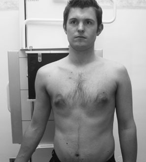
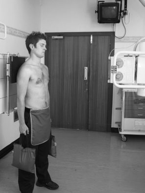
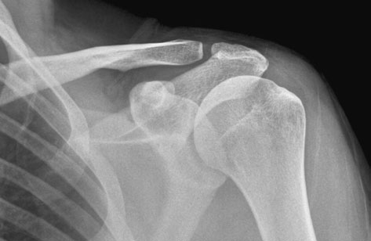
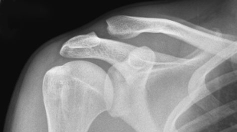

# Rx Articulații Acromioclaviculare Antero-Posterior (AP)

  📷 Radiografie Convențională (Rx)
  <strong>Actualizat:</strong> 2026-09-16
  <strong>Autor:</strong> Departamentul de Radiologie / Referință Clark (Ed. 12)

---

-   __1. Rezumat Clinic & Indicații__

    ---

    === "Indicații Clinice"

        - An 18  24-cm casetă este plasat în vertical casetă holder.

    === "Ghid Național IRIS"

        !!! info "Referință Primară: Ghidul Național IRIS (Ordinul MS 1342/2012)"
            - **Capitol Ghid IRIS:** *Ghidul Național IRIS*
            - **Grad de Recomandare:** **De verificat pe indicație; fără grad atribuit automat**
            - **Nivel de Iradiere Estimată:** `De verificat pentru examinarea și populația selectate`

            [:octicons-search-16: Deschide Ghidul IRIS](../../iris.md){ .md-button .md-button--primary } [:material-open-in-new: Aplicația Oficială PWA](https://radiologie-pediatrica.ro/iris/){ .md-button target="_blank" rel="noopener" }
-   __2. Poziționare & Centrare Fascicul__

    ---

    - **Poziție Pacient:** • pacientul stă în ortostatism facing X-ray tube, cu brațele relaxat la side. posterior aspect de Umăr being examined este plasat în contact cu caseta, și pacientul este then rotit approximately 15 grade spre side being examined la bring articulații acromioclaviculare space la rightangles la film radiologic.
• caseta este poziționat astfel încât acromion este în centre de film radiologic.
    - **Punct de Centrare Fascicul:** • raza centrală orizontală centrală este centred la palpable Profil (lateral) end de Claviculă la articulații acromioclaviculare.
• la avoid superimposition de articulație pe coloană vertebrală de Omoplat (Scapulă), raza centrală poate fie înclinat 25 grade cranially before centring la articulație.
    - **Distanță Focar-Film (DFF / SID):** 100 cm
    - **Comandă Respiratorie:** Apnee pe durata expunerii (apnee în inspir pentru torace; expir pentru Abdomen/bazin).

-   __3. Parametri Tehnici Expunere__

    ---

    | Parametru Tehnic | Valoare Configurare Generator / Tub |
    |:-----------------|:-------------------------------------|
    | **Tensiune Tub (kV)** | DE CONFIGURAT PE APARAT |
    | **Sarcină / Produs Curent-Timp (mAs)** | Conform AEC / grosime anatomică |
    | **Distanță Focar-Film (DFF / SID)** | 100 cm |
    | **Grilă Antidifuzoare (Bucky)** | Conform grosimii anatomice (> 10-12 cm cu grilă) |
    | **Dimensiune Focar** | Focar Mic (0.6 mm) |
    | **Camere de Ionizare AEC** | DE CONFIGURAT PE APARAT |
    | **Colimare Fascicul** | Colimare strictă adaptată pe receptor 18 x 24 cm |
    | **Filtrare Tub** | Totală ≥ 2.5 mm Al echivalent (conform Clark: 3.0 mm Al eq.) |

-   __4. Criterii de Calitate & Reușită Imagine__

    ---

    - imagine trebuie să evidențiază articulații acromioclaviculare și Claviculă projected above acromion.
    - expunere trebuie să evidențiază părți moi around articulation.

-   __5. Protecție Radiologică (ALARA)__

    ---

    - Ecranare gonadică cu șorț plumbat dacă gonadele sunt în apropierea fasciculului util (regula ALARA).
    - Colimare precisă la dimensiunea anatomică strict necesară pentru reducerea dozei și a radiației difuze.
    - Verificarea posibilității unei sarcini la pacientele de vârstă fertilă înainte de expunere.

!!! note "Observații Clinice & Tehnice"
    • normal articulație este variable (3–8 mm) în width. normal difference între sides trebuie să fie less than 2–3 mm (Manaster 1997).
• inferior surfaces de acromion și Claviculă trebuie să normally fie în straight line.
În Încărcare (Ortostatism) Antero-posterior (AP) incidență
• articulații acromioclaviculare has weak articulație capsule și este vulnerable la trauma. Subluxation poate fie difficult la diagnose în standard Antero-posterior (AP) imagine, because width de articulație poate fie variable și poate look widened în normal articulație.
• la prove subluxation, it poate fie necessary la do În Încărcare (Ortostatism) comparison incidențe de ambele Articulații Acromioclaviculare (separate articulație imagini).
• poziții de pacientul și casetă sunt ca described above.
• It este advisable la ‘strap’ weights used pentru procedure around lower brațe rather than getting pacientul la hold pe la them, ca biomechanics involved poate lead la false negative appearance.
94 Normal Antero-posterior (AP) radiografie de articulații acromioclaviculare Antero-posterior (AP) radiografie de articulații acromioclaviculare evidențiind subluxation

### 🖼️ Imagini

<figure class="protocol-image-card" markdown>

<figcaption><strong>este normally required. în certain circumstances, subluxation de the</strong> — Poziționare pacient și centrare fascicul conform Clark (Ed. 12)</figcaption>

</figure>

<figure class="protocol-image-card" markdown>

<figcaption><strong>examined la bring articulații acromioclaviculare space la drept-</strong> — Aspect radiografic / ghid de poziționare conform tratatului Clark (Ed. 12)</figcaption>

</figure>

<figure class="protocol-image-card" markdown>

<figcaption><strong>• normal articulație este variable (3–8 mm) în width. normal</strong> — Aspect radiografic / ghid de poziționare conform tratatului Clark (Ed. 12)</figcaption>

</figure>

<figure class="protocol-image-card" markdown>

<figcaption><strong>normally fie în straight line.</strong> — Aspect radiografic / ghid de poziționare conform tratatului Clark (Ed. 12)</figcaption>

</figure>

=== "Ghid Rapid de Execuție"

    1. **Identificarea și verificarea pacientului:** verificare identitate, zonă de examinat, consimțământ conform procedurii și evaluarea posibilității unei sarcini, când este relevantă.
    2. **Pregătire:** îndepărtarea oricăror obiecte radiopace (bijuterii, agrafe, fermoare, proteze, pansamente dense).
    3. **Poziționare precisă:** alinierea receptorului de imagine și a tubului la distanța prescrisă (100 cm).
    4. **Colimare strictă:** adaptarea fasciculului strict la regiunea de diagnostic pentru scăderea iradierii și reducerea radiației difuze.
    5. **Radioprotecție:** verificarea [politicii RX](../radioprotectie.md), cu măsuri distincte pentru pacient, personal și însoțitor.

## Surse de documentare

- [Clark's Positioning in Radiography (Ed. 12), Pagina 109](../../assets/protocols/sources/Clark___Positioning_in_Radiography__12th_edition.pdf#page=109)
