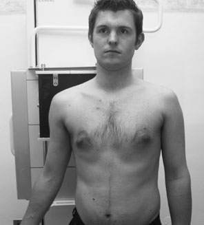
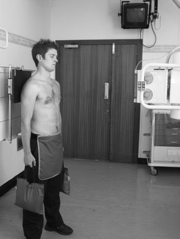
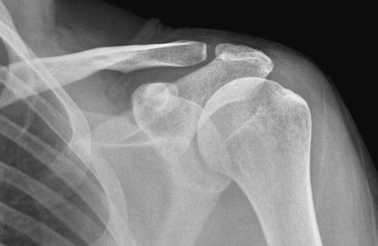
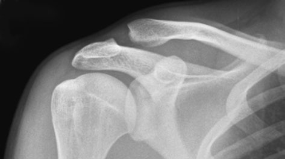

# Rx articulații acromioclaviculare anteroposterior (AP)

  📷 Radiografie Convențională (Rx)
  <strong>Actualizat:</strong> 2026-09-16
  <strong>Autor:</strong> Departamentul de Radiologie / Referință Clark (Ed. 12)

---

-   __1. Rezumat Clinic & Indicații__

    ---

    === "Indicații Clinice"

        - O casetă de 18 × 24 cm este plasată în suportul vertical pentru casetă.

    === "Ghid Național IRIS"

        !!! info "Referință Primară: Ghidul Național IRIS (Ordinul MS 1342/2012)"
            - **Capitol Ghid IRIS:** *Aparat locomotor & Membru superior*
            - **Grad de Recomandare:** **Grad A**
            - **Nivel de Iradiere Estimată:** `Clasa 1 (Minimă < 0.05 mSv)`

            [:octicons-search-16: Deschide Ghidul IRIS](../../iris.md){ .md-button .md-button--primary } [:material-open-in-new: Aplicația Oficială PWA](https://radiologie-pediatrica.ro/iris/){ .md-button target="_blank" rel="noopener" }

-   __2. Poziționare & Centrare Fascicul__

    ---

    - **Poziție Pacient:**
        - Pacientul stă în ortostatism cu fața spre tubul radiologic, cu brațele relaxate pe lângă corp. Aspectul posterior al umărului examinat este plasat în contact cu caseta, iar pacientul este apoi rotit aproximativ 15 grade spre partea examinată pentru a aduce spațiul articulației acromioclaviculare perpendicular pe filmul radiologic.
        - Caseta este poziționată astfel încât acromionul să fie în centrul filmului radiologic.
    - **Punct de Centrare Fascicul:**
        - Raza centrală orizontală este centrată la extremitatea laterală palpabilă a claviculei, la nivelul articulației acromioclaviculare.
        - Pentru a evita suprapunerea articulației peste coloana vertebrală a omoplatului (scapulei), raza centrală poate fi înclinată cu 25 de grade cranial înainte de centrarea pe articulație.
    - **Distanță Focar-Film (DFF / SID):** 100 cm
    - **Comandă Respiratorie:** Apnee pe durata expunerii (apnee în inspir pentru torace; expir pentru Abdomen/bazin).

-   __3. Parametri Tehnici Expunere__

    ---

    | Parametru Tehnic | Valoare Configurare Generator / Tub |
    |:-----------------|:-------------------------------------|
    | **Tensiune Tub (kV)** | DE CONFIGURAT PE APARAT |
    | **Sarcină / Produs Curent-Timp (mAs)** | Conform AEC / grosimii anatomice |
    | **Distanță Focar-Film (DFF / SID)** | 100 cm |
    | **Grilă Antidifuzoare (Bucky)** | Conform grosimii anatomice (> 10-12 cm cu grilă) |
    | **Dimensiune Focar** | Focar Mic (0.6 mm) |
    | **Camere de Ionizare AEC** | DE CONFIGURAT PE APARAT |
    | **Colimare Fascicul** | Colimare strictă adaptată pe receptor 18 x 24 cm |
    | **Filtrare Tub** | Totală ≥ 2.5 mm Al echivalent (conform Clark: 3.0 mm Al echivalent) |

-   __4. Criterii de Calitate & Reușită Imagine__

    ---

    - Imaginea trebuie să evidențieze articulațiile acromioclaviculare și clavicula proiectată deasupra acromionului.
    - Expunerea trebuie să evidențieze părțile moi din jurul articulației.

-   __5. Protecție Radiologică (ALARA)__

    ---

    - Ecranare gonadică cu șorț plumbat dacă gonadele sunt în apropierea fasciculului util (regula ALARA).
    - Colimare precisă la dimensiunea anatomică strict necesară pentru reducerea dozei și a radiației difuze.
    - Verificarea posibilității unei sarcini la pacientele de vârstă fertilă înainte de expunere.

!!! note "Observații Clinice & Tehnice"
    - Articulația normală are o lățime variabilă (3–8 mm). Diferența normală dintre părți trebuie să fie mai mică de 2–3 mm (Manaster 1997).
    - Suprafețele inferioare ale acromionului și claviculei trebuie să fie în mod normal pe aceeași linie dreaptă. În încărcare (ortostatism), incidență anteroposterioară (AP)
    - Articulațiile acromioclaviculare au o capsulă articulară slabă și sunt vulnerabile la traumatisme. Subluxația poate fi dificil de diagnosticat pe imaginea anteroposterioară (AP) standard, deoarece lățimea articulației poate varia și poate părea mărită în articulația normală.
    - Pentru a demonstra subluxația, poate fi necesară efectuarea unor incidențe comparative în încărcare (ortostatism) ale ambelor articulații acromioclaviculare (imagini separate ale articulațiilor).
    - Pozițiile pacientului și ale casetei sunt cele descrise mai sus.
    - Se recomandă utilizarea unor greutăți „legate” în jurul porțiunilor inferioare ale brațelor pentru procedură, în loc ca pacientul să fie rugat să le țină, deoarece biomecanica implicată poate duce la un aspect fals negativ. 94 Radiografie normală anteroposterioară (AP) a articulațiilor acromioclaviculare Radiografie anteroposterioară (AP) a articulațiilor acromioclaviculare, evidențiind subluxație

### 🖼️ Imagini

<figure class="protocol-image-card" markdown>

<figcaption><strong>este necesară în mod normal. În anumite circumstanțe, subluxația articulației</strong> — Poziționarea pacientului și centrarea fasciculului conform Clark (Ed. 12)</figcaption>

</figure>

<figure class="protocol-image-card" markdown>

<figcaption><strong>examinate pentru a aduce spațiul articulației acromioclaviculare perpendicular</strong> — Aspect radiografic / ghid de poziționare conform tratatului Clark (Ed. 12)</figcaption>

</figure>

<figure class="protocol-image-card" markdown>

<figcaption><strong>• Articulația normală are o lățime variabilă (3–8 mm). Normal</strong> — Aspect radiografic / ghid de poziționare conform tratatului Clark (Ed. 12)</figcaption>

</figure>

<figure class="protocol-image-card" markdown>

<figcaption><strong>trebuie să fie în mod normal pe aceeași linie dreaptă.</strong> — Aspect radiografic / ghid de poziționare conform tratatului Clark (Ed. 12)</figcaption>

</figure>

=== "Ghid Rapid de Execuție"

    1. **Identificarea și verificarea pacientului:** verificare identitate, zonă de examinat, consimțământ conform procedurii și evaluarea posibilității unei sarcini, când este relevantă.
    2. **Pregătire:** îndepărtarea oricăror obiecte radiopace (bijuterii, agrafe, fermoare, proteze, pansamente dense).
    3. **Poziționare precisă:** alinierea receptorului de imagine și a tubului la distanța prescrisă (100 cm).
    4. **Colimare strictă:** adaptarea fasciculului strict la regiunea de diagnostic pentru scăderea iradierii și reducerea radiației difuze.
    5. **Radioprotecție:** verificarea [politicii RX](../radioprotectie.md), cu măsuri distincte pentru pacient, personal și însoțitor.

## Surse de documentare

- [Clark's Positioning in Radiography (Ed. 12), Pagina 109](https://books.google.com/books/about/Clark_s_Positioning_in_Radiography.html?id=Xxu6MwEACAAJ)
