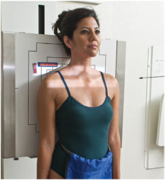
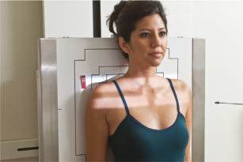

# Rx Articulații Acromioclaviculare AP (Antero-Posterior) (PEARSON METHOD) (BILATERAL WITH AND WITHOUT WEIGHTS)

  📷 Radiografie Convențională (Rx)
  <strong>Actualizat:</strong> 2026-09-15
  <strong>Autor:</strong> Departamentul de Radiologie / Referință Bontrager

---

-   __1. Rezumat Clinic & Indicații__

    ---

    === "Indicații Clinice"

        - Possible AC joint separation: AC joint studies may be taken unilateral if comparative study is not requested or bilateral study for comparison of both joints is requested.
        - Widening of one joint space compared with the other view with weights usually indicates AC joint separation

    === "Ghid Național IRIS"

        !!! info "Referință Primară: Ghidul Național IRIS (Ordinul MS 1342/2012)"
            - **Capitol Ghid IRIS:** *Ghidul Național IRIS*
            - **Grad de Recomandare:** **De verificat pe indicație; fără grad atribuit automat**
            - **Nivel de Iradiere Estimată:** `De verificat pentru examinarea și populația selectate`

            [:octicons-search-16: Deschide Ghidul IRIS](../../iris.md){ .md-button .md-button--primary } [:material-open-in-new: Aplicația Oficială PWA](https://radiologie-pediatrica.ro/iris/){ .md-button target="_blank" rel="noopener" }
-   __2. Poziționare & Centrare Fascicul__

    ---

    - **Poziție Pacient:** Pacient: Perform radiograph with patient in Ortostatism position, posterior shoulders against cassette with equal weight on both feet; arms at side; Absența rotației anatomice: clavicule echidistante față de linia apofizelor spinoase of shoulders or Bazin (Pelvis); and looking straight ahead (may be taken Poziție Șezândă if patient’s condition requires). Two sets of bilateral Articulații Acromioclaviculare are taken in the same position, one without weights and one stress view with weights (Figs. 5.91 and 5.92).; Regiune anatomică: Position patient to direct CR to midway between Articulații Acromioclaviculare. Center midline of IR to CR (top of IR should be approximately 2 inches [5 cm] above shoulders).
    - **Punct de Centrare Fascicul:** perpendicular to midpoint between Articulații Acromioclaviculare, 1 inch (2.5 cm) above incizura jugulară (manubriul sternal) Unilateral study: CR center 1 inch (2.5 cm) below affected AC joint (see NOTE)
    - **Distanță Focar-Film (DFF / SID):** 100 cm
    - **Comandă Respiratorie:** Suspend respiration during exposure. Weights After the first exposure is made without weights and the cassette has been changed, for large adult patients, strap 8to 10lb (3.5 to 4.5 kg) minimum weights to each Pumn (Articulație Radiocarpiană) and, with shoulders relaxed, gently allow weights to hang from wrists while pulling down on each arm and Umăr. The same amount of weight must be used on each Pumn (Articulație Radiocarpiană). Less weight (5 to 8 lb [2.5 to 3.5 kg] per limb) may be used for smaller or asthenic patients, and more weight may be used for larger or hypersthenic patients. (Check department protocol for the amount of applied weight.)

-   __3. Parametri Tehnici Expunere__

    ---

    | Parametru Tehnic | Valoare Configurare Generator / Tub |
    |:-----------------|:-------------------------------------|
    | **Tensiune Tub (kV)** | 70-75 kV |
    | **Sarcină / Produs Curent-Timp (mAs)** | DE CONFIGURAT PE APARAT |
    | **Distanță Focar-Film (DFF / SID)** | 100 cm |
    | **Grilă Antidifuzoare (Bucky)** | Fără grilă (expunere directă) |
    | **Dimensiune Focar** | Focar Mic (0.6 mm) |
    | **Camere de Ionizare AEC** | DE CONFIGURAT PE APARAT |
    | **Colimare Fascicul** | Field Size Collimate with a long, narrow light field to area of interest; upper light border should be to upper Umăr soft tissue margins. |
    | **Filtrare Tub** | Totală ≥ 2.5 mm Al echivalent |

-   __4. Criterii de Calitate & Reușită Imagine__

    ---

    - Vizualizarea completă a regiunii anatomice explorate
    - Absența artefactelor de mișcare sau a suprapunerilor neadecvate
    - Contrast și penetrare optime pentru decelarea structurilor osoase și a părților moi

-   __5. Protecție Radiologică (ALARA)__

    ---

    - Ecranare gonadică și a organelor radiosensibile conform procedurilor locale de radioprotecție ALARA.
    - Colimare strictă la aria de interes pentru limitarea radiației difuze.
    - Verificarea posibilității unei sarcini la pacientele de vârstă fertilă înainte de expunere.

!!! note "Observații Clinice & Tehnice"
    Patients should not be asked to hold onto the weights with their hands; the weights should be attached to the wrists so that the hands, arms, and shoulders are relaxed and possible AC joint separation can be determined. Holding onto weights may result in falsenegative radiographs because they tend to pull on the weights, resulting in contraction rather than relaxation of the Umăr muscles. Alternative Incidență AP Axială (Alexander Method) This method requires a 15° cephalic angle centered at the level of the affected AC joint. It projects the AC joint superior to the acromion, providing optimal visualization. This projection may be performed for suspected AC joint subluxation or luxație / subluxație articulară. Articulații Acromioclaviculare ROUTINE AP bilateral with weights and AP bilateral without weights Unilateral study (if requested) with and without weights Fig. 5.91 Stress view with weights (weights tied to wrists). Female, 8 to 10 lb (3.5–4.5 kg) minimum per limb. Fig. 5.92 Articulații Acromioclaviculare marked by arrows.

### 🖼️ Imagini

<figure class="protocol-image-card" markdown>

<figcaption><strong>Fig. 5.91 Stress view with</strong> — Poziționare pacient conform Ghidului Bontrager (Fig. 5.91 Stress view with)</figcaption>

</figure>

<figure class="protocol-image-card" markdown>

<figcaption><strong>Fig. 5.92 Articulații Acromioclaviculare marked by</strong> — Aspect radiografic de referință conform Ghidului Bontrager (Fig. 5.92 AC joints marked by)</figcaption>

</figure>

=== "Ghid Rapid de Execuție"

    1. **Identificarea și verificarea pacientului:** verificare identitate, zonă de examinat, consimțământ conform procedurii și evaluarea posibilității unei sarcini, când este relevantă.
    2. **Pregătire:** îndepărtarea oricăror obiecte radiopace (bijuterii, agrafe, fermoare, proteze, pansamente dense).
    3. **Poziționare precisă:** alinierea receptorului de imagine și a tubului la distanța prescrisă (100 cm).
    4. **Colimare strictă:** adaptarea fasciculului strict la regiunea de diagnostic pentru scăderea iradierii și reducerea radiației difuze.
    5. **Radioprotecție:** verificarea [politicii RX](../radioprotectie.md), cu măsuri distincte pentru pacient, personal și însoțitor.

## Surse de documentare

- [Bontrager's Textbook of Radiographic Positioning (Ed. 9/10), Pagina 218](https://www.elsevier.com/books/textbook-of-radiographic-positioning-and-related-anatomy/lampignano/978-0-323-65367-1)
