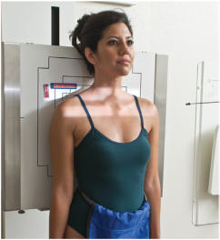
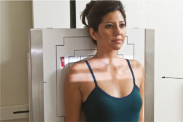

# Rx articulații acromioclaviculare AP (anteroposterior) (metoda Pearson) (BILATERAL CU ȘI FĂRĂ GREUTĂȚI)

  📷 Radiografie Convențională (Rx)
  <strong>Actualizat:</strong> 2026-09-15
  <strong>Autor:</strong> Departamentul de Radiologie / Referință Bontrager

---

-   __1. Rezumat Clinic & Indicații__

    ---

    === "Indicații Clinice"

        - Posibilă separare a articulației acromioclaviculare: studiile articulațiilor acromioclaviculare pot fi efectuate unilateral dacă nu se solicită un studiu comparativ sau bilateral dacă se solicită compararea ambelor articulații.
        - Lărgirea unuia dintre spațiile articulare comparativ cu celălalt în incidența cu greutăți indică de obicei separarea articulației acromioclaviculare.

    === "Ghid Național IRIS"

        !!! info "Referință Primară: Ghidul Național IRIS (Ordinul MS 1342/2012)"
            - **Capitol Ghid IRIS:** *Aparat locomotor & Membru superior*
            - **Grad de Recomandare:** **Grad A**
            - **Nivel de Iradiere Estimată:** `Clasa 1 (Minimă < 0.05 mSv)`

            [:octicons-search-16: Deschide Ghidul IRIS](../../iris.md){ .md-button .md-button--primary } [:material-open-in-new: Aplicația Oficială PWA](https://radiologie-pediatrica.ro/iris/){ .md-button target="_blank" rel="noopener" }

-   __2. Poziționare & Centrare Fascicul__

    ---

    - **Poziție Pacient:**
        Pacient: Efectuați radiografia cu pacientul în poziție de ortostatism, cu partea posterioară a umerilor lipită de casetă și cu greutatea distribuită egal pe ambele picioare; brațele pe lângă corp; fără rotație anatomică: claviculele echidistante față de linia apofizelor spinoase ale umerilor sau bazinului (pelvisului); pacientul privește drept înainte (poate fi efectuată în poziție șezândă dacă starea pacientului o impune). Se efectuează două serii de articulații acromioclaviculare bilaterale în aceeași poziție, una fără greutăți și una reprezentând incidența de stres cu greutăți (Fig. 5.91 și 5.92).

        Regiune anatomică: poziția pacientului față de raza centrală; raza centrală se orientează spre punctul median dintre articulațiile acromioclaviculare. Centrați linia mediană a receptorului de imagine pe raza centrală (partea superioară a receptorului de imagine trebuie să fie la aproximativ 2 țol [5 cm] deasupra umerilor).

    - **Punct de Centrare Fascicul:**
        Perpendicular pe punctul median dintre articulațiile acromioclaviculare, la 1 țol (2,5 cm) deasupra incizurii jugulare (manubriul sternal)

        studiu unilateral: raza centrală centrată la 1 țol (2,5 cm) sub articulația acromioclaviculară afectată (vezi NOTA)

    - **Distanță Focar-Film (DFF / SID):** 100 cm
    - **Comandă Respiratorie:**
        Apnee pe durata expunerii. Greutăți

        După efectuarea primei expuneri fără greutăți și schimbarea casetei, pentru pacienții adulți mari, legați greutăți de minimum 8–10 lb (3,5–4,5 kg) la fiecare încheietură și, cu umerii relaxați, lăsați ușor greutățile să atârne de încheieturi, trăgând în jos de fiecare braț și umăr. Aceeași cantitate de greutate trebuie utilizată la fiecare încheietură. Pentru pacienții mai mici sau astenici pot fi utilizate greutăți mai mici (5–8 lb [2,5–3,5 kg] pentru fiecare membru), iar pentru pacienții mai mari sau hiperstenici pot fi utilizate greutăți mai mari. (Verificați protocolul departamentului pentru cantitatea de greutate aplicată.)

-   __3. Parametri Tehnici Expunere__

    ---

    | Parametru Tehnic | Valoare Configurare Generator / Tub |
    |:-----------------|:-------------------------------------|
    | **Tensiune Tub (kV)** | 70-75 kV |
    | **Sarcină / Produs Curent-Timp (mAs)** | DE CONFIGURAT PE APARAT |
    | **Distanță Focar-Film (DFF / SID)** | 100 cm |
    | **Grilă Antidifuzoare (Bucky)** | Fără grilă (expunere directă) |
    | **Dimensiune Focar** | Focar Mic (0.6 mm) |
    | **Camere de Ionizare AEC** | DE CONFIGURAT PE APARAT |
    | **Colimare Fascicul** | Dimensiunea câmpului Colimați cu un câmp luminos lung și îngust la aria de interes diagnostic; marginea luminoasă superioară trebuie să fie la nivelul marginilor superioare ale părților moi ale umărului. |
    | **Filtrare Tub** | Totală ≥ 2.5 mm Al echivalent |

-   __4. Criterii de Calitate & Reușită Imagine__

    ---

    - Vizualizarea completă a regiunii anatomice explorate
    - Absența artefactelor de mișcare sau a suprapunerilor neadecvate
    - Contrast și penetrare optime pentru decelarea structurilor osoase și a părților moi

-   __5. Protecție Radiologică (ALARA)__

    ---

    - Ecranare gonadică și a organelor radiosensibile conform procedurilor locale de radioprotecție ALARA.
    - Colimare strictă la aria de interes pentru limitarea radiației difuze.
    - Verificarea posibilității unei sarcini la pacientele de vârstă fertilă înainte de expunere.

!!! note "Observații Clinice & Tehnice"
    Pacienților nu trebuie să li se ceară să țină greutățile cu mâinile; greutățile trebuie atașate la încheieturi astfel încât mâinile, brațele și umerii să fie relaxați, iar eventuala separare a articulației acromioclaviculare să poată fi determinată. Menținerea greutăților poate produce radiografii fals negative deoarece pacienții tind să tragă de greutăți, determinând contracția în locul relaxării mușchilor umărului. Incidență alternativă AP axială (metoda Alexander) Această metodă necesită un unghi cefalic de 15°, centrat la nivelul articulației acromioclaviculare afectate. Proiectează articulația acromioclaviculară superior față de acromion, oferind o vizualizare optimă. Această incidență poate fi efectuată în caz de suspiciune de subluxație sau luxație/subluxație a articulației acromioclaviculare. Articulații acromioclaviculare RUTINĂ AP bilaterală cu greutăți și AP bilaterală fără greutăți studiu unilateral (dacă este solicitat), cu și fără greutăți Fig. 5.91 Incidență de stres cu greutăți (greutățile legate de încheieturi). Femeie, minimum 8–10 lb (3,5–4,5 kg) pentru fiecare membru. Fig. 5.92 Articulațiile acromioclaviculare indicate prin săgeți.

### 🖼️ Imagini

<figure class="protocol-image-card" markdown>

<figcaption><strong>Fig. 5.91 Incidență de stres cu</strong> — Poziționare pacient conform Ghidului Bontrager (Fig. 5.91 Incidență de stres cu</figcaption>

</figure>

<figure class="protocol-image-card" markdown>

<figcaption><strong>Fig. 5.92 Articulații acromioclaviculare marcate prin</strong> — Aspect radiografic de referință conform Ghidului Bontrager (Fig. 5.92 articulații acromioclaviculare marcate prin)</figcaption>

</figure>

=== "Ghid Rapid de Execuție"

    1. **Identificarea și verificarea pacientului:** verificare identitate, zonă de examinat, consimțământ conform procedurii și evaluarea posibilității unei sarcini, când este relevantă.
    2. **Pregătire:** îndepărtarea oricăror obiecte radiopace (bijuterii, agrafe, fermoare, proteze, pansamente dense).
    3. **Poziționare precisă:** alinierea receptorului de imagine și a tubului la distanța prescrisă (100 cm).
    4. **Colimare strictă:** adaptarea fasciculului strict la regiunea de diagnostic pentru scăderea iradierii și reducerea radiației difuze.
    5. **Radioprotecție:** verificarea [politicii RX](../radioprotectie.md), cu măsuri distincte pentru pacient, personal și însoțitor.

## Surse de documentare

- [Bontrager's Textbook of Radiographic Positioning (Ed. 9/10), Pagina 218](https://www.elsevier.com/books/textbook-of-radiographic-positioning-and-related-anatomy/lampignano/978-0-323-65367-1)
