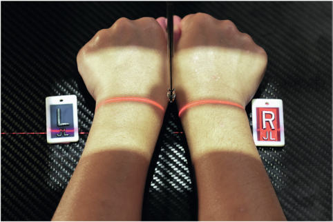
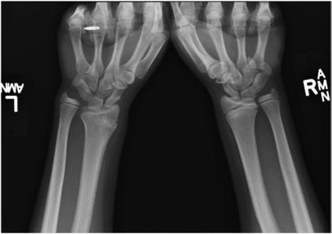

# Rx BILATERAL PA STRESS Incidență (“CLENCHED PA”) WRIST5

  📷 Radiografie Convențională (Rx)
  <strong>Actualizat:</strong> 2026-09-15
  <strong>Autor:</strong> Departamentul de Radiologie / Referință Bontrager

---

-   __1. Rezumat Clinic & Indicații__

    ---

    === "Indicații Clinice"

        - Possible scaphoid suspiciune de fractură
        - Possible scapholunate ligament injury evident prin widening de lunate de la scaphoid (>34 mm)14

    === "Ghid Național IRIS"

        !!! info "Referință Primară: Ghidul Național IRIS (Ordinul MS 1342/2012)"
            - **Capitol Ghid IRIS:** *Ghidul Național IRIS*
            - **Grad de Recomandare:** **De verificat pe indicație; fără grad atribuit automat**
            - **Nivel de Iradiere Estimată:** `De verificat pentru examinarea și populația selectate`

            [:octicons-search-16: Deschide Ghidul IRIS](../../iris.md){ .md-button .md-button--primary } [:material-open-in-new: Aplicația Oficială PWA](https://radiologie-pediatrica.ro/iris/){ .md-button target="_blank" rel="noopener" }
-   __2. Poziționare & Centrare Fascicul__

    ---

    - **Poziție Pacient:** Pacient: Seat pacient la end de table cu forearms extins și mâini în pronație. Drop umeri so that coate și wrists sunt pe same plan orizontal.; Regiune anatomică: poziție wrists ca pentru Incidență Postero-Anterioară (PA)—palm down cu Pumn (Articulație Radiocarpiană) și Mână aliniat cu center de axa longitudinală de receptorul de imagine. Ensure there este Absența rotației anatomice: clavicule echidistante față de linia apofizelor spinoase de mâini și wrists Index Degete Mână sunt opposed tightly la fiecare other Ask pacient la clench fists equally (Fig. 4.106)
    - **Punct de Centrare Fascicul:** perpendicular pe receptorul de imagine orientat la midpoint între ambele carpal regions
    - **Distanță Focar-Film (DFF / SID):** 100 cm
    - **Comandă Respiratorie:** Apnee pe durata expunerii (sau conform cooperării pacientului)

-   __3. Parametri Tehnici Expunere__

    ---

    | Parametru Tehnic | Valoare Configurare Generator / Tub |
    |:-----------------|:-------------------------------------|
    | **Tensiune Tub (kV)** | 55 kV |
    | **Sarcină / Produs Curent-Timp (mAs)** | DE CONFIGURAT PE APARAT |
    | **Distanță Focar-Film (DFF / SID)** | 100 cm |
    | **Grilă Antidifuzoare (Bucky)** | Fără grilă (expunere directă) |
    | **Dimensiune Focar** | Focar Mic (0.6 mm) |
    | **Camere de Ionizare AEC** | DE CONFIGURAT PE APARAT |
    | **Colimare Fascicul** | Field Size Collimate pe four sides la carpal region. Pumn (Articulație Radiocarpiană) SPECIAL Scaphoid incidență: bilateral pA stress incidență |
    | **Filtrare Tub** | Totală ≥ 2.5 mm Al echivalent |

-   __4. Criterii de Calitate & Reușită Imagine__

    ---

    - distal radius și ulna, oase carpiene, și proximal oase metacarpiene sunt vizibil.
    - oase carpiene sunt vizibil, cu adjacent interspaces more open pe medial (ulnar) side de Pumn (Articulație Radiocarpiană) (Fig. 4.107). poziție:
    - axa longitudinală de Antebraț este aliniat cu side margine de receptorul de imagine.
    - Absența rotației anatomice: clavicule echidistante față de linia apofizelor spinoase de Pumn (Articulație Radiocarpiană) este evidenced prin appearance de distal radius și ulna.
    - raza centrală și center de collimation field size trebuie să fie la aria medio-carpiană. expunere:
    - optim receptorul de imagine expunere și contrast cu fără mișcare visualize carpal margini și clear, Contururi osoase și travee trabeculare nete, fără artefacte de mișcare. Fig. 4.107 bilateral PA stress incidență. (Courtesy de Joshua M. Abzug, MD. de la Abzug JM et al: Pediatric Mână therapy, Philadelphia, 2020, Elsevier.) Fig. 4.106 bilateral PA stress (clenched PA) incidență.

-   __5. Protecție Radiologică (ALARA)__

    ---

    - Ecranare gonadică și a organelor radiosensibile conform procedurilor locale de radioprotecție ALARA.
    - Colimare strictă la aria de interes pentru limitarea radiației difuze.
    - Verificarea posibilității unei sarcini la pacientele de vârstă fertilă înainte de expunere.

### 🖼️ Imagini

<figure class="protocol-image-card" markdown>

<figcaption><strong>Fig. 4.107 bilateral PA stress incidență. (Courtesy de Joshua M.</strong> — Poziționare pacient conform Ghidului Bontrager (Fig. 4.107 bilateral PA stress incidență. (Courtesy de Joshua M.)</figcaption>

</figure>

<figure class="protocol-image-card" markdown>

<figcaption><strong>Fig. 4.106 bilateral PA stress (clenched PA) incidență.</strong> — Aspect radiografic de referință conform Ghidului Bontrager (Fig. 4.106 bilateral PA stress (clenched PA) incidență.)</figcaption>

</figure>

=== "Ghid Rapid de Execuție"

    1. **Identificarea și verificarea pacientului:** verificare identitate, zonă de examinat, consimțământ conform procedurii și evaluarea posibilității unei sarcini, când este relevantă.
    2. **Pregătire:** îndepărtarea oricăror obiecte radiopace (bijuterii, agrafe, fermoare, proteze, pansamente dense).
    3. **Poziționare precisă:** alinierea receptorului de imagine și a tubului la distanța prescrisă (100 cm).
    4. **Colimare strictă:** adaptarea fasciculului strict la regiunea de diagnostic pentru scăderea iradierii și reducerea radiației difuze.
    5. **Radioprotecție:** verificarea [politicii RX](../radioprotectie.md), cu măsuri distincte pentru pacient, personal și însoțitor.

## Surse de documentare

- [Bontrager's Textbook of Radiographic Positioning (Ed. 9/10), Pagina 170](https://www.elsevier.com/books/textbook-of-radiographic-positioning-and-related-anatomy/lampignano/978-0-323-65367-1)
