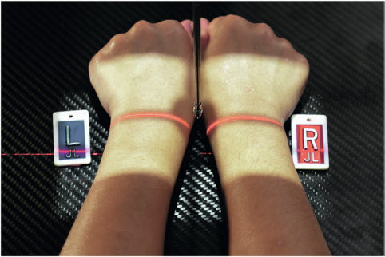
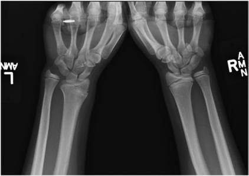

# Rx incidență PA de stres bilaterală („PA cu pumnii strânși”) pentru pumn5

  📷 Radiografie Convențională (Rx)
  <strong>Actualizat:</strong> 2026-09-15
  <strong>Autor:</strong> Departamentul de Radiologie / Referință Bontrager

---

-   __1. Rezumat Clinic & Indicații__

    ---

    === "Indicații Clinice"

        - Posibilă fractură a scafoidului
        - Posibilă leziune a ligamentului scafolunar, evidențiată prin lărgirea spațiului dintre lunat și scafoid (>34 mm)14

    === "Ghid Național IRIS"

        !!! info "Referință Primară: Ghidul Național IRIS (Ordinul MS 1342/2012)"
            - **Capitol Ghid IRIS:** *Aparat locomotor & Membru superior*
            - **Grad de Recomandare:** **Grad A**
            - **Nivel de Iradiere Estimată:** `Clasa 1 (Minimă < 0.01 mSv)`

            [:octicons-search-16: Deschide Ghidul IRIS](../../iris.md){ .md-button .md-button--primary } [:material-open-in-new: Aplicația Oficială PWA](https://radiologie-pediatrica.ro/iris/){ .md-button target="_blank" rel="noopener" }

-   __2. Poziționare & Centrare Fascicul__

    ---

    - **Poziție Pacient:** Pacient: Așezați pacientul la capătul mesei, cu antebrațele întinse și mâinile în pronație. Coborâți umerii astfel încât coatele și pumnii să fie în același plan orizontal.; Regiune anatomică: poziționați pumnii ca pentru incidența postero-anterioară (PA)—palmele în jos, cu pumnul (articulația radiocarpiană) și mâna aliniate cu centrul axei longitudinale a receptorului de imagine. Asigurați absența rotației anatomice: claviculele echidistante față de linia apofizelor spinoase, mâinile și pumnii. Degetele arătătoare ale mâinilor sunt strâns opuse unul altuia. Cereți pacientului să strângă pumnii în mod egal (Fig. 4.106)
    - **Punct de Centrare Fascicul:** perpendicular pe receptorul de imagine, orientat la mijlocul dintre ambele regiuni carpiene
    - **Distanță Focar-Film (DFF / SID):** 100 cm
    - **Comandă Respiratorie:** Apnee pe durata expunerii (sau conform cooperării pacientului)

-   __3. Parametri Tehnici Expunere__

    ---

    | Parametru Tehnic | Valoare Configurare Generator / Tub |
    |:-----------------|:-------------------------------------|
    | **Tensiune Tub (kV)** | 55 kV |
    | **Sarcină / Produs Curent-Timp (mAs)** | DE CONFIGURAT PE APARAT |
    | **Distanță Focar-Film (DFF / SID)** | 100 cm |
    | **Grilă Antidifuzoare (Bucky)** | Fără grilă (expunere directă) |
    | **Dimensiune Focar** | Focar Mic (0.6 mm) |
    | **Camere de Ionizare AEC** | DE CONFIGURAT PE APARAT |
    | **Colimare Fascicul** | Dimensiunea câmpului: colimați pe toate cele patru laturi la regiunea carpiană. Pumn (articulație radiocarpiană) INCIDENȚĂ SPECIALĂ pentru scafoid: incidență PA de stres bilaterală |
    | **Filtrare Tub** | Totală ≥ 2.5 mm Al echivalent |

-   __4. Criterii de Calitate & Reușită Imagine__

    ---

    - Radiusul și ulna distale, oasele carpiene și oasele metacarpiene proximale sunt vizibile.
    - Oasele carpiene sunt vizibile, cu spațiile interosoase adiacente mai deschise pe partea medială (ulnară) a pumnului (articulației radiocarpiene) (Fig. 4.107). Poziție:
    - Axa longitudinală a antebrațului este aliniată cu marginea laterală a receptorului de imagine.
    - Absența rotației anatomice: claviculele echidistante față de linia apofizelor spinoase. Poziția pumnului (articulației radiocarpiene) este evidențiată prin aspectul radiusului și ulnei distale.
    - Raza centrală și centrul câmpului de colimare trebuie să fie la nivelul regiunii mediocarpiene. Expunere:
    - Expunere optimă a receptorului de imagine și contrast, fără mișcare; marginile carpiene și contururile osoase sunt clare, iar traveele trabeculare sunt nete, fără artefacte de mișcare. Fig. 4.107 incidență PA de stres bilaterală. (Cu amabilitatea lui Joshua M. Abzug, MD. Din Abzug JM et al: Pediatric Hand Therapy, Philadelphia, 2020, Elsevier.) Fig. 4.106 incidență PA de stres bilaterală (PA cu pumnii strânși).

-   __5. Protecție Radiologică (ALARA)__

    ---

    - Ecranare gonadică și a organelor radiosensibile conform procedurilor locale de radioprotecție ALARA.
    - Colimare strictă la aria de interes pentru limitarea radiației difuze.
    - Verificarea posibilității unei sarcini la pacientele de vârstă fertilă înainte de expunere.

### 🖼️ Imagini

<figure class="protocol-image-card" markdown>

<figcaption><strong>Fig. 4.107 incidență PA de stres bilaterală. (Cu amabilitatea lui Joshua M.</strong> — Poziționare pacient conform Ghidului Bontrager (Fig. 4.107 incidență PA de stres bilaterală. (Cu amabilitatea lui Joshua M.)</figcaption>

</figure>

<figure class="protocol-image-card" markdown>

<figcaption><strong>Fig. 4.106 incidență PA de stres bilaterală (PA cu pumnii strânși).</strong> — Aspect radiografic de referință conform Ghidului Bontrager (Fig. 4.106 incidență PA de stres bilaterală (PA cu pumnii strânși).)</figcaption>

</figure>

=== "Ghid Rapid de Execuție"

    1. **Identificarea și verificarea pacientului:** verificare identitate, zonă de examinat, consimțământ conform procedurii și evaluarea posibilității unei sarcini, când este relevantă.
    2. **Pregătire:** îndepărtarea oricăror obiecte radiopace (bijuterii, agrafe, fermoare, proteze, pansamente dense).
    3. **Poziționare precisă:** alinierea receptorului de imagine și a tubului la distanța prescrisă (100 cm).
    4. **Colimare strictă:** adaptarea fasciculului strict la regiunea de diagnostic pentru scăderea iradierii și reducerea radiației difuze.
    5. **Radioprotecție:** verificarea [politicii RX](../radioprotectie.md), cu măsuri distincte pentru pacient, personal și însoțitor.

## Surse de documentare

- [Bontrager's Textbook of Radiographic Positioning (Ed. 9/10), Pagina 170](https://www.elsevier.com/books/textbook-of-radiographic-positioning-and-related-anatomy/lampignano/978-0-323-65367-1)
