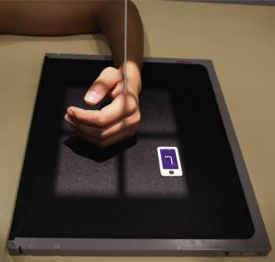
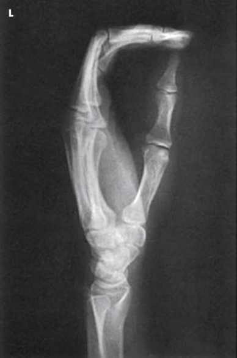
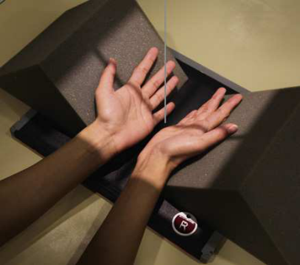
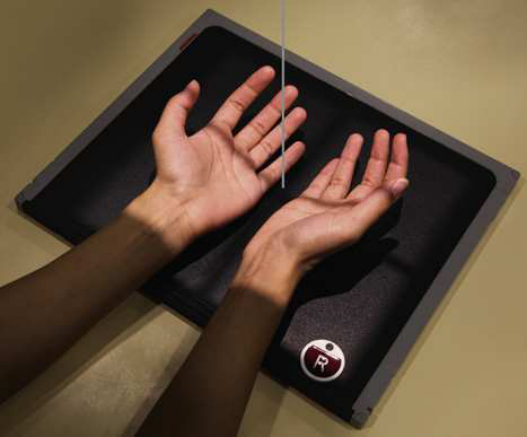

# Rx ▪ Bony trabecular detail and surrounding soft tissues — Oblică Antero-Posterioară (AP) — Metoda Norgaard (Ball-Catcher) Rotație Internă (Medială) (Merrill)

  📷 Radiografie Convențională (Rx)
  <strong>Actualizat:</strong> 2026-09-16
  <strong>Autor:</strong> Referință Merrill

---

-   __1. Rezumat Clinic & Indicații__

    ---

    === "Indicații Clinice"

        - Conform reperelor anatomice standard din tratat

    === "Ghid Național IRIS"

        !!! info "Referință Primară: Ghidul Național IRIS (Ordinul MS 1342/2012)"
            - **Capitol Ghid IRIS:** *Ghidul Național IRIS*
            - **Grad de Recomandare:** **De verificat pe indicație; fără grad atribuit automat**
            - **Nivel de Iradiere Estimată:** `De verificat pentru examinarea și populația selectate`

            [:octicons-search-16: Deschide Ghidul IRIS](../../iris.md){ .md-button .md-button--primary } [:material-open-in-new: Aplicația Oficială PWA](https://radiologie-pediatrica.ro/iris/){ .md-button target="_blank" rel="noopener" }
-   __2. Poziționare & Centrare Fascicul__

    ---

    - **Poziție Pacient:** se așază pacientul pe scaun la end de masa radiologică. Norgaard recommended that ambele mâini fie radiographed în half-în supinație poziție pentru comparison.; Se instruiește pacientul să place palms de ambele mâini together. se centrează articulații metacarpofalangiene (MCF) pe medial aspect de ambele mâini la receptorul de imagine. ambele mâini trebuie să fie în Incidență de Profil (lateral). Place two 45-grade radiolucent sponges pe / sprijinit de posterior aspect de fiecare Mână. se rotește pacient’s mâini la half-în supinație poziție until dorsal surface de fiecare Mână rests against fiecare 45-grade sponge support (Fig. 5.66). se extinde pacient’s Degete Mână și abduct thumbs slightly la avoid superimposing them over second articulații metacarpofalangiene (MCF). original method de positioning mâinile este often modified. pacientul este poziționat similar la method described, except that Degete Mână sunt nu extins. Instead, Degete Mână sunt cupped ca though pacientul were going la catch ball (Fig. 5.67). Comparable diagnostic information este provided using either poziție. se efectuează ecranarea gonadelor cu șorț plumbat.
    - **Punct de Centrare Fascicul:** perpendicular la point midway între ambele mâini la nivelul articulații metacarpofalangiene (MCF) pentru either de two pacient poziții
    - **Distanță Focar-Film (DFF / SID):** Nespecificat în fragmentul extras; de verificat în sursă
    - **Comandă Respiratorie:** Conform reperelor anatomice standard din tratat

-   __3. Parametri Tehnici Expunere__

    ---

    | Parametru Tehnic | Valoare Configurare Generator / Tub |
    |:-----------------|:-------------------------------------|
    | **Tensiune Tub (kV)** | DE CONFIGURAT PE APARAT |
    | **Sarcină / Produs Curent-Timp (mAs)** | DE CONFIGURAT PE APARAT |
    | **Distanță Focar-Film (DFF / SID)** | Nespecificat în fragmentul extras; de verificat în sursă |
    | **Grilă Antidifuzoare (Bucky)** | DE CONFIGURAT PE APARAT |
    | **Dimensiune Focar** | DE CONFIGURAT PE APARAT |
    | **Camere de Ionizare AEC** | DE CONFIGURAT PE APARAT |
    | **Colimare Fascicul** | Adjust câmp de iradiere la 1 inch (2.5 cm) pe toate sides de falange, including 1 inch (2.5 cm) proximal la ulnar styloid. Se plasează markerul de lateralitate în câmpul colimat. |
    | **Filtrare Tub** | DE CONFIGURAT PE APARAT |

-   __4. Criterii de Calitate & Reușită Imagine__

    ---

    - Criterii radiologice de calitate imaginii:
    - Colimare adecvată vizibilă și prezența markerului de lateralitate (D/S) plasat clear de anatomy de interest
    - ambele mâini de la carpal area la tips de falange
    - Metacarpal heads și proximal phalangeal bases liber de superimposition
    - Bony detalii trabeculare osoase și surrounding soft tissues

-   __5. Protecție Radiologică (ALARA)__

    ---

    - Nespecificat în fragmentul extras; de verificat în sursă

!!! note "Observații Clinice & Tehnice"
    Conform reperelor anatomice standard din tratat

### 🖼️ Imagini

<figure class="protocol-image-card" markdown>

<figcaption><strong>Merrill — pagina PDF 285, imaginea 1</strong> — Imagine din fragmentul sursă; asocierea necesită revizie.</figcaption>

</figure>

<figure class="protocol-image-card" markdown>

<figcaption><strong>Merrill — pagina PDF 286, imaginea 2</strong> — Imagine din fragmentul sursă; asocierea necesită revizie.</figcaption>

</figure>

<figure class="protocol-image-card" markdown>

<figcaption><strong>Merrill — pagina PDF 287, imaginea 3</strong> — Imagine din fragmentul sursă; asocierea necesită revizie.</figcaption>

</figure>

<figure class="protocol-image-card" markdown>

<figcaption><strong>Merrill — pagina PDF 287, imaginea 4</strong> — Imagine din fragmentul sursă; asocierea necesită revizie.</figcaption>

</figure>

=== "Ghid Rapid de Execuție"

    1. **Identificarea și verificarea pacientului:** verificare identitate, zonă de examinat, consimțământ conform procedurii și evaluarea posibilității unei sarcini, când este relevantă.
    2. **Pregătire:** îndepărtarea oricăror obiecte radiopace (bijuterii, agrafe, fermoare, proteze, pansamente dense).
    3. **Poziționare precisă:** alinierea receptorului de imagine și a tubului la distanța prescrisă (Nespecificat în fragmentul extras; de verificat în sursă).
    4. **Colimare strictă:** adaptarea fasciculului strict la regiunea de diagnostic pentru scăderea iradierii și reducerea radiației difuze.
    5. **Radioprotecție:** verificarea [politicii RX](../radioprotectie.md), cu măsuri distincte pentru pacient, personal și însoțitor.

## Surse de documentare

- [Merrill’s Atlas, 5. Upper Extremity, pagini PDF 285–287](../../assets/protocols/sources/a56d45c16829_Merrills_Atlas_of_Radiographic_Positioning__Procedures_3Vol_Set.pdf#page=285)

## Fragmente sursă traduse (referință tehnică)

### anatomy

AP 45-grade oblic incidență de ambele mâini (see Fig. 5.68). early radiologic change significant în making diagnosis de rheumatoid
arthritis este simetric, very slight, indistinct outline de bone corresponding la insertion de articulație capsule dorsoradial pe proximal
end de first phalanx de four fingers. în addition, associated demineralization de bone structure este always present în area directly
below contour defect.

### collimation

• Adjust câmp de iradiere la 1 inch (2.5 cm) pe toate sides de falange, including 1 inch (2.5 cm) proximal la ulnar styloid. Place side
marker în collimated expunere field.

### cr

• perpendicular la point midway între ambele mâini la nivelul articulații metacarpofalangiene (MCF) pentru either de two pacient poziții

### criteria

Criterii radiologice de calitate imaginii:
• Colimare adecvată vizibilă și prezența markerului de lateralitate (D/S) plasat clear de anatomy de interest
• ambele mâini de la carpal area la tips de falange
• Metacarpal heads și proximal phalangeal bases liber de superimposition
• Bony detalii trabeculare osoase și surrounding soft tissues

### part_pos

• Se instruiește pacientul să place palms de ambele mâini together. se centrează articulații metacarpofalangiene (MCF) pe medial aspect de ambele mâini la receptorul de imagine. ambele
mâini trebuie să fie în poziție de profil (lateral).
• Place two 45-grade radiolucent sponges pe / sprijinit de posterior aspect de fiecare mână.
• se rotește pacient’s mâini la half-în supinație poziție until dorsal surface de fiecare mână rests against fiecare 45-grade sponge support
(Fig. 5.66).
• se extinde pacient’s fingers și abduct thumbs slightly la avoid superimposing them over second articulații metacarpofalangiene (MCF).
• original method de positioning mâinile este often modified. pacientul este poziționat similar la method described, except that
degetele sunt nu extins. Instead, degetele sunt cupped ca though pacientul were going la catch ball (Fig. 5.67). Comparable
diagnostic information este provided using either poziție.
• se efectuează ecranarea gonadelor cu șorț plumbat.

### patient_pos

• se așază pacientul pe scaun la end de masa radiologică. Norgaard recommended that ambele mâini fie radiographed în half-în supinație
poziție pentru comparison.

### tech

poziționat prin manufacturer sau department protocol pentru corect anatomy display orientation; raza centrală plate: 10 × 12 inches (24 × 30
cm) transversal

