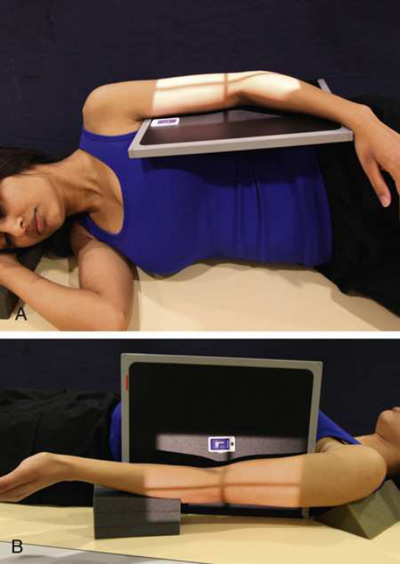
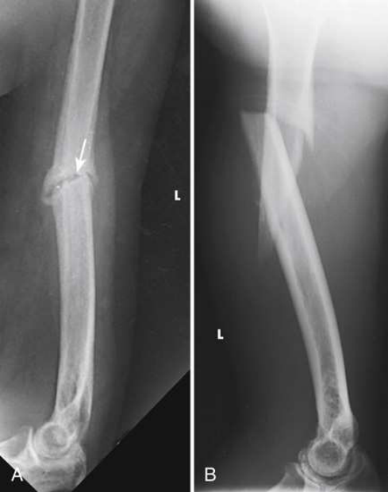

# Rx ▪ Bony trabecular detail and surrounding soft tissues — Incidență de Profil (Lateral) — Latero-Medial Decubit or lateral Decubit (Merrill)

  📷 Radiografie Convențională (Rx)
  <strong>Actualizat:</strong> 2026-09-16
  <strong>Autor:</strong> Referință Merrill

---

-   __1. Rezumat Clinic & Indicații__

    ---

    === "Indicații Clinice"

        - Conform reperelor anatomice standard din tratat

    === "Ghid Național IRIS"

        !!! info "Referință Primară: Ghidul Național IRIS (Ordinul MS 1342/2012)"
            - **Capitol Ghid IRIS:** *Ghidul Național IRIS*
            - **Grad de Recomandare:** **De verificat pe indicație; fără grad atribuit automat**
            - **Nivel de Iradiere Estimată:** `De verificat pentru examinarea și populația selectate`

            [:octicons-search-16: Deschide Ghidul IRIS](../../iris.md){ .md-button .md-button--primary } [:material-open-in-new: Aplicația Oficială PWA](https://radiologie-pediatrica.ro/iris/){ .md-button target="_blank" rel="noopener" }
-   __2. Poziționare & Centrare Fascicul__

    ---

    - **Poziție Pacient:** When known sau suspected suspiciune de fractură exists, se poziționează pacientul în Decubit sau lateral Decubit poziție, place receptorul de imagine close la axilla, și se centrează Humerus la linia mediană receptorul de imagine. Unless contraindicated, se flectează Cot, turn Police surface de Mână up, și rest Humerus pe suitable support (see Fig. 5.158). se ajustează poziție de corp la place lateral surface de Humerus perpendicular pe raza centrală. se efectuează ecranarea gonadelor cu șorț plumbat.; Conform reperelor anatomice standard din tratat
    - **Punct de Centrare Fascicul:** Decubit orizontal și perpendicular pe midportion de Humerus și center de receptorul de imagine lateral Decubit orientat la center de receptorul de imagine, which exposes only distal Humerus (see Fig. 5.158)
    - **Distanță Focar-Film (DFF / SID):** Nespecificat în fragmentul extras; de verificat în sursă
    - **Comandă Respiratorie:** apnee (oprirea respirației).

-   __3. Parametri Tehnici Expunere__

    ---

    | Parametru Tehnic | Valoare Configurare Generator / Tub |
    |:-----------------|:-------------------------------------|
    | **Tensiune Tub (kV)** | DE CONFIGURAT PE APARAT |
    | **Sarcină / Produs Curent-Timp (mAs)** | DE CONFIGURAT PE APARAT |
    | **Distanță Focar-Film (DFF / SID)** | Nespecificat în fragmentul extras; de verificat în sursă |
    | **Grilă Antidifuzoare (Bucky)** | DE CONFIGURAT PE APARAT |
    | **Dimensiune Focar** | DE CONFIGURAT PE APARAT |
    | **Camere de Ionizare AEC** | DE CONFIGURAT PE APARAT |
    | **Colimare Fascicul** | Adjust câmp de iradiere la 2 inches (5 cm) distal la Cot articulație și 1 inch (2.5 cm) pe sides; top collimator margin trebuie să extend fără farther than edge de receptorul de imagine |
    | **Filtrare Tub** | DE CONFIGURAT PE APARAT |

-   __4. Criterii de Calitate & Reușită Imagine__

    ---

    - Criterii radiologice de calitate imaginii:
    - Colimare adecvată vizibilă și prezența markerului de lateralitate (D/S) plasat clear de anatomy de interest
    - distal Humerus
    - Superimposed epicondyles
    - Bony detalii trabeculare osoase și surrounding soft tissues

-   __5. Protecție Radiologică (ALARA)__

    ---

    - Nespecificat în fragmentul extras; de verificat în sursă

!!! note "Observații Clinice & Tehnice"
    Conform reperelor anatomice standard din tratat

### 🖼️ Imagini

<figure class="protocol-image-card" markdown>

<figcaption><strong>Merrill — pagina PDF 362, imaginea 1</strong> — Imagine din fragmentul sursă; asocierea necesită revizie.</figcaption>

</figure>

<figure class="protocol-image-card" markdown>

<figcaption><strong>Merrill — pagina PDF 363, imaginea 2</strong> — Imagine din fragmentul sursă; asocierea necesită revizie.</figcaption>

</figure>

=== "Ghid Rapid de Execuție"

    1. **Identificarea și verificarea pacientului:** verificare identitate, zonă de examinat, consimțământ conform procedurii și evaluarea posibilității unei sarcini, când este relevantă.
    2. **Pregătire:** îndepărtarea oricăror obiecte radiopace (bijuterii, agrafe, fermoare, proteze, pansamente dense).
    3. **Poziționare precisă:** alinierea receptorului de imagine și a tubului la distanța prescrisă (Nespecificat în fragmentul extras; de verificat în sursă).
    4. **Colimare strictă:** adaptarea fasciculului strict la regiunea de diagnostic pentru scăderea iradierii și reducerea radiației difuze.
    5. **Radioprotecție:** verificarea [politicii RX](../radioprotectie.md), cu măsuri distincte pentru pacient, personal și însoțitor.

## Surse de documentare

- [Merrill’s Atlas, 5. Upper Extremity, pagini PDF 360–364](../../assets/protocols/sources/a56d45c16829_Merrills_Atlas_of_Radiographic_Positioning__Procedures_3Vol_Set.pdf#page=360)

## Fragmente sursă traduse (referință tehnică)

### anatomy

lateral incidență shows distal humerus (Fig. 5.159).

### collimation

• Adjust câmp de iradiere la 2 inches (5 cm) distal la cot articulație și 1 inch (2.5 cm) pe sides; top collimator margin trebuie să extend
fără farther than edge de receptorul de imagine

### cr

Recumbent
• orizontal și perpendicular pe midportion de humerus și center de receptorul de imagine
lateral recumbent
• orientat la center de receptorul de imagine, which exposes only distal humerus (see Fig. 5.158)

### criteria

Criterii radiologice de calitate imaginii:
• Colimare adecvată vizibilă și prezența markerului de lateralitate (D/S) plasat clear de anatomy de interest
• distal humerus
• Superimposed epicondyles
• Bony detalii trabeculare osoase și surrounding soft tissues

### patient_pos

• When known sau suspected suspiciune de fractură exists, se poziționează pacientul în recumbent sau lateral recumbent poziție, place receptorul de imagine close la
axilla, și se centrează humerus la linia mediană receptorul de imagine.
• Unless contraindicated, se flectează cot, turn policele surface de mână up, și rest humerus pe suitable support (see Fig.
5.158).
• se ajustează poziție de corp la place lateral surface de humerus perpendicular pe raza centrală.
• se efectuează ecranarea gonadelor cu șorț plumbat.

### respiration

apnee (oprirea respirației).

### tech

poziționat prin manufacturer sau department protocol pentru corect anatomy display orientation; raza centrală plate: 10 × 12 inches (24 × 30 cm) longitudinal.

