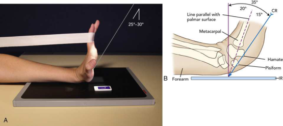

# Rx Carpal Canal — Tangential Incidență — Gaynor-Hart Method 28 (Merrill)

  📷 Radiografie Convențională (Rx)
  <strong>Actualizat:</strong> 2026-09-16
  <strong>Autor:</strong> Referință Merrill

---

-   __1. Rezumat Clinic & Indicații__

    ---

    === "Indicații Clinice"

        - Conform reperelor anatomice standard din tratat

    === "Ghid Național IRIS"

        !!! info "Referință Primară: Ghidul Național IRIS (Ordinul MS 1342/2012)"
            - **Capitol Ghid IRIS:** *Ghidul Național IRIS*
            - **Grad de Recomandare:** **De verificat pe indicație; fără grad atribuit automat**
            - **Nivel de Iradiere Estimată:** `De verificat pentru examinarea și populația selectate`

            [:octicons-search-16: Deschide Ghidul IRIS](../../iris.md){ .md-button .md-button--primary } [:material-open-in-new: Aplicația Oficială PWA](https://radiologie-pediatrica.ro/iris/){ .md-button target="_blank" rel="noopener" }
-   __2. Poziționare & Centrare Fascicul__

    ---

    - **Poziție Pacient:** se așază pacientul pe scaun la end de masa radiologică astfel încât Antebraț poate fie ajustat la lie paralel cu axa longitudinală de masa de examinare. When pacientul cannot assume sau maintain previously described Pumn (Articulație Radiocarpiană) poziție, similar imagine poate fie obtained. Se instruiește pacientul să dorsiflex Pumn (Articulație Radiocarpiană) ca much ca este tolerable și lean forward la place carpal canal tangent la receptorul de imagine (Fig. 5.102). canal este easily palpable pe palmar aspect de Pumn (Articulație Radiocarpiană) ca concavity între trapezium laterally și hook de hamate și pisiform medially.; Hyperextend Pumn (Articulație Radiocarpiană). se centrează receptorul de imagine la articulație la nivelul radial styloid process. pentru support, thin radiolucent pad poate fie plasat under lower Antebraț. se ajustează poziție de Mână la make its axa longitudinală ca vertical ca possible. la prevent superimposition de shadows de hamate și pisiform bones, se rotește Mână slightly spre radial side. Se instruiește pacientul să grasp falange cu opposite Mână sau use suitable device la hold Pumn (Articulație Radiocarpiană) în extins poziție (Fig. 5.100). se efectuează ecranarea gonadelor cu șorț plumbat. When dorsiflexion de Pumn (Articulație Radiocarpiană) este limited, Marshall 31 suСested placing a 45-grade angle sponge under palmar surface de Mână. sponge slightly elevates Pumn (Articulație Radiocarpiană) la place carpal canal tangent la raza centrală. slight grade de magnification exists because de increased object-la-receptorul de imagine distance (OID) (Fig. 5.103).
    - **Punct de Centrare Fascicul:** orientat la palm de Mână la point approximately 1 inch (2.5 cm) distal la base de third metacarpal și la un unghi de 25 la 30 grade la axa longitudinală de Mână When Pumn (Articulație Radiocarpiană) cannot fie extins la within 15 grade de vertical, Mcļuillen Martensen 30 suСested that raza centrală first fie aliniat paralel cu palmar surface, then înclinat additional 15 grade spre palm. tangențial pe carpal canal la nivelul midpoint de Pumn (Articulație Radiocarpiană)
    - **Distanță Focar-Film (DFF / SID):** Nespecificat în fragmentul extras; de verificat în sursă
    - **Comandă Respiratorie:** Conform reperelor anatomice standard din tratat

-   __3. Parametri Tehnici Expunere__

    ---

    | Parametru Tehnic | Valoare Configurare Generator / Tub |
    |:-----------------|:-------------------------------------|
    | **Tensiune Tub (kV)** | DE CONFIGURAT PE APARAT |
    | **Sarcină / Produs Curent-Timp (mAs)** | DE CONFIGURAT PE APARAT |
    | **Distanță Focar-Film (DFF / SID)** | Nespecificat în fragmentul extras; de verificat în sursă |
    | **Grilă Antidifuzoare (Bucky)** | DE CONFIGURAT PE APARAT |
    | **Dimensiune Focar** | DE CONFIGURAT PE APARAT |
    | **Camere de Ionizare AEC** | DE CONFIGURAT PE APARAT |
    | **Colimare Fascicul** | Adjust câmp de iradiere la 1 inch (2.5 cm) pe three sides de shadow de Pumn (Articulație Radiocarpiană). Se plasează markerul de lateralitate în câmpul colimat. Adjust câmp de iradiere la include palmar aspect de Pumn (Articulație Radiocarpiană), proximal one-third de oase metacarpiene, și 1 inch (2.5 cm) pe sides. Se plasează markerul de lateralitate în câmpul colimat. |
    | **Filtrare Tub** | DE CONFIGURAT PE APARAT |

-   __4. Criterii de Calitate & Reușită Imagine__

    ---

    - cu either approach, Criterii radiologice de calitate imaginii:
    - Colimare adecvată vizibilă și prezența markerului de lateralitate (D/S) plasat clear de anatomy de interest
    - oase carpiene în arch arrangement
    - Pisiform în profile și liber de superimposition
    - Hamulus de hamate
    - Bony detalii trabeculare osoase și surrounding soft tissues

-   __5. Protecție Radiologică (ALARA)__

    ---

    - Nespecificat în fragmentul extras; de verificat în sursă

!!! note "Observații Clinice & Tehnice"
    Conform reperelor anatomice standard din tratat

### 🖼️ Imagini

<figure class="protocol-image-card" markdown>

<figcaption><strong>Merrill — pagina PDF 314, imaginea 1</strong> — Imagine din fragmentul sursă; asocierea necesită revizie.</figcaption>

</figure>

=== "Ghid Rapid de Execuție"

    1. **Identificarea și verificarea pacientului:** verificare identitate, zonă de examinat, consimțământ conform procedurii și evaluarea posibilității unei sarcini, când este relevantă.
    2. **Pregătire:** îndepărtarea oricăror obiecte radiopace (bijuterii, agrafe, fermoare, proteze, pansamente dense).
    3. **Poziționare precisă:** alinierea receptorului de imagine și a tubului la distanța prescrisă (Nespecificat în fragmentul extras; de verificat în sursă).
    4. **Colimare strictă:** adaptarea fasciculului strict la regiunea de diagnostic pentru scăderea iradierii și reducerea radiației difuze.
    5. **Radioprotecție:** verificarea [politicii RX](../radioprotectie.md), cu măsuri distincte pentru pacient, personal și însoțitor.

## Surse de documentare

- [Merrill’s Atlas, 5. Upper Extremity, pagini PDF 313–314](../../assets/protocols/sources/a56d45c16829_Merrills_Atlas_of_Radiographic_Positioning__Procedures_3Vol_Set.pdf#page=313)

## Fragmente sursă traduse (referință tehnică)

### anatomy

This imagine de carpal canal (carpal tunnel) shows palmar aspect de trapezium; tubercle de trapezium; și scaphoid, capitate,
hook de hamate, triquetrum, și entire pisiform (Fig. 5.101).

### collimation

• Adjust câmp de iradiere la 1 inch (2.5 cm) pe three sides de shadow de wrist. Se plasează markerul de lateralitate în câmpul colimat.
• Adjust câmp de iradiere la include palmar aspect de wrist, proximal one-third de oase metacarpiene, și 1 inch (2.5 cm) pe sides. Place side
marker în collimated expunere field.

### cr

• orientat la palm de mână la point approximately 1 inch (2.5 cm) distal la base de third metacarpal și la un unghi de 25
la 30 grade la axa longitudinală de mână
• When wrist cannot fie extins la within 15 grade de vertical, Mcļuillen Martensen 30 suСested that raza centrală first fie aliniat
paralel cu palmar surface, then înclinat additional 15 grade spre palm.
• tangențial pe carpal canal la nivelul midpoint de wrist

### criteria

cu either approach, Criterii radiologice de calitate imaginii:
• Colimare adecvată vizibilă și prezența markerului de lateralitate (D/S) plasat clear de anatomy de interest
• oase carpiene în arch arrangement
• Pisiform în profile și liber de superimposition
• Hamulus de hamate
• Bony detalii trabeculare osoase și surrounding soft tissues

### part_pos

• Hyperextend wrist. se centrează receptorul de imagine la articulație la nivelul radial styloid process.
• pentru support, thin radiolucent pad poate fie plasat under lower forearm.
• se ajustează poziție de mână la make its axa longitudinală ca vertical ca possible.
• la prevent superimposition de shadows de hamate și pisiform bones, se rotește mână slightly spre radial side.
• Se instruiește pacientul să grasp falange cu opposite mână sau use suitable device la hold wrist în extins poziție (Fig. 5.100).
• se efectuează ecranarea gonadelor cu șorț plumbat.
• When dorsiflexion de wrist este limited, Marshall 31 suСested placing a 45-grade angle sponge under palmar surface de mână.
sponge slightly elevates wrist la place carpal canal tangent la raza centrală. slight grade de magnification exists because de
increased object-la-receptorul de imagine distance (OID) (Fig. 5.103).

### patient_pos

• se așază pacientul pe scaun la end de masa radiologică astfel încât forearm poate fie ajustat la lie paralel cu axa longitudinală de masa de examinare.
• When pacientul cannot assume sau maintain previously described wrist poziție, similar imagine poate fie obtained.
• Se instruiește pacientul să dorsiflex wrist ca much ca este tolerable și lean forward la place carpal canal tangent la receptorul de imagine (Fig. 5.102). canal este easily palpable pe palmar aspect de wrist ca concavity între trapezium laterally și hook de hamate și
pisiform medially.

### tech

poziționat prin manufacturer sau department protocol pentru corect anatomy display orientation; raza centrală plate: 10 × 12 inches (24 × 30 cm) longitudinal.
Inferosuperior

