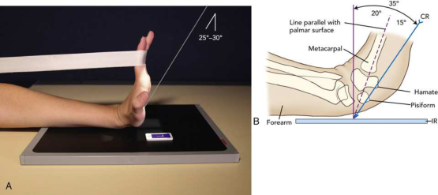

# Rx canal carpian — incidență tangențială — metoda Gaynor-Hart 28 (Merrill)

  📷 Radiografie Convențională (Rx)
  <strong>Actualizat:</strong> 2026-09-16
  <strong>Autor:</strong> Referință Merrill

---

-   __1. Rezumat Clinic & Indicații__

    ---

    === "Indicații Clinice"

        - Conform reperelor anatomice standard din tratat

    === "Ghid Național IRIS"

        !!! info "Referință Primară: Ghidul Național IRIS (Ordinul MS 1342/2012)"
            - **Capitol Ghid IRIS:** *Aparat locomotor & Membru superior*
            - **Grad de Recomandare:** **Grad A**
            - **Nivel de Iradiere Estimată:** `Clasa 1 (Minimă < 0.01 mSv)`

            [:octicons-search-16: Deschide Ghidul IRIS](../../iris.md){ .md-button .md-button--primary } [:material-open-in-new: Aplicația Oficială PWA](https://radiologie-pediatrica.ro/iris/){ .md-button target="_blank" rel="noopener" }

-   __2. Poziționare & Centrare Fascicul__

    ---

    - **Poziție Pacient:** Așezați pacientul pe scaun la capătul mesei radiologice, astfel încât antebrațul să poată fi ajustat pentru a sta paralel cu axa longitudinală a mesei de examinare. Când pacientul nu poate adopta sau menține poziția pumnului descrisă anterior, se poate obține o imagine similară. Instruiți pacientul să dorsiflecteze pumnul cât de mult este tolerabil și să se aplece înainte pentru a plasa canalul carpian tangent pe receptorul de imagine (Fig. 5.102). Canalul este ușor palpabil pe aspectul palmar al pumnului, ca o concavitate între trapez, lateral, și cârligul osului hamat și pisiform, medial. Hiperextindeți pumnul. Centrați receptorul de imagine la articulație, la nivelul procesului stiloid radial. Pentru susținere, se poate plasa un suport subțire radiotransparent sub antebrațul distal. Ajustați poziția mâinii pentru ca axa sa longitudinală să fie cât mai verticală posibil. Pentru a preveni suprapunerea umbrelor oaselor hamat și pisiform, rotiți ușor mâna spre partea radială. Instruiți pacientul să prindă falangele cu mâna opusă sau să utilizeze un dispozitiv adecvat pentru a menține pumnul în poziție extinsă (Fig. 5.100). Se efectuează ecranarea gonadelor cu șorț plumbat. Când dorsiflexia pumnului este limitată, Marshall 31 a sugerat plasarea unui burete în unghi de 45 grade sub suprafața palmară a mâinii. Buretele ridică ușor pumnul pentru a plasa canalul carpian tangent față de raza centrală. Există un grad ușor de mărire din cauza distanței crescute obiect–receptor de imagine (OID) (Fig. 5.103).
    - **Punct de Centrare Fascicul:** orientată spre palma mâinii, într-un punct situat la aproximativ 1 țol (2.5 cm) distal față de baza celui de-al treilea metacarpian și la un unghi de 25 la 30 grade față de axa longitudinală a mâinii. Când pumnul nu poate fi extins până la 15 grade față de verticală, McClüillen Martensen 30 a sugerat ca raza centrală să fie mai întâi aliniată paralel cu suprafața palmară, apoi înclinată cu încă 15 grade spre palmă. tangențial pe canalul carpian la nivelul punctului median al pumnului
    - **Distanță Focar-Film (DFF / SID):** Nespecificat în fragmentul extras; de verificat în sursă
    - **Comandă Respiratorie:** Conform reperelor anatomice standard din tratat

-   __3. Parametri Tehnici Expunere__

    ---

    | Parametru Tehnic | Valoare Configurare Generator / Tub |
    |:-----------------|:-------------------------------------|
    | **Tensiune Tub (kV)** | DE CONFIGURAT PE APARAT |
    | **Sarcină / Produs Curent-Timp (mAs)** | DE CONFIGURAT PE APARAT |
    | **Distanță Focar-Film (DFF / SID)** | Nespecificat în fragmentul extras; de verificat în sursă |
    | **Grilă Antidifuzoare (Bucky)** | DE CONFIGURAT PE APARAT |
    | **Dimensiune Focar** | DE CONFIGURAT PE APARAT |
    | **Camere de Ionizare AEC** | DE CONFIGURAT PE APARAT |
    | **Colimare Fascicul** | Ajustați câmpul de iradiere la 1 țol (2.5 cm) pe cele trei laturi ale umbrei pumnului. Se plasează markerul de lateralitate în câmpul colimat. Ajustați câmpul de iradiere pentru a include aspectul palmar al pumnului, treimea proximală a oaselor metacarpiene și 1 țol (2.5 cm) pe laturi. Se plasează markerul de lateralitate în câmpul colimat. |
    | **Filtrare Tub** | DE CONFIGURAT PE APARAT |

-   __4. Criterii de Calitate & Reușită Imagine__

    ---

    - cu oricare dintre cele două abordări, criterii radiologice de calitate a imaginii:
    - Colimare adecvată vizibilă și prezența markerului de lateralitate (D/S) plasat în afara structurilor anatomice de interes
    - oasele carpiene dispuse în arc
    - Pisiformul în profil și liber de suprapunere
    - Hamulusul osului hamat
    - Detalii trabeculare osoase și țesuturile moi înconjurătoare

-   __5. Protecție Radiologică (ALARA)__

    ---

    - Nespecificat în fragmentul extras; de verificat în sursă

!!! note "Observații Clinice & Tehnice"
    Conform reperelor anatomice standard din tratat

### 🖼️ Imagini

<figure class="protocol-image-card" markdown>

<figcaption><strong>Merrill — pagina 314, imaginea 1</strong> — Imagine din fragmentul sursă; asocierea necesită revizie.</figcaption>

</figure>

=== "Ghid Rapid de Execuție"

    1. **Identificarea și verificarea pacientului:** verificare identitate, zonă de examinat, consimțământ conform procedurii și evaluarea posibilității unei sarcini, când este relevantă.
    2. **Pregătire:** îndepărtarea oricăror obiecte radiopace (bijuterii, agrafe, fermoare, proteze, pansamente dense).
    3. **Poziționare precisă:** alinierea receptorului de imagine și a tubului la distanța prescrisă (Nespecificat în fragmentul extras; de verificat în sursă).
    4. **Colimare strictă:** adaptarea fasciculului strict la regiunea de diagnostic pentru scăderea iradierii și reducerea radiației difuze.
    5. **Radioprotecție:** verificarea [politicii RX](../radioprotectie.md), cu măsuri distincte pentru pacient, personal și însoțitor.

## Surse de documentare

- [Merrill’s Atlas, 5. Upper Extremity, pagini 313–314](https://books.google.com/books/about/Merrill_s_Atlas_of_Radiographic_Position.html?id=BM0lEQAAQBAJ)
