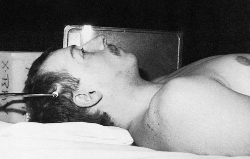
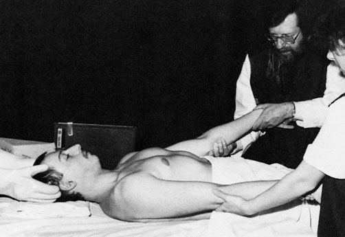
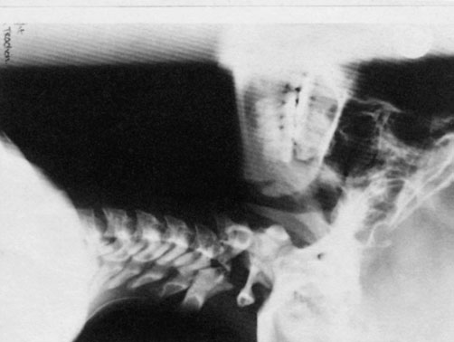
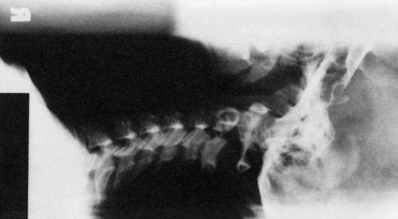

# Rx Cervical spine Profil (Lateral) Decubit Dorsal

  📷 Radiografie Convențională (Rx)
  <strong>Actualizat:</strong> 2026-09-16
  <strong>Autor:</strong> Departamentul de Radiologie / Referință Clark (Ed. 12)

---

-   __1. Rezumat Clinic & Indicații__

    ---

    === "Indicații Clinice"

        - 361 12 Cervical coloană vertebrală pacient cu spinal suspiciune de fractură luxație articulară este commonly nursed cu Craniu traction și weights. This este applied prin means de Craniu calliper secured la outer table de parietal regions de Craniu. Necessary weights în early stages de traction poate fie more than those that sunt required la maintain realignment de vertebre. Traction este continued until there este consolidation. Profil (lateral) incidențe de Coloană Cervicală, over several weeks, sunt necessary la assess effectiveness de traction și evidențiază alignment de vertebre în relation la spinal cord. fiecare radiografie este marked cu weight de applied traction. Profil (lateral) Decubit dorsal

    === "Ghid Național IRIS"

        !!! info "Referință Primară: Ghidul Național IRIS (Ordinul MS 1342/2012)"
            - **Capitol Ghid IRIS:** *Ghidul Național IRIS*
            - **Grad de Recomandare:** **De verificat pe indicație; fără grad atribuit automat**
            - **Nivel de Iradiere Estimată:** `De verificat pentru examinarea și populația selectate`

            [:octicons-search-16: Deschide Ghidul IRIS](../../iris.md){ .md-button .md-button--primary } [:material-open-in-new: Aplicația Oficială PWA](https://radiologie-pediatrica.ro/iris/){ .md-button target="_blank" rel="noopener" }
-   __2. Poziționare & Centrare Fascicul__

    ---

    - **Poziție Pacient:** • mobile set este poziționat so ca la enable Fascicul Orizontal radiografie.
• cu pacientul în Decubit dorsal poziție, a 24  30 sau 18  24-cm casetă este sprijinit vertically against either Umăr, paralel cu Coloană Cervicală și centred la nivelul prominence de cartilaj tiroid (mărul lui Adam).
• caseta este secured în poziție using holder sau săculeți cu nisip.
• pacientul’s umeri trebuie să fie coborât prin supervising doctor gripping pacientul’s wrists și pulling brațele caudally.
    - **Punct de Centrare Fascicul:** • raza centrală orizontală centrală este orientat la point vertically below prominence de cartilaj tiroid (mărul lui Adam) la nivelul proces mastoidian through fourth cervical vertebra.
    - **Distanță Focar-Film (DFF / SID):** 100 cm
    - **Comandă Respiratorie:** Apnee pe durata expunerii (apnee în inspir pentru torace; expir pentru Abdomen/bazin).

-   __3. Parametri Tehnici Expunere__

    ---

    | Parametru Tehnic | Valoare Configurare Generator / Tub |
    |:-----------------|:-------------------------------------|
    | **Tensiune Tub (kV)** | DE CONFIGURAT PE APARAT |
    | **Sarcină / Produs Curent-Timp (mAs)** | Conform AEC / grosime anatomică |
    | **Distanță Focar-Film (DFF / SID)** | 100 cm |
    | **Grilă Antidifuzoare (Bucky)** | Conform grosimii anatomice (> 10-12 cm cu grilă) |
    | **Dimensiune Focar** | Focar Mic (0.6 mm) |
    | **Camere de Ionizare AEC** | DE CONFIGURAT PE APARAT |
    | **Colimare Fascicul** | Colimare strictă adaptată pe receptor 18 x 24 cm |
    | **Filtrare Tub** | Totală ≥ 2.5 mm Al echivalent (conform Clark: 3.0 mm Al eq.) |

-   __4. Criterii de Calitate & Reușită Imagine__

    ---

    - Vizualizarea clară întregii arii anatomice (Cervical coloană vertebrală).
    - Absența artefactelor de mișcare; trabeculație osoasă și contururi nete.
    - Densitate optică și contrast adecvate pentru diferențierea țesuturilor moi de structurile osoase.

-   __5. Protecție Radiologică (ALARA)__

    ---

    - A mobile radiation protection barrier should be positioned behind the cassette to confine the primary radiation field.
    - The person applying the traction must be medically supervised and wear a radiation protective lead-rubber apron and lead-rubber gloves. 1 day on traction 30 days on traction
    - Ecranare gonadică cu șorț plumbat dacă gonadele sunt în apropierea fasciculului util (regula ALARA).
    - Colimare precisă la dimensiunea anatomică strict necesară pentru reducerea dozei și a radiației difuze.
    - Verificarea posibilității unei sarcini la pacientele de vârstă fertilă înainte de expunere.

!!! note "Observații Clinice & Tehnice"
    în radiografii opposite, part de Craniu has been included pe film radiologic la show where Craniu calliper este secured la parietal regions.

### 🖼️ Imagini

<figure class="protocol-image-card" markdown>

<figcaption><strong>pacient cu spinal suspiciune de fractură luxație articulară este commonly nursed</strong> — Poziționare pacient și centrare fascicul conform Clark (Ed. 12)</figcaption>

</figure>

<figure class="protocol-image-card" markdown>

<figcaption><strong>fiecare radiografie este marked cu weight de applied traction.</strong> — Aspect radiografic / ghid de poziționare conform tratatului Clark (Ed. 12)</figcaption>

</figure>

<figure class="protocol-image-card" markdown>

<figcaption><strong>în radiografii opposite, part de Craniu has been included</strong> — Aspect radiografic / ghid de poziționare conform tratatului Clark (Ed. 12)</figcaption>

</figure>

<figure class="protocol-image-card" markdown>

<figcaption><strong>Figura 4: Aspect radiografic / Poziționare (Clark Ed. 12)</strong> — Aspect radiografic / ghid de poziționare conform tratatului Clark (Ed. 12)</figcaption>

</figure>

=== "Ghid Rapid de Execuție"

    1. **Identificarea și verificarea pacientului:** verificare identitate, zonă de examinat, consimțământ conform procedurii și evaluarea posibilității unei sarcini, când este relevantă.
    2. **Pregătire:** îndepărtarea oricăror obiecte radiopace (bijuterii, agrafe, fermoare, proteze, pansamente dense).
    3. **Poziționare precisă:** alinierea receptorului de imagine și a tubului la distanța prescrisă (100 cm).
    4. **Colimare strictă:** adaptarea fasciculului strict la regiunea de diagnostic pentru scăderea iradierii și reducerea radiației difuze.
    5. **Radioprotecție:** verificarea [politicii RX](../radioprotectie.md), cu măsuri distincte pentru pacient, personal și însoțitor.

## Surse de documentare

- [Clark's Positioning in Radiography (Ed. 12), Pagina 376](../../assets/protocols/sources/Clark___Positioning_in_Radiography__12th_edition.pdf#page=376)
