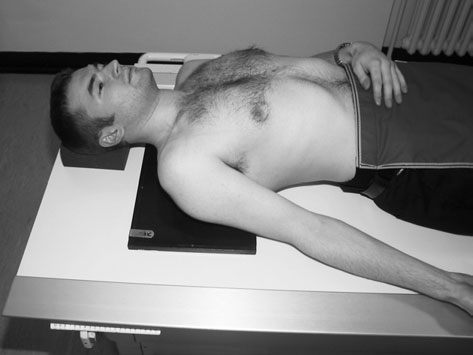
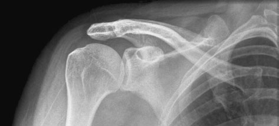
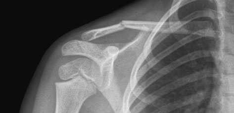
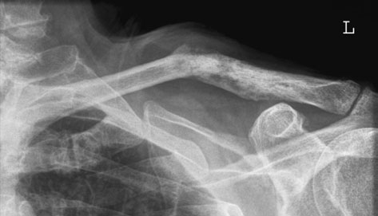
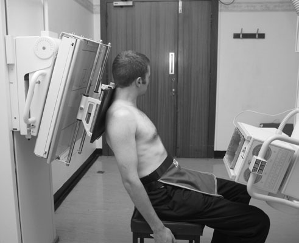
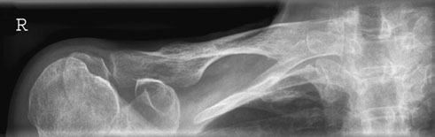
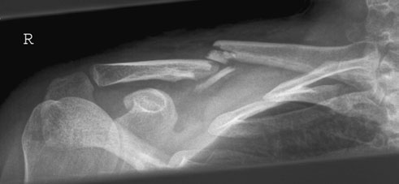

# Rx Claviculă Antero-Posterior (AP) - Decubit Dorsal (alternate)

  📷 Radiografie Convențională (Rx)
  <strong>Actualizat:</strong> 2026-09-16
  <strong>Autor:</strong> Departamentul de Radiologie / Referință Clark (Ed. 12)

---

-   __1. Rezumat Clinic & Indicații__

    ---

    === "Indicații Clinice"

        - If suspiciune de fractură occurs together cu suspiciune de fractură de upper Coaste (Grilaj Costal), then this implies severe injury și poate fie associated cu subclavian vessel damage sau pneumotorax. Infero-Superioară (Axială) radiografie de Claviculă evidențiind suspiciune de fractură Ortostatism Infero-Superioară (Axială) radiografie de Claviculă

    === "Ghid Național IRIS"

        !!! info "Referință Primară: Ghidul Național IRIS (Ordinul MS 1342/2012)"
            - **Capitol Ghid IRIS:** *Ghidul Național IRIS*
            - **Grad de Recomandare:** **De verificat pe indicație; fără grad atribuit automat**
            - **Nivel de Iradiere Estimată:** `De verificat pentru examinarea și populația selectate`

            [:octicons-search-16: Deschide Ghidul IRIS](../../iris.md){ .md-button .md-button--primary } [:material-open-in-new: Aplicația Oficială PWA](https://radiologie-pediatrica.ro/iris/){ .md-button target="_blank" rel="noopener" }
-   __2. Poziționare & Centrare Fascicul__

    ---

    - **Poziție Pacient:** • pacientul este Decubit dorsal pe masa radiologică.
• small săculeți cu nisip este plasat under opposite Umăr la se rotește pacient slightly spre partea afectată la make sure that medial end de Claviculă este nu superimposed pe Coloană Vertebrală.
• braț de side being examined este în relaxat poziție prin side de trunk.
• A 24  30-cm casetă este plasat transversely behind pacientul’s Umăr și ajustat astfel încât Claviculă este în middle.

• pacientul stă așezat facing X-ray tube cu a 24  30-cm casetă plasat în caseta holder. Some holders allow forward-angulation de caseta de 15 grade spre Umăr. This reduces distortion caused prin cranially projected central fascicul.
• unaffected Umăr este raised slightly la bring Omoplat (Scapulă) în contact cu caseta.
• pacientul’s cap este turned away de la partea afectată.
• caseta este displaced above Umăr la allow Claviculă la fie projected into middle de imagine.
    - **Punct de Centrare Fascicul:** • raza centrală verticală centrală este orientat la middle de Claviculă.

• raza centrală este înclinat 30 grade cranially și centred la centre de Claviculă.
• 30 grade needed la separate Claviculă de la underlying Coaste (Grilaj Costal) poate fie achieved prin combination de pacient positioning și raza centrală angulation.
• medial end de Claviculă poate fie vizualizat în greater detail prin adding a 15-grade Profil (lateral) angulation la fascicul.
    - **Distanță Focar-Film (DFF / SID):** 100 cm
    - **Comandă Respiratorie:** Apnee pe durata expunerii (apnee în inspir pentru torace; expir pentru Abdomen/bazin).

-   __3. Parametri Tehnici Expunere__

    ---

    | Parametru Tehnic | Valoare Configurare Generator / Tub |
    |:-----------------|:-------------------------------------|
    | **Tensiune Tub (kV)** | DE CONFIGURAT PE APARAT |
    | **Sarcină / Produs Curent-Timp (mAs)** | Conform AEC / grosime anatomică |
    | **Distanță Focar-Film (DFF / SID)** | 100 cm |
    | **Grilă Antidifuzoare (Bucky)** | Conform grosimii anatomice (> 10-12 cm cu grilă) |
    | **Dimensiune Focar** | Focar Mic (0.6 mm) |
    | **Camere de Ionizare AEC** | DE CONFIGURAT PE APARAT |
    | **Colimare Fascicul** | Colimare strictă adaptată pe receptor 24 x 30 cm |
    | **Filtrare Tub** | Totală ≥ 2.5 mm Al echivalent (conform Clark: 3.0 mm Al eq.) |

-   __4. Criterii de Calitate & Reușită Imagine__

    ---

    - entire length de Claviculă trebuie să fie included pe imagine.
    - Profil (lateral) end de Claviculă will fie evidențiat clear de thoracic cage.
    - There trebuie să fie fără foreshortening de Claviculă.
    - expunere trebuie să evidențiază ambele medial și Profil (lateral) ends de Claviculă. 96 Normal Antero-posterior (AP) Decubit dorsal radiografie de Claviculă Antero-posterior (AP) Decubit dorsal radiografie de Claviculă evidențiind suspiciune de fractură Antero-posterior (AP) Decubit dorsal radiografie de Claviculă evidențiind pathological suspiciune de fractură through sclerotic metastasis
    - imagine trebuie să evidențiază entire length de Claviculă, including sternoclavicular și Articulații Acromioclaviculare.
    - entire length de Claviculă, cu exception de medial end, trebuie să fie projected clear de thoracic cage.
    - Claviculă trebuie să fie orizontal.

-   __5. Protecție Radiologică (ALARA)__

    ---

    - Ecranare gonadică cu șorț plumbat dacă gonadele sunt în apropierea fasciculului util (regula ALARA).
    - Colimare precisă la dimensiunea anatomică strict necesară pentru reducerea dozei și a radiației difuze.
    - Verificarea posibilității unei sarcini la pacientele de vârstă fertilă înainte de expunere.

!!! note "Observații Clinice & Tehnice"
    Pregătirea pacientului prin îndepărtarea tuturor accesoriilor radio-opace.

### 🖼️ Imagini

<figure class="protocol-image-card" markdown>

<figcaption><strong>Normal Antero-posterior (AP) Decubit dorsal radiografie de Claviculă</strong> — Poziționare pacient și centrare fascicul conform Clark (Ed. 12)</figcaption>

</figure>

<figure class="protocol-image-card" markdown>

<figcaption><strong>Antero-posterior (AP) Decubit dorsal radiografie de Claviculă evidențiind suspiciune de fractură</strong> — Aspect radiografic / ghid de poziționare conform tratatului Clark (Ed. 12)</figcaption>

</figure>

<figure class="protocol-image-card" markdown>

<figcaption><strong>Antero-posterior (AP) Decubit dorsal radiografie de Claviculă evidențiind pathological suspiciune de fractură</strong> — Aspect radiografic / ghid de poziționare conform tratatului Clark (Ed. 12)</figcaption>

</figure>

<figure class="protocol-image-card" markdown>

<figcaption><strong>Figura 4: Aspect radiografic / Poziționare (Clark Ed. 12)</strong> — Aspect radiografic / ghid de poziționare conform tratatului Clark (Ed. 12)</figcaption>

</figure>

<figure class="protocol-image-card" markdown>

<figcaption><strong>assess grade de orice suspiciune de fractură displacement și la show the</strong> — Aspect radiografic / ghid de poziționare conform tratatului Clark (Ed. 12)</figcaption>

</figure>

<figure class="protocol-image-card" markdown>

<figcaption><strong>• If suspiciune de fractură occurs together cu suspiciune de fractură de upper Coaste (Grilaj Costal),</strong> — Aspect radiografic / ghid de poziționare conform tratatului Clark (Ed. 12)</figcaption>

</figure>

<figure class="protocol-image-card" markdown>

<figcaption><strong>subclavian vessel damage sau pneumotorax.</strong> — Aspect radiografic / ghid de poziționare conform tratatului Clark (Ed. 12)</figcaption>

</figure>

=== "Ghid Rapid de Execuție"

    1. **Identificarea și verificarea pacientului:** verificare identitate, zonă de examinat, consimțământ conform procedurii și evaluarea posibilității unei sarcini, când este relevantă.
    2. **Pregătire:** îndepărtarea oricăror obiecte radiopace (bijuterii, agrafe, fermoare, proteze, pansamente dense).
    3. **Poziționare precisă:** alinierea receptorului de imagine și a tubului la distanța prescrisă (100 cm).
    4. **Colimare strictă:** adaptarea fasciculului strict la regiunea de diagnostic pentru scăderea iradierii și reducerea radiației difuze.
    5. **Radioprotecție:** verificarea [politicii RX](../radioprotectie.md), cu măsuri distincte pentru pacient, personal și însoțitor.

## Surse de documentare

- [Clark's Positioning in Radiography (Ed. 12), Pagina 111](../../assets/protocols/sources/Clark___Positioning_in_Radiography__12th_edition.pdf#page=111)
