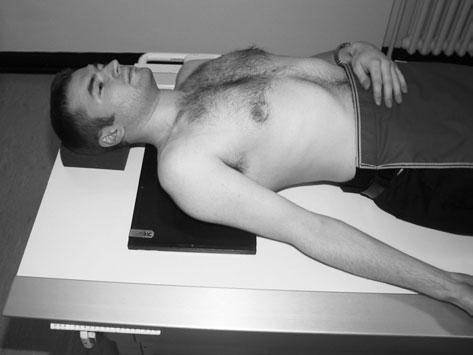
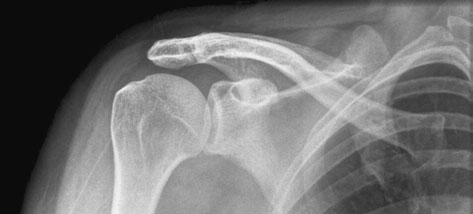
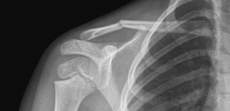
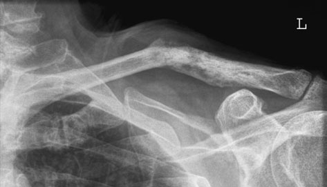
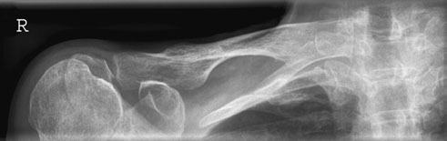
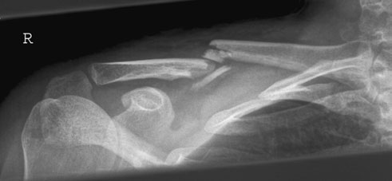

# Rx claviculă antero-posterior (AP) – decubit dorsal (alternativ)

  📷 Radiografie Convențională (Rx)
  <strong>Actualizat:</strong> 2026-09-16
  <strong>Autor:</strong> Departamentul de Radiologie / Referință Clark (Ed. 12)

---

-   __1. Rezumat Clinic & Indicații__

    ---

    === "Indicații Clinice"

        - Dacă suspiciunea de fractură apare împreună cu suspiciunea de fractură a coastelor superioare (grilajului costal), aceasta indică o leziune severă și poate fi asociată cu lezarea vaselor subclaviculare sau cu pneumotorax. Radiografie infero-superioară (axială) a claviculei evidențiind suspiciune de fractură. Radiografie infero-superioară (axială) a claviculei în ortostatism.

    === "Ghid Național IRIS"

        !!! info "Referință Primară: Ghidul Național IRIS (Ordinul MS 1342/2012)"
            - **Capitol Ghid IRIS:** *Aparat locomotor & Membru superior*
            - **Grad de Recomandare:** **Grad A**
            - **Nivel de Iradiere Estimată:** `Clasa 1 (Minimă < 0.05 mSv)`

            [:octicons-search-16: Deschide Ghidul IRIS](../../iris.md){ .md-button .md-button--primary } [:material-open-in-new: Aplicația Oficială PWA](https://radiologie-pediatrica.ro/iris/){ .md-button target="_blank" rel="noopener" }

-   __2. Poziționare & Centrare Fascicul__

    ---

    - **Poziție Pacient:**
        - pacientul este în decubit dorsal pe masa radiologică.
        - Un săculeț mic cu nisip este plasat sub umărul opus pentru a roti ușor pacientul spre partea afectată, astfel încât extremitatea medială a claviculei să nu fie suprapusă peste coloana vertebrală.
        - Brațul de partea examinată este relaxat, în poziție laterală pe lângă trunchi.
        - O casetă de 24 × 30 cm este plasată transversal în spatele umărului pacientului și ajustată astfel încât clavicula să fie în centru.
        - pacientul stă așezat, cu fața spre tubul radiogen, cu o casetă de 24 × 30 cm plasată în suportul pentru casetă. Unele suporturi permit angularea anterioară a casetei cu 15 grade spre umăr. Aceasta reduce distorsiunea cauzată de fasciculul central proiectat cranial.
        - Umărul neafectat este ridicat ușor pentru a aduce omoplatul (scapula) în contact cu caseta.
        - Capul pacientului este întors în partea opusă celei afectate.
        - Caseta este deplasată deasupra umărului pentru a permite proiectarea claviculei în centrul imaginii.
    - **Punct de Centrare Fascicul:**
        - raza centrală verticală este orientată la nivelul mijlocului claviculei.
        - raza centrală este înclinată cu 30 grade cranial și centrată la mijlocul claviculei.
        - Unghiul de 30 grade necesar pentru separarea claviculei de coastele subiacente (grilajul costal) poate fi obținut prin combinarea poziționării pacientului cu angularea razei centrale.
        - Extremitatea medială a claviculei poate fi vizualizată mai detaliat prin adăugarea unei angulări de profil de 15 grade a fasciculului.
    - **Distanță Focar-Film (DFF / SID):** 100 cm
    - **Comandă Respiratorie:** Apnee pe durata expunerii (apnee în inspir pentru torace; expir pentru Abdomen/bazin).

-   __3. Parametri Tehnici Expunere__

    ---

    | Parametru Tehnic | Valoare Configurare Generator / Tub |
    |:-----------------|:-------------------------------------|
    | **Tensiune Tub (kV)** | DE CONFIGURAT PE APARAT |
    | **Sarcină / Produs Curent-Timp (mAs)** | Conform AEC / grosimii anatomice |
    | **Distanță Focar-Film (DFF / SID)** | 100 cm |
    | **Grilă Antidifuzoare (Bucky)** | Conform grosimii anatomice (> 10-12 cm cu grilă) |
    | **Dimensiune Focar** | Focar Mic (0.6 mm) |
    | **Camere de Ionizare AEC** | DE CONFIGURAT PE APARAT |
    | **Colimare Fascicul** | Colimare strictă adaptată pe receptor 24 x 30 cm |
    | **Filtrare Tub** | Totală ≥ 2.5 mm Al echivalent (conform Clark: 3.0 mm Al echivalent) |

-   __4. Criterii de Calitate & Reușită Imagine__

    ---

    - Întreaga lungime a claviculei trebuie inclusă în imagine.
    - Extremitatea de profil a claviculei trebuie evidențiată clar de cutia toracică.
    - Nu trebuie să existe scurtarea claviculei.
    - Expunerea trebuie să evidențieze ambele extremități, medială și de profil, ale claviculei. 96 Radiografie antero-posterioară (AP) normală, în decubit dorsal, a claviculei. Radiografie antero-posterioară (AP), în decubit dorsal, a claviculei, evidențiind suspiciune de fractură. Radiografie antero-posterioară (AP), în decubit dorsal, a claviculei, evidențiind suspiciune de fractură patologică prin metastază sclerotică.
    - Imaginea trebuie să evidențieze întreaga lungime a claviculei, inclusiv articulațiile sternoclaviculare și acromioclaviculare.
    - Întreaga lungime a claviculei, cu excepția extremității mediale, trebuie proiectată clar deasupra cutiei toracice.
    - Clavicula trebuie să fie orizontală.

-   __5. Protecție Radiologică (ALARA)__

    ---

    - Ecranare gonadică cu șorț plumbat dacă gonadele sunt în apropierea fasciculului util (regula ALARA).
    - Colimare precisă la dimensiunea anatomică strict necesară pentru reducerea dozei și a radiației difuze.
    - Verificarea posibilității unei sarcini la pacientele de vârstă fertilă înainte de expunere.

!!! note "Observații Clinice & Tehnice"
    Pregătirea pacientului prin îndepărtarea tuturor accesoriilor radio-opace.

### 🖼️ Imagini

<figure class="protocol-image-card" markdown>

<figcaption><strong>Radiografie antero-posterioară (AP) normală, în decubit dorsal, a claviculei</strong> — Poziționarea pacientului și centrarea fasciculului conform Clark (Ed. 12)</figcaption>

</figure>

<figure class="protocol-image-card" markdown>

<figcaption><strong>Radiografie antero-posterioară (AP), în decubit dorsal, a claviculei, evidențiind suspiciune de fractură</strong> — Aspect radiografic / ghid de poziționare conform tratatului Clark (Ed. 12)</figcaption>

</figure>

<figure class="protocol-image-card" markdown>

<figcaption><strong>Radiografie antero-posterioară (AP), în decubit dorsal, a claviculei, evidențiind suspiciune de fractură patologică</strong> — Aspect radiografic / ghid de poziționare conform tratatului Clark (Ed. 12)</figcaption>

</figure>

<figure class="protocol-image-card" markdown>

<figcaption><strong>Figura 4: Aspect radiografic / Poziționare (Clark Ed. 12)</strong> — Aspect radiografic / ghid de poziționare conform tratatului Clark (Ed. 12)</figcaption>

</figure>

<figure class="protocol-image-card" markdown>

![evaluarea gradului oricărei deplasări asociate suspiciunii de fractură și demonstrarea [fragment deteriorat în sursă]](../../assets/images/protocols/clark/rx-clavicula-antero-posterior-decubit-dorsal-alternate-p111-clark/fig_5.jpeg)

<figcaption><strong>evaluarea gradului oricărei deplasări asociate suspiciunii de fractură și demonstrarea [fragment deteriorat în sursă]</strong> — Aspect radiografic / ghid de poziționare conform tratatului Clark (Ed. 12)</figcaption>

</figure>

<figure class="protocol-image-card" markdown>

<figcaption><strong>• Dacă suspiciunea de fractură apare împreună cu suspiciunea de fractură a coastelor superioare (grilajului costal),</strong> — Aspect radiografic / ghid de poziționare conform tratatului Clark (Ed. 12)</figcaption>

</figure>

<figure class="protocol-image-card" markdown>

<figcaption><strong>lezarea vaselor subclaviculare sau pneumotorax.</strong> — Aspect radiografic / ghid de poziționare conform tratatului Clark (Ed. 12)</figcaption>

</figure>

=== "Ghid Rapid de Execuție"

    1. **Identificarea și verificarea pacientului:** verificare identitate, zonă de examinat, consimțământ conform procedurii și evaluarea posibilității unei sarcini, când este relevantă.
    2. **Pregătire:** îndepărtarea oricăror obiecte radiopace (bijuterii, agrafe, fermoare, proteze, pansamente dense).
    3. **Poziționare precisă:** alinierea receptorului de imagine și a tubului la distanța prescrisă (100 cm).
    4. **Colimare strictă:** adaptarea fasciculului strict la regiunea de diagnostic pentru scăderea iradierii și reducerea radiației difuze.
    5. **Radioprotecție:** verificarea [politicii RX](../radioprotectie.md), cu măsuri distincte pentru pacient, personal și însoțitor.

## Surse de documentare

- [Clark's Positioning in Radiography (Ed. 12), Pagina 111](https://books.google.com/books/about/Clark_s_Positioning_in_Radiography.html?id=Xxu6MwEACAAJ)
