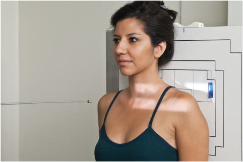
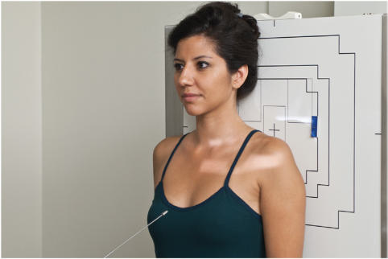
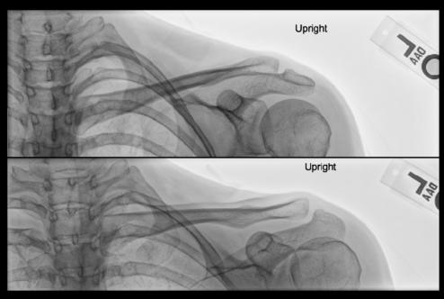

# Rx Claviculă AP AND AP AXIAL PROJECTIONS

  📷 Radiografie Convențională (Rx)
  <strong>Actualizat:</strong> 2026-09-15
  <strong>Autor:</strong> Departamentul de Radiologie / Referință Bontrager

---

-   __1. Rezumat Clinic & Indicații__

    ---

    === "Indicații Clinice"

        - suspiciune de fractură or luxație / subluxație articulară of Claviculă
        - Departmental routines commonly include both AP and AP axial projections

    === "Ghid Național IRIS"

        !!! info "Referință Primară: Ghidul Național IRIS (Ordinul MS 1342/2012)"
            - **Capitol Ghid IRIS:** *Ghidul Național IRIS*
            - **Grad de Recomandare:** **De verificat pe indicație; fără grad atribuit automat**
            - **Nivel de Iradiere Estimată:** `De verificat pentru examinarea și populația selectate`

            [:octicons-search-16: Deschide Ghidul IRIS](../../iris.md){ .md-button .md-button--primary } [:material-open-in-new: Aplicația Oficială PWA](https://radiologie-pediatrica.ro/iris/){ .md-button target="_blank" rel="noopener" }
-   __2. Poziționare & Centrare Fascicul__

    ---

    - **Poziție Pacient:** Pacient: Perform radiograph with patient in Ortostatism or Decubit Dorsal position with arms at sides, chin raised, and looking straight ahead. Posterior Umăr should be in contact with IR or tabletop, without rotation of body (Fig. 5.88).; Regiune anatomică: Center Claviculă and IR to CR. (Claviculă can be readily palpated with medial aspect at incizura jugulară (manubriul sternal) and lateral portion at AC joint above Umăr.)
    - **Punct de Centrare Fascicul:** 15° to 30° cephalad to midclavicle (Fig. 5.89) (see NOTE)
    - **Distanță Focar-Film (DFF / SID):** 100 cm
    - **Comandă Respiratorie:** Suspend respiration at end of inhalation (helps to elevate clavicles). Alternative PA Radiograph also may be taken as Incidență Postero-Anterioară (PA) or PA axial with 15° to 30° caudal angle.

-   __3. Parametri Tehnici Expunere__

    ---

    | Parametru Tehnic | Valoare Configurare Generator / Tub |
    |:-----------------|:-------------------------------------|
    | **Tensiune Tub (kV)** | 70-85 kV |
    | **Sarcină / Produs Curent-Timp (mAs)** | DE CONFIGURAT PE APARAT |
    | **Distanță Focar-Film (DFF / SID)** | 100 cm |
    | **Grilă Antidifuzoare (Bucky)** | Cu grilă antidifuzoare Bucky |
    | **Dimensiune Focar** | Focar Mic (0.6 mm) |
    | **Camere de Ionizare AEC** | Camerele laterale (sau camera centrală funcție de regiune) |
    | **Colimare Fascicul** | field size borders should be visible. Correct angulation of CR projects most of the Claviculă above the Omoplat (Scapulă) and second and third Coaste (Grilaj Costal). Only the medial portion of the Claviculă is superimposed by the first and second Coaste (Grilaj Costal) (see Fig. 5.90B). Exposure: Exposure: Midclavicle, sternal, and acromial extremities demonstrate clear, Contururi osoase și travee trabeculare nete, fără artefacte de mișcare and soft tissue detail. Optimal exposure demonstrates the distal Claviculă and AC joint without excessive image receptor exposure. Bony margins and trabecular markings should appear sharp, indicating no motion, and medial Claviculă and sternoclavicular joint should be visualized through the thorax. Fig. 5.88 AP Claviculă—CR 0°. Fig. 5.89 AP axial Claviculă—CR 15° to 30° cephalad. A B Fig. 5.90 (A) AP—CR 0°. 5.89.(B) AP axial Claviculă—25°. (Courtesy Joss Wertz, DO.) |
    | **Filtrare Tub** | Totală ≥ 2.5 mm Al echivalent |

-   __4. Criterii de Calitate & Reușită Imagine__

    ---

    - Entire Claviculă visualized, including both AC and sternoclavicular joints and acromion.
    - Entire Claviculă visualized, including both AC and sternoclavicular joints and acromion. Position: Position:
    - Claviculă is demonstrated without any foreshortening.
    - The midclavicle is superimposed on the superior scapular angle (Fig. 5.90A).

-   __5. Protecție Radiologică (ALARA)__

    ---

    - Ecranare gonadică și a organelor radiosensibile conform procedurilor locale de radioprotecție ALARA.
    - Colimare strictă la aria de interes pentru limitarea radiației difuze.
    - Verificarea posibilității unei sarcini la pacientele de vârstă fertilă înainte de expunere.

!!! note "Observații Clinice & Tehnice"
    Thin (asthenic) patients require 25° to 30° CR angle; patients with thick shoulders and Torace (hypersthenic) require 15° to 20° CR angle. Claviculă ROUTINE AP and AP axial

### 🖼️ Imagini

<figure class="protocol-image-card" markdown>

<figcaption><strong>Fig. 5.90B).</strong> — Poziționare pacient conform Ghidului Bontrager (Fig. 5.90B).)</figcaption>

</figure>

<figure class="protocol-image-card" markdown>

<figcaption><strong>Fig. 5.88 AP Claviculă—CR 0°.</strong> — Aspect radiografic de referință conform Ghidului Bontrager (Fig. 5.88 AP clavicle—CR 0°.)</figcaption>

</figure>

<figure class="protocol-image-card" markdown>

<figcaption><strong>Fig. 5.89 AP axial Claviculă—CR 15° to 30° cephalad.</strong> — Aspect radiografic de referință conform Ghidului Bontrager (Fig. 5.89 AP axial clavicle—CR 15° to 30° cephalad.)</figcaption>

</figure>

=== "Ghid Rapid de Execuție"

    1. **Identificarea și verificarea pacientului:** verificare identitate, zonă de examinat, consimțământ conform procedurii și evaluarea posibilității unei sarcini, când este relevantă.
    2. **Pregătire:** îndepărtarea oricăror obiecte radiopace (bijuterii, agrafe, fermoare, proteze, pansamente dense).
    3. **Poziționare precisă:** alinierea receptorului de imagine și a tubului la distanța prescrisă (100 cm).
    4. **Colimare strictă:** adaptarea fasciculului strict la regiunea de diagnostic pentru scăderea iradierii și reducerea radiației difuze.
    5. **Radioprotecție:** verificarea [politicii RX](../radioprotectie.md), cu măsuri distincte pentru pacient, personal și însoțitor.

## Surse de documentare

- [Bontrager's Textbook of Radiographic Positioning (Ed. 9/10), Pagina 217](https://www.elsevier.com/books/textbook-of-radiographic-positioning-and-related-anatomy/lampignano/978-0-323-65367-1)
