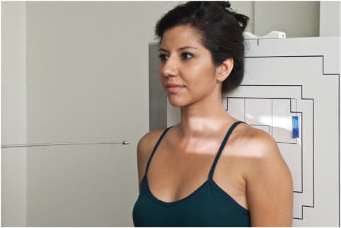
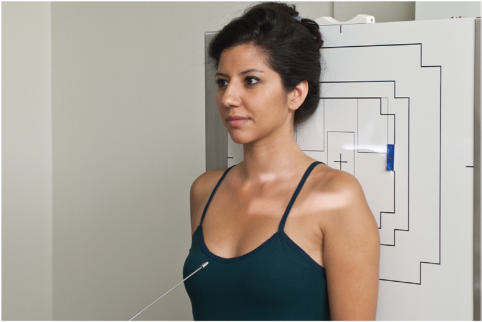
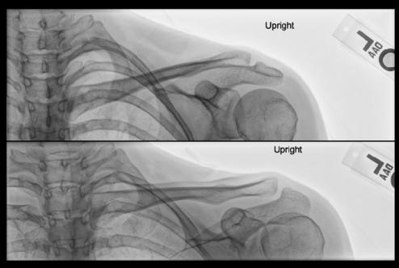

# Rx claviculă – incidență AP și AP axială

  📷 Radiografie Convențională (Rx)
  <strong>Actualizat:</strong> 2026-09-15
  <strong>Autor:</strong> Departamentul de Radiologie / Referință Bontrager

---

-   __1. Rezumat Clinic & Indicații__

    ---

    === "Indicații Clinice"

        - suspiciune de fractură sau luxație/subluxație articulară a claviculei
        - Protocoalele departamentale includ în mod obișnuit atât incidențe AP, cât și AP axiale

    === "Ghid Național IRIS"

        !!! info "Referință Primară: Ghidul Național IRIS (Ordinul MS 1342/2012)"
            - **Capitol Ghid IRIS:** *Aparat locomotor & Membru superior*
            - **Grad de Recomandare:** **Grad A**
            - **Nivel de Iradiere Estimată:** `Clasa 1 (Minimă < 0.05 mSv)`

            [:octicons-search-16: Deschide Ghidul IRIS](../../iris.md){ .md-button .md-button--primary } [:material-open-in-new: Aplicația Oficială PWA](https://radiologie-pediatrica.ro/iris/){ .md-button target="_blank" rel="noopener" }

-   __2. Poziționare & Centrare Fascicul__

    ---

    - **Poziție Pacient:** Pacient: Se efectuează radiografia cu pacientul în ortostatism sau în decubit dorsal, cu brațele pe lângă corp, bărbia ridicată și privirea înainte. Umărul posterior trebuie să fie în contact cu receptorul de imagine sau cu masa, fără rotația corpului (Fig. 5.88).; Regiune anatomică: Se centrează clavicula și receptorul de imagine la nivelul razei centrale. (Clavicula poate fi palpată cu ușurință, cu porțiunea medială la incizura jugulară (manubriul sternal) și porțiunea laterală la nivelul articulației acromioclaviculare, deasupra umărului.)
    - **Punct de Centrare Fascicul:** 15° până la 30° cranial, la nivelul mijlocului claviculei (Fig. 5.89) (vezi NOTA)
    - **Distanță Focar-Film (DFF / SID):** 100 cm
    - **Comandă Respiratorie:** Apnee pe durata expunerii, la sfârșitul inhalării (ajută la ridicarea claviculelor). Alternativ, poate fi efectuată și o radiografie PA sau o incidență PA axială cu un unghi caudal de 15° până la 30°.

-   __3. Parametri Tehnici Expunere__

    ---

    | Parametru Tehnic | Valoare Configurare Generator / Tub |
    |:-----------------|:-------------------------------------|
    | **Tensiune Tub (kV)** | 70-85 kV |
    | **Sarcină / Produs Curent-Timp (mAs)** | DE CONFIGURAT PE APARAT |
    | **Distanță Focar-Film (DFF / SID)** | 100 cm |
    | **Grilă Antidifuzoare (Bucky)** | Cu grilă antidifuzoare Bucky |
    | **Dimensiune Focar** | Focar Mic (0.6 mm) |
    | **Camere de Ionizare AEC** | Camerele laterale (sau camera centrală, în funcție de regiune) |
    | **Colimare Fascicul** | Marginile câmpului trebuie să fie vizibile. Angularea corectă a razei centrale proiectează cea mai mare parte a claviculei deasupra omoplatului (scapulei) și coastelor a doua și a treia (grilajului costal). Numai porțiunea medială a claviculei este suprapusă peste prima și a doua coastă (grilajul costal) (vezi Fig. 5.90B). Expunere: expunere: Extremitățile mijlocului claviculei, sternale și acromiale sunt evidențiate clar, cu contururi osoase și travee trabeculare nete, fără artefacte de mișcare și cu detalii ale părților moi. Expunerea optimă evidențiază clavicula distală și articulațiile acromioclaviculare fără expunere excesivă a receptorului de imagine. Marginile osoase și desenul trabecular trebuie să apară nete, indicând absența mișcării, iar clavicula medială și articulațiile sternoclaviculare trebuie vizualizate prin torace. Fig. 5.88 AP claviculă—raza centrală 0°. Fig. 5.89 AP axială claviculă—raza centrală 15° până la 30° cranial. B Fig. 5.90 (A) AP—raza centrală 0°. 5.89.(B) AP axială claviculă—25°. (Cu amabilitatea lui Joss Wertz, DO.) |
    | **Filtrare Tub** | Totală ≥ 2.5 mm Al echivalent |

-   __4. Criterii de Calitate & Reușită Imagine__

    ---

    - Întreaga claviculă este vizualizată, inclusiv ambele articulații acromioclaviculare și sternoclaviculare și acromionul.
    - Întreaga claviculă este vizualizată, inclusiv ambele articulații acromioclaviculare și sternoclaviculare și acromionul. Poziție: poziție:
    - Clavicula este evidențiată fără scurtare.
    - Mijlocul claviculei este suprapus peste unghiul superior al scapulei (Fig. 5.90A).

-   __5. Protecție Radiologică (ALARA)__

    ---

    - Ecranare gonadică și a organelor radiosensibile conform procedurilor locale de radioprotecție ALARA.
    - Colimare strictă la aria de interes pentru limitarea radiației difuze.
    - Verificarea posibilității unei sarcini la pacientele de vârstă fertilă înainte de expunere.

!!! note "Observații Clinice & Tehnice"
    Pacienții slabi (astenici) necesită un unghi al razei centrale de 25° până la 30°; pacienții cu umeri și torace voluminoase (hiperstenici) necesită un unghi al razei centrale de 15° până la 20°. Claviculă – incidențe AP de rutină și AP axială

### 🖼️ Imagini

<figure class="protocol-image-card" markdown>

<figcaption><strong>Fig. 5.90B).</strong> — Poziționarea pacientului conform Ghidului Bontrager (Fig. 5.90B).)</figcaption>

</figure>

<figure class="protocol-image-card" markdown>

<figcaption><strong>Fig. 5.88 AP claviculă—raza centrală 0°.</strong> — Aspect radiografic de referință conform Ghidului Bontrager (Fig. 5.88 AP claviculă—raza centrală 0°.)</figcaption>

</figure>

<figure class="protocol-image-card" markdown>

<figcaption><strong>Fig. 5.89 AP axială claviculă—raza centrală 15° până la 30° cranial.</strong> — Aspect radiografic de referință conform Ghidului Bontrager (Fig. 5.89 AP axială claviculă—raza centrală 15° până la 30° cranial.)</figcaption>

</figure>

=== "Ghid Rapid de Execuție"

    1. **Identificarea și verificarea pacientului:** verificare identitate, zonă de examinat, consimțământ conform procedurii și evaluarea posibilității unei sarcini, când este relevantă.
    2. **Pregătire:** îndepărtarea oricăror obiecte radiopace (bijuterii, agrafe, fermoare, proteze, pansamente dense).
    3. **Poziționare precisă:** alinierea receptorului de imagine și a tubului la distanța prescrisă (100 cm).
    4. **Colimare strictă:** adaptarea fasciculului strict la regiunea de diagnostic pentru scăderea iradierii și reducerea radiației difuze.
    5. **Radioprotecție:** verificarea [politicii RX](../radioprotectie.md), cu măsuri distincte pentru pacient, personal și însoțitor.

## Surse de documentare

- [Bontrager's Textbook of Radiographic Positioning (Ed. 9/10), Pagina 217](https://www.elsevier.com/books/textbook-of-radiographic-positioning-and-related-anatomy/lampignano/978-0-323-65367-1)
