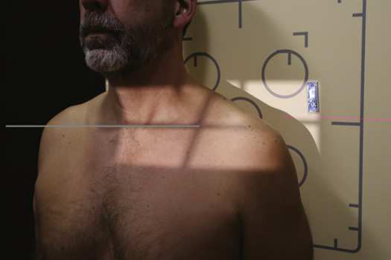
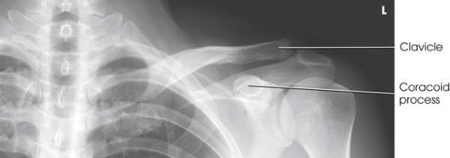

# Rx Claviculă — Incidență Antero-Posterioară (AP) (Merrill)

  📷 Radiografie Convențională (Rx)
  <strong>Actualizat:</strong> 2026-09-16
  <strong>Autor:</strong> Referință Merrill

---

-   __1. Rezumat Clinic & Indicații__

    ---

    === "Indicații Clinice"

        - Conform reperelor anatomice standard din tratat

    === "Ghid Național IRIS"

        !!! info "Referință Primară: Ghidul Național IRIS (Ordinul MS 1342/2012)"
            - **Capitol Ghid IRIS:** *Ghidul Național IRIS*
            - **Grad de Recomandare:** **De verificat pe indicație; fără grad atribuit automat**
            - **Nivel de Iradiere Estimată:** `De verificat pentru examinarea și populația selectate`

            [:octicons-search-16: Deschide Ghidul IRIS](../../iris.md){ .md-button .md-button--primary } [:material-open-in-new: Aplicația Oficială PWA](https://radiologie-pediatrica.ro/iris/){ .md-button target="_blank" rel="noopener" }
-   __2. Poziționare & Centrare Fascicul__

    ---

    - **Poziție Pacient:** se așază pacientul în Decubit dorsal sau ortostatism. If Claviculă este being examined pentru suspiciune de fractură sau destructive disease, sau if pacientul cannot fie plasat în ortostatism, use Decubit dorsal poziție la reduce possibility de fragment displacement sau additional injury.; se ajustează corp la se centrează Claviculă la linia mediană mesei sau stativ vertical Bucky. Place brațele along sides de corp și se ajustează umeri la lie în same plan orizontal. se centrează Claviculă la receptorul de imagine (Fig. 6.61). se efectuează ecranarea gonadelor cu șorț plumbat.
    - **Punct de Centrare Fascicul:** perpendicular pe midshaft de Claviculă
    - **Distanță Focar-Film (DFF / SID):** Nespecificat în fragmentul extras; de verificat în sursă
    - **Comandă Respiratorie:** apnee (oprirea respirației) la end de exhalation la obtain more uniform-densitate optică imagine.

-   __3. Parametri Tehnici Expunere__

    ---

    | Parametru Tehnic | Valoare Configurare Generator / Tub |
    |:-----------------|:-------------------------------------|
    | **Tensiune Tub (kV)** | DE CONFIGURAT PE APARAT |
    | **Sarcină / Produs Curent-Timp (mAs)** | DE CONFIGURAT PE APARAT |
    | **Distanță Focar-Film (DFF / SID)** | Nespecificat în fragmentul extras; de verificat în sursă |
    | **Grilă Antidifuzoare (Bucky)** | DE CONFIGURAT PE APARAT |
    | **Dimensiune Focar** | DE CONFIGURAT PE APARAT |
    | **Camere de Ionizare AEC** | DE CONFIGURAT PE APARAT |
    | **Colimare Fascicul** | Se ajustează câmpul de iradiere la formatul 18 × 30 cm pe colimator. Adjust ca needed la include 1.5 inches (3.8 cm) above Umăr, 1 inch (2.5 cm) beyond lateral aspect de Umăr, și entire Claviculă. Se plasează markerul de lateralitate în câmpul colimat. |
    | **Filtrare Tub** | DE CONFIGURAT PE APARAT |

-   __4. Criterii de Calitate & Reușită Imagine__

    ---

    - Criterii radiologice de calitate imaginii:
    - Colimare adecvată vizibilă și prezența markerului de lateralitate (D/S) plasat clear de anatomy de interest
    - Entire Claviculă centrat pe imagine
    - lateral half de Claviculă above Omoplat (Scapulă), cu medial half superimposing thorax
    - Bony detalii trabeculare osoase și surrounding soft tissues

-   __5. Protecție Radiologică (ALARA)__

    ---

    - Nespecificat în fragmentul extras; de verificat în sursă

!!! note "Observații Clinice & Tehnice"
    Conform reperelor anatomice standard din tratat

### 🖼️ Imagini

<figure class="protocol-image-card" markdown>

<figcaption><strong>Merrill — pagina PDF 420, imaginea 1</strong> — Imagine din fragmentul sursă; asocierea necesită revizie.</figcaption>

</figure>

<figure class="protocol-image-card" markdown>

<figcaption><strong>Merrill — pagina PDF 420, imaginea 2</strong> — Imagine din fragmentul sursă; asocierea necesită revizie.</figcaption>

</figure>

=== "Ghid Rapid de Execuție"

    1. **Identificarea și verificarea pacientului:** verificare identitate, zonă de examinat, consimțământ conform procedurii și evaluarea posibilității unei sarcini, când este relevantă.
    2. **Pregătire:** îndepărtarea oricăror obiecte radiopace (bijuterii, agrafe, fermoare, proteze, pansamente dense).
    3. **Poziționare precisă:** alinierea receptorului de imagine și a tubului la distanța prescrisă (Nespecificat în fragmentul extras; de verificat în sursă).
    4. **Colimare strictă:** adaptarea fasciculului strict la regiunea de diagnostic pentru scăderea iradierii și reducerea radiației difuze.
    5. **Radioprotecție:** verificarea [politicii RX](../radioprotectie.md), cu măsuri distincte pentru pacient, personal și însoțitor.

## Surse de documentare

- [Merrill’s Atlas, 6. Shoulder Girdle, pagini PDF 419–420](../../assets/protocols/sources/a56d45c16829_Merrills_Atlas_of_Radiographic_Positioning__Procedures_3Vol_Set.pdf#page=419)

## Fragmente sursă traduse (referință tehnică)

### anatomy

AP imagine de entire clavicle (Fig. 6.62).

### collimation

• Se ajustează câmpul de iradiere la formatul 18 × 30 cm pe colimator. Adjust ca needed la include 1.5 inches (3.8 cm) above umăr,
1 inch (2.5 cm) beyond lateral aspect de umăr, și entire clavicle. Se plasează markerul de lateralitate în câmpul colimat.

### cr

• perpendicular pe midshaft de clavicle

### criteria

Criterii radiologice de calitate imaginii:
• Colimare adecvată vizibilă și prezența markerului de lateralitate (D/S) plasat clear de anatomy de interest
• Entire clavicle centrat pe imagine
• lateral half de clavicle above scapula, cu medial half superimposing thorax
• Bony detalii trabeculare osoase și surrounding soft tissues

### part_pos

• se ajustează corp la se centrează clavicle la linia mediană mesei sau stativ vertical Bucky.
• Place brațele along sides de corp și se ajustează umeri la lie în same plan orizontal.
• se centrează clavicle la receptorul de imagine (Fig. 6.61).
• se efectuează ecranarea gonadelor cu șorț plumbat.

### patient_pos

• se așază pacientul în decubit dorsal sau ortostatism.
• If clavicle este being examined pentru suspiciune de fractură sau destructive disease, sau if pacientul cannot fie plasat în ortostatism, use decubit dorsal la reduce possibility de fragment displacement sau additional injury.

### respiration

apnee (oprirea respirației) la end de exhalation la obtain more uniform-densitate optică imagine.

### tech

poziționat prin manufacturer sau department protocol pentru corect anatomy display orientation; raza centrală plate: 10 × 12 inches (24 ×
30 cm) transversal.

