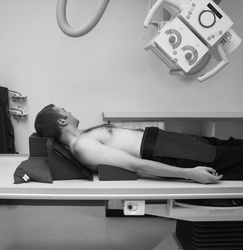
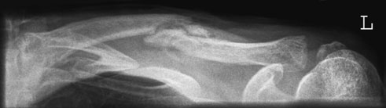
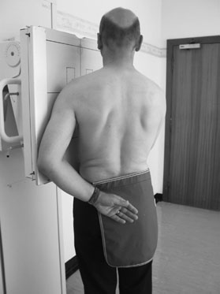
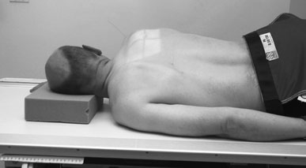
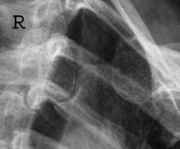
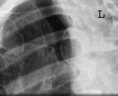

# Rx Claviculă Infero - superior - Decubit Dorsal

  📷 Radiografie Convențională (Rx)
  <strong>Actualizat:</strong> 2026-09-16
  <strong>Autor:</strong> Departamentul de Radiologie / Referință Clark (Ed. 12)

---

-   __1. Rezumat Clinic & Indicații__

    ---

    === "Indicații Clinice"

        - These articulații sunt difficult la evidențiază, even cu good technique. Alternatives include ultrasound, CT (especially cu three-dimensional sau multiplanar reconstructions) și MRI. X-ray tube Oblică ray passing through stâng articulații sternoclaviculare Oblică ray passing through drept articulații sternoclaviculare Articulații Sternoclaviculare Normal ray 45° Claviculă Omoplat (Scapulă) Humerus Humerus incizură jugulară (furculiță sternală) R R L L Shadow de coloană vertebrală Shadows de drept și stâng Articulații Sternoclaviculare X-ray casetă Coaste (Grilaj Costal) Omoplat (Scapulă) Claviculă III 3rd TV Axială diagram evidențiind incidență pentru drept articulații sternoclaviculare radiografie de normal drept sternoclavicular join radiografie de normal stâng articulații sternoclaviculare

    === "Ghid Național IRIS"

        !!! info "Referință Primară: Ghidul Național IRIS (Ordinul MS 1342/2012)"
            - **Capitol Ghid IRIS:** *Ghidul Național IRIS*
            - **Grad de Recomandare:** **De verificat pe indicație; fără grad atribuit automat**
            - **Nivel de Iradiere Estimată:** `De verificat pentru examinarea și populația selectate`

            [:octicons-search-16: Deschide Ghidul IRIS](../../iris.md){ .md-button .md-button--primary } [:material-open-in-new: Aplicația Oficială PWA](https://radiologie-pediatrica.ro/iris/){ .md-button target="_blank" rel="noopener" }
-   __2. Poziționare & Centrare Fascicul__

    ---

    - **Poziție Pacient:** • pacientul este culcat Decubit dorsal pe masa de examinare, cu Umăr de side being examined raised pe non-opaque pad și cu braț relaxat prin side.
• pacientul’s cap este turned away de la partea afectată.
• caseta este tilted back about 20 grade de la vertical și este sprijinit prin săculeți cu nisip pe / sprijinit de upper margine de Umăr și pressed into side de gâtul.

• pacientul stă în ortostatism facing Bucky.
• pacientul este then rotit through 45 grade astfel încât plan mediosagital de corp este la 45 grade la caseta cu articulații sternoclaviculare being examined nearer caseta și centred la it.
• pacientul holds vertical stand la help imobilizare și continues la breathe during expunere.
    - **Punct de Centrare Fascicul:** • raza centrală este înclinat 45 grade cranially și centred la centre de Claviculă.

• raza centrală orizontală centrală este centred la nivelul fourth thoracic vertebra la point 10 cm away de la linia mediană pe side away de la caseta.
    - **Distanță Focar-Film (DFF / SID):** 100 cm
    - **Comandă Respiratorie:** Apnee pe durata expunerii (apnee în inspir pentru torace; expir pentru Abdomen/bazin).

-   __3. Parametri Tehnici Expunere__

    ---

    | Parametru Tehnic | Valoare Configurare Generator / Tub |
    |:-----------------|:-------------------------------------|
    | **Tensiune Tub (kV)** | DE CONFIGURAT PE APARAT |
    | **Sarcină / Produs Curent-Timp (mAs)** | Conform AEC / grosime anatomică |
    | **Distanță Focar-Film (DFF / SID)** | 100 cm |
    | **Grilă Antidifuzoare (Bucky)** | Cu grilă antidifuzoare Bucky |
    | **Dimensiune Focar** | Focar Mic (0.6 mm) |
    | **Camere de Ionizare AEC** | Camerele laterale (sau camera centrală funcție de regiune) |
    | **Colimare Fascicul** | Colimare strictă la aria anatomică de interes diagnostic |
    | **Filtrare Tub** | Totală ≥ 2.5 mm Al echivalent (conform Clark: 3.0 mm Al eq.) |

-   __4. Criterii de Calitate & Reușită Imagine__

    ---

    - imagine trebuie să evidențiază entire length de Claviculă, including sternoclavicular și Articulații Acromioclaviculare.
    - entire length de Claviculă, cu exception de proximal end, trebuie să fie projected clear de thoracic cage.
    - Claviculă trebuie să fie orizontal.
    - articulații sternoclaviculare trebuie să fie clar evidențiat(e) în profile away de la Coloană Vertebrală.

-   __5. Protecție Radiologică (ALARA)__

    ---

    - Ecranare gonadică cu șorț plumbat dacă gonadele sunt în apropierea fasciculului util (regula ALARA).
    - Colimare precisă la dimensiunea anatomică strict necesară pentru reducerea dozei și a radiației difuze.
    - Verificarea posibilității unei sarcini la pacientele de vârstă fertilă înainte de expunere.

!!! note "Observații Clinice & Tehnice"
    If caseta cannot fie pressed well into side de gâtul, then medial end de Claviculă might nu fie included pe casetă. în this case, cu raza centrală centrală again înclinat 45 grade cranially, raza centrală este first centred la articulații sternoclaviculare de partea afectată și then tubul este rotit until raza centrală este orientat la centre de Claviculă.
98 Decubit dorsal Infero-Superioară (Axială) radiografie de Claviculă evidențiind early healing de suspiciune de fractură

Superimposed lung detail poate fie reduced prin asking pacientul la breathe gently during expunere.
Semi-Decubit ventral (alternate) Alternatively, pacientul poate fie examined în semi-Decubit ventral poziție. Starting cu pacientul Decubit ventral, side nu being examined este raised de la masa de examinare until planul mediosagital este la 45 grade la masa de examinare, cu articulație being examined în linia mediană mesei. centring point este la raised side, 10 cm de la linia mediană la nivelul fourth thoracic vertebra.

### 🖼️ Imagini

<figure class="protocol-image-card" markdown>

<figcaption><strong>Decubit dorsal Infero-Superioară (Axială) radiografie de Claviculă evidențiind early healing de a</strong> — Poziționare pacient și centrare fascicul conform Clark (Ed. 12)</figcaption>

</figure>

<figure class="protocol-image-card" markdown>

<figcaption><strong>Figura 2: Aspect radiografic / Poziționare (Clark Ed. 12)</strong> — Aspect radiografic / ghid de poziționare conform tratatului Clark (Ed. 12)</figcaption>

</figure>

<figure class="protocol-image-card" markdown>

<figcaption><strong>spații articulare clear de Coloană Vertebrală. Oblică incidență</strong> — Aspect radiografic / ghid de poziționare conform tratatului Clark (Ed. 12)</figcaption>

</figure>

<figure class="protocol-image-card" markdown>

<figcaption><strong>este chosen that will bring spații articulare ca near ca possible la</strong> — Aspect radiografic / ghid de poziționare conform tratatului Clark (Ed. 12)</figcaption>

</figure>

<figure class="protocol-image-card" markdown>

<figcaption><strong>Axială diagram evidențiind incidență pentru drept articulații sternoclaviculare</strong> — Aspect radiografic / ghid de poziționare conform tratatului Clark (Ed. 12)</figcaption>

</figure>

<figure class="protocol-image-card" markdown>

<figcaption><strong>radiografie de normal drept</strong> — Aspect radiografic / ghid de poziționare conform tratatului Clark (Ed. 12)</figcaption>

</figure>

=== "Ghid Rapid de Execuție"

    1. **Identificarea și verificarea pacientului:** verificare identitate, zonă de examinat, consimțământ conform procedurii și evaluarea posibilității unei sarcini, când este relevantă.
    2. **Pregătire:** îndepărtarea oricăror obiecte radiopace (bijuterii, agrafe, fermoare, proteze, pansamente dense).
    3. **Poziționare precisă:** alinierea receptorului de imagine și a tubului la distanța prescrisă (100 cm).
    4. **Colimare strictă:** adaptarea fasciculului strict la regiunea de diagnostic pentru scăderea iradierii și reducerea radiației difuze.
    5. **Radioprotecție:** verificarea [politicii RX](../radioprotectie.md), cu măsuri distincte pentru pacient, personal și însoțitor.

## Surse de documentare

- [Clark's Positioning in Radiography (Ed. 12), Pagina 113](../../assets/protocols/sources/Clark___Positioning_in_Radiography__12th_edition.pdf#page=113)
