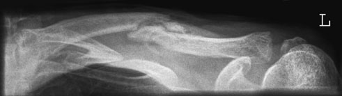
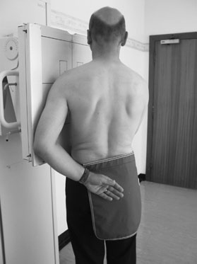
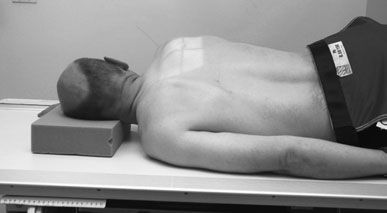
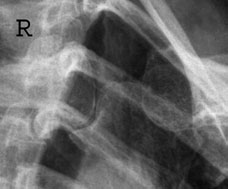
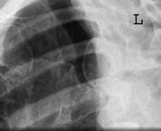

# Rx claviculă infero-superior – decubit dorsal

  📷 Radiografie Convențională (Rx)
  <strong>Actualizat:</strong> 2026-09-16
  <strong>Autor:</strong> Departamentul de Radiologie / Referință Clark (Ed. 12)

---

-   __1. Rezumat Clinic & Indicații__

    ---

    === "Indicații Clinice"

        - Aceste articulații sunt dificil de evidențiat, chiar și cu o tehnică bună. Alternativele includ ecografia, CT (în special cu reconstrucții tridimensionale sau multiplanare) și RMN. Tub radiogen. Rază oblică trecând prin articulațiile sternoclaviculare stângi. Rază oblică trecând prin articulațiile sternoclaviculare drepte. Articulații sternoclaviculare. Normal. Rază 45°. Claviculă. Omoplat (scapulă). Humerus. Humerus. Incizură jugulară (furculiță sternală). R R L L. Umbra coloanei vertebrale. Umbrele articulațiilor sternoclaviculare drepte și stângi. Casetă radiografică. Coaste (grilaj costal). Omoplat (scapulă). Claviculă. III. A 3-a vertebră toracică. Diagramă axială evidențiind incidența pentru articulațiile sternoclaviculare drepte. Radiografie a articulației sternoclaviculare drepte normale. Radiografie a articulațiilor sternoclaviculare stângi normale.

    === "Ghid Național IRIS"

        !!! info "Referință Primară: Ghidul Național IRIS (Ordinul MS 1342/2012)"
            - **Capitol Ghid IRIS:** *Aparat locomotor & Membru superior*
            - **Grad de Recomandare:** **Grad A**
            - **Nivel de Iradiere Estimată:** `Clasa 1 (Minimă < 0.05 mSv)`

            [:octicons-search-16: Deschide Ghidul IRIS](../../iris.md){ .md-button .md-button--primary } [:material-open-in-new: Aplicația Oficială PWA](https://radiologie-pediatrica.ro/iris/){ .md-button target="_blank" rel="noopener" }

-   __2. Poziționare & Centrare Fascicul__

    ---

    - **Poziție Pacient:**
        - pacientul este culcat în decubit dorsal pe masa de examinare, cu umărul de partea examinată ridicat pe un suport radiotransparent și cu brațul relaxat pe lângă corp.
        - capul pacientului este întors în partea opusă celei afectate.
        - caseta este înclinată posterior cu aproximativ 20 grade față de verticală, este sprijinită cu săculeți cu nisip pe marginea superioară a umărului și apăsată pe partea gâtului.
        - pacientul stă în ortostatism, cu fața spre Bucky.
        - pacientul este apoi rotit cu 45 grade, astfel încât planul mediosagital al corpului să formeze un unghi de 45 grade cu caseta, articulațiile sternoclaviculare examinate fiind mai apropiate de casetă și centrate pe aceasta.
        - pacientul se ține de stativul vertical pentru a ajuta la imobilizare și continuă să respire în timpul expunerii.
    - **Punct de Centrare Fascicul:**
        - raza centrală este înclinată cu 45 grade cranial și centrată la mijlocul claviculei.
        - raza centrală orizontală este centrată la nivelul celei de-a patra vertebre toracice, într-un punct situat la 10 cm de linia mediană, pe partea opusă casetei.
    - **Distanță Focar-Film (DFF / SID):** 100 cm
    - **Comandă Respiratorie:** Apnee pe durata expunerii (apnee în inspir pentru torace; expir pentru Abdomen/bazin).

-   __3. Parametri Tehnici Expunere__

    ---

    | Parametru Tehnic | Valoare Configurare Generator / Tub |
    |:-----------------|:-------------------------------------|
    | **Tensiune Tub (kV)** | DE CONFIGURAT PE APARAT |
    | **Sarcină / Produs Curent-Timp (mAs)** | Conform AEC / grosimii anatomice |
    | **Distanță Focar-Film (DFF / SID)** | 100 cm |
    | **Grilă Antidifuzoare (Bucky)** | Cu grilă antidifuzoare Bucky |
    | **Dimensiune Focar** | Focar Mic (0.6 mm) |
    | **Camere de Ionizare AEC** | Camerele laterale (sau camera centrală, în funcție de regiune) |
    | **Colimare Fascicul** | Colimare strictă la aria anatomică de interes diagnostic |
    | **Filtrare Tub** | Totală ≥ 2.5 mm Al echivalent (conform Clark: 3.0 mm Al echivalent) |

-   __4. Criterii de Calitate & Reușită Imagine__

    ---

    - Imaginea trebuie să evidențieze întreaga lungime a claviculei, inclusiv articulațiile sternoclaviculare și acromioclaviculare.
    - Întreaga lungime a claviculei, cu excepția extremității proximale, trebuie proiectată clar deasupra cutiei toracice.
    - Clavicula trebuie să fie orizontală.
    - Articulațiile sternoclaviculare trebuie să fie evidențiate clar în profil, departe de coloana vertebrală.

-   __5. Protecție Radiologică (ALARA)__

    ---

    - Ecranare gonadică cu șorț plumbat dacă gonadele sunt în apropierea fasciculului util (regula ALARA).
    - Colimare precisă la dimensiunea anatomică strict necesară pentru reducerea dozei și a radiației difuze.
    - Verificarea posibilității unei sarcini la pacientele de vârstă fertilă înainte de expunere.

!!! note "Observații Clinice & Tehnice"
    Dacă caseta nu poate fi apăsată bine pe partea gâtului, atunci extremitatea medială a claviculei s-ar putea să nu fie inclusă pe casetă. În acest caz, cu raza centrală înclinată din nou cu 45 grade cranial, raza centrală este centrată mai întâi la nivelul articulațiilor sternoclaviculare de partea afectată și apoi tubul este rotit până când raza centrală este orientată spre mijlocul claviculei. 98 Radiografie infero-superioară (axială), în decubit dorsal, a claviculei, evidențiind vindecarea timpurie a suspiciunii de fractură.

    Suprapunerea desenului pulmonar poate fi redusă cerând pacientului să respire ușor în timpul expunerii. Semi-decubit ventral (alternativ). Alternativ, pacientul poate fi examinat în poziție de semi-decubit ventral. Pornind cu pacientul în decubit ventral, partea neexaminată este ridicată de la masa de examinare până când planul mediosagital formează un unghi de 45 grade cu masa de examinare, articulația examinată fiind pe linia mediană a mesei. Punctul de centrare este pe partea ridicată, la 10 cm de linia mediană, la nivelul celei de-a patra vertebre toracice.

### 🖼️ Imagini

<figure class="protocol-image-card" markdown>

![Radiografie infero-superioară (axială), în decubit dorsal, a claviculei, evidențiind vindecarea timpurie a [fragment deteriorat în sursă]](../../assets/images/protocols/clark/rx-clavicula-infero-superior-decubit-dorsal-p113-clark/fig_1.jpeg)

<figcaption><strong>Radiografie infero-superioară (axială), în decubit dorsal, a claviculei, evidențiind vindecarea timpurie a [fragment deteriorat în sursă]</strong> — Poziționarea pacientului și centrarea fasciculului conform Clark (Ed. 12)</figcaption>

</figure>

<figure class="protocol-image-card" markdown>

<figcaption><strong>Figura 2: Aspect radiografic / Poziționare (Clark Ed. 12)</strong> — Aspect radiografic / ghid de poziționare conform tratatului Clark (Ed. 12)</figcaption>

</figure>

<figure class="protocol-image-card" markdown>

<figcaption><strong>Spații articulare clare față de coloana vertebrală. Incidență oblică</strong> — Aspect radiografic / ghid de poziționare conform tratatului Clark (Ed. 12)</figcaption>

</figure>

<figure class="protocol-image-card" markdown>

<figcaption><strong>este aleasă pentru a aduce spațiile articulare cât mai aproape posibil de</strong> — Aspect radiografic / ghid de poziționare conform tratatului Clark (Ed. 12)</figcaption>

</figure>

<figure class="protocol-image-card" markdown>

<figcaption><strong>Diagramă axială evidențiind incidența pentru articulațiile sternoclaviculare drepte</strong> — Aspect radiografic / ghid de poziționare conform tratatului Clark (Ed. 12)</figcaption>

</figure>

<figure class="protocol-image-card" markdown>

<figcaption><strong>Radiografie a articulației sternoclaviculare drepte normale</strong> — Aspect radiografic / ghid de poziționare conform tratatului Clark (Ed. 12)</figcaption>

</figure>

=== "Ghid Rapid de Execuție"

    1. **Identificarea și verificarea pacientului:** verificare identitate, zonă de examinat, consimțământ conform procedurii și evaluarea posibilității unei sarcini, când este relevantă.
    2. **Pregătire:** îndepărtarea oricăror obiecte radiopace (bijuterii, agrafe, fermoare, proteze, pansamente dense).
    3. **Poziționare precisă:** alinierea receptorului de imagine și a tubului la distanța prescrisă (100 cm).
    4. **Colimare strictă:** adaptarea fasciculului strict la regiunea de diagnostic pentru scăderea iradierii și reducerea radiației difuze.
    5. **Radioprotecție:** verificarea [politicii RX](../radioprotectie.md), cu măsuri distincte pentru pacient, personal și însoțitor.

## Surse de documentare

- [Clark's Positioning in Radiography (Ed. 12), Pagina 113](https://books.google.com/books/about/Clark_s_Positioning_in_Radiography.html?id=Xxu6MwEACAAJ)
