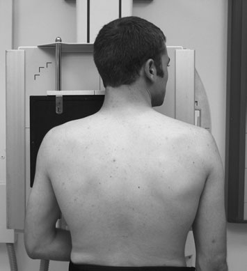
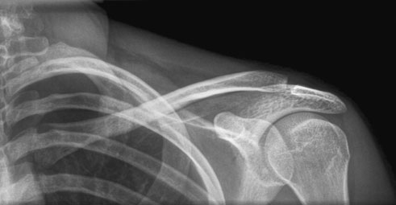
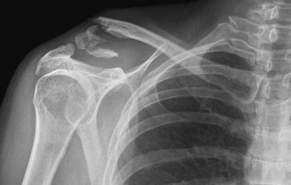

# Rx Claviculă Postero-Anterior (PA) - Ortostatism (basic)

  📷 Radiografie Convențională (Rx)
  <strong>Actualizat:</strong> 2026-09-16
  <strong>Autor:</strong> Departamentul de Radiologie / Referință Clark (Ed. 12)

---

-   __1. Rezumat Clinic & Indicații__

    ---

    === "Indicații Clinice"

        - 95 3 Claviculă Postero-anterior (PA) – Ortostatism (basic) Although Claviculă este evidențiat pe Antero-posterior (AP) ‘survey’ imagine, it este desirable la have Claviculă ca close la caseta ca possible la give optimum bony detail. posteroanterior poziție also reduces radiation dose la thyroid și eyes, important consideration în follow-up suspiciune de fractură imagini. Alternatively, pacientul poate fie Decubit dorsal pe masa de examinare sau trolley pentru Antero-posterior (AP) incidență în which immobility și movement sunt considerations. A 24  30-cm casetă este plasat transversely în Ortostatism casetă holder (sau stativ vertical Bucky if pacientul este particularly large).

    === "Ghid Național IRIS"

        !!! info "Referință Primară: Ghidul Național IRIS (Ordinul MS 1342/2012)"
            - **Capitol Ghid IRIS:** *Ghidul Național IRIS*
            - **Grad de Recomandare:** **De verificat pe indicație; fără grad atribuit automat**
            - **Nivel de Iradiere Estimată:** `De verificat pentru examinarea și populația selectate`

            [:octicons-search-16: Deschide Ghidul IRIS](../../iris.md){ .md-button .md-button--primary } [:material-open-in-new: Aplicația Oficială PWA](https://radiologie-pediatrica.ro/iris/){ .md-button target="_blank" rel="noopener" }
-   __2. Poziționare & Centrare Fascicul__

    ---

    - **Poziție Pacient:** • pacientul stă așezat sau stands facing Ortostatism casetă holder.
• pacientul’s poziție este ajustat astfel încât middle de Claviculă este în centre de caseta.
• pacientul’s cap este turned away de la side being examined și affected Umăr rotit slightly forward la allow affected Claviculă la fie brought into close contact cu Bucky.
    - **Punct de Centrare Fascicul:** • raza centrală orizontală centrală este orientat la centre de Claviculă și centre de imagine, cu fascicul collimated la Claviculă.
    - **Distanță Focar-Film (DFF / SID):** 100 cm
    - **Comandă Respiratorie:** expunere este made pe arrested respirație la reduce pacient

-   __3. Parametri Tehnici Expunere__

    ---

    | Parametru Tehnic | Valoare Configurare Generator / Tub |
    |:-----------------|:-------------------------------------|
    | **Tensiune Tub (kV)** | DE CONFIGURAT PE APARAT |
    | **Sarcină / Produs Curent-Timp (mAs)** | Conform AEC / grosime anatomică |
    | **Distanță Focar-Film (DFF / SID)** | 100 cm |
    | **Grilă Antidifuzoare (Bucky)** | Cu grilă antidifuzoare Bucky |
    | **Dimensiune Focar** | Focar Mic (0.6 mm) |
    | **Camere de Ionizare AEC** | Camerele laterale (sau camera centrală funcție de regiune) |
    | **Colimare Fascicul** | Colimare strictă adaptată pe receptor 24 x 30 cm |
    | **Filtrare Tub** | Totală ≥ 2.5 mm Al echivalent (conform Clark: 3.0 mm Al eq.) |

-   __4. Criterii de Calitate & Reușită Imagine__

    ---

    - entire length de Claviculă trebuie să fie included pe imagine.
    - Profil (lateral) end de Claviculă will fie evidențiat clear de thoracic cage.
    - There trebuie să fie fără foreshortening de Claviculă.
    - expunere trebuie să evidențiază ambele medial și Profil (lateral) ends de Claviculă.

-   __5. Protecție Radiologică (ALARA)__

    ---

    - Ecranare gonadică cu șorț plumbat dacă gonadele sunt în apropierea fasciculului util (regula ALARA).
    - Colimare precisă la dimensiunea anatomică strict necesară pentru reducerea dozei și a radiației difuze.
    - Verificarea posibilității unei sarcini la pacientele de vârstă fertilă înainte de expunere.

!!! note "Observații Clinice & Tehnice"
    expunere este made pe arrested respirație la reduce pacient movement.
Normal Postero-anterior (PA) radiografie de Claviculă Postero-anterior (PA) radiografie de Claviculă evidențiind comminuted suspiciune de fractură

### 🖼️ Imagini

<figure class="protocol-image-card" markdown>

<figcaption><strong>și eyes, important consideration în follow-up suspiciune de fractură imagini.</strong> — Poziționare pacient și centrare fascicul conform Clark (Ed. 12)</figcaption>

</figure>

<figure class="protocol-image-card" markdown>

<figcaption><strong>Normal Postero-anterior (PA) radiografie de Claviculă</strong> — Aspect radiografic / ghid de poziționare conform tratatului Clark (Ed. 12)</figcaption>

</figure>

<figure class="protocol-image-card" markdown>

<figcaption><strong>Postero-anterior (PA) radiografie de Claviculă evidențiind comminuted suspiciune de fractură</strong> — Aspect radiografic / ghid de poziționare conform tratatului Clark (Ed. 12)</figcaption>

</figure>

=== "Ghid Rapid de Execuție"

    1. **Identificarea și verificarea pacientului:** verificare identitate, zonă de examinat, consimțământ conform procedurii și evaluarea posibilității unei sarcini, când este relevantă.
    2. **Pregătire:** îndepărtarea oricăror obiecte radiopace (bijuterii, agrafe, fermoare, proteze, pansamente dense).
    3. **Poziționare precisă:** alinierea receptorului de imagine și a tubului la distanța prescrisă (100 cm).
    4. **Colimare strictă:** adaptarea fasciculului strict la regiunea de diagnostic pentru scăderea iradierii și reducerea radiației difuze.
    5. **Radioprotecție:** verificarea [politicii RX](../radioprotectie.md), cu măsuri distincte pentru pacient, personal și însoțitor.

## Surse de documentare

- [Clark's Positioning in Radiography (Ed. 12), Pagina 110](../../assets/protocols/sources/Clark___Positioning_in_Radiography__12th_edition.pdf#page=110)
