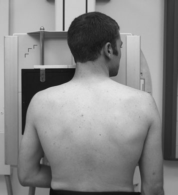
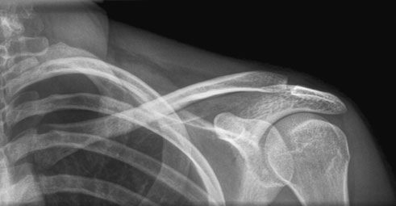
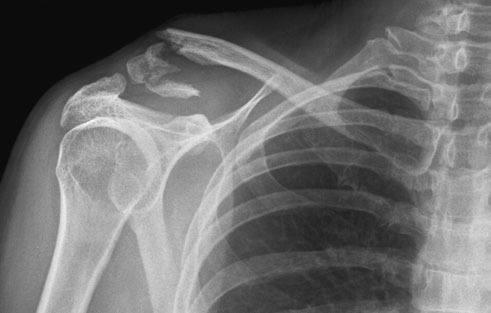

# Rx claviculă postero-anterioară (PA) – ortostatism (de bază)

  📷 Radiografie Convențională (Rx)
  <strong>Actualizat:</strong> 2026-09-16
  <strong>Autor:</strong> Departamentul de Radiologie / Referință Clark (Ed. 12)

---

-   __1. Rezumat Clinic & Indicații__

    ---

    === "Indicații Clinice"

        - 95 3 Claviculă postero-anterioară (PA) – ortostatism (de bază) Deși clavicula este evidențiată pe imaginea de examinare antero-posterioară (AP), este de preferat ca clavicula să fie cât mai aproape posibil de casetă, pentru a obține detalii osoase optime. Poziția postero-anterioară reduce, de asemenea, doza de radiații la nivelul tiroidei și ochilor, aspect important în imaginile de monitorizare ale suspiciunii de fractură. Alternativ, pacientul poate fi așezat în decubit dorsal pe masa de examinare sau pe targa mobilă pentru incidența antero-posterioară (AP), caz în care imobilitatea și mișcarea reprezintă aspecte importante. O casetă de 24 × 30 cm este plasată transversal în suportul de casete pentru ortostatism (sau în stativul vertical Bucky dacă pacientul este deosebit de corpolent).

    === "Ghid Național IRIS"

        !!! info "Referință Primară: Ghidul Național IRIS (Ordinul MS 1342/2012)"
            - **Capitol Ghid IRIS:** *Aparat locomotor & Membru superior*
            - **Grad de Recomandare:** **Grad A**
            - **Nivel de Iradiere Estimată:** `Clasa 1 (Minimă < 0.05 mSv)`

            [:octicons-search-16: Deschide Ghidul IRIS](../../iris.md){ .md-button .md-button--primary } [:material-open-in-new: Aplicația Oficială PWA](https://radiologie-pediatrica.ro/iris/){ .md-button target="_blank" rel="noopener" }

-   __2. Poziționare & Centrare Fascicul__

    ---

    - **Poziție Pacient:**
        - Pacientul stă așezat sau în picioare, cu fața spre suportul de casete pentru ortostatism.
        - Poziția pacientului este ajustată astfel încât mijlocul claviculei să fie centrat pe casetă.
        - Capul pacientului este întors în partea opusă celei examinate, iar umărul afectat este rotit ușor anterior pentru a permite aducerea claviculei afectate în contact strâns cu Bucky.
    - **Punct de Centrare Fascicul:** • Raza centrală orizontală este orientată pentru a centra clavicula și centrul imaginii, cu fasciculul colimat pe claviculă.
    - **Distanță Focar-Film (DFF / SID):** 100 cm
    - **Comandă Respiratorie:** Expunerea se efectuează în apnee pentru a reduce mișcarea pacientului.

-   __3. Parametri Tehnici Expunere__

    ---

    | Parametru Tehnic | Valoare Configurare Generator / Tub |
    |:-----------------|:-------------------------------------|
    | **Tensiune Tub (kV)** | DE CONFIGURAT PE APARAT |
    | **Sarcină / Produs Curent-Timp (mAs)** | Conform AEC / grosimii anatomice |
    | **Distanță Focar-Film (DFF / SID)** | 100 cm |
    | **Grilă Antidifuzoare (Bucky)** | Cu grilă antidifuzoare Bucky |
    | **Dimensiune Focar** | Focar Mic (0.6 mm) |
    | **Camere de Ionizare AEC** | Camerele laterale (sau camera centrală, în funcție de regiune) |
    | **Colimare Fascicul** | Colimare strictă adaptată pe receptor 24 x 30 cm |
    | **Filtrare Tub** | Totală ≥ 2.5 mm Al echivalent (conform Clark: 3.0 mm Al echivalent) |

-   __4. Criterii de Calitate & Reușită Imagine__

    ---

    - Întreaga lungime a claviculei trebuie inclusă în imagine.
    - Extremitatea de profil a claviculei trebuie evidențiată clar de cutia toracică.
    - Nu trebuie să existe scurtarea claviculei.
    - Expunerea trebuie să evidențieze ambele extremități, medială și laterală, ale claviculei.

-   __5. Protecție Radiologică (ALARA)__

    ---

    - Ecranare gonadică cu șorț plumbat dacă gonadele sunt în apropierea fasciculului util (regula ALARA).
    - Colimare precisă la dimensiunea anatomică strict necesară pentru reducerea dozei și a radiației difuze.
    - Verificarea posibilității unei sarcini la pacientele de vârstă fertilă înainte de expunere.

!!! note "Observații Clinice & Tehnice"
    Expunerea se efectuează în apnee pentru a reduce mișcarea pacientului. Radiografie normală postero-anterioară (PA) a claviculei Radiografie postero-anterioară (PA) a claviculei, evidențiind suspiciunea de fractură cominutivă

### 🖼️ Imagini

<figure class="protocol-image-card" markdown>

<figcaption><strong>și ochilor, aspect important în imaginile de monitorizare ale suspiciunii de fractură.</strong> — Poziționarea pacientului și centrarea fasciculului conform Clark (Ed. 12)</figcaption>

</figure>

<figure class="protocol-image-card" markdown>

<figcaption><strong>Radiografie normală postero-anterioară (PA) a claviculei</strong> — Aspect radiografic / ghid de poziționare conform tratatului Clark (Ed. 12)</figcaption>

</figure>

<figure class="protocol-image-card" markdown>

<figcaption><strong>Radiografie postero-anterioară (PA) a claviculei, evidențiind suspiciunea de fractură cominutivă</strong> — Aspect radiografic / ghid de poziționare conform tratatului Clark (Ed. 12)</figcaption>

</figure>

=== "Ghid Rapid de Execuție"

    1. **Identificarea și verificarea pacientului:** verificare identitate, zonă de examinat, consimțământ conform procedurii și evaluarea posibilității unei sarcini, când este relevantă.
    2. **Pregătire:** îndepărtarea oricăror obiecte radiopace (bijuterii, agrafe, fermoare, proteze, pansamente dense).
    3. **Poziționare precisă:** alinierea receptorului de imagine și a tubului la distanța prescrisă (100 cm).
    4. **Colimare strictă:** adaptarea fasciculului strict la regiunea de diagnostic pentru scăderea iradierii și reducerea radiației difuze.
    5. **Radioprotecție:** verificarea [politicii RX](../radioprotectie.md), cu măsuri distincte pentru pacient, personal și însoțitor.

## Surse de documentare

- [Clark's Positioning in Radiography (Ed. 12), Pagina 110](https://books.google.com/books/about/Clark_s_Positioning_in_Radiography.html?id=Xxu6MwEACAAJ)
