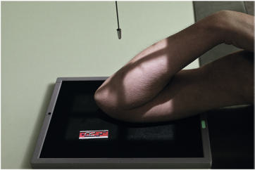
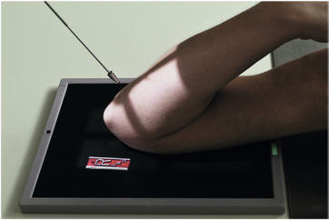
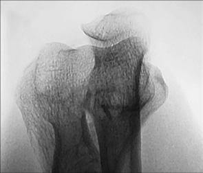
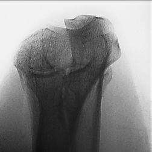
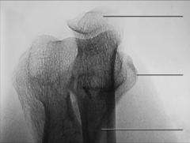

# Rx Cot ACUTE FLEXION Incidență (AP Incidență OF Cot IN ACUTE FLEXION)

  📷 Radiografie Convențională (Rx)
  <strong>Actualizat:</strong> 2026-09-15
  <strong>Autor:</strong> Departamentul de Radiologie / Referință Bontrager

---

-   __1. Rezumat Clinic & Indicații__

    ---

    === "Indicații Clinice"

        - suspiciune de fractură și moderate luxație / subluxație articulară de Cot în acute flexion when Cot cannot fie extins la orice grade

    === "Ghid Național IRIS"

        !!! info "Referință Primară: Ghidul Național IRIS (Ordinul MS 1342/2012)"
            - **Capitol Ghid IRIS:** *Ghidul Național IRIS*
            - **Grad de Recomandare:** **De verificat pe indicație; fără grad atribuit automat**
            - **Nivel de Iradiere Estimată:** `De verificat pentru examinarea și populația selectate`

            [:octicons-search-16: Deschide Ghidul IRIS](../../iris.md){ .md-button .md-button--primary } [:material-open-in-new: Aplicația Oficială PWA](https://radiologie-pediatrica.ro/iris/){ .md-button target="_blank" rel="noopener" }
-   __2. Poziționare & Centrare Fascicul__

    ---

    - **Poziție Pacient:** Pacient: Seat pacient la end de table, cu acutely flectat braț resting pe receptorul de imagine.; Regiune anatomică: Align și center Humerus la axa longitudinală de receptorul de imagine, cu Antebraț acutely flectat și fingertips resting pe Umăr. Adjust receptorul de imagine la center de Cot articulație region. Palpate humeral epicondyles și ensure interepicondylar plane este paralel cu receptorul de imagine pentru Absența rotației anatomice: clavicule echidistante față de linia apofizelor spinoase.
    - **Punct de Centrare Fascicul:** distal Humerus: Raza centrală (RC) perpendiculară pe receptorul de imagine și Humerus, orientat la point midway între epicondyles (Fig. 4.129) proximal Antebraț: Raza centrală perpendiculară la Antebraț (angling raza centrală ca needed), orientat la point approximately 2 inches (5 cm) proximal sau superior la olecran (Fig. 4.130)
    - **Distanță Focar-Film (DFF / SID):** 100 cm
    - **Comandă Respiratorie:** Apnee pe durata expunerii (sau conform cooperării pacientului)

-   __3. Parametri Tehnici Expunere__

    ---

    | Parametru Tehnic | Valoare Configurare Generator / Tub |
    |:-----------------|:-------------------------------------|
    | **Tensiune Tub (kV)** | 70 kV |
    | **Sarcină / Produs Curent-Timp (mAs)** | DE CONFIGURAT PE APARAT |
    | **Distanță Focar-Film (DFF / SID)** | 100 cm |
    | **Grilă Antidifuzoare (Bucky)** | Fără grilă (expunere directă) |
    | **Dimensiune Focar** | Focar Mic (0.6 mm) |
    | **Camere de Ionizare AEC** | DE CONFIGURAT PE APARAT |
    | **Colimare Fascicul** | Field Size Collimate pe four sides la anatomy de interest. Cot ROUTINE AP Alternate AP—partial flexion Alternate AP—acute flexion oblic lateral (extern) medial (intern) lateral Fig. 4.129 pentru distal Humerus—Raza centrală perpendiculară la Humerus. Fig. 4.130 pentru proximal Antebraț—Raza centrală perpendiculară la Antebraț. |
    | **Filtrare Tub** | Totală ≥ 2.5 mm Al echivalent |

-   __4. Criterii de Calitate & Reușită Imagine__

    ---

    - Foursided collimation field size margini trebuie să fie vizibil cu raza centrală și center de collimation field size midway între epicondyles. distal Humerus:
    - Antebraț și Humerus trebuie să fie directly superimposed.
    - medial și lateral epicondyles și parts de trochlea, capitulum, și olecran toate trebuie să fie seen în profile.
    - optim expunere trebuie să visualize distal Humerus și olecran through superimposed structures.
    - părți moi detail este nu readily vizibil pe either incidență (Figs. 4.131 și 4.133). proximal Antebraț:
    - proximal ulna și radius, including outline de cap radial și neck, trebuie să fie vizibil through superimposed distal Humerus.
    - optim expunere visualizes outlines de proximal ulna și radius superimposed over Humerus (Figs. 4.132 și 4.134). olecran epicondil medial (epitrohlee) col radial Ulna Fig. 4.133 distal Humerus. R Fig. 4.132 proximal Antebraț. R Fig. 4.131 distal Humerus. olecran epicondil medial (epitrohlee) col radial Ulna epicondil lateral Fig. 4.134 proximal Antebraț.

-   __5. Protecție Radiologică (ALARA)__

    ---

    - Ecranare gonadică și a organelor radiosensibile conform procedurilor locale de radioprotecție ALARA.
    - Colimare strictă la aria de interes pentru limitarea radiației difuze.
    - Verificarea posibilității unei sarcini la pacientele de vârstă fertilă înainte de expunere.

!!! note "Observații Clinice & Tehnice"
    la visualize ambele distal Humerus și proximal radius și ulna, two incidențe sunt required—one cu Raza centrală perpendiculară la Humerus și one cu raza centrală înclinat so that it este perpendicular pe Antebraț.

### 🖼️ Imagini

<figure class="protocol-image-card" markdown>

<figcaption><strong>Fig. 4.129 pentru distal Humerus—Raza centrală perpendiculară la Humerus.</strong> — Poziționare pacient conform Ghidului Bontrager (Fig. 4.129 pentru distal humerus—raza centrală perpendicular la humerus.)</figcaption>

</figure>

<figure class="protocol-image-card" markdown>

<figcaption><strong>Fig. 4.130 pentru proximal Antebraț—Raza centrală perpendiculară la Antebraț.</strong> — Aspect radiografic de referință conform Ghidului Bontrager (Fig. 4.130 pentru proximal forearm—raza centrală perpendicular la forearm.)</figcaption>

</figure>

<figure class="protocol-image-card" markdown>

<figcaption><strong>Fig. 4.133 distal Humerus.</strong> — Aspect radiografic de referință conform Ghidului Bontrager (Fig. 4.133 distal humerus.)</figcaption>

</figure>

<figure class="protocol-image-card" markdown>

<figcaption><strong>Fig. 4.132 proximal Antebraț.</strong> — Aspect radiografic de referință conform Ghidului Bontrager (Fig. 4.132 proximal forearm.)</figcaption>

</figure>

<figure class="protocol-image-card" markdown>

<figcaption><strong>Fig. 4.131 distal Humerus.</strong> — Aspect radiografic de referință conform Ghidului Bontrager (Fig. 4.131 distal humerus.)</figcaption>

</figure>

<figure class="protocol-image-card" markdown>

<figcaption><strong>Fig. 4.134 proximal Antebraț.</strong> — Aspect radiografic de referință conform Ghidului Bontrager (Fig. 4.134 proximal forearm.)</figcaption>

</figure>

=== "Ghid Rapid de Execuție"

    1. **Identificarea și verificarea pacientului:** verificare identitate, zonă de examinat, consimțământ conform procedurii și evaluarea posibilității unei sarcini, când este relevantă.
    2. **Pregătire:** îndepărtarea oricăror obiecte radiopace (bijuterii, agrafe, fermoare, proteze, pansamente dense).
    3. **Poziționare precisă:** alinierea receptorului de imagine și a tubului la distanța prescrisă (100 cm).
    4. **Colimare strictă:** adaptarea fasciculului strict la regiunea de diagnostic pentru scăderea iradierii și reducerea radiației difuze.
    5. **Radioprotecție:** verificarea [politicii RX](../radioprotectie.md), cu măsuri distincte pentru pacient, personal și însoțitor.

## Surse de documentare

- [Bontrager's Textbook of Radiographic Positioning (Ed. 9/10), Pagina 179](https://www.elsevier.com/books/textbook-of-radiographic-positioning-and-related-anatomy/lampignano/978-0-323-65367-1)
