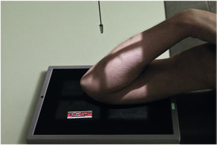
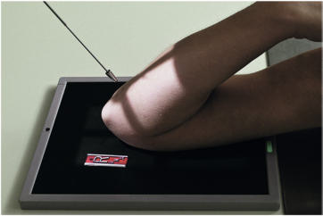
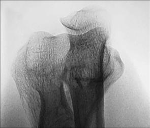
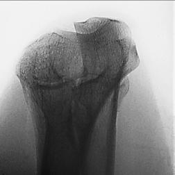
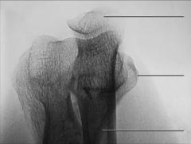

# Rx cot — incidență în flexie acută (incidență AP a cotului în flexie acută)

  📷 Radiografie Convențională (Rx)
  <strong>Actualizat:</strong> 2026-09-15
  <strong>Autor:</strong> Departamentul de Radiologie / Referință Bontrager

---

-   __1. Rezumat Clinic & Indicații__

    ---

    === "Indicații Clinice"

        - Suspiciune de fractură și luxație/subluxație articulară moderată a cotului în flexie acută, când cotul nu poate fi extins la niciun grad.

    === "Ghid Național IRIS"

        !!! info "Referință Primară: Ghidul Național IRIS (Ordinul MS 1342/2012)"
            - **Capitol Ghid IRIS:** *Aparat locomotor & Membru superior*
            - **Grad de Recomandare:** **Grad A**
            - **Nivel de Iradiere Estimată:** `Clasa 1 (Minimă < 0.02 mSv)`

            [:octicons-search-16: Deschide Ghidul IRIS](../../iris.md){ .md-button .md-button--primary } [:material-open-in-new: Aplicația Oficială PWA](https://radiologie-pediatrica.ro/iris/){ .md-button target="_blank" rel="noopener" }

-   __2. Poziționare & Centrare Fascicul__

    ---

    - **Poziție Pacient:** Pacient: Așezați pacientul la capătul mesei, cu brațul flectat acut sprijinit pe receptorul de imagine; Regiune anatomică: Aliniați și centrați humerusul pe axa longitudinală a receptorului de imagine, cu antebrațul flectat acut și vârfurile degetelor sprijinite pe umăr. Ajustați receptorul de imagine la centrul regiunii articulației cotului. Palpați epicondilele humerale și asigurați-vă că planul interepicondilian este paralel cu receptorul de imagine pentru absența rotației anatomice: claviculele sunt echidistante față de linia apofizelor spinoase.
    - **Punct de Centrare Fascicul:** Humerus distal: raza centrală (RC) perpendiculară pe receptorul de imagine și pe humerus, orientată spre punctul median dintre epicondile (Fig. 4.129). Antebraț proximal: raza centrală perpendiculară pe antebraț (înclinând raza centrală după necesitate), orientată spre un punct situat la aproximativ 2 țoli (5 cm) proximal sau superior de olecran (Fig. 4.130).
    - **Distanță Focar-Film (DFF / SID):** 100 cm
    - **Comandă Respiratorie:** Apnee pe durata expunerii (sau conform cooperării pacientului)

-   __3. Parametri Tehnici Expunere__

    ---

    | Parametru Tehnic | Valoare Configurare Generator / Tub |
    |:-----------------|:-------------------------------------|
    | **Tensiune Tub (kV)** | 70 kV |
    | **Sarcină / Produs Curent-Timp (mAs)** | DE CONFIGURAT PE APARAT |
    | **Distanță Focar-Film (DFF / SID)** | 100 cm |
    | **Grilă Antidifuzoare (Bucky)** | Fără grilă (expunere directă) |
    | **Dimensiune Focar** | Focar Mic (0.6 mm) |
    | **Camere de Ionizare AEC** | DE CONFIGURAT PE APARAT |
    | **Colimare Fascicul** | Dimensiunea câmpului: Colimați pe patru laturi la nivelul anatomiei de interes. Cot — AP de rutină; AP alternativă — flexie parțială; AP alternativă — flexie acută; oblică laterală (externă); medială (internă); laterală. Fig. 4.129 pentru humerusul distal — raza centrală perpendiculară pe humerus. Fig. 4.130 pentru antebrațul proximal — raza centrală perpendiculară pe antebraț. |
    | **Filtrare Tub** | Totală ≥ 2.5 mm Al echivalent |

-   __4. Criterii de Calitate & Reușită Imagine__

    ---

    - Marginile câmpului de colimare pe patru laturi trebuie să fie vizibile, cu raza centrală și centrul câmpului de colimare situate la jumătatea distanței dintre epicondile. Humerus distal:
    - Antebrațul și humerusul trebuie să fie suprapuse direct.
    - Epicondilele medial și lateral și părți ale trohleei, capitulului și olecranului trebuie să fie vizibile de profil.
    - Expunerea optimă trebuie să vizualizeze humerusul distal și olecranul prin structurile suprapuse.
    - Detaliile țesuturilor moi nu sunt ușor vizibile pe niciuna dintre incidențe (Fig. 4.131 și 4.133). Antebraț proximal:
    - Ulna și radiusul proximale, inclusiv conturul capului și colului radial, trebuie să fie vizibile prin humerusul distal suprapus.
    - Expunerea optimă evidențiază contururile ulnei și radiusului proximale suprapuse peste humerus (Fig. 4.132 și 4.134). Olecran, epicondil medial (epitrohlee), col radial, ulna, Fig. 4.133 humerus distal. R Fig. 4.132 antebraț proximal. R Fig. 4.131 humerus distal. Olecran, epicondil medial (epitrohlee), col radial, ulna, epicondil lateral, Fig. 4.134 antebraț proximal.

-   __5. Protecție Radiologică (ALARA)__

    ---

    - Ecranare gonadică și a organelor radiosensibile conform procedurilor locale de radioprotecție ALARA.
    - Colimare strictă la aria de interes pentru limitarea radiației difuze.
    - Verificarea posibilității unei sarcini la pacientele de vârstă fertilă înainte de expunere.

!!! note "Observații Clinice & Tehnice"
    Pentru a vizualiza atât humerusul distal, cât și radiusul și ulna proximale, sunt necesare două incidențe — una cu raza centrală perpendiculară pe humerus și una cu raza centrală înclinată astfel încât să fie perpendiculară pe antebraț.

### 🖼️ Imagini

<figure class="protocol-image-card" markdown>

<figcaption><strong>Fig. 4.129 pentru humerusul distal — raza centrală perpendiculară pe humerus.</strong> — Poziționarea pacientului conform Ghidului Bontrager (Fig. 4.129 pentru humerusul distal — raza centrală perpendiculară pe humerus.)</figcaption>

</figure>

<figure class="protocol-image-card" markdown>

<figcaption><strong>Fig. 4.130 pentru antebrațul proximal — raza centrală perpendiculară pe antebraț.</strong> — Aspect radiografic de referință conform Ghidului Bontrager (Fig. 4.130 pentru antebrațul proximal — raza centrală perpendiculară pe antebraț.)</figcaption>

</figure>

<figure class="protocol-image-card" markdown>

<figcaption><strong>Fig. 4.133 humerus distal.</strong> — Aspect radiografic de referință conform Ghidului Bontrager (Fig. 4.133 humerus distal.)</figcaption>

</figure>

<figure class="protocol-image-card" markdown>

<figcaption><strong>Fig. 4.132 antebraț proximal.</strong> — Aspect radiografic de referință conform Ghidului Bontrager (Fig. 4.132 antebraț proximal.)</figcaption>

</figure>

<figure class="protocol-image-card" markdown>

<figcaption><strong>Fig. 4.131 humerus distal.</strong> — Aspect radiografic de referință conform Ghidului Bontrager (Fig. 4.131 humerus distal.)</figcaption>

</figure>

<figure class="protocol-image-card" markdown>

<figcaption><strong>Fig. 4.134 antebraț proximal.</strong> — Aspect radiografic de referință conform Ghidului Bontrager (Fig. 4.134 antebraț proximal.)</figcaption>

</figure>

=== "Ghid Rapid de Execuție"

    1. **Identificarea și verificarea pacientului:** verificare identitate, zonă de examinat, consimțământ conform procedurii și evaluarea posibilității unei sarcini, când este relevantă.
    2. **Pregătire:** îndepărtarea oricăror obiecte radiopace (bijuterii, agrafe, fermoare, proteze, pansamente dense).
    3. **Poziționare precisă:** alinierea receptorului de imagine și a tubului la distanța prescrisă (100 cm).
    4. **Colimare strictă:** adaptarea fasciculului strict la regiunea de diagnostic pentru scăderea iradierii și reducerea radiației difuze.
    5. **Radioprotecție:** verificarea [politicii RX](../radioprotectie.md), cu măsuri distincte pentru pacient, personal și însoțitor.

## Surse de documentare

- [Bontrager's Textbook of Radiographic Positioning (Ed. 9/10), Pagina 179](https://www.elsevier.com/books/textbook-of-radiographic-positioning-and-related-anatomy/lampignano/978-0-323-65367-1)
