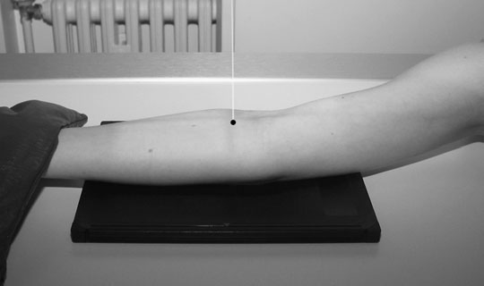
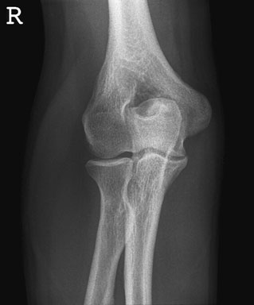
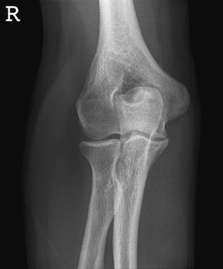

# Rx Cot Antero-Posterior (AP)

  📷 Radiografie Convențională (Rx)
  <strong>Actualizat:</strong> 2026-09-16
  <strong>Autor:</strong> Departamentul de Radiologie / Referință Clark (Ed. 12)

---

-   __1. Rezumat Clinic & Indicații__

    ---

    === "Indicații Clinice"

        - Evaluare radiografică regiunii Cot (Antero - posterior).
        - Suspiciune de leziuni traumatice (fracturi, luxații sau diastazis articular).
        - Bilanț osteoarticular / visceral conform recomandării medicale de trimitere.

    === "Ghid Național IRIS"

        !!! info "Referință Primară: Ghidul Național IRIS (Ordinul MS 1342/2012)"
            - **Capitol Ghid IRIS:** *Ghidul Național IRIS*
            - **Grad de Recomandare:** **De verificat pe indicație; fără grad atribuit automat**
            - **Nivel de Iradiere Estimată:** `De verificat pentru examinarea și populația selectate`

            [:octicons-search-16: Deschide Ghidul IRIS](../../iris.md){ .md-button .md-button--primary } [:material-open-in-new: Aplicația Oficială PWA](https://radiologie-pediatrica.ro/iris/){ .md-button target="_blank" rel="noopener" }
-   __2. Poziționare & Centrare Fascicul__

    ---

    - **Poziție Pacient:** • de la Profil (lateral) poziție, pacientul’s braț este externally rotit.
• braț este then extins fully, astfel încât posterior aspect de entire limb este în contact cu tabletop și palm de Mână este facing upwards.
• unexposed half de caseta este poziționat under Cot articulație, cu its short axis paralel cu Antebraț (Radius și Ulna).
• braț este ajustat astfel încât medial și Profil (lateral) epicondyles sunt echidistant față de caseta.
• limb este imobilizat using săculeți cu nisip.
    - **Punct de Centrare Fascicul:** • raza centrală verticală centrală este centred through spații articulare 2.5 cm distal la point midway între medial și Profil (lateral) epicondyles de Humerus.
    - **Distanță Focar-Film (DFF / SID):** 100 cm
    - **Comandă Respiratorie:** Apnee pe durata expunerii (apnee în inspir pentru torace; expir pentru Abdomen/bazin).

-   __3. Parametri Tehnici Expunere__

    ---

    | Parametru Tehnic | Valoare Configurare Generator / Tub |
    |:-----------------|:-------------------------------------|
    | **Tensiune Tub (kV)** | DE CONFIGURAT PE APARAT |
    | **Sarcină / Produs Curent-Timp (mAs)** | Conform AEC / grosime anatomică |
    | **Distanță Focar-Film (DFF / SID)** | 100 cm |
    | **Grilă Antidifuzoare (Bucky)** | Conform grosimii anatomice (> 10-12 cm cu grilă) |
    | **Dimensiune Focar** | Focar Mic (0.6 mm) |
    | **Camere de Ionizare AEC** | DE CONFIGURAT PE APARAT |
    | **Colimare Fascicul** | Colimare strictă la aria anatomică de interes diagnostic |
    | **Filtrare Tub** | Totală ≥ 2.5 mm Al echivalent (conform Clark: 3.0 mm Al eq.) |

-   __4. Criterii de Calitate & Reușită Imagine__

    ---

    - raza centrală trebuie să pass through spații articulare la 90 grade la Humerus la provide satisfactory incidență de spații articulare.
    - imagine trebuie să evidențiază distal third de Humerus și proximal third de radius și ulna.

-   __5. Protecție Radiologică (ALARA)__

    ---

    - Ecranare gonadică cu șorț plumbat dacă gonadele sunt în apropierea fasciculului util (regula ALARA).
    - Colimare precisă la dimensiunea anatomică strict necesară pentru reducerea dozei și a radiației difuze.
    - Verificarea posibilității unei sarcini la pacientele de vârstă fertilă înainte de expunere.

!!! note "Observații Clinice & Tehnice"
    • Care trebuie să fie taken when supracondylar suspiciune de fractură de Humerus este suspected. în such cases, fără attempt trebuie să fie made la se extinde Cot articulație, și modified technique trebuie să fie employed.
• When pacientul este unable la se extinde Cot la 90 grade, modified technique este used pentru Antero-posterior (AP) incidență.
• If limb cannot fie moved, two incidențe la drept-angles la fiecare other poate fie taken prin keeping limb în same poziție și rotating X-ray tube through 90 grade.
Antero-posterior (AP) – partial flexion If pacientul este unable la se extinde Cot fully, positioning pentru Antero-posterior (AP) incidență poate fie modified. pentru general survey de Cot, sau if main aria de interes diagnostic este extremitatea proximală radius și ulna, then posterior aspect de Antebraț (Radius și Ulna) trebuie să fie în contact cu caseta. If main aria de interes diagnostic este extremitatea distală Humerus, however, then posterior aspect de Humerus trebuie să fie în contact cu caseta.
If Cot este imobilizat în fully flectat poziție, then Axială incidență trebuie să fie used instead de Antero-posterior (AP) incidență.
în ambele de above cases, some superimposition de bones will occur. However, gross injury și general alignment poate fie evidențiat.
62 Coronoid și olecran fossae epicondil medial (epitrohlee) olecran Trochlea proces coronoid Radial notch Shaft de ulna Shaft de radius Tuberosity de radius cap de radius Capitulum Profil (lateral) epicondyle Radial fossa Shaft de Humerus Antero-posterior (AP) radiografie de Cot Normal Antero-posterior (AP) radiografie de Cot

### 🖼️ Imagini

<figure class="protocol-image-card" markdown>

<figcaption><strong>• raza centrală verticală centrală este centred through spații articulare</strong> — Poziționare pacient și centrare fascicul conform Clark (Ed. 12)</figcaption>

</figure>

<figure class="protocol-image-card" markdown>

<figcaption><strong>• raza centrală trebuie să pass through spații articulare la 90</strong> — Aspect radiografic / ghid de poziționare conform tratatului Clark (Ed. 12)</figcaption>

</figure>

<figure class="protocol-image-card" markdown>

<figcaption><strong>• Care trebuie să fie taken when supracondylar suspiciune de fractură de the</strong> — Aspect radiografic / ghid de poziționare conform tratatului Clark (Ed. 12)</figcaption>

</figure>

=== "Ghid Rapid de Execuție"

    1. **Identificarea și verificarea pacientului:** verificare identitate, zonă de examinat, consimțământ conform procedurii și evaluarea posibilității unei sarcini, când este relevantă.
    2. **Pregătire:** îndepărtarea oricăror obiecte radiopace (bijuterii, agrafe, fermoare, proteze, pansamente dense).
    3. **Poziționare precisă:** alinierea receptorului de imagine și a tubului la distanța prescrisă (100 cm).
    4. **Colimare strictă:** adaptarea fasciculului strict la regiunea de diagnostic pentru scăderea iradierii și reducerea radiației difuze.
    5. **Radioprotecție:** verificarea [politicii RX](../radioprotectie.md), cu măsuri distincte pentru pacient, personal și însoțitor.

## Surse de documentare

- [Clark's Positioning in Radiography (Ed. 12), Pagina 77](../../assets/protocols/sources/Clark___Positioning_in_Radiography__12th_edition.pdf#page=77)
